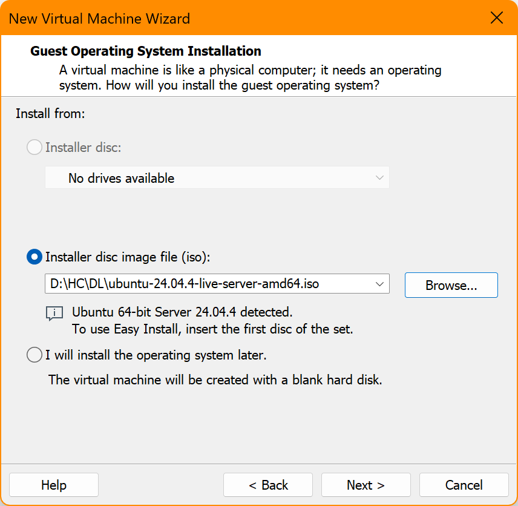
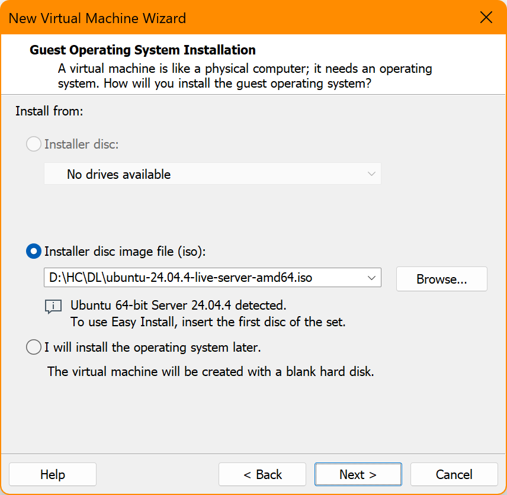
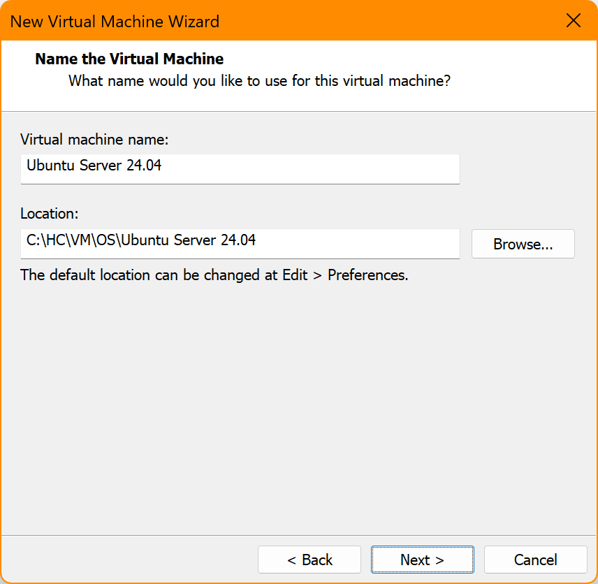
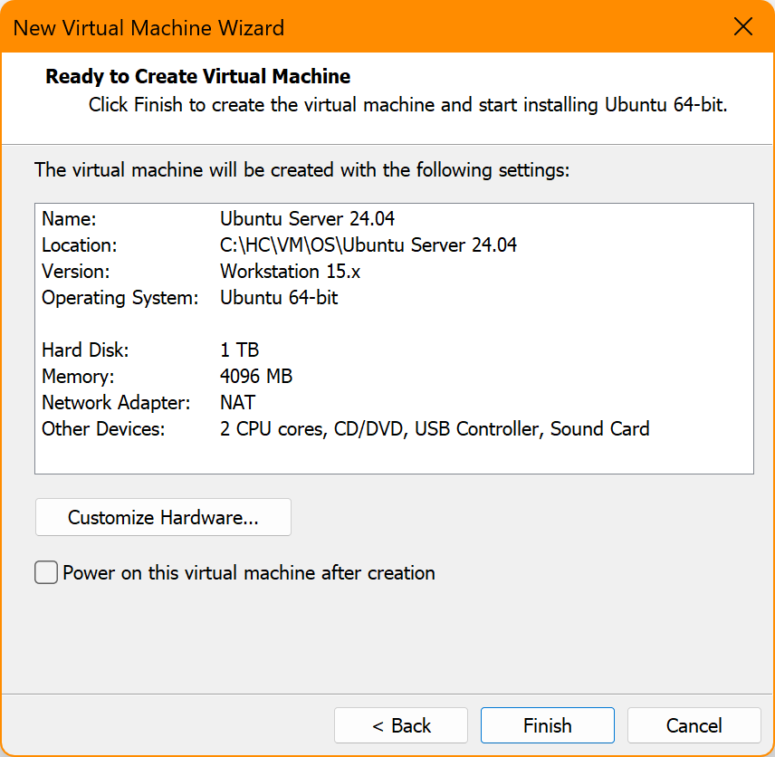
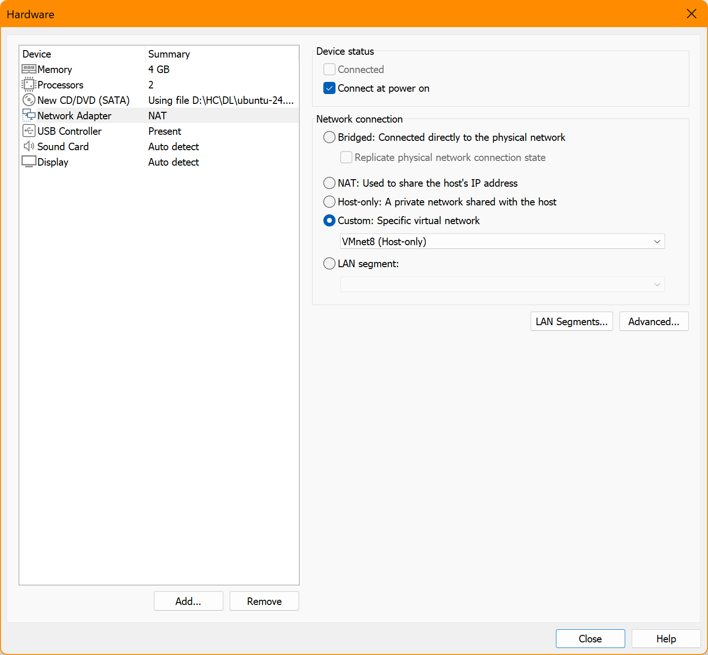
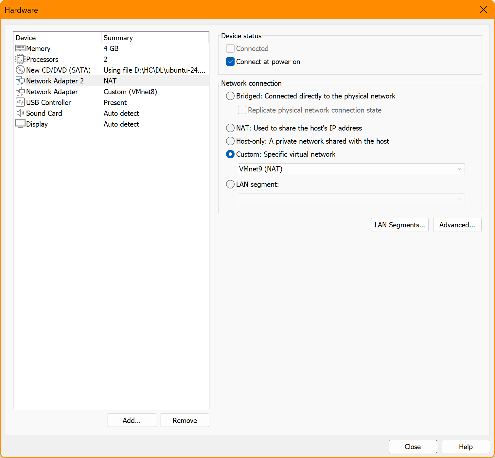
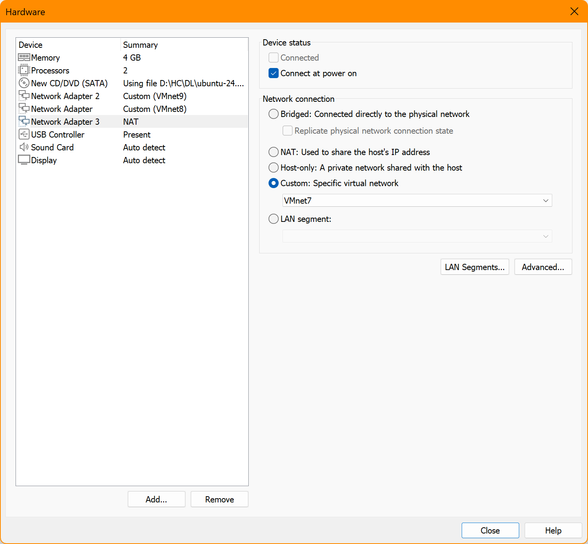
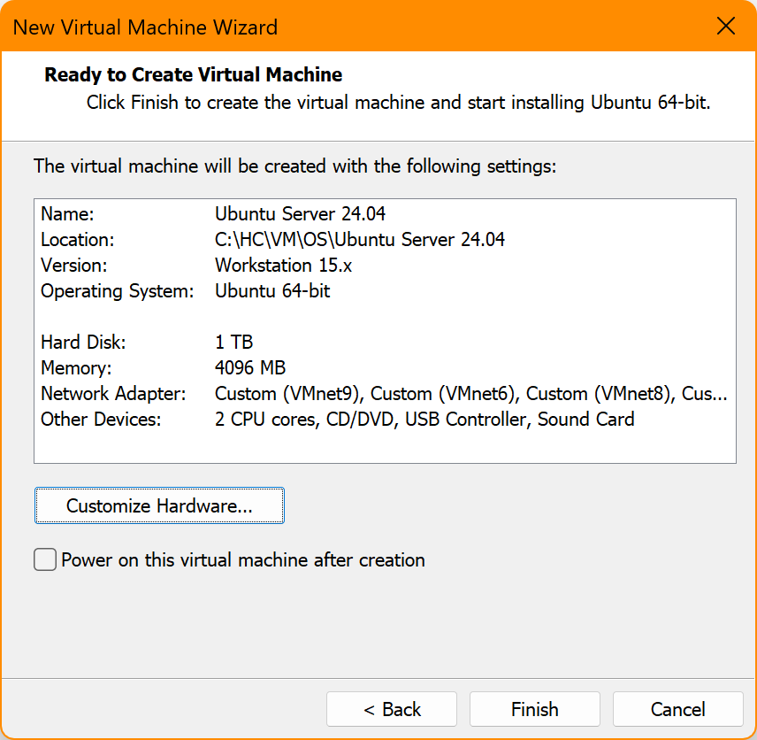
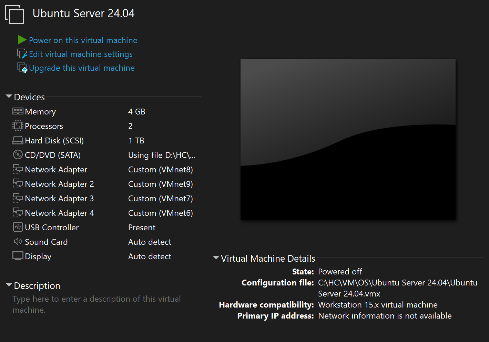
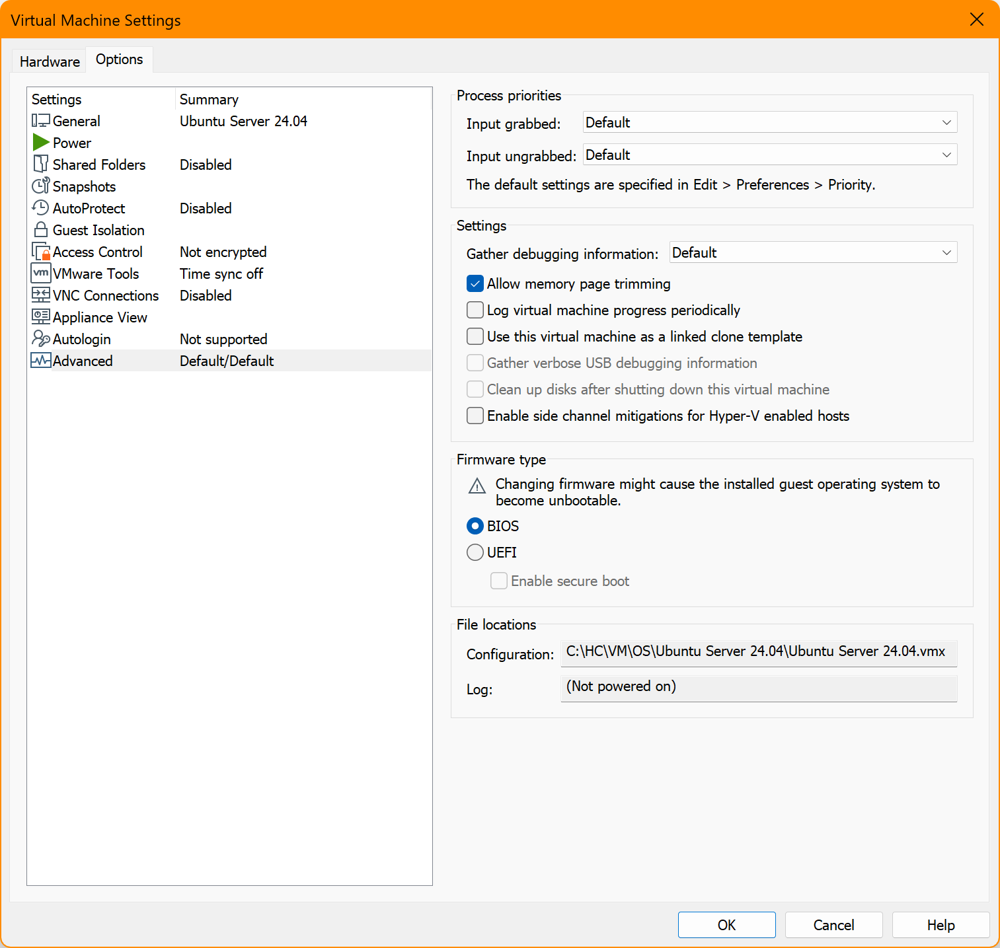

# Ubuntu Template on VMware WorkStation

<br><br><br>
```
╔═╦═══════════════════════════════════════════════════════╦═╗
╠═╬═══════════════════════════════════════════════════════╬═╣
║ ║ Content of this Folder was Last Updated on 2026 07 22 ║ ║
╠═╬═══════════════════════════════════════════════════════╬═╣
╚═╩═══════════════════════════════════════════════════════╩═╝
```
<br><br><br>

Download the installation disc from :
- [ ] [Ubuntu Releases](http://releases.ubuntu.com/) (recommended because this page provides access to CheckSum files)
- [ ] [Download Ubuntu](https://ubuntu.com/download)

Do download the `.iso` file(s), either directly with your browser, or through your favorite download mechanism (example: torrent); and also do download the CheckSum file to verify that the downloaded `.iso` file is intact (not corrupted).
The CheckSum file contains checksum information for multiple files.

There are multiple versions of Ubuntu (example: Desktop, Server, WSL, etc.), for this document we are focusing only to Ubuntu Server.


<br><br><br>

***

## Main Node

### Create new VM from the `.iso` file






























<br><br><br>

***

## Replicate Main Node into Multiple Nodes

Blah Blah Blah.

<br><br><br>

***

<br><br><br>
```
╔═╦═════════════════╦═╗
╠═╬═════════════════╬═╣
║ ║ End of Document ║ ║
╠═╬═════════════════╬═╣
╚═╩═════════════════╩═╝
```
<br><br><br>


