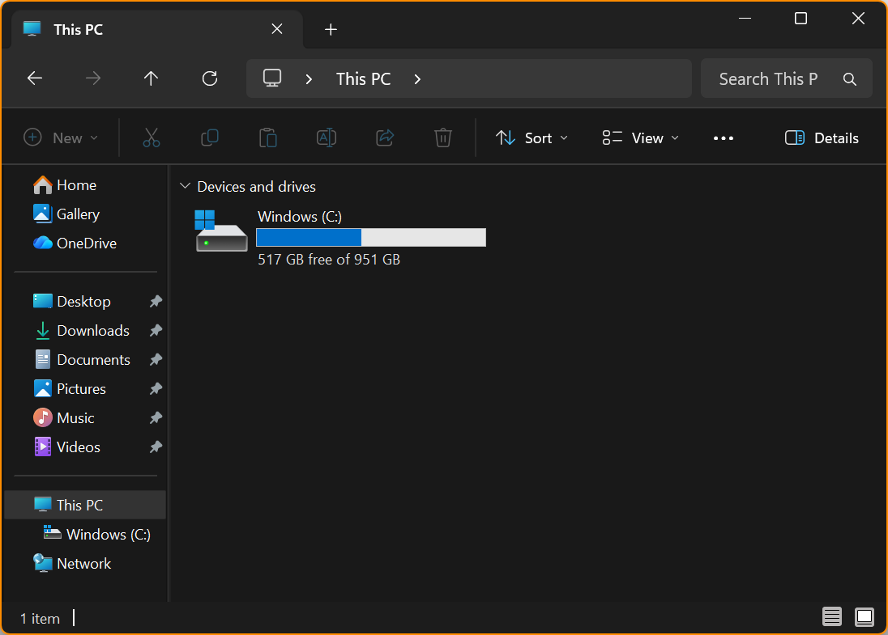
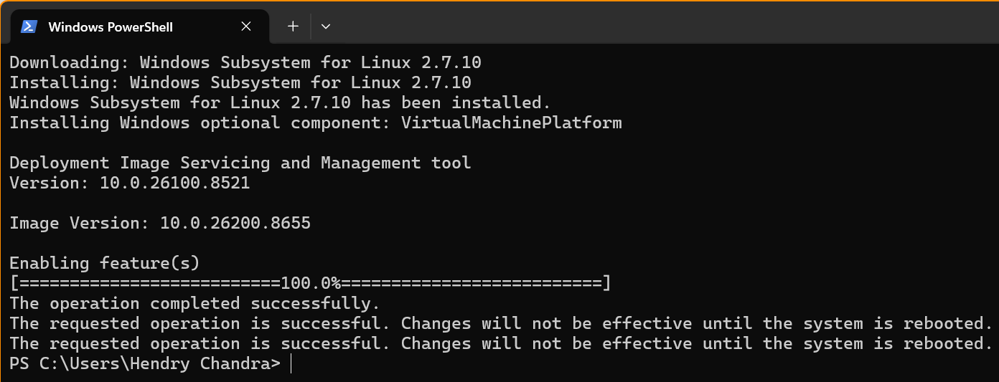

# CLI Dumps of WSL2, Ubuntu 24.04 and PyTorch on Intel GPU

<br><br><br>
```
╔═╦═══════════════════════════════════════════════════════╦═╗
╠═╬═══════════════════════════════════════════════════════╬═╣
║ ║ Content of this Folder was Last Updated on 2026 07 22 ║ ║
╠═╬═══════════════════════════════════════════════════════╬═╣
╚═╩═══════════════════════════════════════════════════════╩═╝
```
<br><br><br>

## Before WSL2 Virtualization Framework installed on Windows 11

```
PS C:\Users\Hendry Chandra> wsl --status
The Windows Subsystem for Linux is not installed. You can install by running 'wsl.exe --install'.
For more information please visit https://aka.ms/wslinstall
PS C:\Users\Hendry Chandra>
```

```
PS C:\Users\Hendry Chandra> wsl --help

Copyright (c) Microsoft Corporation. All rights reserved.

Usage: wsl.exe [Argument]

Arguments:

    --install
        Install Windows Subsystem for Linux. If no options are specified,
        the recommended features will be installed along with the default distribution.

        For a full list of install options please visit https://aka.ms/wslinstall.

    --update
        Update to the latest version of Windows Subsystem for Linux.

    --status
        Show the status of Windows Subsystem for Linux.

    --help
        Display usage information.
PS C:\Users\Hendry Chandra>
```



<br><br><br>

***

## Installing WSL Virtualization Framework

Open: **PowerShell** in ***administrator mode***.

Command: **`wsl --install`**.



After successful installation, ***restart your machine***.

<br><br><br>

***

## After WSL2 Virtualization Framework installed and Windows 11 ReStarted

```
PS C:\Users\Hendry Chandra> wsl --status
Default Version: 2
WSL1 is not supported with your current machine configuration.
Please enable the "Windows Subsystem for Linux" optional component to use WSL1.
PS C:\Users\Hendry Chandra>
```

```
PS C:\Users\Hendry Chandra> wsl --version
WSL version: 2.7.10.0
Kernel version: 6.18.33.2-2
WSLg version: 1.0.73.2
MSRDC version: 1.2.6676
Direct3D version: 1.611.1-81528511
DXCore version: 10.0.26100.1-240331-1435.ge-release
Windows version: 10.0.26200.8655
PS C:\Users\Hendry Chandra> wsl --list --verbose
Windows Subsystem for Linux has no installed distributions.
You can resolve this by installing a distribution with the instructions below:

Use 'wsl.exe --list --online' to list available distributions
and 'wsl.exe --install <Distro>' to install.
PS C:\Users\Hendry Chandra>
```

<details>
<summary><b><code>wsl --help</code></b></summary>

```
PS C:\Users\Hendry Chandra> wsl --help
Copyright (c) Microsoft Corporation. All rights reserved.
For privacy information about this product please visit https://aka.ms/privacy.

Usage: wsl.exe [Argument] [Options...] [CommandLine]

Arguments for running Linux binaries:

    If no command line is provided, wsl.exe launches the default shell.

    --exec, -e <CommandLine>
        Execute the specified command without using the default Linux shell.

    --shell-type <standard|login|none>
        Execute the specified command with the provided shell type.

    --
        Pass the remaining command line as-is.

Options:
    --cd <Directory>
        Sets the specified directory as the current working directory.
        If ~ is used the Linux user's home path will be used. If the path begins
        with a / character, it will be interpreted as an absolute Linux path.
        Otherwise, the value must be an absolute Windows path.

    --distribution, -d <DistroName>
        Run the specified distribution.

    --distribution-id <DistroGuid>
        Run the specified distribution ID.

    --user, -u <UserName>
        Run as the specified user.

    --system
        Launches a shell for the system distribution.

Arguments for managing Windows Subsystem for Linux:

    --help
        Display usage information.

    --debug-shell
        Open a WSL2 debug shell for diagnostics purposes.

    --install [Distro] [Options...]
        Install a Windows Subsystem for Linux distribution.
        For a list of valid distributions, use 'wsl.exe --list --online'.

        Options:
            --enable-wsl1
                Enable WSL1 support.

            --fixed-vhd
                Create a fixed-size disk to store the distribution.

            --from-file <Path>
                Install a distribution from a local file.

            --legacy
                Use the legacy distribution manifest.

            --location <Location>
                Set the install path for the distribution.

            --name <Name>
                Set the name of the distribution.

            --no-distribution
                Only install the required optional components, does not install a distribution.

            --no-launch, -n
                Do not launch the distribution after install.

            --version <Version>
                Specifies the version to use for the new distribution.

            --vhd-size <MemoryString>
                Specifies the size of the disk to store the distribution.

            --web-download
                Download the distribution from the internet instead of the Microsoft Store.

    --manage <Distro> <Options...>
        Changes distro specific options.

        Options:
            --move <Location>
                Move the distribution to a new location.

            --set-sparse, -s <true|false>
                Set the VHD of distro to be sparse, allowing disk space to be automatically reclaimed.

            --set-default-user <Username>
                Set the default user of the distribution.

            --resize <MemoryString>
                Resize the disk of the distribution to the specified size.

    --mount <Disk>
        Attaches and mounts a physical or virtual disk in all WSL 2 distributions.

        Options:
            --vhd
                Specifies that <Disk> refers to a virtual hard disk.

            --bare
                Attach the disk to WSL2, but don't mount it.

            --name <Name>
                Mount the disk using a custom name for the mountpoint.

            --type <Type>
                Filesystem to use when mounting a disk, if not specified defaults to ext4.

            --options <Options>
                Additional mount options.

            --partition <Index>
                Index of the partition to mount, if not specified defaults to the whole disk.

    --set-default-version <Version>
        Changes the default install version for new distributions.

    --shutdown
        Immediately terminates all running distributions and the WSL 2
        lightweight utility virtual machine.

        Options:
            --force
                Terminate the WSL 2 virtual machine even if an operation is in progress. Can cause data loss.

    --status
        Show the status of Windows Subsystem for Linux.

    --unmount [Disk]
        Unmounts and detaches a disk from all WSL2 distributions.
        Unmounts and detaches all disks if called without argument.

    --uninstall
        Uninstalls the Windows Subsystem for Linux package from this machine.

    --update
        Update the Windows Subsystem for Linux package.

        Options:
            --pre-release
                Download a pre-release version if available.

    --version, -v
        Display version information.

Arguments for managing distributions in Windows Subsystem for Linux:

    --export <Distro> <FileName> [Options]
        Exports the distribution to a tar file.
        The filename can be - for stdout.

        Options:
            --format <Format>
                Specifies the export format. Supported values: tar, tar.gz, tar.xz, vhd.

    --import <Distro> <InstallLocation> <FileName> [Options]
        Imports the specified tar file as a new distribution.
        The filename can be - for stdin.

        Options:
            --version <Version>
                Specifies the version to use for the new distribution.

            --vhd
                Specifies that the provided file is a .vhd or .vhdx file, not a tar file.
                This operation makes a copy of the VHD file at the specified install location.

    --import-in-place <Distro> <FileName>
        Imports the specified VHD file as a new distribution.
        This virtual hard disk must be formatted with the ext4 filesystem type.

    --list, -l [Options]
        Lists distributions.

        Options:
            --all
                List all distributions, including distributions that are
                currently being installed or uninstalled.

            --running
                List only distributions that are currently running.

            --quiet, -q
                Only show distribution names.

            --verbose, -v
                Show detailed information about all distributions.

            --online, -o
                Displays a list of available distributions for install with 'wsl.exe --install'.

    --set-default, -s <Distro>
        Sets the distribution as the default.

    --set-version <Distro> <Version>
        Changes the version of the specified distribution.

    --terminate, -t <Distro>
        Terminates the specified distribution.

    --unregister <Distro>
        Unregisters the distribution and deletes the root filesystem.
PS C:\Users\Hendry Chandra>
```

</details>

```
PS C:\Users\Hendry Chandra> wsl --list --online
The following is a list of valid distributions that can be installed.
Install using 'wsl.exe --install <Distro>'.

NAME                            FRIENDLY NAME
Ubuntu                          Ubuntu
Ubuntu-26.04                    Ubuntu 26.04 LTS
Ubuntu-24.04                    Ubuntu 24.04 LTS
Ubuntu-22.04                    Ubuntu 22.04 LTS
openSUSE-Tumbleweed             openSUSE Tumbleweed
openSUSE-Leap-16.0              openSUSE Leap 16.0
SUSE-Linux-Enterprise-15-SP7    SUSE Linux Enterprise 15 SP7
SUSE-Linux-Enterprise-16.0      SUSE Linux Enterprise 16.0
kali-linux                      Kali Linux Rolling
Debian                          Debian GNU/Linux
AlmaLinux-8                     AlmaLinux OS 8
AlmaLinux-9                     AlmaLinux OS 9
AlmaLinux-Kitten-10             AlmaLinux OS Kitten 10
AlmaLinux-10                    AlmaLinux OS 10
archlinux                       Arch Linux
FedoraLinux-44                  Fedora Linux 44
FedoraLinux-43                  Fedora Linux 43
eLxr                            eLxr 12.12.0.0 GNU/Linux
OracleLinux_7_9                 Oracle Linux 7.9
OracleLinux_8_10                Oracle Linux 8.10
OracleLinux_9_5                 Oracle Linux 9.5
SUSE-Linux-Enterprise-15-SP6    SUSE Linux Enterprise 15 SP6
PS C:\Users\Hendry Chandra>
```

<br><br><br>

***

## Install Ubuntu-24.04

```
PS C:\Users\Hendry Chandra> wsl --install --distribution Ubuntu-24.04 --name Ubuntu-24.04-HC --no-launch
Downloading: Ubuntu 24.04 LTS
Installing: Ubuntu 24.04 LTS
Distribution successfully installed. It can be launched via 'wsl.exe -d Ubuntu-24.04-HC'
PS C:\Users\Hendry Chandra>
```

```
PS C:\Users\Hendry Chandra> wsl --list --verbose
  NAME               STATE           VERSION
* Ubuntu-24.04-HC    Stopped         2
PS C:\Users\Hendry Chandra>
```

```
PS C:\Users\Hendry Chandra> wsl --distribution Ubuntu-24.04-HC
Provisioning the new WSL instance Ubuntu-24.04-HC
This might take a while...
Create a default Unix user account: ubuntu
New password:
Retype new password:
passwd: password updated successfully
To run a command as administrator (user "root"), use "sudo <command>".
See "man sudo_root" for details.
ubuntu@Hen-Chan-X-Man:/mnt/c/Users/Hendry Chandra$
```

<br><br><br>

***

## Configure Ubuntu-24.04 for Template

### sudoers

```
ubuntu@Hen-Chan-X-Man:/mnt/c/Users/Hendry Chandra$ echo -e "\n\n\nroot     ALL=(ALL:ALL) NOPASSWD:ALL\nubuntu   ALL=(ALL:ALL) NOPASSWD:ALL\n\n\n" | sudo tee -a /etc/sudoers
[sudo] password for ubuntu:


root     ALL=(ALL:ALL) NOPASSWD:ALL
ubuntu   ALL=(ALL:ALL) NOPASSWD:ALL


ubuntu@Hen-Chan-X-Man:/mnt/c/Users/Hendry Chandra$
```

<details>
<summary><b><code>sudo cat /etc/sudoers</code></b></summary>

```
ubuntu@Hen-Chan-X-Man:/mnt/c/Users/Hendry Chandra$ sudo cat /etc/sudoers
#
# This file MUST be edited with the 'visudo' command as root.
#
# Please consider adding local content in /etc/sudoers.d/ instead of
# directly modifying this file.
#
# See the man page for details on how to write a sudoers file.
#
Defaults        env_reset
Defaults        mail_badpass
Defaults        secure_path="/usr/local/sbin:/usr/local/bin:/usr/sbin:/usr/bin:/sbin:/bin:/snap/bin"

# This fixes CVE-2005-4890 and possibly breaks some versions of kdesu
# (#1011624, https://bugs.kde.org/show_bug.cgi?id=452532)
Defaults        use_pty

# This preserves proxy settings from user environments of root
# equivalent users (group sudo)
#Defaults:%sudo env_keep += "http_proxy https_proxy ftp_proxy all_proxy no_proxy"

# This allows running arbitrary commands, but so does ALL, and it means
# different sudoers have their choice of editor respected.
#Defaults:%sudo env_keep += "EDITOR"

# Completely harmless preservation of a user preference.
#Defaults:%sudo env_keep += "GREP_COLOR"

# While you shouldn't normally run git as root, you need to with etckeeper
#Defaults:%sudo env_keep += "GIT_AUTHOR_* GIT_COMMITTER_*"

# Per-user preferences; root won't have sensible values for them.
#Defaults:%sudo env_keep += "EMAIL DEBEMAIL DEBFULLNAME"

# "sudo scp" or "sudo rsync" should be able to use your SSH agent.
#Defaults:%sudo env_keep += "SSH_AGENT_PID SSH_AUTH_SOCK"

# Ditto for GPG agent
#Defaults:%sudo env_keep += "GPG_AGENT_INFO"

# Host alias specification

# User alias specification

# Cmnd alias specification

# User privilege specification
root    ALL=(ALL:ALL) ALL

# Members of the admin group may gain root privileges
%admin ALL=(ALL) ALL

# Allow members of group sudo to execute any command
%sudo   ALL=(ALL:ALL) ALL

# See sudoers(5) for more information on "@include" directives:

@includedir /etc/sudoers.d


root     ALL=(ALL:ALL) NOPASSWD:ALL
ubuntu   ALL=(ALL:ALL) NOPASSWD:ALL


ubuntu@Hen-Chan-X-Man:/mnt/c/Users/Hendry Chandra$
```

</details>

Series of tests:

```
ubuntu@Hen-Chan-X-Man:/mnt/c/Users/Hendry Chandra$ sudo visudo -c
/etc/sudoers: parsed OK
/etc/sudoers.d/README: parsed OK
ubuntu@Hen-Chan-X-Man:/mnt/c/Users/Hendry Chandra$ sudo -k
ubuntu@Hen-Chan-X-Man:/mnt/c/Users/Hendry Chandra$ sudo whoami
root
ubuntu@Hen-Chan-X-Man:/mnt/c/Users/Hendry Chandra$ sudo -l -U root
Matching Defaults entries for root on Hen-Chan-X-Man:
    env_reset, mail_badpass, secure_path=/usr/local/sbin\:/usr/local/bin\:/usr/sbin\:/usr/bin\:/sbin\:/bin\:/snap/bin, use_pty

User root may run the following commands on Hen-Chan-X-Man:
    (ALL : ALL) ALL
    (ALL : ALL) NOPASSWD: ALL
ubuntu@Hen-Chan-X-Man:/mnt/c/Users/Hendry Chandra$ sudo -l -U ubuntu
Matching Defaults entries for ubuntu on Hen-Chan-X-Man:
    env_reset, mail_badpass, secure_path=/usr/local/sbin\:/usr/local/bin\:/usr/sbin\:/usr/bin\:/sbin\:/bin\:/snap/bin, use_pty

User ubuntu may run the following commands on Hen-Chan-X-Man:
    (ALL : ALL) ALL
    (ALL : ALL) NOPASSWD: ALL
ubuntu@Hen-Chan-X-Man:/mnt/c/Users/Hendry Chandra$
```

<br><br><br>

***

### Ubuntu Distribution Repository

Changes to the **`URIs`** fields to cover more than one repositories, for added robustness.

<details>
<summary><b><code>sudo cat /etc/apt/sources.list.d/ubuntu.sources</code></b></summary>

```
ubuntu@Hen-Chan-X-Man:/mnt/c/Users/Hendry Chandra$ sudo cat /etc/apt/sources.list.d/ubuntu.sources
# See http://help.ubuntu.com/community/UpgradeNotes for how to upgrade to
# newer versions of the distribution.

## Ubuntu distribution repository
##
## The following settings can be adjusted to configure which packages to use from Ubuntu.
## Mirror your choices (except for URIs and Suites) in the security section below to
## ensure timely security updates.
##
## Types: Append deb-src to enable the fetching of source package.
## URIs: A URL to the repository (you may add multiple URLs)
## Suites: The following additional suites can be configured
##   <name>-updates   - Major bug fix updates produced after the final release of the
##                      distribution.
##   <name>-backports - software from this repository may not have been tested as
##                      extensively as that contained in the main release, although it includes
##                      newer versions of some applications which may provide useful features.
##                      Also, please note that software in backports WILL NOT receive any review
##                      or updates from the Ubuntu security team.
## Components: Aside from main, the following components can be added to the list
##   restricted  - Software that may not be under a free license, or protected by patents.
##   universe    - Community maintained packages. Software in this repository receives maintenance
##                 from volunteers in the Ubuntu community, or a 10 year security maintenance
##                 commitment from Canonical when an Ubuntu Pro subscription is attached.
##   multiverse  - Community maintained of restricted. Software from this repository is
##                 ENTIRELY UNSUPPORTED by the Ubuntu team, and may not be under a free
##                 licence. Please satisfy yourself as to your rights to use the software.
##                 Also, please note that software in multiverse WILL NOT receive any
##                 review or updates from the Ubuntu security team.
##
## See the sources.list(5) manual page for further settings.
Types: deb
URIs: https://mirror.twds.com.tw/ubuntu/ https://ftp.kaist.ac.kr/ubuntu/ https://ftp.udx.icscoe.jp/Linux/ubuntu/ https://ftp.uni-stuttgart.de/ubuntu/ https://mirrors.arcuslayer.com/ubuntu/ https://archive.ubuntu.com/ubuntu/
Suites: noble noble-updates noble-backports
Components: main universe restricted multiverse
Signed-By: /usr/share/keyrings/ubuntu-archive-keyring.gpg

## Ubuntu security updates. Aside from URIs and Suites,
## this should mirror your choices in the previous section.
Types: deb
URIs: https://mirror.twds.com.tw/ubuntu/ https://ftp.kaist.ac.kr/ubuntu/ https://ftp.udx.icscoe.jp/Linux/ubuntu/ https://ftp.uni-stuttgart.de/ubuntu/ https://mirrors.arcuslayer.com/ubuntu/ https://security.ubuntu.com/ubuntu/
Suites: noble-security
Components: main universe restricted multiverse
Signed-By: /usr/share/keyrings/ubuntu-archive-keyring.gpg
ubuntu@Hen-Chan-X-Man:/mnt/c/Users/Hendry Chandra$
```

</details>

<br><br><br>

***

### Check Other Base Configurations

```
ubuntu@Hen-Chan-X-Man:/mnt/c/Users/Hendry Chandra$ timedatectl
               Local time: Tue 2026-06-30 10:50:18 +07
           Universal time: Tue 2026-06-30 03:50:18 UTC
                 RTC time: Tue 2026-06-30 03:50:20
                Time zone: Asia/Bangkok (+07, +0700)
System clock synchronized: no
              NTP service: active
          RTC in local TZ: no
ubuntu@Hen-Chan-X-Man:/mnt/c/Users/Hendry Chandra$
```

```
ubuntu@Hen-Chan-X-Man:/mnt/c/Users/Hendry Chandra$ hostname
Hen-Chan-X-Man
ubuntu@Hen-Chan-X-Man:/mnt/c/Users/Hendry Chandra$
```

```
ubuntu@Hen-Chan-X-Man:/mnt/c/Users/Hendry Chandra$ sudo ls -lap /etc/netplan/
total 8
drwxr-xr-x  2 root root 4096 Apr 18  2024 ./
drwxr-xr-x 88 root root 4096 Jun 30 10:27 ../
ubuntu@Hen-Chan-X-Man:/mnt/c/Users/Hendry Chandra$
```

```
ubuntu@Hen-Chan-X-Man:/mnt/c/Users/Hendry Chandra$ sudo cat /etc/hosts
# This file was automatically generated by WSL. To stop automatic generation of this file, add the following entry to /etc/wsl.conf:
# [network]
# generateHosts = false
127.0.0.1       localhost
127.0.1.1       Hen-Chan-X-Man.localdomain      Hen-Chan-X-Man

# The following lines are desirable for IPv6 capable hosts
::1     ip6-localhost ip6-loopback
fe00::0 ip6-localnet
ff00::0 ip6-mcastprefix
ff02::1 ip6-allnodes
ff02::2 ip6-allrouters
ubuntu@Hen-Chan-X-Man:/mnt/c/Users/Hendry Chandra$
```

```
ubuntu@Hen-Chan-X-Man:/mnt/c/Users/Hendry Chandra$ ip address
1: lo: <LOOPBACK,UP,LOWER_UP> mtu 65536 qdisc noqueue state UNKNOWN group default qlen 1000
    link/loopback 00:00:00:00:00:00 brd 00:00:00:00:00:00
    inet 127.0.0.1/8 scope host lo
       valid_lft forever preferred_lft forever
    inet 10.255.255.254/32 brd 10.255.255.254 scope global lo
       valid_lft forever preferred_lft forever
    inet6 ::1/128 scope host
       valid_lft forever preferred_lft forever
2: eth0: <BROADCAST,MULTICAST,UP,LOWER_UP> mtu 1500 qdisc mq state UP group default qlen 1000
    link/ether 00:15:5d:9e:f1:c6 brd ff:ff:ff:ff:ff:ff
    inet 172.20.230.222/20 brd 172.20.239.255 scope global eth0
       valid_lft forever preferred_lft forever
    inet6 fe80::215:5dff:fe9e:f1c6/64 scope link
       valid_lft forever preferred_lft forever
ubuntu@Hen-Chan-X-Man:/mnt/c/Users/Hendry Chandra$
```

<br><br><br>

***

### Update the Instance

<details>
<summary><b><code>sudo apt update -y</code></b></summary>

```
ubuntu@Hen-Chan-X-Man:/mnt/c/Users/Hendry Chandra$ sudo apt update -y
Get:1 https://mirror.twds.com.tw/ubuntu noble InRelease [256 kB]
Get:2 https://mirror.twds.com.tw/ubuntu noble-updates InRelease [126 kB]
Get:3 https://mirrors.arcuslayer.com/ubuntu noble InRelease [256 kB]
Get:4 https://mirror.twds.com.tw/ubuntu noble-backports InRelease [126 kB]
Get:5 https://mirror.twds.com.tw/ubuntu noble-security InRelease [126 kB]
Get:6 https://security.ubuntu.com/ubuntu noble-security InRelease [126 kB]
Get:7 https://mirror.twds.com.tw/ubuntu noble/main amd64 Packages [1401 kB]
Get:8 https://ftp.kaist.ac.kr/ubuntu noble InRelease [256 kB]
Get:9 https://mirrors.arcuslayer.com/ubuntu noble-updates InRelease [126 kB]
Get:10 https://mirror.twds.com.tw/ubuntu noble/main Translation-en [513 kB]
Get:11 https://mirrors.arcuslayer.com/ubuntu noble-backports InRelease [126 kB]
Get:12 https://mirror.twds.com.tw/ubuntu noble/main amd64 Components [464 kB]
Hit:13 https://archive.ubuntu.com/ubuntu noble InRelease
Get:14 https://mirror.twds.com.tw/ubuntu noble/main amd64 c-n-f Metadata [30.5 kB]
Get:15 https://mirror.twds.com.tw/ubuntu noble/universe amd64 Packages [15.0 MB]
Get:16 https://archive.ubuntu.com/ubuntu noble-updates InRelease [126 kB]
Get:17 https://ftp.udx.icscoe.jp/Linux/ubuntu noble InRelease [256 kB]
Get:18 https://ftp.kaist.ac.kr/ubuntu noble-updates InRelease [126 kB]
Get:19 https://mirrors.arcuslayer.com/ubuntu noble-security InRelease [126 kB]
Get:20 https://security.ubuntu.com/ubuntu noble-security/main amd64 Packages [788 kB]
Get:21 https://mirrors.arcuslayer.com/ubuntu noble/main amd64 Packages [1401 kB]
Get:22 https://security.ubuntu.com/ubuntu noble-security/main Translation-en [179 kB]
Get:23 https://security.ubuntu.com/ubuntu noble-security/main amd64 Components [44.9 kB]
Get:24 https://security.ubuntu.com/ubuntu noble-security/main amd64 c-n-f Metadata [11.6 kB]
Get:25 https://security.ubuntu.com/ubuntu noble-security/universe amd64 Packages [1171 kB]
Get:26 https://ftp.kaist.ac.kr/ubuntu noble-backports InRelease [126 kB]
Get:27 https://ftp.udx.icscoe.jp/Linux/ubuntu noble-updates InRelease [126 kB]
Get:28 https://ftp.uni-stuttgart.de/ubuntu noble InRelease [256 kB]
Get:29 https://archive.ubuntu.com/ubuntu noble-backports InRelease [126 kB]
Get:30 https://ftp.kaist.ac.kr/ubuntu noble-security InRelease [126 kB]
Get:31 https://security.ubuntu.com/ubuntu noble-security/universe Translation-en [229 kB]
Get:32 https://archive.ubuntu.com/ubuntu noble/universe amd64 Packages [15.0 MB]
Get:33 https://security.ubuntu.com/ubuntu noble-security/universe amd64 Components [76.3 kB]
Get:34 https://security.ubuntu.com/ubuntu noble-security/universe amd64 c-n-f Metadata [24.1 kB]
Get:35 https://security.ubuntu.com/ubuntu noble-security/restricted amd64 Packages [1071 kB]
Get:36 https://ftp.udx.icscoe.jp/Linux/ubuntu noble-backports InRelease [126 kB]
Get:37 https://ftp.kaist.ac.kr/ubuntu noble/main amd64 Packages [1401 kB]
Get:38 https://ftp.udx.icscoe.jp/Linux/ubuntu noble-security InRelease [126 kB]
Get:39 https://security.ubuntu.com/ubuntu noble-security/restricted Translation-en [245 kB]
Get:40 https://security.ubuntu.com/ubuntu noble-security/restricted amd64 Components [212 B]
Get:41 https://security.ubuntu.com/ubuntu noble-security/restricted amd64 c-n-f Metadata [444 B]
Get:42 https://security.ubuntu.com/ubuntu noble-security/multiverse amd64 Packages [35.3 kB]
Get:43 https://mirrors.arcuslayer.com/ubuntu noble/main Translation-en [513 kB]
Get:44 https://security.ubuntu.com/ubuntu noble-security/multiverse Translation-en [8308 B]
Get:45 https://security.ubuntu.com/ubuntu noble-security/multiverse amd64 Components [208 B]
Get:46 https://security.ubuntu.com/ubuntu noble-security/multiverse amd64 c-n-f Metadata [468 B]
Get:47 https://ftp.udx.icscoe.jp/Linux/ubuntu noble/main amd64 Packages [1401 kB]
Get:48 https://mirrors.arcuslayer.com/ubuntu noble/main amd64 Components [464 kB]
Get:49 https://mirrors.arcuslayer.com/ubuntu noble/main amd64 c-n-f Metadata [30.5 kB]
Get:50 https://ftp.udx.icscoe.jp/Linux/ubuntu noble/main Translation-en [513 kB]
Get:51 https://mirrors.arcuslayer.com/ubuntu noble/universe amd64 Packages [15.0 MB]
Get:52 https://ftp.kaist.ac.kr/ubuntu noble/main Translation-en [513 kB]
Get:53 https://ftp.udx.icscoe.jp/Linux/ubuntu noble/main amd64 Components [464 kB]
Get:54 https://ftp.udx.icscoe.jp/Linux/ubuntu noble/main amd64 c-n-f Metadata [30.5 kB]
Get:55 https://ftp.udx.icscoe.jp/Linux/ubuntu noble/universe amd64 Packages [15.0 MB]
Get:56 https://ftp.kaist.ac.kr/ubuntu noble/main amd64 Components [464 kB]
Get:57 https://ftp.kaist.ac.kr/ubuntu noble/main amd64 c-n-f Metadata [30.5 kB]
Get:58 https://ftp.kaist.ac.kr/ubuntu noble/universe amd64 Packages [15.0 MB]
Get:59 https://mirrors.arcuslayer.com/ubuntu noble/universe Translation-en [5982 kB]
Get:60 https://archive.ubuntu.com/ubuntu noble/universe Translation-en [5982 kB]
Get:61 https://ftp.kaist.ac.kr/ubuntu noble/universe Translation-en [5982 kB]
Get:62 https://mirrors.arcuslayer.com/ubuntu noble/universe amd64 Components [3871 kB]
Get:63 https://archive.ubuntu.com/ubuntu noble/universe amd64 Components [3871 kB]
Get:64 https://ftp.udx.icscoe.jp/Linux/ubuntu noble/universe Translation-en [5982 kB]
Get:65 https://ftp.uni-stuttgart.de/ubuntu noble-updates InRelease [126 kB]
Get:66 https://archive.ubuntu.com/ubuntu noble/universe amd64 c-n-f Metadata [301 kB]
Get:67 https://archive.ubuntu.com/ubuntu noble/multiverse amd64 Packages [269 kB]
Get:68 https://ftp.kaist.ac.kr/ubuntu noble/universe amd64 Components [3871 kB]
Get:69 https://archive.ubuntu.com/ubuntu noble/multiverse Translation-en [118 kB]
Get:70 https://archive.ubuntu.com/ubuntu noble/multiverse amd64 Components [35.0 kB]
Get:71 https://archive.ubuntu.com/ubuntu noble/multiverse amd64 c-n-f Metadata [8328 B]
Get:72 https://archive.ubuntu.com/ubuntu noble-updates/main amd64 Packages [1041 kB]
Get:73 https://archive.ubuntu.com/ubuntu noble-updates/main Translation-en [261 kB]
Get:74 https://archive.ubuntu.com/ubuntu noble-updates/main amd64 Components [181 kB]
Get:75 https://archive.ubuntu.com/ubuntu noble-updates/main amd64 c-n-f Metadata [17.5 kB]
Get:76 https://archive.ubuntu.com/ubuntu noble-updates/universe amd64 Packages [1656 kB]
Get:77 https://archive.ubuntu.com/ubuntu noble-updates/universe Translation-en [326 kB]
Get:78 https://archive.ubuntu.com/ubuntu noble-updates/universe amd64 Components [388 kB]
Get:79 https://archive.ubuntu.com/ubuntu noble-updates/universe amd64 c-n-f Metadata [34.8 kB]
Get:80 https://archive.ubuntu.com/ubuntu noble-updates/restricted amd64 Packages [1134 kB]
Get:81 https://ftp.kaist.ac.kr/ubuntu noble/universe amd64 c-n-f Metadata [301 kB]
Get:82 https://ftp.udx.icscoe.jp/Linux/ubuntu noble/universe amd64 Components [3871 kB]
Get:83 https://archive.ubuntu.com/ubuntu noble-updates/restricted Translation-en [257 kB]
Get:84 https://ftp.kaist.ac.kr/ubuntu noble/restricted amd64 Packages [93.9 kB]
Get:85 https://ftp.kaist.ac.kr/ubuntu noble/restricted Translation-en [18.7 kB]
Get:86 https://ftp.kaist.ac.kr/ubuntu noble/restricted amd64 c-n-f Metadata [416 B]
Get:87 https://ftp.kaist.ac.kr/ubuntu noble/multiverse amd64 Packages [269 kB]
Get:88 https://archive.ubuntu.com/ubuntu noble-updates/restricted amd64 Components [212 B]
Get:89 https://archive.ubuntu.com/ubuntu noble-updates/restricted amd64 c-n-f Metadata [456 B]
Get:90 https://archive.ubuntu.com/ubuntu noble-updates/multiverse amd64 Packages [40.4 kB]
Get:91 https://archive.ubuntu.com/ubuntu noble-updates/multiverse Translation-en [9972 B]
Get:92 https://archive.ubuntu.com/ubuntu noble-updates/multiverse amd64 Components [940 B]
Get:93 https://archive.ubuntu.com/ubuntu noble-updates/multiverse amd64 c-n-f Metadata [656 B]
Get:94 https://archive.ubuntu.com/ubuntu noble-backports/main amd64 Packages [40.6 kB]
Get:95 https://archive.ubuntu.com/ubuntu noble-backports/main Translation-en [9172 B]
Get:96 https://archive.ubuntu.com/ubuntu noble-backports/main amd64 Components [5760 B]
Get:97 https://archive.ubuntu.com/ubuntu noble-backports/main amd64 c-n-f Metadata [368 B]
Get:98 https://archive.ubuntu.com/ubuntu noble-backports/universe amd64 Packages [31.0 kB]
Get:99 https://ftp.kaist.ac.kr/ubuntu noble/multiverse Translation-en [118 kB]
Get:100 https://archive.ubuntu.com/ubuntu noble-backports/universe Translation-en [18.6 kB]
Get:101 https://archive.ubuntu.com/ubuntu noble-backports/universe amd64 Components [10.5 kB]
Get:102 https://archive.ubuntu.com/ubuntu noble-backports/universe amd64 c-n-f Metadata [1588 B]
Get:103 https://archive.ubuntu.com/ubuntu noble-backports/restricted amd64 Components [212 B]
Get:104 https://archive.ubuntu.com/ubuntu noble-backports/restricted amd64 c-n-f Metadata [116 B]
Get:105 https://archive.ubuntu.com/ubuntu noble-backports/multiverse amd64 Packages [748 B]
Get:106 https://ftp.kaist.ac.kr/ubuntu noble/multiverse amd64 Components [35.0 kB]
Get:107 https://ftp.kaist.ac.kr/ubuntu noble/multiverse amd64 c-n-f Metadata [8328 B]
Get:108 https://ftp.kaist.ac.kr/ubuntu noble-updates/main amd64 Packages [1041 kB]
Get:109 https://archive.ubuntu.com/ubuntu noble-backports/multiverse Translation-en [340 B]
Get:110 https://archive.ubuntu.com/ubuntu noble-backports/multiverse amd64 Components [212 B]
Get:111 https://archive.ubuntu.com/ubuntu noble-backports/multiverse amd64 c-n-f Metadata [116 B]
Get:112 https://mirrors.arcuslayer.com/ubuntu noble/universe amd64 c-n-f Metadata [301 kB]
Get:113 https://ftp.uni-stuttgart.de/ubuntu noble-backports InRelease [126 kB]
Get:114 https://ftp.kaist.ac.kr/ubuntu noble-updates/main Translation-en [261 kB]
Get:115 https://ftp.kaist.ac.kr/ubuntu noble-updates/main amd64 Components [181 kB]
Get:116 https://mirrors.arcuslayer.com/ubuntu noble/restricted amd64 Packages [93.9 kB]
Get:117 https://ftp.kaist.ac.kr/ubuntu noble-updates/main amd64 c-n-f Metadata [17.5 kB]
Get:118 https://ftp.kaist.ac.kr/ubuntu noble-updates/universe amd64 Packages [1656 kB]
Get:119 https://mirrors.arcuslayer.com/ubuntu noble/restricted Translation-en [18.7 kB]
Get:120 https://ftp.udx.icscoe.jp/Linux/ubuntu noble/universe amd64 c-n-f Metadata [301 kB]
Get:121 https://mirrors.arcuslayer.com/ubuntu noble/restricted amd64 c-n-f Metadata [416 B]
Get:122 https://ftp.udx.icscoe.jp/Linux/ubuntu noble/restricted amd64 Packages [93.9 kB]
Get:123 https://ftp.kaist.ac.kr/ubuntu noble-updates/universe Translation-en [326 kB]
Get:124 https://ftp.udx.icscoe.jp/Linux/ubuntu noble/restricted Translation-en [18.7 kB]
Get:125 https://ftp.udx.icscoe.jp/Linux/ubuntu noble/restricted amd64 c-n-f Metadata [416 B]
Get:126 https://ftp.udx.icscoe.jp/Linux/ubuntu noble/multiverse amd64 Packages [269 kB]
Get:127 https://ftp.udx.icscoe.jp/Linux/ubuntu noble/multiverse Translation-en [118 kB]
Get:128 https://ftp.kaist.ac.kr/ubuntu noble-updates/universe amd64 Components [388 kB]
Get:129 https://ftp.udx.icscoe.jp/Linux/ubuntu noble/multiverse amd64 Components [35.0 kB]
Get:130 https://mirrors.arcuslayer.com/ubuntu noble/multiverse amd64 Packages [269 kB]
Get:131 https://ftp.udx.icscoe.jp/Linux/ubuntu noble/multiverse amd64 c-n-f Metadata [8328 B]
Get:132 https://ftp.udx.icscoe.jp/Linux/ubuntu noble-updates/main amd64 Packages [1041 kB]
Get:133 https://ftp.kaist.ac.kr/ubuntu noble-updates/universe amd64 c-n-f Metadata [34.8 kB]
Get:134 https://ftp.kaist.ac.kr/ubuntu noble-updates/restricted amd64 Packages [1134 kB]
Get:135 https://mirrors.arcuslayer.com/ubuntu noble/multiverse Translation-en [118 kB]
Get:136 https://ftp.udx.icscoe.jp/Linux/ubuntu noble-updates/main Translation-en [261 kB]
Get:137 https://ftp.udx.icscoe.jp/Linux/ubuntu noble-updates/main amd64 Components [181 kB]
Get:138 https://ftp.udx.icscoe.jp/Linux/ubuntu noble-updates/main amd64 c-n-f Metadata [17.5 kB]
Get:139 https://ftp.udx.icscoe.jp/Linux/ubuntu noble-updates/universe amd64 Packages [1656 kB]
Get:140 https://ftp.kaist.ac.kr/ubuntu noble-updates/restricted Translation-en [257 kB]
Get:141 https://mirrors.arcuslayer.com/ubuntu noble/multiverse amd64 Components [35.0 kB]
Get:142 https://ftp.kaist.ac.kr/ubuntu noble-updates/restricted amd64 Components [212 B]
Get:143 https://ftp.kaist.ac.kr/ubuntu noble-updates/restricted amd64 c-n-f Metadata [456 B]
Get:144 https://ftp.kaist.ac.kr/ubuntu noble-updates/multiverse amd64 Packages [40.4 kB]
Get:145 https://ftp.kaist.ac.kr/ubuntu noble-updates/multiverse Translation-en [9972 B]
Get:146 https://ftp.kaist.ac.kr/ubuntu noble-updates/multiverse amd64 Components [940 B]
Get:147 https://ftp.kaist.ac.kr/ubuntu noble-updates/multiverse amd64 c-n-f Metadata [656 B]
Get:148 https://ftp.kaist.ac.kr/ubuntu noble-backports/main amd64 Packages [40.6 kB]
Get:149 https://ftp.kaist.ac.kr/ubuntu noble-backports/main Translation-en [9172 B]
Get:150 https://ftp.kaist.ac.kr/ubuntu noble-backports/main amd64 Components [5760 B]
Get:151 https://ftp.kaist.ac.kr/ubuntu noble-backports/main amd64 c-n-f Metadata [368 B]
Get:152 https://ftp.kaist.ac.kr/ubuntu noble-backports/universe amd64 Packages [31.0 kB]
Get:153 https://ftp.kaist.ac.kr/ubuntu noble-backports/universe Translation-en [18.6 kB]
Get:154 https://ftp.kaist.ac.kr/ubuntu noble-backports/universe amd64 Components [10.5 kB]
Get:155 https://ftp.kaist.ac.kr/ubuntu noble-backports/universe amd64 c-n-f Metadata [1588 B]
Get:156 https://ftp.kaist.ac.kr/ubuntu noble-backports/restricted amd64 Components [212 B]
Get:157 https://ftp.kaist.ac.kr/ubuntu noble-backports/restricted amd64 c-n-f Metadata [116 B]
Get:158 https://ftp.kaist.ac.kr/ubuntu noble-backports/multiverse amd64 Packages [748 B]
Get:159 https://ftp.kaist.ac.kr/ubuntu noble-backports/multiverse Translation-en [340 B]
Get:160 https://ftp.kaist.ac.kr/ubuntu noble-backports/multiverse amd64 Components [212 B]
Get:161 https://mirrors.arcuslayer.com/ubuntu noble/multiverse amd64 c-n-f Metadata [8328 B]
Get:162 https://ftp.kaist.ac.kr/ubuntu noble-backports/multiverse amd64 c-n-f Metadata [116 B]
Get:163 https://ftp.kaist.ac.kr/ubuntu noble-security/main amd64 Packages [788 kB]
Get:164 https://ftp.udx.icscoe.jp/Linux/ubuntu noble-updates/universe Translation-en [326 kB]
Get:165 https://ftp.udx.icscoe.jp/Linux/ubuntu noble-updates/universe amd64 Components [388 kB]
Get:166 https://ftp.udx.icscoe.jp/Linux/ubuntu noble-updates/universe amd64 c-n-f Metadata [34.8 kB]
Get:167 https://ftp.udx.icscoe.jp/Linux/ubuntu noble-updates/restricted amd64 Packages [1134 kB]
Get:168 https://ftp.kaist.ac.kr/ubuntu noble-security/main Translation-en [179 kB]
Get:169 https://mirrors.arcuslayer.com/ubuntu noble-updates/main amd64 Packages [1041 kB]
Get:170 https://ftp.kaist.ac.kr/ubuntu noble-security/main amd64 Components [44.9 kB]
Get:171 https://ftp.uni-stuttgart.de/ubuntu noble-security InRelease [126 kB]
Get:172 https://ftp.kaist.ac.kr/ubuntu noble-security/main amd64 c-n-f Metadata [11.6 kB]
Get:173 https://ftp.kaist.ac.kr/ubuntu noble-security/universe amd64 Packages [1171 kB]
Get:174 https://ftp.udx.icscoe.jp/Linux/ubuntu noble-updates/restricted Translation-en [257 kB]
Get:175 https://ftp.udx.icscoe.jp/Linux/ubuntu noble-updates/restricted amd64 Components [212 B]
Get:176 https://ftp.udx.icscoe.jp/Linux/ubuntu noble-updates/restricted amd64 c-n-f Metadata [456 B]
Get:177 https://ftp.udx.icscoe.jp/Linux/ubuntu noble-updates/multiverse amd64 Packages [40.4 kB]
Get:178 https://ftp.udx.icscoe.jp/Linux/ubuntu noble-updates/multiverse Translation-en [9972 B]
Get:179 https://ftp.udx.icscoe.jp/Linux/ubuntu noble-updates/multiverse amd64 Components [940 B]
Get:180 https://ftp.udx.icscoe.jp/Linux/ubuntu noble-updates/multiverse amd64 c-n-f Metadata [656 B]
Get:181 https://ftp.udx.icscoe.jp/Linux/ubuntu noble-backports/main amd64 Packages [40.6 kB]
Get:182 https://ftp.udx.icscoe.jp/Linux/ubuntu noble-backports/main Translation-en [9172 B]
Get:183 https://ftp.udx.icscoe.jp/Linux/ubuntu noble-backports/main amd64 Components [5760 B]
Get:184 https://ftp.udx.icscoe.jp/Linux/ubuntu noble-backports/main amd64 c-n-f Metadata [368 B]
Get:185 https://ftp.udx.icscoe.jp/Linux/ubuntu noble-backports/universe amd64 Packages [31.0 kB]
Get:186 https://ftp.udx.icscoe.jp/Linux/ubuntu noble-backports/universe Translation-en [18.6 kB]
Get:187 https://ftp.udx.icscoe.jp/Linux/ubuntu noble-backports/universe amd64 Components [10.5 kB]
Get:188 https://ftp.udx.icscoe.jp/Linux/ubuntu noble-backports/universe amd64 c-n-f Metadata [1588 B]
Get:189 https://ftp.udx.icscoe.jp/Linux/ubuntu noble-backports/restricted amd64 Components [212 B]
Get:190 https://ftp.udx.icscoe.jp/Linux/ubuntu noble-backports/restricted amd64 c-n-f Metadata [116 B]
Get:191 https://ftp.udx.icscoe.jp/Linux/ubuntu noble-backports/multiverse amd64 Packages [748 B]
Get:192 https://ftp.udx.icscoe.jp/Linux/ubuntu noble-backports/multiverse Translation-en [340 B]
Get:193 https://ftp.kaist.ac.kr/ubuntu noble-security/universe Translation-en [229 kB]
Get:194 https://ftp.kaist.ac.kr/ubuntu noble-security/universe amd64 Components [76.3 kB]
Get:195 https://ftp.kaist.ac.kr/ubuntu noble-security/universe amd64 c-n-f Metadata [24.1 kB]
Get:196 https://ftp.kaist.ac.kr/ubuntu noble-security/restricted amd64 Packages [1071 kB]
Get:197 https://mirrors.arcuslayer.com/ubuntu noble-updates/main Translation-en [261 kB]
Get:198 https://ftp.udx.icscoe.jp/Linux/ubuntu noble-backports/multiverse amd64 Components [212 B]
Get:199 https://ftp.udx.icscoe.jp/Linux/ubuntu noble-backports/multiverse amd64 c-n-f Metadata [116 B]
Get:200 https://ftp.udx.icscoe.jp/Linux/ubuntu noble-security/main amd64 Packages [788 kB]
Get:201 https://mirrors.arcuslayer.com/ubuntu noble-updates/main amd64 Components [181 kB]
Get:202 https://ftp.udx.icscoe.jp/Linux/ubuntu noble-security/main Translation-en [179 kB]
Get:203 https://ftp.udx.icscoe.jp/Linux/ubuntu noble-security/main amd64 Components [44.9 kB]
Get:204 https://ftp.udx.icscoe.jp/Linux/ubuntu noble-security/main amd64 c-n-f Metadata [11.6 kB]
Get:205 https://ftp.udx.icscoe.jp/Linux/ubuntu noble-security/universe amd64 Packages [1171 kB]
Get:206 https://ftp.kaist.ac.kr/ubuntu noble-security/restricted Translation-en [245 kB]
Get:207 https://ftp.kaist.ac.kr/ubuntu noble-security/restricted amd64 Components [212 B]
Get:208 https://ftp.kaist.ac.kr/ubuntu noble-security/restricted amd64 c-n-f Metadata [444 B]
Get:209 https://ftp.kaist.ac.kr/ubuntu noble-security/multiverse amd64 Packages [35.3 kB]
Get:210 https://ftp.kaist.ac.kr/ubuntu noble-security/multiverse Translation-en [8308 B]
Get:211 https://ftp.kaist.ac.kr/ubuntu noble-security/multiverse amd64 Components [208 B]
Get:212 https://ftp.kaist.ac.kr/ubuntu noble-security/multiverse amd64 c-n-f Metadata [468 B]
Get:213 https://mirrors.arcuslayer.com/ubuntu noble-updates/main amd64 c-n-f Metadata [17.5 kB]
Get:214 https://ftp.udx.icscoe.jp/Linux/ubuntu noble-security/universe Translation-en [229 kB]
Get:215 https://ftp.udx.icscoe.jp/Linux/ubuntu noble-security/universe amd64 Components [76.3 kB]
Get:216 https://ftp.udx.icscoe.jp/Linux/ubuntu noble-security/universe amd64 c-n-f Metadata [24.1 kB]
Get:217 https://ftp.udx.icscoe.jp/Linux/ubuntu noble-security/restricted amd64 Packages [1071 kB]
Get:218 https://mirrors.arcuslayer.com/ubuntu noble-updates/universe amd64 Packages [1656 kB]
Get:219 https://ftp.udx.icscoe.jp/Linux/ubuntu noble-security/restricted Translation-en [245 kB]
Get:220 https://ftp.udx.icscoe.jp/Linux/ubuntu noble-security/restricted amd64 Components [212 B]
Get:221 https://ftp.udx.icscoe.jp/Linux/ubuntu noble-security/restricted amd64 c-n-f Metadata [444 B]
Get:222 https://ftp.udx.icscoe.jp/Linux/ubuntu noble-security/multiverse amd64 Packages [35.3 kB]
Get:223 https://ftp.udx.icscoe.jp/Linux/ubuntu noble-security/multiverse Translation-en [8308 B]
Get:224 https://ftp.udx.icscoe.jp/Linux/ubuntu noble-security/multiverse amd64 Components [208 B]
Get:225 https://ftp.udx.icscoe.jp/Linux/ubuntu noble-security/multiverse amd64 c-n-f Metadata [468 B]
Get:226 https://mirror.twds.com.tw/ubuntu noble/universe Translation-en [5982 kB]
Get:227 https://mirrors.arcuslayer.com/ubuntu noble-updates/universe Translation-en [326 kB]
Get:228 https://mirrors.arcuslayer.com/ubuntu noble-updates/universe amd64 Components [388 kB]
Get:229 https://ftp.uni-stuttgart.de/ubuntu noble/main amd64 Packages [1401 kB]
Get:230 https://mirrors.arcuslayer.com/ubuntu noble-updates/universe amd64 c-n-f Metadata [34.8 kB]
Get:231 https://mirrors.arcuslayer.com/ubuntu noble-updates/restricted amd64 Packages [1134 kB]
Get:232 https://mirrors.arcuslayer.com/ubuntu noble-updates/restricted Translation-en [257 kB]
Get:233 https://mirrors.arcuslayer.com/ubuntu noble-updates/restricted amd64 Components [212 B]
Get:234 https://mirror.twds.com.tw/ubuntu noble/universe amd64 Components [3871 kB]
Get:235 https://mirrors.arcuslayer.com/ubuntu noble-updates/restricted amd64 c-n-f Metadata [456 B]
Get:236 https://mirrors.arcuslayer.com/ubuntu noble-updates/multiverse amd64 Packages [40.4 kB]
Get:237 https://mirrors.arcuslayer.com/ubuntu noble-updates/multiverse Translation-en [9972 B]
Get:238 https://mirrors.arcuslayer.com/ubuntu noble-updates/multiverse amd64 Components [940 B]
Get:239 https://mirror.twds.com.tw/ubuntu noble/universe amd64 c-n-f Metadata [301 kB]
Get:240 https://mirror.twds.com.tw/ubuntu noble/restricted amd64 Packages [93.9 kB]
Get:241 https://mirror.twds.com.tw/ubuntu noble/restricted Translation-en [18.7 kB]
Get:242 https://mirror.twds.com.tw/ubuntu noble/restricted amd64 c-n-f Metadata [416 B]
Get:243 https://mirror.twds.com.tw/ubuntu noble/multiverse amd64 Packages [269 kB]
Get:244 https://mirrors.arcuslayer.com/ubuntu noble-updates/multiverse amd64 c-n-f Metadata [656 B]
Get:245 https://mirror.twds.com.tw/ubuntu noble/multiverse Translation-en [118 kB]
Get:246 https://mirror.twds.com.tw/ubuntu noble/multiverse amd64 Components [35.0 kB]
Get:247 https://mirror.twds.com.tw/ubuntu noble/multiverse amd64 c-n-f Metadata [8328 B]
Get:248 https://mirror.twds.com.tw/ubuntu noble-updates/main amd64 Packages [1041 kB]
Get:249 https://mirrors.arcuslayer.com/ubuntu noble-backports/main amd64 Packages [40.6 kB]
Get:250 https://mirror.twds.com.tw/ubuntu noble-updates/main Translation-en [261 kB]
Get:251 https://mirror.twds.com.tw/ubuntu noble-updates/main amd64 Components [181 kB]
Get:252 https://mirror.twds.com.tw/ubuntu noble-updates/main amd64 c-n-f Metadata [17.5 kB]
Get:253 https://mirror.twds.com.tw/ubuntu noble-updates/universe amd64 Packages [1656 kB]
Get:254 https://mirrors.arcuslayer.com/ubuntu noble-backports/main Translation-en [9172 B]
Get:255 https://mirror.twds.com.tw/ubuntu noble-updates/universe Translation-en [326 kB]
Get:256 https://mirror.twds.com.tw/ubuntu noble-updates/universe amd64 Components [388 kB]
Get:257 https://mirror.twds.com.tw/ubuntu noble-updates/universe amd64 c-n-f Metadata [34.8 kB]
Get:258 https://mirror.twds.com.tw/ubuntu noble-updates/restricted amd64 Packages [1134 kB]
Get:259 https://mirrors.arcuslayer.com/ubuntu noble-backports/main amd64 Components [5760 B]
Get:260 https://mirror.twds.com.tw/ubuntu noble-updates/restricted Translation-en [257 kB]
Get:261 https://mirror.twds.com.tw/ubuntu noble-updates/restricted amd64 Components [212 B]
Get:262 https://mirror.twds.com.tw/ubuntu noble-updates/restricted amd64 c-n-f Metadata [456 B]
Get:263 https://mirror.twds.com.tw/ubuntu noble-updates/multiverse amd64 Packages [40.4 kB]
Get:264 https://mirror.twds.com.tw/ubuntu noble-updates/multiverse Translation-en [9972 B]
Get:265 https://mirror.twds.com.tw/ubuntu noble-updates/multiverse amd64 Components [940 B]
Get:266 https://mirror.twds.com.tw/ubuntu noble-updates/multiverse amd64 c-n-f Metadata [656 B]
Get:267 https://mirror.twds.com.tw/ubuntu noble-backports/main amd64 Packages [40.6 kB]
Get:268 https://mirror.twds.com.tw/ubuntu noble-backports/main Translation-en [9172 B]
Get:269 https://mirrors.arcuslayer.com/ubuntu noble-backports/main amd64 c-n-f Metadata [368 B]
Get:270 https://mirror.twds.com.tw/ubuntu noble-backports/main amd64 Components [5760 B]
Get:271 https://mirror.twds.com.tw/ubuntu noble-backports/main amd64 c-n-f Metadata [368 B]
Get:272 https://mirror.twds.com.tw/ubuntu noble-backports/universe amd64 Packages [31.0 kB]
Get:273 https://mirror.twds.com.tw/ubuntu noble-backports/universe Translation-en [18.6 kB]
Get:274 https://mirror.twds.com.tw/ubuntu noble-backports/universe amd64 Components [10.5 kB]
Get:275 https://mirror.twds.com.tw/ubuntu noble-backports/universe amd64 c-n-f Metadata [1588 B]
Get:276 https://mirror.twds.com.tw/ubuntu noble-backports/restricted amd64 Components [212 B]
Get:277 https://mirror.twds.com.tw/ubuntu noble-backports/restricted amd64 c-n-f Metadata [116 B]
Get:278 https://mirror.twds.com.tw/ubuntu noble-backports/multiverse amd64 Packages [748 B]
Get:279 https://mirror.twds.com.tw/ubuntu noble-backports/multiverse Translation-en [340 B]
Get:280 https://mirror.twds.com.tw/ubuntu noble-backports/multiverse amd64 Components [212 B]
Get:281 https://mirror.twds.com.tw/ubuntu noble-backports/multiverse amd64 c-n-f Metadata [116 B]
Get:282 https://mirror.twds.com.tw/ubuntu noble-security/main amd64 Packages [788 kB]
Get:283 https://mirror.twds.com.tw/ubuntu noble-security/main Translation-en [179 kB]
Get:284 https://mirror.twds.com.tw/ubuntu noble-security/main amd64 Components [44.9 kB]
Get:285 https://mirror.twds.com.tw/ubuntu noble-security/main amd64 c-n-f Metadata [11.6 kB]
Get:286 https://mirrors.arcuslayer.com/ubuntu noble-backports/universe amd64 Packages [31.0 kB]
Get:287 https://mirror.twds.com.tw/ubuntu noble-security/universe amd64 Packages [1171 kB]
Get:288 https://mirror.twds.com.tw/ubuntu noble-security/universe Translation-en [229 kB]
Get:289 https://mirror.twds.com.tw/ubuntu noble-security/universe amd64 Components [76.3 kB]
Get:290 https://mirrors.arcuslayer.com/ubuntu noble-backports/universe Translation-en [18.6 kB]
Get:291 https://mirror.twds.com.tw/ubuntu noble-security/universe amd64 c-n-f Metadata [24.1 kB]
Get:292 https://mirror.twds.com.tw/ubuntu noble-security/restricted amd64 Packages [1071 kB]
Get:293 https://mirror.twds.com.tw/ubuntu noble-security/restricted Translation-en [245 kB]
Get:294 https://mirror.twds.com.tw/ubuntu noble-security/restricted amd64 Components [212 B]
Get:295 https://mirror.twds.com.tw/ubuntu noble-security/restricted amd64 c-n-f Metadata [444 B]
Get:296 https://mirror.twds.com.tw/ubuntu noble-security/multiverse amd64 Packages [35.3 kB]
Get:297 https://mirror.twds.com.tw/ubuntu noble-security/multiverse Translation-en [8308 B]
Get:298 https://mirror.twds.com.tw/ubuntu noble-security/multiverse amd64 Components [208 B]
Get:299 https://mirror.twds.com.tw/ubuntu noble-security/multiverse amd64 c-n-f Metadata [468 B]
Get:300 https://mirrors.arcuslayer.com/ubuntu noble-backports/universe amd64 Components [10.5 kB]
Get:301 https://mirrors.arcuslayer.com/ubuntu noble-backports/universe amd64 c-n-f Metadata [1588 B]
Get:302 https://mirrors.arcuslayer.com/ubuntu noble-backports/restricted amd64 Components [212 B]
Get:303 https://mirrors.arcuslayer.com/ubuntu noble-backports/restricted amd64 c-n-f Metadata [116 B]
Get:304 https://mirrors.arcuslayer.com/ubuntu noble-backports/multiverse amd64 Packages [748 B]
Get:305 https://mirrors.arcuslayer.com/ubuntu noble-backports/multiverse Translation-en [340 B]
Get:306 https://mirrors.arcuslayer.com/ubuntu noble-backports/multiverse amd64 Components [212 B]
Get:307 https://mirrors.arcuslayer.com/ubuntu noble-backports/multiverse amd64 c-n-f Metadata [116 B]
Get:308 https://mirrors.arcuslayer.com/ubuntu noble-security/main amd64 Packages [788 kB]
Get:309 https://mirrors.arcuslayer.com/ubuntu noble-security/main Translation-en [179 kB]
Get:310 https://mirrors.arcuslayer.com/ubuntu noble-security/main amd64 Components [44.9 kB]
Get:311 https://mirrors.arcuslayer.com/ubuntu noble-security/main amd64 c-n-f Metadata [11.6 kB]
Get:312 https://mirrors.arcuslayer.com/ubuntu noble-security/universe amd64 Packages [1171 kB]
Get:313 https://mirrors.arcuslayer.com/ubuntu noble-security/universe Translation-en [229 kB]
Get:314 https://ftp.uni-stuttgart.de/ubuntu noble/main Translation-en [513 kB]
Get:315 https://mirrors.arcuslayer.com/ubuntu noble-security/universe amd64 Components [76.3 kB]
Get:316 https://mirrors.arcuslayer.com/ubuntu noble-security/universe amd64 c-n-f Metadata [24.1 kB]
Get:317 https://mirrors.arcuslayer.com/ubuntu noble-security/restricted amd64 Packages [1071 kB]
Get:318 https://ftp.uni-stuttgart.de/ubuntu noble/main amd64 Components [464 kB]
Get:319 https://mirrors.arcuslayer.com/ubuntu noble-security/restricted Translation-en [245 kB]
Get:320 https://mirrors.arcuslayer.com/ubuntu noble-security/restricted amd64 Components [212 B]
Get:321 https://ftp.uni-stuttgart.de/ubuntu noble/main amd64 c-n-f Metadata [30.5 kB]
Get:322 https://ftp.uni-stuttgart.de/ubuntu noble/universe amd64 Packages [15.0 MB]
Get:323 https://mirrors.arcuslayer.com/ubuntu noble-security/restricted amd64 c-n-f Metadata [444 B]
Get:324 https://mirrors.arcuslayer.com/ubuntu noble-security/multiverse amd64 Packages [35.3 kB]
Get:325 https://mirrors.arcuslayer.com/ubuntu noble-security/multiverse Translation-en [8308 B]
Get:326 https://mirrors.arcuslayer.com/ubuntu noble-security/multiverse amd64 Components [208 B]
Get:327 https://mirrors.arcuslayer.com/ubuntu noble-security/multiverse amd64 c-n-f Metadata [468 B]
Get:328 https://ftp.uni-stuttgart.de/ubuntu noble/universe Translation-en [5982 kB]
Get:329 https://ftp.uni-stuttgart.de/ubuntu noble/universe amd64 Components [3871 kB]
Get:330 https://ftp.uni-stuttgart.de/ubuntu noble/universe amd64 c-n-f Metadata [301 kB]
Get:331 https://ftp.uni-stuttgart.de/ubuntu noble/restricted amd64 Packages [93.9 kB]
Get:332 https://ftp.uni-stuttgart.de/ubuntu noble/restricted Translation-en [18.7 kB]
Get:333 https://ftp.uni-stuttgart.de/ubuntu noble/restricted amd64 c-n-f Metadata [416 B]
Get:334 https://ftp.uni-stuttgart.de/ubuntu noble/multiverse amd64 Packages [269 kB]
Get:335 https://ftp.uni-stuttgart.de/ubuntu noble/multiverse Translation-en [118 kB]
Get:336 https://ftp.uni-stuttgart.de/ubuntu noble/multiverse amd64 Components [35.0 kB]
Get:337 https://ftp.uni-stuttgart.de/ubuntu noble/multiverse amd64 c-n-f Metadata [8328 B]
Get:338 https://ftp.uni-stuttgart.de/ubuntu noble-updates/main amd64 Packages [1041 kB]
Get:339 https://ftp.uni-stuttgart.de/ubuntu noble-updates/main Translation-en [261 kB]
Get:340 https://ftp.uni-stuttgart.de/ubuntu noble-updates/main amd64 Components [181 kB]
Get:341 https://ftp.uni-stuttgart.de/ubuntu noble-updates/main amd64 c-n-f Metadata [17.5 kB]
Get:342 https://ftp.uni-stuttgart.de/ubuntu noble-updates/universe amd64 Packages [1656 kB]
Get:343 https://ftp.uni-stuttgart.de/ubuntu noble-updates/universe Translation-en [326 kB]
Get:344 https://ftp.uni-stuttgart.de/ubuntu noble-updates/universe amd64 Components [388 kB]
Get:345 https://ftp.uni-stuttgart.de/ubuntu noble-updates/universe amd64 c-n-f Metadata [34.8 kB]
Get:346 https://ftp.uni-stuttgart.de/ubuntu noble-updates/restricted amd64 Packages [1134 kB]
Get:347 https://ftp.uni-stuttgart.de/ubuntu noble-updates/restricted Translation-en [257 kB]
Get:348 https://ftp.uni-stuttgart.de/ubuntu noble-updates/restricted amd64 Components [212 B]
Get:349 https://ftp.uni-stuttgart.de/ubuntu noble-updates/restricted amd64 c-n-f Metadata [456 B]
Get:350 https://ftp.uni-stuttgart.de/ubuntu noble-updates/multiverse amd64 Packages [40.4 kB]
Get:351 https://ftp.uni-stuttgart.de/ubuntu noble-updates/multiverse Translation-en [9972 B]
Get:352 https://ftp.uni-stuttgart.de/ubuntu noble-updates/multiverse amd64 Components [940 B]
Get:353 https://ftp.uni-stuttgart.de/ubuntu noble-updates/multiverse amd64 c-n-f Metadata [656 B]
Get:354 https://ftp.uni-stuttgart.de/ubuntu noble-backports/main amd64 Packages [40.6 kB]
Get:355 https://ftp.uni-stuttgart.de/ubuntu noble-backports/main Translation-en [9172 B]
Get:356 https://ftp.uni-stuttgart.de/ubuntu noble-backports/main amd64 Components [5760 B]
Get:357 https://ftp.uni-stuttgart.de/ubuntu noble-backports/main amd64 c-n-f Metadata [368 B]
Get:358 https://ftp.uni-stuttgart.de/ubuntu noble-backports/universe amd64 Packages [31.0 kB]
Get:359 https://ftp.uni-stuttgart.de/ubuntu noble-backports/universe Translation-en [18.6 kB]
Get:360 https://ftp.uni-stuttgart.de/ubuntu noble-backports/universe amd64 Components [10.5 kB]
Get:361 https://ftp.uni-stuttgart.de/ubuntu noble-backports/universe amd64 c-n-f Metadata [1588 B]
Get:362 https://ftp.uni-stuttgart.de/ubuntu noble-backports/restricted amd64 Components [212 B]
Get:363 https://ftp.uni-stuttgart.de/ubuntu noble-backports/restricted amd64 c-n-f Metadata [116 B]
Get:364 https://ftp.uni-stuttgart.de/ubuntu noble-backports/multiverse amd64 Packages [748 B]
Get:365 https://ftp.uni-stuttgart.de/ubuntu noble-backports/multiverse Translation-en [340 B]
Get:366 https://ftp.uni-stuttgart.de/ubuntu noble-backports/multiverse amd64 Components [212 B]
Get:367 https://ftp.uni-stuttgart.de/ubuntu noble-backports/multiverse amd64 c-n-f Metadata [116 B]
Get:368 https://ftp.uni-stuttgart.de/ubuntu noble-security/main amd64 Packages [788 kB]
Get:369 https://ftp.uni-stuttgart.de/ubuntu noble-security/main Translation-en [179 kB]
Get:370 https://ftp.uni-stuttgart.de/ubuntu noble-security/main amd64 Components [44.9 kB]
Get:371 https://ftp.uni-stuttgart.de/ubuntu noble-security/main amd64 c-n-f Metadata [11.6 kB]
Get:372 https://ftp.uni-stuttgart.de/ubuntu noble-security/universe amd64 Packages [1171 kB]
Get:373 https://ftp.uni-stuttgart.de/ubuntu noble-security/universe Translation-en [229 kB]
Get:374 https://ftp.uni-stuttgart.de/ubuntu noble-security/universe amd64 Components [76.3 kB]
Get:375 https://ftp.uni-stuttgart.de/ubuntu noble-security/universe amd64 c-n-f Metadata [24.1 kB]
Get:376 https://ftp.uni-stuttgart.de/ubuntu noble-security/restricted amd64 Packages [1071 kB]
Get:377 https://ftp.uni-stuttgart.de/ubuntu noble-security/restricted Translation-en [245 kB]
Get:378 https://ftp.uni-stuttgart.de/ubuntu noble-security/restricted amd64 Components [212 B]
Get:379 https://ftp.uni-stuttgart.de/ubuntu noble-security/restricted amd64 c-n-f Metadata [444 B]
Get:380 https://ftp.uni-stuttgart.de/ubuntu noble-security/multiverse amd64 Packages [35.3 kB]
Get:381 https://ftp.uni-stuttgart.de/ubuntu noble-security/multiverse Translation-en [8308 B]
Get:382 https://ftp.uni-stuttgart.de/ubuntu noble-security/multiverse amd64 Components [208 B]
Get:383 https://ftp.uni-stuttgart.de/ubuntu noble-security/multiverse amd64 c-n-f Metadata [468 B]
Fetched 226 MB in 54s (4202 kB/s)
Reading package lists... Done
Building dependency tree... Done
Reading state information... Done
131 packages can be upgraded. Run 'apt list --upgradable' to see them.
ubuntu@Hen-Chan-X-Man:/mnt/c/Users/Hendry Chandra$
```

</details>

<details>
<summary><b><code>sudo apt upgrade -y</code></b></summary>

```
ubuntu@Hen-Chan-X-Man:/mnt/c/Users/Hendry Chandra$ sudo apt upgrade -y
Reading package lists... Done
Building dependency tree... Done
Reading state information... Done
Calculating upgrade... Done
The following packages will be upgraded:
  apparmor binutils binutils-common binutils-x86-64-linux-gnu bsdextrautils bsdutils ca-certificates cloud-init coreutils curl distro-info-data dpkg eject fdisk gcc-14-base gir1.2-packagekitglib-1.0 iproute2 kmod libapparmor1 libavahi-client3 libavahi-common-data
  libavahi-common3 libbinutils libblkid1 libcap2 libcap2-bin libctf-nobfd0 libctf0 libcups2t64 libcurl3t64-gnutls libcurl4t64 libdrm-amdgpu1 libdrm-common libdrm-intel1 libdrm2 libegl-mesa0 libexpat1 libfdisk1 libfreetype6 libgbm1 libgcc-s1 libgcrypt20
  libgdk-pixbuf-2.0-0 libgdk-pixbuf2.0-bin libgdk-pixbuf2.0-common libgl1-mesa-dri libglx-mesa0 libgnutls30t64 libgprofng0 libgraphite2-3 libkmod2 liblcms2-2 libllvm20 liblzma5 libmount1 libnetplan1 libnghttp2-14 libnss-systemd libpackagekit-glib2-18 libpam-cap
  libpam-systemd libperl5.38t64 libpng16-16t64 libpolkit-agent-1-0 libpolkit-gobject-1-0 libpython3.12-minimal libpython3.12-stdlib libpython3.12t64 libsframe1 libsmartcols1 libsqlite3-0 libssh-4 libssl3t64 libstdc++6 libsystemd-shared libsystemd0 libtiff6 libudev1
  libuuid1 libxml2 libxmlb2 lshw mesa-libgallium mesa-vulkan-drivers mount nano netplan-generator netplan.io openssh-client openssl packagekit packagekit-tools perl perl-base perl-modules-5.38 polkitd python3-cryptography python3-jwt python3-netplan python3-openssl
  python3-pyasn1 python3-software-properties python3-twisted python3-urllib3 python3.12 python3.12-minimal rsync rsyslog sed snapd software-properties-common sudo systemd systemd-dev systemd-hwe-hwdb systemd-resolved systemd-sysv systemd-timesyncd tar tzdata
  ubuntu-pro-client ubuntu-pro-client-l10n udev util-linux uuid-runtime vim vim-common vim-runtime vim-tiny xxd xz-utils
131 upgraded, 0 newly installed, 0 to remove and 0 not upgraded.
105 standard LTS security updates
Need to get 163 MB of archives.
After this operation, 1763 kB of additional disk space will be used.
Get:1 https://mirror.twds.com.tw/ubuntu noble-updates/main amd64 bsdutils amd64 1:2.39.3-9ubuntu6.5 [96.1 kB]
Get:2 https://mirror.twds.com.tw/ubuntu noble-updates/main amd64 coreutils amd64 9.4-3ubuntu6.2 [1412 kB]
Get:3 https://mirror.twds.com.tw/ubuntu noble-updates/main amd64 tar amd64 1.35+dfsg-3ubuntu0.1 [254 kB]
Get:4 https://mirror.twds.com.tw/ubuntu noble-updates/main amd64 dpkg amd64 1.22.6ubuntu6.6 [1282 kB]
Get:5 https://mirror.twds.com.tw/ubuntu noble-updates/main amd64 libperl5.38t64 amd64 5.38.2-3.2ubuntu0.3 [4876 kB]
Get:6 https://mirror.twds.com.tw/ubuntu noble-updates/main amd64 perl amd64 5.38.2-3.2ubuntu0.3 [231 kB]
Get:7 https://mirror.twds.com.tw/ubuntu noble-updates/main amd64 perl-base amd64 5.38.2-3.2ubuntu0.3 [1827 kB]
Get:8 https://mirror.twds.com.tw/ubuntu noble-updates/main amd64 perl-modules-5.38 all 5.38.2-3.2ubuntu0.3 [3110 kB]
Get:9 https://mirror.twds.com.tw/ubuntu noble-updates/main amd64 sed amd64 4.9-2ubuntu0.24.04.1 [194 kB]
Get:10 https://mirror.twds.com.tw/ubuntu noble-updates/main amd64 util-linux amd64 2.39.3-9ubuntu6.5 [1128 kB]
Get:11 https://mirror.twds.com.tw/ubuntu noble-updates/main amd64 mount amd64 2.39.3-9ubuntu6.5 [118 kB]
Get:12 https://mirror.twds.com.tw/ubuntu noble-updates/main amd64 libexpat1 amd64 2.6.1-2ubuntu0.4 [88.2 kB]
Get:13 https://mirror.twds.com.tw/ubuntu noble-updates/main amd64 libpython3.12t64 amd64 3.12.3-1ubuntu0.13 [2338 kB]
Get:14 https://mirror.twds.com.tw/ubuntu noble-updates/main amd64 libssl3t64 amd64 3.0.13-0ubuntu3.11 [1942 kB]
Get:15 https://mirror.twds.com.tw/ubuntu noble-updates/main amd64 python3.12 amd64 3.12.3-1ubuntu0.13 [662 kB]
Get:16 https://mirror.twds.com.tw/ubuntu noble-updates/main amd64 libpython3.12-stdlib amd64 3.12.3-1ubuntu0.13 [2068 kB]
Get:17 https://mirror.twds.com.tw/ubuntu noble-updates/main amd64 python3.12-minimal amd64 3.12.3-1ubuntu0.13 [2346 kB]
Get:18 https://mirror.twds.com.tw/ubuntu noble-updates/main amd64 libpython3.12-minimal amd64 3.12.3-1ubuntu0.13 [837 kB]
Get:19 https://mirror.twds.com.tw/ubuntu noble-updates/main amd64 tzdata all 2026a-0ubuntu0.24.04.1 [280 kB]
Get:20 https://mirror.twds.com.tw/ubuntu noble-updates/main amd64 liblzma5 amd64 5.6.1+really5.4.5-1ubuntu0.3 [127 kB]
Get:21 https://mirror.twds.com.tw/ubuntu noble-updates/main amd64 libsqlite3-0 amd64 3.45.1-1ubuntu2.6 [701 kB]
Get:22 https://mirror.twds.com.tw/ubuntu noble-updates/main amd64 libcap2 amd64 1:2.66-5ubuntu2.4 [30.5 kB]
Get:23 https://mirror.twds.com.tw/ubuntu noble-updates/main amd64 libnss-systemd amd64 255.4-1ubuntu8.16 [159 kB]
Get:24 https://mirror.twds.com.tw/ubuntu noble-updates/main amd64 systemd-dev all 255.4-1ubuntu8.16 [106 kB]
Get:25 https://mirror.twds.com.tw/ubuntu noble-updates/main amd64 libblkid1 amd64 2.39.3-9ubuntu6.5 [123 kB]
Get:26 https://mirror.twds.com.tw/ubuntu noble-updates/main amd64 kmod amd64 31+20240202-2ubuntu7.2 [102 kB]
Get:27 https://mirror.twds.com.tw/ubuntu noble-updates/main amd64 libkmod2 amd64 31+20240202-2ubuntu7.2 [51.8 kB]
Get:28 https://mirror.twds.com.tw/ubuntu noble-updates/main amd64 systemd-timesyncd amd64 255.4-1ubuntu8.16 [35.3 kB]
Get:29 https://mirror.twds.com.tw/ubuntu noble-updates/main amd64 systemd-resolved amd64 255.4-1ubuntu8.16 [296 kB]
Get:30 https://mirror.twds.com.tw/ubuntu noble-updates/main amd64 libsystemd-shared amd64 255.4-1ubuntu8.16 [2076 kB]
Get:31 https://mirror.twds.com.tw/ubuntu noble-updates/main amd64 libsystemd0 amd64 255.4-1ubuntu8.16 [431 kB]
Get:32 https://mirror.twds.com.tw/ubuntu noble-updates/main amd64 systemd-sysv amd64 255.4-1ubuntu8.16 [11.9 kB]
Get:33 https://mirror.twds.com.tw/ubuntu noble-updates/main amd64 libpam-systemd amd64 255.4-1ubuntu8.16 [235 kB]
Get:34 https://mirror.twds.com.tw/ubuntu noble-updates/main amd64 systemd amd64 255.4-1ubuntu8.16 [3475 kB]
Get:35 https://mirror.twds.com.tw/ubuntu noble-updates/main amd64 udev amd64 255.4-1ubuntu8.16 [1875 kB]
Get:36 https://mirror.twds.com.tw/ubuntu noble-updates/main amd64 libudev1 amd64 255.4-1ubuntu8.16 [177 kB]
Get:37 https://mirror.twds.com.tw/ubuntu noble-updates/main amd64 libapparmor1 amd64 4.0.1really4.0.1-0ubuntu0.24.04.7 [51.3 kB]
Get:38 https://mirror.twds.com.tw/ubuntu noble-updates/main amd64 libgcrypt20 amd64 1.10.3-2ubuntu0.1 [532 kB]
Get:39 https://mirror.twds.com.tw/ubuntu noble-updates/main amd64 libmount1 amd64 2.39.3-9ubuntu6.5 [134 kB]
Get:40 https://mirror.twds.com.tw/ubuntu noble-updates/main amd64 libuuid1 amd64 2.39.3-9ubuntu6.5 [36.1 kB]
Get:41 https://mirror.twds.com.tw/ubuntu noble-updates/main amd64 libfdisk1 amd64 2.39.3-9ubuntu6.5 [146 kB]
Get:42 https://mirror.twds.com.tw/ubuntu noble-updates/main amd64 rsync amd64 3.2.7-1ubuntu1.5 [443 kB]
Get:43 https://mirror.twds.com.tw/ubuntu noble-updates/main amd64 libsmartcols1 amd64 2.39.3-9ubuntu6.5 [65.8 kB]
Get:44 https://mirror.twds.com.tw/ubuntu noble-updates/main amd64 uuid-runtime amd64 2.39.3-9ubuntu6.5 [33.1 kB]
Get:45 https://mirror.twds.com.tw/ubuntu noble-updates/main amd64 gcc-14-base amd64 14.2.0-4ubuntu2~24.04.1 [51.0 kB]
Get:46 https://mirror.twds.com.tw/ubuntu noble-updates/main amd64 libstdc++6 amd64 14.2.0-4ubuntu2~24.04.1 [792 kB]
Get:47 https://mirror.twds.com.tw/ubuntu noble-updates/main amd64 libgcc-s1 amd64 14.2.0-4ubuntu2~24.04.1 [78.4 kB]
Get:48 https://mirror.twds.com.tw/ubuntu noble-updates/main amd64 libgnutls30t64 amd64 3.8.3-1.1ubuntu3.6 [1003 kB]
Get:49 https://mirror.twds.com.tw/ubuntu noble-updates/main amd64 openssl amd64 3.0.13-0ubuntu3.11 [1003 kB]
Get:50 https://mirror.twds.com.tw/ubuntu noble-updates/main amd64 ca-certificates all 20260601~24.04.1 [139 kB]
Get:51 https://mirror.twds.com.tw/ubuntu noble-updates/main amd64 distro-info-data all 0.60ubuntu0.6 [7036 B]
Get:52 https://mirror.twds.com.tw/ubuntu noble-updates/main amd64 eject amd64 2.39.3-9ubuntu6.5 [26.3 kB]
Get:53 https://mirror.twds.com.tw/ubuntu noble-updates/main amd64 libpam-cap amd64 1:2.66-5ubuntu2.4 [12.5 kB]
Get:54 https://mirror.twds.com.tw/ubuntu noble-updates/main amd64 libcap2-bin amd64 1:2.66-5ubuntu2.4 [34.1 kB]
Get:55 https://mirror.twds.com.tw/ubuntu noble-updates/main amd64 iproute2 amd64 6.1.0-1ubuntu6.3 [1120 kB]
Get:56 https://mirror.twds.com.tw/ubuntu noble-updates/main amd64 netplan-generator amd64 1.1.2-8ubuntu1~24.04.2 [61.2 kB]
Get:57 https://mirror.twds.com.tw/ubuntu noble-updates/main amd64 python3-netplan amd64 1.1.2-8ubuntu1~24.04.2 [24.3 kB]
Get:58 https://mirror.twds.com.tw/ubuntu noble-updates/main amd64 netplan.io amd64 1.1.2-8ubuntu1~24.04.2 [69.8 kB]
Get:59 https://mirror.twds.com.tw/ubuntu noble-updates/main amd64 libnetplan1 amd64 1.1.2-8ubuntu1~24.04.2 [133 kB]
Get:60 https://mirror.twds.com.tw/ubuntu noble-updates/main amd64 libxml2 amd64 2.9.14+dfsg-1.3ubuntu3.8 [764 kB]
Get:61 https://mirror.twds.com.tw/ubuntu noble-updates/main amd64 rsyslog amd64 8.2312.0-3ubuntu9.2 [511 kB]
Get:62 https://mirror.twds.com.tw/ubuntu noble-updates/main amd64 sudo amd64 1.9.15p5-3ubuntu5.24.04.2 [948 kB]
Get:63 https://mirror.twds.com.tw/ubuntu noble-updates/main amd64 systemd-hwe-hwdb all 255.1.7 [3716 B]
Get:64 https://mirror.twds.com.tw/ubuntu noble-updates/main amd64 ubuntu-pro-client-l10n amd64 37.2ubuntu~24.04 [19.8 kB]
Get:65 https://mirror.twds.com.tw/ubuntu noble-updates/main amd64 ubuntu-pro-client amd64 37.2ubuntu~24.04 [259 kB]
Get:66 https://mirror.twds.com.tw/ubuntu noble-updates/main amd64 vim amd64 2:9.1.0016-1ubuntu7.16 [1880 kB]
Get:67 https://mirror.twds.com.tw/ubuntu noble-updates/main amd64 vim-common all 2:9.1.0016-1ubuntu7.16 [388 kB]
Get:68 https://mirror.twds.com.tw/ubuntu noble-updates/main amd64 vim-tiny amd64 2:9.1.0016-1ubuntu7.16 [805 kB]
Get:69 https://mirror.twds.com.tw/ubuntu noble-updates/main amd64 vim-runtime all 2:9.1.0016-1ubuntu7.16 [7280 kB]
Get:70 https://mirror.twds.com.tw/ubuntu noble-updates/main amd64 xxd amd64 2:9.1.0016-1ubuntu7.16 [65.3 kB]
Get:71 https://mirror.twds.com.tw/ubuntu noble-updates/main amd64 apparmor amd64 4.0.1really4.0.1-0ubuntu0.24.04.7 [640 kB]
Get:72 https://mirror.twds.com.tw/ubuntu noble-updates/main amd64 bsdextrautils amd64 2.39.3-9ubuntu6.5 [73.7 kB]
Get:73 https://mirror.twds.com.tw/ubuntu noble-updates/main amd64 libdrm-common all 2.4.125-1ubuntu0.1~24.04.2 [9250 B]
Get:74 https://mirror.twds.com.tw/ubuntu noble-updates/main amd64 libdrm2 amd64 2.4.125-1ubuntu0.1~24.04.2 [41.4 kB]
Get:75 https://mirror.twds.com.tw/ubuntu noble-updates/main amd64 libnghttp2-14 amd64 1.59.0-1ubuntu0.3 [74.4 kB]
Get:76 https://mirror.twds.com.tw/ubuntu noble-updates/main amd64 libpng16-16t64 amd64 1.6.43-5ubuntu0.6 [189 kB]
Get:77 https://mirror.twds.com.tw/ubuntu noble-updates/main amd64 lshw amd64 02.19.git.2021.06.19.996aaad9c7-2ubuntu0.24.04.1 [334 kB]
Get:78 https://mirror.twds.com.tw/ubuntu noble-updates/main amd64 nano amd64 7.2-2ubuntu0.2 [282 kB]
Get:79 https://mirror.twds.com.tw/ubuntu noble-updates/main amd64 openssh-client amd64 1:9.6p1-3ubuntu13.16 [907 kB]
Get:80 https://mirror.twds.com.tw/ubuntu noble-updates/main amd64 xz-utils amd64 5.6.1+really5.4.5-1ubuntu0.3 [267 kB]
Get:81 https://mirror.twds.com.tw/ubuntu noble-updates/main amd64 libgprofng0 amd64 2.42-4ubuntu2.10 [849 kB]
Get:82 https://mirror.twds.com.tw/ubuntu noble-updates/main amd64 libctf0 amd64 2.42-4ubuntu2.10 [94.5 kB]
Get:83 https://mirror.twds.com.tw/ubuntu noble-updates/main amd64 libctf-nobfd0 amd64 2.42-4ubuntu2.10 [98.0 kB]
Get:84 https://mirror.twds.com.tw/ubuntu noble-updates/main amd64 binutils-x86-64-linux-gnu amd64 2.42-4ubuntu2.10 [2463 kB]
Get:85 https://mirror.twds.com.tw/ubuntu noble-updates/main amd64 libbinutils amd64 2.42-4ubuntu2.10 [577 kB]
Get:86 https://mirror.twds.com.tw/ubuntu noble-updates/main amd64 binutils amd64 2.42-4ubuntu2.10 [18.2 kB]
Get:87 https://mirror.twds.com.tw/ubuntu noble-updates/main amd64 binutils-common amd64 2.42-4ubuntu2.10 [240 kB]
Get:88 https://mirror.twds.com.tw/ubuntu noble-updates/main amd64 libsframe1 amd64 2.42-4ubuntu2.10 [15.7 kB]
Get:89 https://mirror.twds.com.tw/ubuntu noble-updates/main amd64 libssh-4 amd64 0.10.6-2ubuntu0.4 [190 kB]
Get:90 https://mirror.twds.com.tw/ubuntu noble-updates/main amd64 curl amd64 8.5.0-2ubuntu10.9 [227 kB]
Get:91 https://mirror.twds.com.tw/ubuntu noble-updates/main amd64 libcurl4t64 amd64 8.5.0-2ubuntu10.9 [342 kB]
Get:92 https://mirror.twds.com.tw/ubuntu noble-updates/main amd64 fdisk amd64 2.39.3-9ubuntu6.5 [122 kB]
Get:93 https://mirror.twds.com.tw/ubuntu noble-updates/main amd64 libpackagekit-glib2-18 amd64 1.2.8-2ubuntu1.5 [120 kB]
Get:94 https://mirror.twds.com.tw/ubuntu noble-updates/main amd64 gir1.2-packagekitglib-1.0 amd64 1.2.8-2ubuntu1.5 [25.6 kB]
Get:95 https://mirror.twds.com.tw/ubuntu noble-updates/main amd64 libavahi-client3 amd64 0.8-13ubuntu6.2 [26.8 kB]
Get:96 https://mirror.twds.com.tw/ubuntu noble-updates/main amd64 libavahi-common3 amd64 0.8-13ubuntu6.2 [23.4 kB]
Get:97 https://mirror.twds.com.tw/ubuntu noble-updates/main amd64 libavahi-common-data amd64 0.8-13ubuntu6.2 [30.1 kB]
Get:98 https://mirror.twds.com.tw/ubuntu noble-updates/main amd64 libcups2t64 amd64 2.4.7-1.2ubuntu7.14 [274 kB]
Get:99 https://mirror.twds.com.tw/ubuntu noble-updates/main amd64 libcurl3t64-gnutls amd64 8.5.0-2ubuntu10.9 [334 kB]
Get:100 https://mirror.twds.com.tw/ubuntu noble-updates/main amd64 libdrm-amdgpu1 amd64 2.4.125-1ubuntu0.1~24.04.2 [21.4 kB]
Get:101 https://mirror.twds.com.tw/ubuntu noble-updates/main amd64 libdrm-intel1 amd64 2.4.125-1ubuntu0.1~24.04.2 [63.9 kB]
Get:102 https://mirror.twds.com.tw/ubuntu noble-updates/main amd64 libgl1-mesa-dri amd64 25.2.8-0ubuntu0.24.04.2 [37.9 kB]
Get:103 https://mirror.twds.com.tw/ubuntu noble-updates/main amd64 libglx-mesa0 amd64 25.2.8-0ubuntu0.24.04.2 [110 kB]
Get:104 https://mirror.twds.com.tw/ubuntu noble-updates/main amd64 libllvm20 amd64 1:20.1.2-0ubuntu1~24.04.3 [30.6 MB]
Get:105 https://mirror.twds.com.tw/ubuntu noble-updates/main amd64 libegl-mesa0 amd64 25.2.8-0ubuntu0.24.04.2 [117 kB]
Get:106 https://mirror.twds.com.tw/ubuntu noble-updates/main amd64 libgbm1 amd64 25.2.8-0ubuntu0.24.04.2 [34.2 kB]
Get:107 https://mirror.twds.com.tw/ubuntu noble-updates/main amd64 mesa-libgallium amd64 25.2.8-0ubuntu0.24.04.2 [10.8 MB]
Get:108 https://mirror.twds.com.tw/ubuntu noble-updates/main amd64 libfreetype6 amd64 2.13.2+dfsg-1ubuntu0.1 [402 kB]
Get:109 https://mirror.twds.com.tw/ubuntu noble-updates/main amd64 libgdk-pixbuf2.0-common all 2.42.10+dfsg-3ubuntu3.3 [8302 B]
Get:110 https://mirror.twds.com.tw/ubuntu noble-updates/main amd64 libtiff6 amd64 4.5.1+git230720-4ubuntu2.5 [200 kB]
Get:111 https://mirror.twds.com.tw/ubuntu noble-updates/main amd64 libgdk-pixbuf-2.0-0 amd64 2.42.10+dfsg-3ubuntu3.3 [147 kB]
Get:112 https://mirror.twds.com.tw/ubuntu noble-updates/main amd64 libgdk-pixbuf2.0-bin amd64 2.42.10+dfsg-3ubuntu3.3 [13.9 kB]
Get:113 https://mirror.twds.com.tw/ubuntu noble-updates/main amd64 libgraphite2-3 amd64 1.3.14-2ubuntu0.24.04.1 [73.4 kB]
Get:114 https://mirror.twds.com.tw/ubuntu noble-updates/main amd64 liblcms2-2 amd64 2.14-2ubuntu0.1 [161 kB]
Get:115 https://mirror.twds.com.tw/ubuntu noble-updates/main amd64 polkitd amd64 124-2ubuntu1.24.04.3 [95.4 kB]
Get:116 https://mirror.twds.com.tw/ubuntu noble-updates/main amd64 libpolkit-agent-1-0 amd64 124-2ubuntu1.24.04.3 [17.4 kB]
Get:117 https://mirror.twds.com.tw/ubuntu noble-updates/main amd64 libpolkit-gobject-1-0 amd64 124-2ubuntu1.24.04.3 [49.5 kB]
Get:118 https://mirror.twds.com.tw/ubuntu noble-updates/main amd64 libxmlb2 amd64 0.3.24-1~ubuntu0.24.04.1 [67.6 kB]
Get:119 https://mirror.twds.com.tw/ubuntu noble-updates/main amd64 mesa-vulkan-drivers amd64 25.2.8-0ubuntu0.24.04.2 [17.5 MB]
Get:120 https://mirror.twds.com.tw/ubuntu noble-updates/main amd64 packagekit-tools amd64 1.2.8-2ubuntu1.5 [28.2 kB]
Get:121 https://mirror.twds.com.tw/ubuntu noble-updates/main amd64 packagekit amd64 1.2.8-2ubuntu1.5 [434 kB]
Get:122 https://mirror.twds.com.tw/ubuntu noble-updates/main amd64 python3-cryptography amd64 41.0.7-4ubuntu0.4 [815 kB]
Get:123 https://mirror.twds.com.tw/ubuntu noble-updates/main amd64 python3-jwt all 2.7.0-1ubuntu0.1 [20.2 kB]
Get:124 https://mirror.twds.com.tw/ubuntu noble-updates/main amd64 python3-openssl all 23.2.0-1ubuntu0.1 [48.1 kB]
Get:125 https://mirror.twds.com.tw/ubuntu noble-updates/main amd64 python3-pyasn1 all 0.4.8-4ubuntu0.2 [51.8 kB]
Get:126 https://mirror.twds.com.tw/ubuntu noble-updates/main amd64 software-properties-common all 0.99.49.4 [14.4 kB]
Get:127 https://mirror.twds.com.tw/ubuntu noble-updates/main amd64 python3-software-properties all 0.99.49.4 [30.0 kB]
Get:128 https://mirror.twds.com.tw/ubuntu noble-updates/main amd64 python3-twisted all 24.3.0-1ubuntu0.2 [2061 kB]
Get:129 https://mirror.twds.com.tw/ubuntu noble-updates/main amd64 python3-urllib3 all 2.0.7-1ubuntu0.7 [95.4 kB]
Get:130 https://mirror.twds.com.tw/ubuntu noble-updates/main amd64 snapd amd64 2.75.2+ubuntu24.04 [35.1 MB]
Get:131 https://mirror.twds.com.tw/ubuntu noble-updates/main amd64 cloud-init all 26.1-0ubuntu1~24.04.1 [629 kB]
Fetched 163 MB in 27s (6082 kB/s)
Extracting templates from packages: 100%
Preconfiguring packages ...
(Reading database ... 40805 files and directories currently installed.)
Preparing to unpack .../bsdutils_1%3a2.39.3-9ubuntu6.5_amd64.deb ...
Unpacking bsdutils (1:2.39.3-9ubuntu6.5) over (1:2.39.3-9ubuntu6.4) ...
Setting up bsdutils (1:2.39.3-9ubuntu6.5) ...
(Reading database ... 40805 files and directories currently installed.)
Preparing to unpack .../coreutils_9.4-3ubuntu6.2_amd64.deb ...
Unpacking coreutils (9.4-3ubuntu6.2) over (9.4-3ubuntu6.1) ...
Setting up coreutils (9.4-3ubuntu6.2) ...
(Reading database ... 40805 files and directories currently installed.)
Preparing to unpack .../tar_1.35+dfsg-3ubuntu0.1_amd64.deb ...
Unpacking tar (1.35+dfsg-3ubuntu0.1) over (1.35+dfsg-3build1) ...
Setting up tar (1.35+dfsg-3ubuntu0.1) ...
(Reading database ... 40805 files and directories currently installed.)
Preparing to unpack .../dpkg_1.22.6ubuntu6.6_amd64.deb ...
Unpacking dpkg (1.22.6ubuntu6.6) over (1.22.6ubuntu6.5) ...
Setting up dpkg (1.22.6ubuntu6.6) ...
(Reading database ... 40805 files and directories currently installed.)
Preparing to unpack .../libperl5.38t64_5.38.2-3.2ubuntu0.3_amd64.deb ...
Unpacking libperl5.38t64:amd64 (5.38.2-3.2ubuntu0.3) over (5.38.2-3.2ubuntu0.2) ...
Preparing to unpack .../perl_5.38.2-3.2ubuntu0.3_amd64.deb ...
Unpacking perl (5.38.2-3.2ubuntu0.3) over (5.38.2-3.2ubuntu0.2) ...
Preparing to unpack .../perl-base_5.38.2-3.2ubuntu0.3_amd64.deb ...
Unpacking perl-base (5.38.2-3.2ubuntu0.3) over (5.38.2-3.2ubuntu0.2) ...
Setting up perl-base (5.38.2-3.2ubuntu0.3) ...
(Reading database ... 40805 files and directories currently installed.)
Preparing to unpack .../perl-modules-5.38_5.38.2-3.2ubuntu0.3_all.deb ...
Unpacking perl-modules-5.38 (5.38.2-3.2ubuntu0.3) over (5.38.2-3.2ubuntu0.2) ...
Preparing to unpack .../sed_4.9-2ubuntu0.24.04.1_amd64.deb ...
Unpacking sed (4.9-2ubuntu0.24.04.1) over (4.9-2build1) ...
Setting up sed (4.9-2ubuntu0.24.04.1) ...
(Reading database ... 40805 files and directories currently installed.)
Preparing to unpack .../util-linux_2.39.3-9ubuntu6.5_amd64.deb ...
Unpacking util-linux (2.39.3-9ubuntu6.5) over (2.39.3-9ubuntu6.4) ...
Setting up util-linux (2.39.3-9ubuntu6.5) ...
fstrim.service is a disabled or a static unit not running, not starting it.
(Reading database ... 40805 files and directories currently installed.)
Preparing to unpack .../mount_2.39.3-9ubuntu6.5_amd64.deb ...
Unpacking mount (2.39.3-9ubuntu6.5) over (2.39.3-9ubuntu6.4) ...
Preparing to unpack .../libexpat1_2.6.1-2ubuntu0.4_amd64.deb ...
Unpacking libexpat1:amd64 (2.6.1-2ubuntu0.4) over (2.6.1-2ubuntu0.3) ...
Preparing to unpack .../libpython3.12t64_3.12.3-1ubuntu0.13_amd64.deb ...
Unpacking libpython3.12t64:amd64 (3.12.3-1ubuntu0.13) over (3.12.3-1ubuntu0.11) ...
Preparing to unpack .../libssl3t64_3.0.13-0ubuntu3.11_amd64.deb ...
Unpacking libssl3t64:amd64 (3.0.13-0ubuntu3.11) over (3.0.13-0ubuntu3.7) ...
Setting up libssl3t64:amd64 (3.0.13-0ubuntu3.11) ...
(Reading database ... 40805 files and directories currently installed.)
Preparing to unpack .../0-python3.12_3.12.3-1ubuntu0.13_amd64.deb ...
Unpacking python3.12 (3.12.3-1ubuntu0.13) over (3.12.3-1ubuntu0.11) ...
Preparing to unpack .../1-libpython3.12-stdlib_3.12.3-1ubuntu0.13_amd64.deb ...
Unpacking libpython3.12-stdlib:amd64 (3.12.3-1ubuntu0.13) over (3.12.3-1ubuntu0.11) ...
Preparing to unpack .../2-python3.12-minimal_3.12.3-1ubuntu0.13_amd64.deb ...
Unpacking python3.12-minimal (3.12.3-1ubuntu0.13) over (3.12.3-1ubuntu0.11) ...
Preparing to unpack .../3-libpython3.12-minimal_3.12.3-1ubuntu0.13_amd64.deb ...
Unpacking libpython3.12-minimal:amd64 (3.12.3-1ubuntu0.13) over (3.12.3-1ubuntu0.11) ...
Preparing to unpack .../4-tzdata_2026a-0ubuntu0.24.04.1_all.deb ...
Unpacking tzdata (2026a-0ubuntu0.24.04.1) over (2025b-0ubuntu0.24.04.1) ...
Preparing to unpack .../5-liblzma5_5.6.1+really5.4.5-1ubuntu0.3_amd64.deb ...
Unpacking liblzma5:amd64 (5.6.1+really5.4.5-1ubuntu0.3) over (5.6.1+really5.4.5-1ubuntu0.2) ...
Setting up liblzma5:amd64 (5.6.1+really5.4.5-1ubuntu0.3) ...
(Reading database ... 40805 files and directories currently installed.)
Preparing to unpack .../libsqlite3-0_3.45.1-1ubuntu2.6_amd64.deb ...
Unpacking libsqlite3-0:amd64 (3.45.1-1ubuntu2.6) over (3.45.1-1ubuntu2.5) ...
Preparing to unpack .../libcap2_1%3a2.66-5ubuntu2.4_amd64.deb ...
Unpacking libcap2:amd64 (1:2.66-5ubuntu2.4) over (1:2.66-5ubuntu2.2) ...
Setting up libcap2:amd64 (1:2.66-5ubuntu2.4) ...
(Reading database ... 40805 files and directories currently installed.)
Preparing to unpack .../libnss-systemd_255.4-1ubuntu8.16_amd64.deb ...
Unpacking libnss-systemd:amd64 (255.4-1ubuntu8.16) over (255.4-1ubuntu8.12) ...
Preparing to unpack .../systemd-dev_255.4-1ubuntu8.16_all.deb ...
Unpacking systemd-dev (255.4-1ubuntu8.16) over (255.4-1ubuntu8.12) ...
Preparing to unpack .../libblkid1_2.39.3-9ubuntu6.5_amd64.deb ...
Unpacking libblkid1:amd64 (2.39.3-9ubuntu6.5) over (2.39.3-9ubuntu6.4) ...
Setting up libblkid1:amd64 (2.39.3-9ubuntu6.5) ...
(Reading database ... 40805 files and directories currently installed.)
Preparing to unpack .../0-kmod_31+20240202-2ubuntu7.2_amd64.deb ...
Unpacking kmod (31+20240202-2ubuntu7.2) over (31+20240202-2ubuntu7.1) ...
Preparing to unpack .../1-libkmod2_31+20240202-2ubuntu7.2_amd64.deb ...
Unpacking libkmod2:amd64 (31+20240202-2ubuntu7.2) over (31+20240202-2ubuntu7.1) ...
Preparing to unpack .../2-systemd-timesyncd_255.4-1ubuntu8.16_amd64.deb ...
Unpacking systemd-timesyncd (255.4-1ubuntu8.16) over (255.4-1ubuntu8.12) ...
Preparing to unpack .../3-systemd-resolved_255.4-1ubuntu8.16_amd64.deb ...
Unpacking systemd-resolved (255.4-1ubuntu8.16) over (255.4-1ubuntu8.12) ...
Preparing to unpack .../4-libsystemd-shared_255.4-1ubuntu8.16_amd64.deb ...
Unpacking libsystemd-shared:amd64 (255.4-1ubuntu8.16) over (255.4-1ubuntu8.12) ...
Preparing to unpack .../5-libsystemd0_255.4-1ubuntu8.16_amd64.deb ...
Unpacking libsystemd0:amd64 (255.4-1ubuntu8.16) over (255.4-1ubuntu8.12) ...
Setting up libsystemd0:amd64 (255.4-1ubuntu8.16) ...
(Reading database ... 40806 files and directories currently installed.)
Preparing to unpack .../systemd-sysv_255.4-1ubuntu8.16_amd64.deb ...
Unpacking systemd-sysv (255.4-1ubuntu8.16) over (255.4-1ubuntu8.12) ...
Preparing to unpack .../libpam-systemd_255.4-1ubuntu8.16_amd64.deb ...
Unpacking libpam-systemd:amd64 (255.4-1ubuntu8.16) over (255.4-1ubuntu8.12) ...
Preparing to unpack .../systemd_255.4-1ubuntu8.16_amd64.deb ...
Unpacking systemd (255.4-1ubuntu8.16) over (255.4-1ubuntu8.12) ...
Preparing to unpack .../udev_255.4-1ubuntu8.16_amd64.deb ...
Unpacking udev (255.4-1ubuntu8.16) over (255.4-1ubuntu8.12) ...
Preparing to unpack .../libudev1_255.4-1ubuntu8.16_amd64.deb ...
Unpacking libudev1:amd64 (255.4-1ubuntu8.16) over (255.4-1ubuntu8.12) ...
Setting up libudev1:amd64 (255.4-1ubuntu8.16) ...
(Reading database ... 40806 files and directories currently installed.)
Preparing to unpack .../libapparmor1_4.0.1really4.0.1-0ubuntu0.24.04.7_amd64.deb ...
Unpacking libapparmor1:amd64 (4.0.1really4.0.1-0ubuntu0.24.04.7) over (4.0.1really4.0.1-0ubuntu0.24.04.5) ...
Preparing to unpack .../libgcrypt20_1.10.3-2ubuntu0.1_amd64.deb ...
Unpacking libgcrypt20:amd64 (1.10.3-2ubuntu0.1) over (1.10.3-2build1) ...
Setting up libgcrypt20:amd64 (1.10.3-2ubuntu0.1) ...
(Reading database ... 40806 files and directories currently installed.)
Preparing to unpack .../libmount1_2.39.3-9ubuntu6.5_amd64.deb ...
Unpacking libmount1:amd64 (2.39.3-9ubuntu6.5) over (2.39.3-9ubuntu6.4) ...
Setting up libmount1:amd64 (2.39.3-9ubuntu6.5) ...
(Reading database ... 40806 files and directories currently installed.)
Preparing to unpack .../libuuid1_2.39.3-9ubuntu6.5_amd64.deb ...
Unpacking libuuid1:amd64 (2.39.3-9ubuntu6.5) over (2.39.3-9ubuntu6.4) ...
Setting up libuuid1:amd64 (2.39.3-9ubuntu6.5) ...
(Reading database ... 40806 files and directories currently installed.)
Preparing to unpack .../libfdisk1_2.39.3-9ubuntu6.5_amd64.deb ...
Unpacking libfdisk1:amd64 (2.39.3-9ubuntu6.5) over (2.39.3-9ubuntu6.4) ...
Preparing to unpack .../rsync_3.2.7-1ubuntu1.5_amd64.deb ...
Unpacking rsync (3.2.7-1ubuntu1.5) over (3.2.7-1ubuntu1.2) ...
Preparing to unpack .../libsmartcols1_2.39.3-9ubuntu6.5_amd64.deb ...
Unpacking libsmartcols1:amd64 (2.39.3-9ubuntu6.5) over (2.39.3-9ubuntu6.4) ...
Setting up libsmartcols1:amd64 (2.39.3-9ubuntu6.5) ...
(Reading database ... 40806 files and directories currently installed.)
Preparing to unpack .../uuid-runtime_2.39.3-9ubuntu6.5_amd64.deb ...
Unpacking uuid-runtime (2.39.3-9ubuntu6.5) over (2.39.3-9ubuntu6.4) ...
Preparing to unpack .../gcc-14-base_14.2.0-4ubuntu2~24.04.1_amd64.deb ...
Unpacking gcc-14-base:amd64 (14.2.0-4ubuntu2~24.04.1) over (14.2.0-4ubuntu2~24.04) ...
Setting up gcc-14-base:amd64 (14.2.0-4ubuntu2~24.04.1) ...
(Reading database ... 40806 files and directories currently installed.)
Preparing to unpack .../libstdc++6_14.2.0-4ubuntu2~24.04.1_amd64.deb ...
Unpacking libstdc++6:amd64 (14.2.0-4ubuntu2~24.04.1) over (14.2.0-4ubuntu2~24.04) ...
Setting up libstdc++6:amd64 (14.2.0-4ubuntu2~24.04.1) ...
(Reading database ... 40806 files and directories currently installed.)
Preparing to unpack .../libgcc-s1_14.2.0-4ubuntu2~24.04.1_amd64.deb ...
Unpacking libgcc-s1:amd64 (14.2.0-4ubuntu2~24.04.1) over (14.2.0-4ubuntu2~24.04) ...
Setting up libgcc-s1:amd64 (14.2.0-4ubuntu2~24.04.1) ...
(Reading database ... 40806 files and directories currently installed.)
Preparing to unpack .../libgnutls30t64_3.8.3-1.1ubuntu3.6_amd64.deb ...
Unpacking libgnutls30t64:amd64 (3.8.3-1.1ubuntu3.6) over (3.8.3-1.1ubuntu3.4) ...
Setting up libgnutls30t64:amd64 (3.8.3-1.1ubuntu3.6) ...
(Reading database ... 40806 files and directories currently installed.)
Preparing to unpack .../00-openssl_3.0.13-0ubuntu3.11_amd64.deb ...
Unpacking openssl (3.0.13-0ubuntu3.11) over (3.0.13-0ubuntu3.7) ...
Preparing to unpack .../01-ca-certificates_20260601~24.04.1_all.deb ...
Unpacking ca-certificates (20260601~24.04.1) over (20240203) ...
Preparing to unpack .../02-distro-info-data_0.60ubuntu0.6_all.deb ...
Unpacking distro-info-data (0.60ubuntu0.6) over (0.60ubuntu0.5) ...
Preparing to unpack .../03-eject_2.39.3-9ubuntu6.5_amd64.deb ...
Unpacking eject (2.39.3-9ubuntu6.5) over (2.39.3-9ubuntu6.4) ...
Preparing to unpack .../04-libpam-cap_1%3a2.66-5ubuntu2.4_amd64.deb ...
Unpacking libpam-cap:amd64 (1:2.66-5ubuntu2.4) over (1:2.66-5ubuntu2.2) ...
Preparing to unpack .../05-libcap2-bin_1%3a2.66-5ubuntu2.4_amd64.deb ...
Unpacking libcap2-bin (1:2.66-5ubuntu2.4) over (1:2.66-5ubuntu2.2) ...
Preparing to unpack .../06-iproute2_6.1.0-1ubuntu6.3_amd64.deb ...
Unpacking iproute2 (6.1.0-1ubuntu6.3) over (6.1.0-1ubuntu6.2) ...
Preparing to unpack .../07-netplan-generator_1.1.2-8ubuntu1~24.04.2_amd64.deb ...
Adding 'diversion of /lib/systemd/system-generators/netplan to /lib/systemd/system-generators/netplan.usr-is-merged by netplan-generator'
Unpacking netplan-generator (1.1.2-8ubuntu1~24.04.2) over (1.1.2-8ubuntu1~24.04.1) ...
Preparing to unpack .../08-python3-netplan_1.1.2-8ubuntu1~24.04.2_amd64.deb ...
Unpacking python3-netplan (1.1.2-8ubuntu1~24.04.2) over (1.1.2-8ubuntu1~24.04.1) ...
Preparing to unpack .../09-netplan.io_1.1.2-8ubuntu1~24.04.2_amd64.deb ...
Unpacking netplan.io (1.1.2-8ubuntu1~24.04.2) over (1.1.2-8ubuntu1~24.04.1) ...
Preparing to unpack .../10-libnetplan1_1.1.2-8ubuntu1~24.04.2_amd64.deb ...
Unpacking libnetplan1:amd64 (1.1.2-8ubuntu1~24.04.2) over (1.1.2-8ubuntu1~24.04.1) ...
Preparing to unpack .../11-libxml2_2.9.14+dfsg-1.3ubuntu3.8_amd64.deb ...
Unpacking libxml2:amd64 (2.9.14+dfsg-1.3ubuntu3.8) over (2.9.14+dfsg-1.3ubuntu3.7) ...
Preparing to unpack .../12-rsyslog_8.2312.0-3ubuntu9.2_amd64.deb ...
Unpacking rsyslog (8.2312.0-3ubuntu9.2) over (8.2312.0-3ubuntu9.1) ...
Preparing to unpack .../13-sudo_1.9.15p5-3ubuntu5.24.04.2_amd64.deb ...
Unpacking sudo (1.9.15p5-3ubuntu5.24.04.2) over (1.9.15p5-3ubuntu5.24.04.1) ...
Preparing to unpack .../14-systemd-hwe-hwdb_255.1.7_all.deb ...
Unpacking systemd-hwe-hwdb (255.1.7) over (255.1.6) ...
Preparing to unpack .../15-ubuntu-pro-client-l10n_37.2ubuntu~24.04_amd64.deb ...
Unpacking ubuntu-pro-client-l10n (37.2ubuntu~24.04) over (37.1ubuntu0~24.04) ...
Preparing to unpack .../16-ubuntu-pro-client_37.2ubuntu~24.04_amd64.deb ...
Unpacking ubuntu-pro-client (37.2ubuntu~24.04) over (37.1ubuntu0~24.04) ...
Preparing to unpack .../17-vim_2%3a9.1.0016-1ubuntu7.16_amd64.deb ...
Unpacking vim (2:9.1.0016-1ubuntu7.16) over (2:9.1.0016-1ubuntu7.9) ...
Preparing to unpack .../18-vim-common_2%3a9.1.0016-1ubuntu7.16_all.deb ...
Unpacking vim-common (2:9.1.0016-1ubuntu7.16) over (2:9.1.0016-1ubuntu7.9) ...
Preparing to unpack .../19-vim-tiny_2%3a9.1.0016-1ubuntu7.16_amd64.deb ...
Unpacking vim-tiny (2:9.1.0016-1ubuntu7.16) over (2:9.1.0016-1ubuntu7.9) ...
Preparing to unpack .../20-vim-runtime_2%3a9.1.0016-1ubuntu7.16_all.deb ...
Unpacking vim-runtime (2:9.1.0016-1ubuntu7.16) over (2:9.1.0016-1ubuntu7.9) ...
Preparing to unpack .../21-xxd_2%3a9.1.0016-1ubuntu7.16_amd64.deb ...
Unpacking xxd (2:9.1.0016-1ubuntu7.16) over (2:9.1.0016-1ubuntu7.9) ...
Preparing to unpack .../22-apparmor_4.0.1really4.0.1-0ubuntu0.24.04.7_amd64.deb ...
Unpacking apparmor (4.0.1really4.0.1-0ubuntu0.24.04.7) over (4.0.1really4.0.1-0ubuntu0.24.04.5) ...
Preparing to unpack .../23-bsdextrautils_2.39.3-9ubuntu6.5_amd64.deb ...
Unpacking bsdextrautils (2.39.3-9ubuntu6.5) over (2.39.3-9ubuntu6.4) ...
Preparing to unpack .../24-libdrm-common_2.4.125-1ubuntu0.1~24.04.2_all.deb ...
Unpacking libdrm-common (2.4.125-1ubuntu0.1~24.04.2) over (2.4.125-1ubuntu0.1~24.04.1) ...
Preparing to unpack .../25-libdrm2_2.4.125-1ubuntu0.1~24.04.2_amd64.deb ...
Unpacking libdrm2:amd64 (2.4.125-1ubuntu0.1~24.04.2) over (2.4.125-1ubuntu0.1~24.04.1) ...
Preparing to unpack .../26-libnghttp2-14_1.59.0-1ubuntu0.3_amd64.deb ...
Unpacking libnghttp2-14:amd64 (1.59.0-1ubuntu0.3) over (1.59.0-1ubuntu0.2) ...
Preparing to unpack .../27-libpng16-16t64_1.6.43-5ubuntu0.6_amd64.deb ...
Unpacking libpng16-16t64:amd64 (1.6.43-5ubuntu0.6) over (1.6.43-5ubuntu0.4) ...
Preparing to unpack .../28-lshw_02.19.git.2021.06.19.996aaad9c7-2ubuntu0.24.04.1_amd64.deb ...
Unpacking lshw (02.19.git.2021.06.19.996aaad9c7-2ubuntu0.24.04.1) over (02.19.git.2021.06.19.996aaad9c7-2build3) ...
Preparing to unpack .../29-nano_7.2-2ubuntu0.2_amd64.deb ...
Unpacking nano (7.2-2ubuntu0.2) over (7.2-2ubuntu0.1) ...
Preparing to unpack .../30-openssh-client_1%3a9.6p1-3ubuntu13.16_amd64.deb ...
Unpacking openssh-client (1:9.6p1-3ubuntu13.16) over (1:9.6p1-3ubuntu13.14) ...
Preparing to unpack .../31-xz-utils_5.6.1+really5.4.5-1ubuntu0.3_amd64.deb ...
Unpacking xz-utils (5.6.1+really5.4.5-1ubuntu0.3) over (5.6.1+really5.4.5-1ubuntu0.2) ...
Preparing to unpack .../32-libgprofng0_2.42-4ubuntu2.10_amd64.deb ...
Unpacking libgprofng0:amd64 (2.42-4ubuntu2.10) over (2.42-4ubuntu2.8) ...
Preparing to unpack .../33-libctf0_2.42-4ubuntu2.10_amd64.deb ...
Unpacking libctf0:amd64 (2.42-4ubuntu2.10) over (2.42-4ubuntu2.8) ...
Preparing to unpack .../34-libctf-nobfd0_2.42-4ubuntu2.10_amd64.deb ...
Unpacking libctf-nobfd0:amd64 (2.42-4ubuntu2.10) over (2.42-4ubuntu2.8) ...
Preparing to unpack .../35-binutils-x86-64-linux-gnu_2.42-4ubuntu2.10_amd64.deb ...
Unpacking binutils-x86-64-linux-gnu (2.42-4ubuntu2.10) over (2.42-4ubuntu2.8) ...
Preparing to unpack .../36-libbinutils_2.42-4ubuntu2.10_amd64.deb ...
Unpacking libbinutils:amd64 (2.42-4ubuntu2.10) over (2.42-4ubuntu2.8) ...
Preparing to unpack .../37-binutils_2.42-4ubuntu2.10_amd64.deb ...
Unpacking binutils (2.42-4ubuntu2.10) over (2.42-4ubuntu2.8) ...
Preparing to unpack .../38-binutils-common_2.42-4ubuntu2.10_amd64.deb ...
Unpacking binutils-common:amd64 (2.42-4ubuntu2.10) over (2.42-4ubuntu2.8) ...
Preparing to unpack .../39-libsframe1_2.42-4ubuntu2.10_amd64.deb ...
Unpacking libsframe1:amd64 (2.42-4ubuntu2.10) over (2.42-4ubuntu2.8) ...
Preparing to unpack .../40-libssh-4_0.10.6-2ubuntu0.4_amd64.deb ...
Unpacking libssh-4:amd64 (0.10.6-2ubuntu0.4) over (0.10.6-2ubuntu0.2) ...
Preparing to unpack .../41-curl_8.5.0-2ubuntu10.9_amd64.deb ...
Unpacking curl (8.5.0-2ubuntu10.9) over (8.5.0-2ubuntu10.6) ...
Preparing to unpack .../42-libcurl4t64_8.5.0-2ubuntu10.9_amd64.deb ...
Unpacking libcurl4t64:amd64 (8.5.0-2ubuntu10.9) over (8.5.0-2ubuntu10.6) ...
Preparing to unpack .../43-fdisk_2.39.3-9ubuntu6.5_amd64.deb ...
Unpacking fdisk (2.39.3-9ubuntu6.5) over (2.39.3-9ubuntu6.4) ...
Preparing to unpack .../44-libpackagekit-glib2-18_1.2.8-2ubuntu1.5_amd64.deb ...
Unpacking libpackagekit-glib2-18:amd64 (1.2.8-2ubuntu1.5) over (1.2.8-2ubuntu1.4) ...
Preparing to unpack .../45-gir1.2-packagekitglib-1.0_1.2.8-2ubuntu1.5_amd64.deb ...
Unpacking gir1.2-packagekitglib-1.0 (1.2.8-2ubuntu1.5) over (1.2.8-2ubuntu1.4) ...
Preparing to unpack .../46-libavahi-client3_0.8-13ubuntu6.2_amd64.deb ...
Unpacking libavahi-client3:amd64 (0.8-13ubuntu6.2) over (0.8-13ubuntu6.1) ...
Preparing to unpack .../47-libavahi-common3_0.8-13ubuntu6.2_amd64.deb ...
Unpacking libavahi-common3:amd64 (0.8-13ubuntu6.2) over (0.8-13ubuntu6.1) ...
Preparing to unpack .../48-libavahi-common-data_0.8-13ubuntu6.2_amd64.deb ...
Unpacking libavahi-common-data:amd64 (0.8-13ubuntu6.2) over (0.8-13ubuntu6.1) ...
Preparing to unpack .../49-libcups2t64_2.4.7-1.2ubuntu7.14_amd64.deb ...
Unpacking libcups2t64:amd64 (2.4.7-1.2ubuntu7.14) over (2.4.7-1.2ubuntu7.9) ...
Preparing to unpack .../50-libcurl3t64-gnutls_8.5.0-2ubuntu10.9_amd64.deb ...
Unpacking libcurl3t64-gnutls:amd64 (8.5.0-2ubuntu10.9) over (8.5.0-2ubuntu10.6) ...
Preparing to unpack .../51-libdrm-amdgpu1_2.4.125-1ubuntu0.1~24.04.2_amd64.deb ...
Unpacking libdrm-amdgpu1:amd64 (2.4.125-1ubuntu0.1~24.04.2) over (2.4.125-1ubuntu0.1~24.04.1) ...
Preparing to unpack .../52-libdrm-intel1_2.4.125-1ubuntu0.1~24.04.2_amd64.deb ...
Unpacking libdrm-intel1:amd64 (2.4.125-1ubuntu0.1~24.04.2) over (2.4.125-1ubuntu0.1~24.04.1) ...
Preparing to unpack .../53-libgl1-mesa-dri_25.2.8-0ubuntu0.24.04.2_amd64.deb ...
Unpacking libgl1-mesa-dri:amd64 (25.2.8-0ubuntu0.24.04.2) over (25.2.8-0ubuntu0.24.04.1) ...
Preparing to unpack .../54-libglx-mesa0_25.2.8-0ubuntu0.24.04.2_amd64.deb ...
Unpacking libglx-mesa0:amd64 (25.2.8-0ubuntu0.24.04.2) over (25.2.8-0ubuntu0.24.04.1) ...
Preparing to unpack .../55-libllvm20_1%3a20.1.2-0ubuntu1~24.04.3_amd64.deb ...
Unpacking libllvm20:amd64 (1:20.1.2-0ubuntu1~24.04.3) over (1:20.1.2-0ubuntu1~24.04.2) ...
Preparing to unpack .../56-libegl-mesa0_25.2.8-0ubuntu0.24.04.2_amd64.deb ...
Unpacking libegl-mesa0:amd64 (25.2.8-0ubuntu0.24.04.2) over (25.2.8-0ubuntu0.24.04.1) ...
Preparing to unpack .../57-libgbm1_25.2.8-0ubuntu0.24.04.2_amd64.deb ...
Unpacking libgbm1:amd64 (25.2.8-0ubuntu0.24.04.2) over (25.2.8-0ubuntu0.24.04.1) ...
Preparing to unpack .../58-mesa-libgallium_25.2.8-0ubuntu0.24.04.2_amd64.deb ...
Unpacking mesa-libgallium:amd64 (25.2.8-0ubuntu0.24.04.2) over (25.2.8-0ubuntu0.24.04.1) ...
Preparing to unpack .../59-libfreetype6_2.13.2+dfsg-1ubuntu0.1_amd64.deb ...
Unpacking libfreetype6:amd64 (2.13.2+dfsg-1ubuntu0.1) over (2.13.2+dfsg-1build3) ...
Preparing to unpack .../60-libgdk-pixbuf2.0-common_2.42.10+dfsg-3ubuntu3.3_all.deb ...
Unpacking libgdk-pixbuf2.0-common (2.42.10+dfsg-3ubuntu3.3) over (2.42.10+dfsg-3ubuntu3.2) ...
Preparing to unpack .../61-libtiff6_4.5.1+git230720-4ubuntu2.5_amd64.deb ...
Unpacking libtiff6:amd64 (4.5.1+git230720-4ubuntu2.5) over (4.5.1+git230720-4ubuntu2.4) ...
Preparing to unpack .../62-libgdk-pixbuf-2.0-0_2.42.10+dfsg-3ubuntu3.3_amd64.deb ...
Unpacking libgdk-pixbuf-2.0-0:amd64 (2.42.10+dfsg-3ubuntu3.3) over (2.42.10+dfsg-3ubuntu3.2) ...
Preparing to unpack .../63-libgdk-pixbuf2.0-bin_2.42.10+dfsg-3ubuntu3.3_amd64.deb ...
Unpacking libgdk-pixbuf2.0-bin (2.42.10+dfsg-3ubuntu3.3) over (2.42.10+dfsg-3ubuntu3.2) ...
Preparing to unpack .../64-libgraphite2-3_1.3.14-2ubuntu0.24.04.1_amd64.deb ...
Unpacking libgraphite2-3:amd64 (1.3.14-2ubuntu0.24.04.1) over (1.3.14-2build1) ...
Preparing to unpack .../65-liblcms2-2_2.14-2ubuntu0.1_amd64.deb ...
Unpacking liblcms2-2:amd64 (2.14-2ubuntu0.1) over (2.14-2build1) ...
Preparing to unpack .../66-polkitd_124-2ubuntu1.24.04.3_amd64.deb ...
Unpacking polkitd (124-2ubuntu1.24.04.3) over (124-2ubuntu1.24.04.2) ...
Preparing to unpack .../67-libpolkit-agent-1-0_124-2ubuntu1.24.04.3_amd64.deb ...
Unpacking libpolkit-agent-1-0:amd64 (124-2ubuntu1.24.04.3) over (124-2ubuntu1.24.04.2) ...
Preparing to unpack .../68-libpolkit-gobject-1-0_124-2ubuntu1.24.04.3_amd64.deb ...
Unpacking libpolkit-gobject-1-0:amd64 (124-2ubuntu1.24.04.3) over (124-2ubuntu1.24.04.2) ...
Preparing to unpack .../69-libxmlb2_0.3.24-1~ubuntu0.24.04.1_amd64.deb ...
Unpacking libxmlb2:amd64 (0.3.24-1~ubuntu0.24.04.1) over (0.3.18-1) ...
Preparing to unpack .../70-mesa-vulkan-drivers_25.2.8-0ubuntu0.24.04.2_amd64.deb ...
Unpacking mesa-vulkan-drivers:amd64 (25.2.8-0ubuntu0.24.04.2) over (25.2.8-0ubuntu0.24.04.1) ...
Preparing to unpack .../71-packagekit-tools_1.2.8-2ubuntu1.5_amd64.deb ...
Unpacking packagekit-tools (1.2.8-2ubuntu1.5) over (1.2.8-2ubuntu1.4) ...
Preparing to unpack .../72-packagekit_1.2.8-2ubuntu1.5_amd64.deb ...
Unpacking packagekit (1.2.8-2ubuntu1.5) over (1.2.8-2ubuntu1.4) ...
Preparing to unpack .../73-python3-cryptography_41.0.7-4ubuntu0.4_amd64.deb ...
Unpacking python3-cryptography (41.0.7-4ubuntu0.4) over (41.0.7-4ubuntu0.1) ...
Preparing to unpack .../74-python3-jwt_2.7.0-1ubuntu0.1_all.deb ...
Unpacking python3-jwt (2.7.0-1ubuntu0.1) over (2.7.0-1) ...
Preparing to unpack .../75-python3-openssl_23.2.0-1ubuntu0.1_all.deb ...
Unpacking python3-openssl (23.2.0-1ubuntu0.1) over (23.2.0-1) ...
Preparing to unpack .../76-python3-pyasn1_0.4.8-4ubuntu0.2_all.deb ...
Unpacking python3-pyasn1 (0.4.8-4ubuntu0.2) over (0.4.8-4ubuntu0.1) ...
Preparing to unpack .../77-software-properties-common_0.99.49.4_all.deb ...
Unpacking software-properties-common (0.99.49.4) over (0.99.49.3) ...
Preparing to unpack .../78-python3-software-properties_0.99.49.4_all.deb ...
Unpacking python3-software-properties (0.99.49.4) over (0.99.49.3) ...
Preparing to unpack .../79-python3-twisted_24.3.0-1ubuntu0.2_all.deb ...
Unpacking python3-twisted (24.3.0-1ubuntu0.2) over (24.3.0-1ubuntu0.1) ...
Preparing to unpack .../80-python3-urllib3_2.0.7-1ubuntu0.7_all.deb ...
Unpacking python3-urllib3 (2.0.7-1ubuntu0.7) over (2.0.7-1ubuntu0.6) ...
Preparing to unpack .../81-snapd_2.75.2+ubuntu24.04_amd64.deb ...
Unpacking snapd (2.75.2+ubuntu24.04) over (2.73+ubuntu24.04) ...
Preparing to unpack .../82-cloud-init_26.1-0ubuntu1~24.04.1_all.deb ...
Unpacking cloud-init (26.1-0ubuntu1~24.04.1) over (25.2-0ubuntu1~24.04.1) ...
Setting up libexpat1:amd64 (2.6.1-2ubuntu0.4) ...
Setting up libgraphite2-3:amd64 (1.3.14-2ubuntu0.24.04.1) ...
Setting up liblcms2-2:amd64 (2.14-2ubuntu0.1) ...
Setting up libapparmor1:amd64 (4.0.1really4.0.1-0ubuntu0.24.04.7) ...
Setting up bsdextrautils (2.39.3-9ubuntu6.5) ...
Setting up python3-jwt (2.7.0-1ubuntu0.1) ...
Setting up distro-info-data (0.60ubuntu0.6) ...
Setting up openssh-client (1:9.6p1-3ubuntu13.16) ...
Setting up libxmlb2:amd64 (0.3.24-1~ubuntu0.24.04.1) ...
Setting up libsqlite3-0:amd64 (3.45.1-1ubuntu2.6) ...
Setting up libgdk-pixbuf2.0-common (2.42.10+dfsg-3ubuntu3.3) ...
Setting up rsyslog (8.2312.0-3ubuntu9.2) ...
Installing new version of config file /etc/apparmor.d/usr.sbin.rsyslogd ...
info: The user `syslog' is already a member of `adm'.
Setting up libpython3.12-minimal:amd64 (3.12.3-1ubuntu0.13) ...
Setting up binutils-common:amd64 (2.42-4ubuntu2.10) ...
Setting up libnghttp2-14:amd64 (1.59.0-1ubuntu0.3) ...
Setting up libctf-nobfd0:amd64 (2.42-4ubuntu2.10) ...
Setting up libpackagekit-glib2-18:amd64 (1.2.8-2ubuntu1.5) ...
Setting up systemd-dev (255.4-1ubuntu8.16) ...
Setting up libnetplan1:amd64 (1.1.2-8ubuntu1~24.04.2) ...
Setting up lshw (02.19.git.2021.06.19.996aaad9c7-2ubuntu0.24.04.1) ...
Setting up xxd (2:9.1.0016-1ubuntu7.16) ...
Setting up libsframe1:amd64 (2.42-4ubuntu2.10) ...
Setting up tzdata (2026a-0ubuntu0.24.04.1) ...

Current default time zone: 'Asia/Bangkok'
Local time is now:      Tue Jun 30 10:58:51 +07 2026.
Universal Time is now:  Tue Jun 30 03:58:51 UTC 2026.
Run 'dpkg-reconfigure tzdata' if you wish to change it.

Setting up libcap2-bin (1:2.66-5ubuntu2.4) ...
Setting up eject (2.39.3-9ubuntu6.5) ...
Setting up apparmor (4.0.1really4.0.1-0ubuntu0.24.04.7) ...
Removing obsolete conffile /etc/apparmor.d/busybox ...
Removing obsolete conffile /etc/apparmor.d/nautilus ...
Setting up gir1.2-packagekitglib-1.0 (1.2.8-2ubuntu1.5) ...
Setting up vim-common (2:9.1.0016-1ubuntu7.16) ...
Setting up python3-software-properties (0.99.49.4) ...
Setting up python3-cryptography (41.0.7-4ubuntu0.4) ...
Setting up libavahi-common-data:amd64 (0.8-13ubuntu6.2) ...
Setting up xz-utils (5.6.1+really5.4.5-1ubuntu0.3) ...
Setting up perl-modules-5.38 (5.38.2-3.2ubuntu0.3) ...
Setting up libpng16-16t64:amd64 (1.6.43-5ubuntu0.6) ...
Setting up sudo (1.9.15p5-3ubuntu5.24.04.2) ...
Setting up libssh-4:amd64 (0.10.6-2ubuntu0.4) ...
Setting up python3-urllib3 (2.0.7-1ubuntu0.7) ...
Setting up libfdisk1:amd64 (2.39.3-9ubuntu6.5) ...
Setting up nano (7.2-2ubuntu0.2) ...
Setting up mount (2.39.3-9ubuntu6.5) ...
Setting up uuid-runtime (2.39.3-9ubuntu6.5) ...
uuidd.service is a disabled or a static unit not running, not starting it.
Setting up libtiff6:amd64 (4.5.1+git230720-4ubuntu2.5) ...
Setting up python3-pyasn1 (0.4.8-4ubuntu0.2) ...
Setting up python3-netplan (1.1.2-8ubuntu1~24.04.2) ...
Setting up libgdk-pixbuf-2.0-0:amd64 (2.42.10+dfsg-3ubuntu3.3) ...
Setting up libperl5.38t64:amd64 (5.38.2-3.2ubuntu0.3) ...
Setting up libbinutils:amd64 (2.42-4ubuntu2.10) ...
Setting up vim-runtime (2:9.1.0016-1ubuntu7.16) ...
Setting up openssl (3.0.13-0ubuntu3.11) ...
Setting up libdrm-common (2.4.125-1ubuntu0.1~24.04.2) ...
Setting up libpam-cap:amd64 (1:2.66-5ubuntu2.4) ...
Setting up libxml2:amd64 (2.9.14+dfsg-1.3ubuntu3.8) ...
Setting up ubuntu-pro-client (37.2ubuntu~24.04) ...
Installing new version of config file /etc/apparmor.d/ubuntu_pro_esm_cache ...
Setting up libpolkit-gobject-1-0:amd64 (124-2ubuntu1.24.04.3) ...
Setting up rsync (3.2.7-1ubuntu1.5) ...
rsync.service is a disabled or a static unit not running, not starting it.
Setting up libkmod2:amd64 (31+20240202-2ubuntu7.2) ...
Setting up libctf0:amd64 (2.42-4ubuntu2.10) ...
Setting up ubuntu-pro-client-l10n (37.2ubuntu~24.04) ...
Setting up python3.12-minimal (3.12.3-1ubuntu0.13) ...
Setting up libpython3.12-stdlib:amd64 (3.12.3-1ubuntu0.13) ...
Setting up libcurl4t64:amd64 (8.5.0-2ubuntu10.9) ...
Setting up iproute2 (6.1.0-1ubuntu6.3) ...
Setting up python3-openssl (23.2.0-1ubuntu0.1) ...
Setting up python3.12 (3.12.3-1ubuntu0.13) ...
Setting up libavahi-common3:amd64 (0.8-13ubuntu6.2) ...
Setting up libcurl3t64-gnutls:amd64 (8.5.0-2ubuntu10.9) ...
Setting up vim-tiny (2:9.1.0016-1ubuntu7.16) ...
Setting up kmod (31+20240202-2ubuntu7.2) ...
Setting up fdisk (2.39.3-9ubuntu6.5) ...
Setting up libpython3.12t64:amd64 (3.12.3-1ubuntu0.13) ...
Setting up ca-certificates (20260601~24.04.1) ...
Updating certificates in /etc/ssl/certs...
rehash: warning: skipping ca-certificates.crt,it does not contain exactly one certificate or CRL
14 added, 39 removed; done.
Setting up perl (5.38.2-3.2ubuntu0.3) ...
Setting up libgprofng0:amd64 (2.42-4ubuntu2.10) ...
Setting up libfreetype6:amd64 (2.13.2+dfsg-1ubuntu0.1) ...
Setting up python3-twisted (24.3.0-1ubuntu0.2) ...
Setting up libsystemd-shared:amd64 (255.4-1ubuntu8.16) ...
Setting up libllvm20:amd64 (1:20.1.2-0ubuntu1~24.04.3) ...
Setting up libdrm2:amd64 (2.4.125-1ubuntu0.1~24.04.2) ...
Setting up libgdk-pixbuf2.0-bin (2.42.10+dfsg-3ubuntu3.3) ...
Setting up libpolkit-agent-1-0:amd64 (124-2ubuntu1.24.04.3) ...
Setting up curl (8.5.0-2ubuntu10.9) ...
Setting up libavahi-client3:amd64 (0.8-13ubuntu6.2) ...
Setting up binutils-x86-64-linux-gnu (2.42-4ubuntu2.10) ...
Setting up libdrm-amdgpu1:amd64 (2.4.125-1ubuntu0.1~24.04.2) ...
Setting up mesa-vulkan-drivers:amd64 (25.2.8-0ubuntu0.24.04.2) ...
Setting up vim (2:9.1.0016-1ubuntu7.16) ...
Setting up libdrm-intel1:amd64 (2.4.125-1ubuntu0.1~24.04.2) ...
Setting up systemd (255.4-1ubuntu8.16) ...
Setting up binutils (2.42-4ubuntu2.10) ...
Setting up systemd-timesyncd (255.4-1ubuntu8.16) ...
Setting up udev (255.4-1ubuntu8.16) ...
Setting up systemd-hwe-hwdb (255.1.7) ...
Setting up netplan-generator (1.1.2-8ubuntu1~24.04.2) ...
Removing 'diversion of /lib/systemd/system-generators/netplan to /lib/systemd/system-generators/netplan.usr-is-merged by netplan-generator'
Setting up libcups2t64:amd64 (2.4.7-1.2ubuntu7.14) ...
Setting up systemd-resolved (255.4-1ubuntu8.16) ...
Setting up snapd (2.75.2+ubuntu24.04) ...
Installing new version of config file /etc/apparmor.d/usr.lib.snapd.snap-confine.real ...
snapd.failure.service is a disabled or a static unit not running, not starting it.
snapd.gpio-chardev-setup.target is a disabled or a static unit not running, not starting it.
snapd.snap-repair.service is a disabled or a static unit not running, not starting it.
Setting up mesa-libgallium:amd64 (25.2.8-0ubuntu0.24.04.2) ...
Setting up systemd-sysv (255.4-1ubuntu8.16) ...
Setting up libgbm1:amd64 (25.2.8-0ubuntu0.24.04.2) ...
Setting up libgl1-mesa-dri:amd64 (25.2.8-0ubuntu0.24.04.2) ...
Setting up libnss-systemd:amd64 (255.4-1ubuntu8.16) ...
Setting up netplan.io (1.1.2-8ubuntu1~24.04.2) ...
Setting up libegl-mesa0:amd64 (25.2.8-0ubuntu0.24.04.2) ...
Setting up libpam-systemd:amd64 (255.4-1ubuntu8.16) ...
Setting up polkitd (124-2ubuntu1.24.04.3) ...
Setting up libglx-mesa0:amd64 (25.2.8-0ubuntu0.24.04.2) ...
Setting up cloud-init (26.1-0ubuntu1~24.04.1) ...
Installing new version of config file /etc/cloud/templates/chrony.conf.freebsd.tmpl ...
Processing triggers for dbus (1.14.10-4ubuntu4.1) ...
Processing triggers for sgml-base (1.31) ...
Processing triggers for install-info (7.1-3build2) ...
Processing triggers for hicolor-icon-theme (0.17-2) ...
Processing triggers for libc-bin (2.39-0ubuntu8.7) ...
Processing triggers for man-db (2.12.0-4build2) ...
Setting up packagekit (1.2.8-2ubuntu1.5) ...
Setting up packagekit-tools (1.2.8-2ubuntu1.5) ...
Setting up software-properties-common (0.99.49.4) ...
Processing triggers for ca-certificates (20260601~24.04.1) ...
Updating certificates in /etc/ssl/certs...
0 added, 0 removed; done.
Running hooks in /etc/ca-certificates/update.d...
done.
ubuntu@Hen-Chan-X-Man:/mnt/c/Users/Hendry Chandra$
```

</details>

Repeats and also including `apt-get`.

<details>
<summary><b><code>sudo apt update -y</code></b>,<b><code>sudo apt upgrade -y</code></b>,<b><code>sudo apt-get update -y</code></b>,<b><code>sudo apt-get upgrade -y</code></b></summary>

```
ubuntu@Hen-Chan-X-Man:/mnt/c/Users/Hendry Chandra$ sudo apt update -y
Hit:1 https://mirrors.arcuslayer.com/ubuntu noble InRelease
Hit:2 https://mirrors.arcuslayer.com/ubuntu noble-updates InRelease
Hit:3 https://mirrors.arcuslayer.com/ubuntu noble-backports InRelease
Hit:4 https://mirrors.arcuslayer.com/ubuntu noble-security InRelease
Hit:5 https://mirror.twds.com.tw/ubuntu noble InRelease
Hit:6 https://mirror.twds.com.tw/ubuntu noble-updates InRelease
Hit:7 https://mirror.twds.com.tw/ubuntu noble-backports InRelease
Hit:8 https://mirror.twds.com.tw/ubuntu noble-security InRelease
Hit:9 https://ftp.kaist.ac.kr/ubuntu noble InRelease
Hit:10 https://archive.ubuntu.com/ubuntu noble InRelease
Hit:11 https://ftp.udx.icscoe.jp/Linux/ubuntu noble InRelease
Hit:12 https://security.ubuntu.com/ubuntu noble-security InRelease
Hit:13 https://ftp.udx.icscoe.jp/Linux/ubuntu noble-updates InRelease
Hit:14 https://archive.ubuntu.com/ubuntu noble-updates InRelease
Hit:15 https://ftp.udx.icscoe.jp/Linux/ubuntu noble-backports InRelease
Hit:16 https://ftp.udx.icscoe.jp/Linux/ubuntu noble-security InRelease
Hit:17 https://archive.ubuntu.com/ubuntu noble-backports InRelease
Hit:18 https://ftp.kaist.ac.kr/ubuntu noble-updates InRelease
Hit:19 https://ftp.uni-stuttgart.de/ubuntu noble InRelease
Hit:20 https://ftp.uni-stuttgart.de/ubuntu noble-updates InRelease
Hit:21 https://ftp.uni-stuttgart.de/ubuntu noble-backports InRelease
Hit:22 https://ftp.kaist.ac.kr/ubuntu noble-backports InRelease
Hit:23 https://ftp.uni-stuttgart.de/ubuntu noble-security InRelease
Hit:24 https://ftp.kaist.ac.kr/ubuntu noble-security InRelease
Reading package lists... Done
Building dependency tree... Done
Reading state information... Done
All packages are up to date.
ubuntu@Hen-Chan-X-Man:/mnt/c/Users/Hendry Chandra$ sudo apt upgrade -y
Reading package lists... Done
Building dependency tree... Done
Reading state information... Done
Calculating upgrade... Done
0 upgraded, 0 newly installed, 0 to remove and 0 not upgraded.
ubuntu@Hen-Chan-X-Man:/mnt/c/Users/Hendry Chandra$ sudo apt-get update -y
Hit:1 https://mirrors.arcuslayer.com/ubuntu noble InRelease
Hit:2 https://mirrors.arcuslayer.com/ubuntu noble-updates InRelease
Hit:3 https://mirrors.arcuslayer.com/ubuntu noble-backports InRelease
Hit:4 https://mirrors.arcuslayer.com/ubuntu noble-security InRelease
Hit:5 https://mirror.twds.com.tw/ubuntu noble InRelease
Hit:6 https://mirror.twds.com.tw/ubuntu noble-updates InRelease
Hit:7 https://mirror.twds.com.tw/ubuntu noble-backports InRelease
Hit:8 https://mirror.twds.com.tw/ubuntu noble-security InRelease
Hit:9 https://ftp.udx.icscoe.jp/Linux/ubuntu noble InRelease
Hit:10 https://archive.ubuntu.com/ubuntu noble InRelease
Hit:11 https://ftp.kaist.ac.kr/ubuntu noble InRelease
Hit:12 https://ftp.udx.icscoe.jp/Linux/ubuntu noble-updates InRelease
Hit:13 https://ftp.udx.icscoe.jp/Linux/ubuntu noble-backports InRelease
Hit:14 https://security.ubuntu.com/ubuntu noble-security InRelease
Hit:15 https://ftp.udx.icscoe.jp/Linux/ubuntu noble-security InRelease
Hit:16 https://archive.ubuntu.com/ubuntu noble-updates InRelease
Hit:17 https://archive.ubuntu.com/ubuntu noble-backports InRelease
Hit:18 https://ftp.kaist.ac.kr/ubuntu noble-updates InRelease
Hit:19 https://ftp.uni-stuttgart.de/ubuntu noble InRelease
Hit:20 https://ftp.uni-stuttgart.de/ubuntu noble-updates InRelease
Hit:21 https://ftp.uni-stuttgart.de/ubuntu noble-backports InRelease
Hit:22 https://ftp.kaist.ac.kr/ubuntu noble-backports InRelease
Hit:23 https://ftp.uni-stuttgart.de/ubuntu noble-security InRelease
Hit:24 https://ftp.kaist.ac.kr/ubuntu noble-security InRelease
Reading package lists... Done
ubuntu@Hen-Chan-X-Man:/mnt/c/Users/Hendry Chandra$ sudo apt-get upgrade -y
Reading package lists... Done
Building dependency tree... Done
Reading state information... Done
Calculating upgrade... Done
0 upgraded, 0 newly installed, 0 to remove and 0 not upgraded.
ubuntu@Hen-Chan-X-Man:/mnt/c/Users/Hendry Chandra$
```

</details>

<br><br><br>

***

### Clean Up the Instance

<details>
<summary><b><code>sudo apt autoremove</code></b>,<b><code>sudo apt autoclean</code></b>,<b><code>sudo apt-get autoremove</code></b>,<b><code>sudo apt-get autoclean</code></b></summary>

```
ubuntu@Hen-Chan-X-Man:/mnt/c/Users/Hendry Chandra$ sudo apt autoremove
Reading package lists... Done
Building dependency tree... Done
Reading state information... Done
0 upgraded, 0 newly installed, 0 to remove and 0 not upgraded.
ubuntu@Hen-Chan-X-Man:/mnt/c/Users/Hendry Chandra$ sudo apt autoclean
Reading package lists... Done
Building dependency tree... Done
Reading state information... Done
ubuntu@Hen-Chan-X-Man:/mnt/c/Users/Hendry Chandra$ sudo apt autoremove
Reading package lists... Done
Building dependency tree... Done
Reading state information... Done
0 upgraded, 0 newly installed, 0 to remove and 0 not upgraded.
ubuntu@Hen-Chan-X-Man:/mnt/c/Users/Hendry Chandra$ sudo apt autoclean
Reading package lists... Done
Building dependency tree... Done
Reading state information... Done
ubuntu@Hen-Chan-X-Man:/mnt/c/Users/Hendry Chandra$ sudo apt-get autoremove
Reading package lists... Done
Building dependency tree... Done
Reading state information... Done
0 upgraded, 0 newly installed, 0 to remove and 0 not upgraded.
ubuntu@Hen-Chan-X-Man:/mnt/c/Users/Hendry Chandra$ sudo apt-get autoclean
Reading package lists... Done
Building dependency tree... Done
Reading state information... Done
ubuntu@Hen-Chan-X-Man:/mnt/c/Users/Hendry Chandra$ sudo apt-get autoremove
Reading package lists... Done
Building dependency tree... Done
Reading state information... Done
0 upgraded, 0 newly installed, 0 to remove and 0 not upgraded.
ubuntu@Hen-Chan-X-Man:/mnt/c/Users/Hendry Chandra$ sudo apt-get autoclean
Reading package lists... Done
Building dependency tree... Done
Reading state information... Done
ubuntu@Hen-Chan-X-Man:/mnt/c/Users/Hendry Chandra$
```

</details>

```
ubuntu@Hen-Chan-X-Man:/mnt/c/Users/Hendry Chandra$ exit
logout
PS C:\Users\Hendry Chandra>
```

<br><br><br>

***

### Create Template (Clone and Compress)

```
PS C:\Users\Hendry Chandra> wsl --list --verbose
  NAME               STATE           VERSION
* Ubuntu-24.04-HC    Stopped         2
PS C:\Users\Hendry Chandra>
```

```
PS C:\Users\Hendry Chandra> mkdir C:\HC\VM\BackUp\WSL\Ubuntu-24.04\Ubuntu-24.04-HC

    Directory: C:\HC\VM\BackUp\WSL\Ubuntu-24.04

Mode                 LastWriteTime         Length Name
----                 -------------         ------ ----
d-----        2026 06 30     11:08                Ubuntu-24.04-HC

PS C:\Users\Hendry Chandra>
```

```
PS C:\Users\Hendry Chandra> wsl --export Ubuntu-24.04-HC "C:\HC\VM\BackUp\WSL\Ubuntu-24.04\Ubuntu-24.04-HC\$(Get-Date -Format 'yyyyMMdd-HHmm')-Ubuntu-24.04-HC.tar"
Export in progress, this may take a few minutes. (2380 MB)

The operation completed successfully.
PS C:\Users\Hendry Chandra>
```

```
PS C:\Users\Hendry Chandra> dir C:\HC\VM\BackUp\WSL\Ubuntu-24.04\Ubuntu-24.04-HC

    Directory: C:\HC\VM\BackUp\WSL\Ubuntu-24.04\Ubuntu-24.04-HC

Mode                 LastWriteTime         Length Name
----                 -------------         ------ ----
-a----        2026 06 30     11:10     2498150400 20260630-1110-Ubuntu-24.04-HC.tar

PS C:\Users\Hendry Chandra>
```

<br><br><br>

***

### Replicate from Template

```
PS C:\Users\Hendry Chandra> mkdir C:\HC\VM\OS\WSL\Ubuntu-24.04\Ubuntu-24.04-PyTorch-XPU

    Directory: C:\HC\VM\OS\WSL\Ubuntu-24.04

Mode                 LastWriteTime         Length Name
----                 -------------         ------ ----
d-----        2026 06 30     11:16                Ubuntu-24.04-PyTorch-XPU

PS C:\Users\Hendry Chandra>
```

```
PS C:\Users\Hendry Chandra> wsl --import Ubuntu-24.04-PyTorch-XPU C:\HC\VM\OS\WSL\Ubuntu-24.04\Ubuntu-24.04-PyTorch-XPU C:\HC\VM\BackUp\WSL\Ubuntu-24.04\Ubuntu-24.04-HC\20260630-1110-Ubuntu-24.04-HC.tar
The operation completed successfully.
PS C:\Users\Hendry Chandra>
```

```
PS C:\Users\Hendry Chandra> wsl --list --verbose
  NAME                        STATE           VERSION
* Ubuntu-24.04-HC             Stopped         2
  Ubuntu-24.04-PyTorch-XPU    Stopped         2
PS C:\Users\Hendry Chandra>
```

Now that we do NOT need `Ubuntu-24.04-HC` instance anymore (which is installed at Windows' default location); we can delete/remove it.

```
PS C:\Users\Hendry Chandra> wsl --unregister Ubuntu-24.04-HC
Unregistering.
The operation completed successfully.
PS C:\Users\Hendry Chandra>
```

```
PS C:\Users\Hendry Chandra> wsl --list --verbose
  NAME                        STATE           VERSION
* Ubuntu-24.04-PyTorch-XPU    Stopped         2
PS C:\Users\Hendry Chandra>
```

<br><br><br>

***

### Install and Configure PyTorch for Intel's Integrated GPU

```
PS C:\Users\Hendry Chandra> wsl --distribution Ubuntu-24.04-PyTorch-XPU
ubuntu@Hen-Chan-X-Man:/mnt/c/Users/Hendry Chandra$
```

Note: ***NO*** **`nvidia-smi`**.

```
ubuntu@Hen-Chan-X-Man:/mnt/c/Users/Hendry Chandra$ nvidia-smi
Command 'nvidia-smi' not found, but can be installed with:
sudo apt install nvidia-utils-470         # version 470.256.02-0ubuntu0.24.04.1, or
sudo apt install nvidia-utils-470-server  # version 470.256.02-0ubuntu0.24.04.1
sudo apt install nvidia-utils-535         # version 535.288.01-0ubuntu0.24.04.1
sudo apt install nvidia-utils-535-server  # version 535.288.01-0ubuntu0.24.04.2
sudo apt install nvidia-utils-565-server  # version 565.57.01-0ubuntu0.24.04.3
sudo apt install nvidia-utils-570         # version 570.211.01-0ubuntu0.24.04.1
sudo apt install nvidia-utils-570-server  # version 570.211.01-0ubuntu0.24.04.1
sudo apt install nvidia-utils-580         # version 580.126.09-0ubuntu0.24.04.1
sudo apt install nvidia-utils-580-server  # version 580.126.09-0ubuntu0.24.04.1
sudo apt install nvidia-utils-590         # version 590.48.01-0ubuntu0.24.04.1
sudo apt install nvidia-utils-590-server  # version 590.48.01-0ubuntu0.24.04.1
sudo apt install nvidia-utils-525         # version 525.147.05-0ubuntu1
sudo apt install nvidia-utils-525-server  # version 525.147.05-0ubuntu1
ubuntu@Hen-Chan-X-Man:/mnt/c/Users/Hendry Chandra$
```

Avoid working on Window's Folder Structure.

```
ubuntu@Hen-Chan-X-Man:/mnt/c/Users/Hendry Chandra$ cd $HOME
ubuntu@Hen-Chan-X-Man:~$
```

Configure Intel's Repository.

```
ubuntu@Hen-Chan-X-Man:~$ wget -qO - https://repositories.intel.com/gpu/intel-graphics.key | sudo gpg --yes --dearmor --output /usr/share/keyrings/intel-graphics.gpg
ubuntu@Hen-Chan-X-Man:~$
```

```
ubuntu@Hen-Chan-X-Man:~$ echo "deb [arch=amd64,i386 signed-by=/usr/share/keyrings/intel-graphics.gpg] https://repositories.intel.com/gpu/ubuntu noble client" | sudo tee /etc/apt/sources.list.d/intel-gpu-noble.list
deb [arch=amd64,i386 signed-by=/usr/share/keyrings/intel-graphics.gpg] https://repositories.intel.com/gpu/ubuntu noble client
ubuntu@Hen-Chan-X-Man:~$
```

<details>
<summary><b><code>sudo apt update -y && sudo apt upgrade -y</code></b></summary>

```
ubuntu@Hen-Chan-X-Man:~$ sudo apt update -y && sudo apt upgrade -y
Hit:1 https://mirror.twds.com.tw/ubuntu noble InRelease
Hit:2 https://mirrors.arcuslayer.com/ubuntu noble InRelease
Hit:3 https://mirror.twds.com.tw/ubuntu noble-updates InRelease
Get:4 https://mirrors.arcuslayer.com/ubuntu noble-updates InRelease [126 kB]
Hit:5 https://mirror.twds.com.tw/ubuntu noble-backports InRelease
Hit:6 https://mirrors.arcuslayer.com/ubuntu noble-backports InRelease
Hit:7 https://mirrors.arcuslayer.com/ubuntu noble-security InRelease
Hit:8 https://mirror.twds.com.tw/ubuntu noble-security InRelease
Get:9 https://mirrors.arcuslayer.com/ubuntu noble-updates/main amd64 c-n-f Metadata [17.5 kB]
Get:10 https://repositories.intel.com/gpu/ubuntu noble InRelease [8281 B]
Get:11 https://mirrors.arcuslayer.com/ubuntu noble-updates/universe amd64 c-n-f Metadata [34.8 kB]
Hit:12 https://ftp.kaist.ac.kr/ubuntu noble InRelease
Get:13 https://repositories.intel.com/gpu/ubuntu noble/client i386 Packages [18.9 kB]
Get:14 https://repositories.intel.com/gpu/ubuntu noble/client amd64 Packages [52.1 kB]
Hit:15 https://archive.ubuntu.com/ubuntu noble InRelease
Hit:16 https://ftp.udx.icscoe.jp/Linux/ubuntu noble InRelease
Hit:17 https://ftp.udx.icscoe.jp/Linux/ubuntu noble-updates InRelease
Hit:18 https://archive.ubuntu.com/ubuntu noble-updates InRelease
Hit:19 https://security.ubuntu.com/ubuntu noble-security InRelease
Hit:20 https://ftp.udx.icscoe.jp/Linux/ubuntu noble-backports InRelease
Hit:21 https://ftp.udx.icscoe.jp/Linux/ubuntu noble-security InRelease
Hit:22 https://ftp.kaist.ac.kr/ubuntu noble-updates InRelease
Hit:23 https://ftp.uni-stuttgart.de/ubuntu noble InRelease
Hit:24 https://archive.ubuntu.com/ubuntu noble-backports InRelease
Get:25 https://ftp.uni-stuttgart.de/ubuntu noble-updates InRelease [126 kB]
Hit:26 https://ftp.kaist.ac.kr/ubuntu noble-backports InRelease
Hit:27 https://ftp.uni-stuttgart.de/ubuntu noble-backports InRelease
Hit:28 https://ftp.kaist.ac.kr/ubuntu noble-security InRelease
Get:29 https://ftp.uni-stuttgart.de/ubuntu noble-security InRelease [126 kB]
Get:30 https://ftp.uni-stuttgart.de/ubuntu noble-updates/main amd64 Packages [1041 kB]
Get:31 https://ftp.uni-stuttgart.de/ubuntu noble-updates/main amd64 c-n-f Metadata [17.5 kB]
Get:32 https://ftp.uni-stuttgart.de/ubuntu noble-updates/universe amd64 c-n-f Metadata [34.8 kB]
Get:33 https://ftp.uni-stuttgart.de/ubuntu noble-security/main amd64 c-n-f Metadata [11.6 kB]
Get:34 https://ftp.uni-stuttgart.de/ubuntu noble-security/universe amd64 c-n-f Metadata [24.1 kB]
Fetched 1639 kB in 4s (378 kB/s)
Reading package lists... Done
Building dependency tree... Done
Reading state information... Done
All packages are up to date.
Reading package lists... Done
Building dependency tree... Done
Reading state information... Done
Calculating upgrade... Done
0 upgraded, 0 newly installed, 0 to remove and 0 not upgraded.
ubuntu@Hen-Chan-X-Man:~$
```

</details>

Install the Intel Graphics Compute Runtimes.

<details>
<summary><b><code>sudo apt install -y intel-opencl-icd intel-level-zero-gpu level-zero</code></b></summary>

```
ubuntu@Hen-Chan-X-Man:~$ sudo apt install -y intel-opencl-icd intel-level-zero-gpu level-zero
Reading package lists... Done
Building dependency tree... Done
Reading state information... Done
Note, selecting 'libze1' instead of 'level-zero'
The following additional packages will be installed:
  intel-igc-cm libigc1 libigdfcl1 libigdgmm12 libnl-3-200 libnl-route-3-200 libz3-4 ocl-icd-libopencl1
The following NEW packages will be installed:
  intel-igc-cm intel-level-zero-gpu intel-opencl-icd libigc1 libigdfcl1 libigdgmm12 libnl-3-200 libnl-route-3-200 libz3-4 libze1 ocl-icd-libopencl1
0 upgraded, 11 newly installed, 0 to remove and 0 not upgraded.
Need to get 92.3 MB of archives.
After this operation, 349 MB of additional disk space will be used.
Get:1 https://repositories.intel.com/gpu/ubuntu noble/client amd64 libigc1 amd64 1.0.17791.16-1032~24.04 [23.5 MB]
Get:2 https://mirror.twds.com.tw/ubuntu noble-updates/main amd64 libnl-3-200 amd64 3.7.0-0.3build1.1 [55.7 kB]
Get:3 https://mirror.twds.com.tw/ubuntu noble-updates/main amd64 libnl-route-3-200 amd64 3.7.0-0.3build1.1 [189 kB]
Get:4 https://mirror.twds.com.tw/ubuntu noble/universe amd64 libz3-4 amd64 4.8.12-3.1build1 [5836 kB]
Get:5 https://repositories.intel.com/gpu/ubuntu noble/client amd64 intel-igc-cm amd64 1.0.176.54074-1029~24.04 [19.2 MB]
Get:6 https://repositories.intel.com/gpu/ubuntu noble/client amd64 libigdgmm12 amd64 22.5.2-1018~24.04 [179 kB]
Get:7 https://repositories.intel.com/gpu/ubuntu noble/client amd64 libigdfcl1 amd64 1.0.17791.16-1032~24.04 [38.8 MB]
Get:8 https://mirror.twds.com.tw/ubuntu noble/universe amd64 ocl-icd-libopencl1 amd64 2.3.2-1build1 [38.5 kB]
Get:9 https://repositories.intel.com/gpu/ubuntu noble/client amd64 libze1 amd64 1.17.44.0-1022~24.04 [346 kB]
Get:10 https://repositories.intel.com/gpu/ubuntu noble/client amd64 intel-level-zero-gpu amd64 1.3.29735.27-914~24.04 [2197 kB]
Get:11 https://repositories.intel.com/gpu/ubuntu noble/client amd64 intel-opencl-icd amd64 24.39.31294.20-1032~24.04 [1981 kB]
Fetched 92.3 MB in 15s (6191 kB/s)
Selecting previously unselected package libnl-3-200:amd64.
(Reading database ... 40782 files and directories currently installed.)
Preparing to unpack .../00-libnl-3-200_3.7.0-0.3build1.1_amd64.deb ...
Unpacking libnl-3-200:amd64 (3.7.0-0.3build1.1) ...
Selecting previously unselected package libnl-route-3-200:amd64.
Preparing to unpack .../01-libnl-route-3-200_3.7.0-0.3build1.1_amd64.deb ...
Unpacking libnl-route-3-200:amd64 (3.7.0-0.3build1.1) ...
Selecting previously unselected package libigc1.
Preparing to unpack .../02-libigc1_1.0.17791.16-1032~24.04_amd64.deb ...
Unpacking libigc1 (1.0.17791.16-1032~24.04) ...
Selecting previously unselected package intel-igc-cm.
Preparing to unpack .../03-intel-igc-cm_1.0.176.54074-1029~24.04_amd64.deb ...
Unpacking intel-igc-cm (1.0.176.54074-1029~24.04) ...
Selecting previously unselected package libigdgmm12:amd64.
Preparing to unpack .../04-libigdgmm12_22.5.2-1018~24.04_amd64.deb ...
Unpacking libigdgmm12:amd64 (22.5.2-1018~24.04) ...
Selecting previously unselected package libz3-4:amd64.
Preparing to unpack .../05-libz3-4_4.8.12-3.1build1_amd64.deb ...
Unpacking libz3-4:amd64 (4.8.12-3.1build1) ...
Selecting previously unselected package libigdfcl1.
Preparing to unpack .../06-libigdfcl1_1.0.17791.16-1032~24.04_amd64.deb ...
Unpacking libigdfcl1 (1.0.17791.16-1032~24.04) ...
Selecting previously unselected package libze1.
Preparing to unpack .../07-libze1_1.17.44.0-1022~24.04_amd64.deb ...
Unpacking libze1 (1.17.44.0-1022~24.04) ...
Selecting previously unselected package intel-level-zero-gpu.
Preparing to unpack .../08-intel-level-zero-gpu_1.3.29735.27-914~24.04_amd64.deb ...
Unpacking intel-level-zero-gpu (1.3.29735.27-914~24.04) ...
Selecting previously unselected package ocl-icd-libopencl1:amd64.
Preparing to unpack .../09-ocl-icd-libopencl1_2.3.2-1build1_amd64.deb ...
Unpacking ocl-icd-libopencl1:amd64 (2.3.2-1build1) ...
Selecting previously unselected package intel-opencl-icd.
Preparing to unpack .../10-intel-opencl-icd_24.39.31294.20-1032~24.04_amd64.deb ...
Unpacking intel-opencl-icd (24.39.31294.20-1032~24.04) ...
Setting up libigc1 (1.0.17791.16-1032~24.04) ...
Setting up libigdgmm12:amd64 (22.5.2-1018~24.04) ...
Setting up intel-igc-cm (1.0.176.54074-1029~24.04) ...
Setting up libze1 (1.17.44.0-1022~24.04) ...
Setting up libz3-4:amd64 (4.8.12-3.1build1) ...
Setting up ocl-icd-libopencl1:amd64 (2.3.2-1build1) ...
Setting up libnl-3-200:amd64 (3.7.0-0.3build1.1) ...
Setting up libigdfcl1 (1.0.17791.16-1032~24.04) ...
Setting up intel-opencl-icd (24.39.31294.20-1032~24.04) ...
Setting up libnl-route-3-200:amd64 (3.7.0-0.3build1.1) ...
Setting up intel-level-zero-gpu (1.3.29735.27-914~24.04) ...
Processing triggers for libc-bin (2.39-0ubuntu8.7) ...
Processing triggers for man-db (2.12.0-4build2) ...
ubuntu@Hen-Chan-X-Man:~$
```

</details>

Adjust Permissions.

```
ubuntu@Hen-Chan-X-Man:~$ sudo usermod -aG video $USER
ubuntu@Hen-Chan-X-Man:~$ sudo usermod -aG render $USER
ubuntu@Hen-Chan-X-Man:~$
```

Exit Guest OS's CLI terminal completely.

```
ubuntu@Hen-Chan-X-Man:~$ exit
logout
PS C:\Users\Hendry Chandra>
```

Make sure the Guest OS reach `Stopped` state, before reopen it for the group permission changes above to apply.

```
PS C:\Users\Hendry Chandra> wsl --list --verbose
  NAME                        STATE           VERSION
* Ubuntu-24.04-PyTorch-XPU    Running         2
PS C:\Users\Hendry Chandra> wsl --list --verbose
  NAME                        STATE           VERSION
* Ubuntu-24.04-PyTorch-XPU    Stopped         2
PS C:\Users\Hendry Chandra>
```

ReOpen Guest OS CLI terminal and go to `$HOME` folder.

```
PS C:\Users\Hendry Chandra> wsl --distribution Ubuntu-24.04-PyTorch-XPU
ubuntu@Hen-Chan-X-Man:/mnt/c/Users/Hendry Chandra$ cd ~
ubuntu@Hen-Chan-X-Man:~$
```

Install `python3-pip` and `python3-venv`.

<details>
<summary><b><code>sudo apt install python3-pip python3-venv -y</code></b></summary>

```
ubuntu@Hen-Chan-X-Man:~$ sudo apt install python3-pip python3-venv -y
Reading package lists... Done
Building dependency tree... Done
Reading state information... Done
The following additional packages will be installed:
  build-essential bzip2 cpp cpp-13 cpp-13-x86-64-linux-gnu cpp-x86-64-linux-gnu dpkg-dev fakeroot g++ g++-13 g++-13-x86-64-linux-gnu g++-x86-64-linux-gnu gcc gcc-13 gcc-13-base gcc-13-x86-64-linux-gnu gcc-x86-64-linux-gnu javascript-common libalgorithm-diff-perl
  libalgorithm-diff-xs-perl libalgorithm-merge-perl libaom3 libasan8 libatomic1 libc-dev-bin libc-devtools libc6-dev libcc1-0 libcrypt-dev libdpkg-perl libexpat1-dev libfakeroot libfile-fcntllock-perl libgcc-13-dev libgd3 libgomp1 libheif-plugin-aomdec
  libheif-plugin-aomenc libheif1 libhwasan0 libisl23 libitm1 libjs-jquery libjs-sphinxdoc libjs-underscore liblsan0 libmpc3 libpython3-dev libpython3.12-dev libquadmath0 libstdc++-13-dev libtsan2 libubsan1 libxpm4 linux-libc-dev lto-disabled-list make manpages-dev
  python3-dev python3-pip-whl python3-setuptools-whl python3-wheel python3.12-dev python3.12-venv rpcsvc-proto zlib1g-dev
Suggested packages:
  bzip2-doc cpp-doc gcc-13-locales cpp-13-doc debian-keyring g++-multilib g++-13-multilib gcc-13-doc gcc-multilib autoconf automake libtool flex bison gdb gcc-doc gcc-13-multilib gdb-x86-64-linux-gnu apache2 | lighttpd | httpd glibc-doc bzr libgd-tools
  libheif-plugin-libde265 libheif-plugin-x265 libheif-plugin-ffmpegdec libheif-plugin-jpegdec libheif-plugin-jpegenc libheif-plugin-j2kdec libheif-plugin-j2kenc libheif-plugin-rav1e libheif-plugin-svtenc libstdc++-13-doc make-doc
The following NEW packages will be installed:
  build-essential bzip2 cpp cpp-13 cpp-13-x86-64-linux-gnu cpp-x86-64-linux-gnu dpkg-dev fakeroot g++ g++-13 g++-13-x86-64-linux-gnu g++-x86-64-linux-gnu gcc gcc-13 gcc-13-base gcc-13-x86-64-linux-gnu gcc-x86-64-linux-gnu javascript-common libalgorithm-diff-perl
  libalgorithm-diff-xs-perl libalgorithm-merge-perl libaom3 libasan8 libatomic1 libc-dev-bin libc-devtools libc6-dev libcc1-0 libcrypt-dev libdpkg-perl libexpat1-dev libfakeroot libfile-fcntllock-perl libgcc-13-dev libgd3 libgomp1 libheif-plugin-aomdec
  libheif-plugin-aomenc libheif1 libhwasan0 libisl23 libitm1 libjs-jquery libjs-sphinxdoc libjs-underscore liblsan0 libmpc3 libpython3-dev libpython3.12-dev libquadmath0 libstdc++-13-dev libtsan2 libubsan1 libxpm4 linux-libc-dev lto-disabled-list make manpages-dev
  python3-dev python3-pip python3-pip-whl python3-setuptools-whl python3-venv python3-wheel python3.12-dev python3.12-venv rpcsvc-proto zlib1g-dev
0 upgraded, 68 newly installed, 0 to remove and 0 not upgraded.
Need to get 82.4 MB of archives.
After this operation, 285 MB of additional disk space will be used.
Get:1 https://mirror.twds.com.tw/ubuntu noble-updates/main amd64 libc-dev-bin amd64 2.39-0ubuntu8.7 [20.4 kB]
Get:2 https://mirror.twds.com.tw/ubuntu noble-updates/main amd64 linux-libc-dev amd64 6.8.0-124.124 [1442 kB]
Get:3 https://mirror.twds.com.tw/ubuntu noble/main amd64 libcrypt-dev amd64 1:4.4.36-4build1 [112 kB]
Get:4 https://mirror.twds.com.tw/ubuntu noble/main amd64 rpcsvc-proto amd64 1.4.2-0ubuntu7 [67.4 kB]
Get:5 https://mirror.twds.com.tw/ubuntu noble-updates/main amd64 libc6-dev amd64 2.39-0ubuntu8.7 [2124 kB]
Get:6 https://mirror.twds.com.tw/ubuntu noble-updates/main amd64 gcc-13-base amd64 13.3.0-6ubuntu2~24.04.1 [51.6 kB]
Get:7 https://mirror.twds.com.tw/ubuntu noble-updates/main amd64 libisl23 amd64 0.26-3build1.1 [680 kB]
Get:8 https://mirror.twds.com.tw/ubuntu noble-updates/main amd64 libmpc3 amd64 1.3.1-1build1.1 [54.6 kB]
Get:9 https://mirror.twds.com.tw/ubuntu noble-updates/main amd64 cpp-13-x86-64-linux-gnu amd64 13.3.0-6ubuntu2~24.04.1 [10.7 MB]
Get:10 https://mirror.twds.com.tw/ubuntu noble-updates/main amd64 cpp-13 amd64 13.3.0-6ubuntu2~24.04.1 [1042 B]
Get:11 https://mirror.twds.com.tw/ubuntu noble/main amd64 cpp-x86-64-linux-gnu amd64 4:13.2.0-7ubuntu1 [5326 B]
Get:12 https://mirror.twds.com.tw/ubuntu noble/main amd64 cpp amd64 4:13.2.0-7ubuntu1 [22.4 kB]
Get:13 https://mirror.twds.com.tw/ubuntu noble-updates/main amd64 libcc1-0 amd64 14.2.0-4ubuntu2~24.04.1 [48.0 kB]
Get:14 https://mirror.twds.com.tw/ubuntu noble-updates/main amd64 libgomp1 amd64 14.2.0-4ubuntu2~24.04.1 [148 kB]
Get:15 https://mirror.twds.com.tw/ubuntu noble-updates/main amd64 libitm1 amd64 14.2.0-4ubuntu2~24.04.1 [29.7 kB]
Get:16 https://mirror.twds.com.tw/ubuntu noble-updates/main amd64 libatomic1 amd64 14.2.0-4ubuntu2~24.04.1 [10.5 kB]
Get:17 https://mirror.twds.com.tw/ubuntu noble-updates/main amd64 libasan8 amd64 14.2.0-4ubuntu2~24.04.1 [3027 kB]
Get:18 https://mirror.twds.com.tw/ubuntu noble-updates/main amd64 liblsan0 amd64 14.2.0-4ubuntu2~24.04.1 [1322 kB]
Get:19 https://mirror.twds.com.tw/ubuntu noble-updates/main amd64 libtsan2 amd64 14.2.0-4ubuntu2~24.04.1 [2772 kB]
Get:20 https://mirror.twds.com.tw/ubuntu noble-updates/main amd64 libubsan1 amd64 14.2.0-4ubuntu2~24.04.1 [1184 kB]
Get:21 https://mirror.twds.com.tw/ubuntu noble-updates/main amd64 libhwasan0 amd64 14.2.0-4ubuntu2~24.04.1 [1641 kB]
Get:22 https://mirror.twds.com.tw/ubuntu noble-updates/main amd64 libquadmath0 amd64 14.2.0-4ubuntu2~24.04.1 [153 kB]
Get:23 https://mirror.twds.com.tw/ubuntu noble-updates/main amd64 libgcc-13-dev amd64 13.3.0-6ubuntu2~24.04.1 [2681 kB]
Get:24 https://mirror.twds.com.tw/ubuntu noble-updates/main amd64 gcc-13-x86-64-linux-gnu amd64 13.3.0-6ubuntu2~24.04.1 [21.1 MB]
Get:25 https://mirror.twds.com.tw/ubuntu noble-updates/main amd64 gcc-13 amd64 13.3.0-6ubuntu2~24.04.1 [494 kB]
Get:26 https://mirror.twds.com.tw/ubuntu noble/main amd64 gcc-x86-64-linux-gnu amd64 4:13.2.0-7ubuntu1 [1212 B]
Get:27 https://mirror.twds.com.tw/ubuntu noble/main amd64 gcc amd64 4:13.2.0-7ubuntu1 [5018 B]
Get:28 https://mirror.twds.com.tw/ubuntu noble-updates/main amd64 libstdc++-13-dev amd64 13.3.0-6ubuntu2~24.04.1 [2420 kB]
Get:29 https://mirror.twds.com.tw/ubuntu noble-updates/main amd64 g++-13-x86-64-linux-gnu amd64 13.3.0-6ubuntu2~24.04.1 [12.2 MB]
Get:30 https://mirror.twds.com.tw/ubuntu noble-updates/main amd64 g++-13 amd64 13.3.0-6ubuntu2~24.04.1 [16.0 kB]
Get:31 https://mirror.twds.com.tw/ubuntu noble/main amd64 g++-x86-64-linux-gnu amd64 4:13.2.0-7ubuntu1 [964 B]
Get:32 https://mirror.twds.com.tw/ubuntu noble/main amd64 g++ amd64 4:13.2.0-7ubuntu1 [1100 B]
Get:33 https://mirror.twds.com.tw/ubuntu noble/main amd64 make amd64 4.3-4.1build2 [180 kB]
Get:34 https://mirror.twds.com.tw/ubuntu noble-updates/main amd64 libdpkg-perl all 1.22.6ubuntu6.6 [268 kB]
Get:35 https://mirror.twds.com.tw/ubuntu noble-updates/main amd64 bzip2 amd64 1.0.8-5.1build0.1 [34.5 kB]
Get:36 https://mirror.twds.com.tw/ubuntu noble/main amd64 lto-disabled-list all 47 [12.4 kB]
Get:37 https://mirror.twds.com.tw/ubuntu noble-updates/main amd64 dpkg-dev all 1.22.6ubuntu6.6 [1074 kB]
Get:38 https://mirror.twds.com.tw/ubuntu noble/main amd64 build-essential amd64 12.10ubuntu1 [4928 B]
Get:39 https://mirror.twds.com.tw/ubuntu noble/main amd64 libfakeroot amd64 1.33-1 [32.4 kB]
Get:40 https://mirror.twds.com.tw/ubuntu noble/main amd64 fakeroot amd64 1.33-1 [67.2 kB]
Get:41 https://mirror.twds.com.tw/ubuntu noble/main amd64 javascript-common all 11+nmu1 [5936 B]
Get:42 https://mirror.twds.com.tw/ubuntu noble/main amd64 libalgorithm-diff-perl all 1.201-1 [41.8 kB]
Get:43 https://mirror.twds.com.tw/ubuntu noble/main amd64 libalgorithm-diff-xs-perl amd64 0.04-8build3 [11.2 kB]
Get:44 https://mirror.twds.com.tw/ubuntu noble/main amd64 libalgorithm-merge-perl all 0.08-5 [11.4 kB]
Get:45 https://mirror.twds.com.tw/ubuntu noble-updates/main amd64 libaom3 amd64 3.8.2-2ubuntu0.1 [1941 kB]
Get:46 https://mirror.twds.com.tw/ubuntu noble-updates/main amd64 libheif-plugin-aomdec amd64 1.17.6-1ubuntu4.4 [10.9 kB]
Get:47 https://mirror.twds.com.tw/ubuntu noble-updates/main amd64 libheif1 amd64 1.17.6-1ubuntu4.4 [276 kB]
Get:48 https://mirror.twds.com.tw/ubuntu noble/main amd64 libxpm4 amd64 1:3.5.17-1build2 [36.5 kB]
Get:49 https://mirror.twds.com.tw/ubuntu noble/main amd64 libgd3 amd64 2.3.3-9ubuntu5 [128 kB]
Get:50 https://mirror.twds.com.tw/ubuntu noble-updates/main amd64 libc-devtools amd64 2.39-0ubuntu8.7 [29.3 kB]
Get:51 https://mirror.twds.com.tw/ubuntu noble-updates/main amd64 libexpat1-dev amd64 2.6.1-2ubuntu0.4 [140 kB]
Get:52 https://mirror.twds.com.tw/ubuntu noble/main amd64 libfile-fcntllock-perl amd64 0.22-4ubuntu5 [30.7 kB]
Get:53 https://mirror.twds.com.tw/ubuntu noble-updates/main amd64 libheif-plugin-aomenc amd64 1.17.6-1ubuntu4.4 [14.7 kB]
Get:54 https://mirror.twds.com.tw/ubuntu noble/main amd64 libjs-jquery all 3.6.1+dfsg+~3.5.14-1 [328 kB]
Get:55 https://mirror.twds.com.tw/ubuntu noble/main amd64 libjs-underscore all 1.13.4~dfsg+~1.11.4-3 [118 kB]
Get:56 https://mirror.twds.com.tw/ubuntu noble/main amd64 libjs-sphinxdoc all 7.2.6-6 [149 kB]
Get:57 https://mirror.twds.com.tw/ubuntu noble-updates/main amd64 zlib1g-dev amd64 1:1.3.dfsg-3.1ubuntu2.1 [894 kB]
Get:58 https://mirror.twds.com.tw/ubuntu noble-updates/main amd64 libpython3.12-dev amd64 3.12.3-1ubuntu0.13 [5682 kB]
Get:59 https://mirror.twds.com.tw/ubuntu noble-updates/main amd64 libpython3-dev amd64 3.12.3-0ubuntu2.1 [10.3 kB]
Get:60 https://mirror.twds.com.tw/ubuntu noble/main amd64 manpages-dev all 6.7-2 [2013 kB]
Get:61 https://mirror.twds.com.tw/ubuntu noble-updates/main amd64 python3.12-dev amd64 3.12.3-1ubuntu0.13 [498 kB]
Get:62 https://mirror.twds.com.tw/ubuntu noble-updates/main amd64 python3-dev amd64 3.12.3-0ubuntu2.1 [26.7 kB]
Get:63 https://mirror.twds.com.tw/ubuntu noble/universe amd64 python3-wheel all 0.42.0-2 [53.1 kB]
Get:64 https://mirror.twds.com.tw/ubuntu noble-updates/universe amd64 python3-pip all 24.0+dfsg-1ubuntu1.3 [1320 kB]
Get:65 https://mirror.twds.com.tw/ubuntu noble-updates/universe amd64 python3-pip-whl all 24.0+dfsg-1ubuntu1.3 [1707 kB]
Get:66 https://mirror.twds.com.tw/ubuntu noble-updates/universe amd64 python3-setuptools-whl all 68.1.2-2ubuntu1.2 [716 kB]
Get:67 https://mirror.twds.com.tw/ubuntu noble-updates/universe amd64 python3.12-venv amd64 3.12.3-1ubuntu0.13 [5672 B]
Get:68 https://mirror.twds.com.tw/ubuntu noble-updates/universe amd64 python3-venv amd64 3.12.3-0ubuntu2.1 [1032 B]
Fetched 82.4 MB in 14s (5750 kB/s)
Extracting templates from packages: 100%
Selecting previously unselected package libc-dev-bin.
(Reading database ... 40782 files and directories currently installed.)
Preparing to unpack .../00-libc-dev-bin_2.39-0ubuntu8.7_amd64.deb ...
Unpacking libc-dev-bin (2.39-0ubuntu8.7) ...
Selecting previously unselected package linux-libc-dev:amd64.
Preparing to unpack .../01-linux-libc-dev_6.8.0-124.124_amd64.deb ...
Unpacking linux-libc-dev:amd64 (6.8.0-124.124) ...
Selecting previously unselected package libcrypt-dev:amd64.
Preparing to unpack .../02-libcrypt-dev_1%3a4.4.36-4build1_amd64.deb ...
Unpacking libcrypt-dev:amd64 (1:4.4.36-4build1) ...
Selecting previously unselected package rpcsvc-proto.
Preparing to unpack .../03-rpcsvc-proto_1.4.2-0ubuntu7_amd64.deb ...
Unpacking rpcsvc-proto (1.4.2-0ubuntu7) ...
Selecting previously unselected package libc6-dev:amd64.
Preparing to unpack .../04-libc6-dev_2.39-0ubuntu8.7_amd64.deb ...
Unpacking libc6-dev:amd64 (2.39-0ubuntu8.7) ...
Selecting previously unselected package gcc-13-base:amd64.
Preparing to unpack .../05-gcc-13-base_13.3.0-6ubuntu2~24.04.1_amd64.deb ...
Unpacking gcc-13-base:amd64 (13.3.0-6ubuntu2~24.04.1) ...
Selecting previously unselected package libisl23:amd64.
Preparing to unpack .../06-libisl23_0.26-3build1.1_amd64.deb ...
Unpacking libisl23:amd64 (0.26-3build1.1) ...
Selecting previously unselected package libmpc3:amd64.
Preparing to unpack .../07-libmpc3_1.3.1-1build1.1_amd64.deb ...
Unpacking libmpc3:amd64 (1.3.1-1build1.1) ...
Selecting previously unselected package cpp-13-x86-64-linux-gnu.
Preparing to unpack .../08-cpp-13-x86-64-linux-gnu_13.3.0-6ubuntu2~24.04.1_amd64.deb ...
Unpacking cpp-13-x86-64-linux-gnu (13.3.0-6ubuntu2~24.04.1) ...
Selecting previously unselected package cpp-13.
Preparing to unpack .../09-cpp-13_13.3.0-6ubuntu2~24.04.1_amd64.deb ...
Unpacking cpp-13 (13.3.0-6ubuntu2~24.04.1) ...
Selecting previously unselected package cpp-x86-64-linux-gnu.
Preparing to unpack .../10-cpp-x86-64-linux-gnu_4%3a13.2.0-7ubuntu1_amd64.deb ...
Unpacking cpp-x86-64-linux-gnu (4:13.2.0-7ubuntu1) ...
Selecting previously unselected package cpp.
Preparing to unpack .../11-cpp_4%3a13.2.0-7ubuntu1_amd64.deb ...
Unpacking cpp (4:13.2.0-7ubuntu1) ...
Selecting previously unselected package libcc1-0:amd64.
Preparing to unpack .../12-libcc1-0_14.2.0-4ubuntu2~24.04.1_amd64.deb ...
Unpacking libcc1-0:amd64 (14.2.0-4ubuntu2~24.04.1) ...
Selecting previously unselected package libgomp1:amd64.
Preparing to unpack .../13-libgomp1_14.2.0-4ubuntu2~24.04.1_amd64.deb ...
Unpacking libgomp1:amd64 (14.2.0-4ubuntu2~24.04.1) ...
Selecting previously unselected package libitm1:amd64.
Preparing to unpack .../14-libitm1_14.2.0-4ubuntu2~24.04.1_amd64.deb ...
Unpacking libitm1:amd64 (14.2.0-4ubuntu2~24.04.1) ...
Selecting previously unselected package libatomic1:amd64.
Preparing to unpack .../15-libatomic1_14.2.0-4ubuntu2~24.04.1_amd64.deb ...
Unpacking libatomic1:amd64 (14.2.0-4ubuntu2~24.04.1) ...
Selecting previously unselected package libasan8:amd64.
Preparing to unpack .../16-libasan8_14.2.0-4ubuntu2~24.04.1_amd64.deb ...
Unpacking libasan8:amd64 (14.2.0-4ubuntu2~24.04.1) ...
Selecting previously unselected package liblsan0:amd64.
Preparing to unpack .../17-liblsan0_14.2.0-4ubuntu2~24.04.1_amd64.deb ...
Unpacking liblsan0:amd64 (14.2.0-4ubuntu2~24.04.1) ...
Selecting previously unselected package libtsan2:amd64.
Preparing to unpack .../18-libtsan2_14.2.0-4ubuntu2~24.04.1_amd64.deb ...
Unpacking libtsan2:amd64 (14.2.0-4ubuntu2~24.04.1) ...
Selecting previously unselected package libubsan1:amd64.
Preparing to unpack .../19-libubsan1_14.2.0-4ubuntu2~24.04.1_amd64.deb ...
Unpacking libubsan1:amd64 (14.2.0-4ubuntu2~24.04.1) ...
Selecting previously unselected package libhwasan0:amd64.
Preparing to unpack .../20-libhwasan0_14.2.0-4ubuntu2~24.04.1_amd64.deb ...
Unpacking libhwasan0:amd64 (14.2.0-4ubuntu2~24.04.1) ...
Selecting previously unselected package libquadmath0:amd64.
Preparing to unpack .../21-libquadmath0_14.2.0-4ubuntu2~24.04.1_amd64.deb ...
Unpacking libquadmath0:amd64 (14.2.0-4ubuntu2~24.04.1) ...
Selecting previously unselected package libgcc-13-dev:amd64.
Preparing to unpack .../22-libgcc-13-dev_13.3.0-6ubuntu2~24.04.1_amd64.deb ...
Unpacking libgcc-13-dev:amd64 (13.3.0-6ubuntu2~24.04.1) ...
Selecting previously unselected package gcc-13-x86-64-linux-gnu.
Preparing to unpack .../23-gcc-13-x86-64-linux-gnu_13.3.0-6ubuntu2~24.04.1_amd64.deb ...
Unpacking gcc-13-x86-64-linux-gnu (13.3.0-6ubuntu2~24.04.1) ...
Selecting previously unselected package gcc-13.
Preparing to unpack .../24-gcc-13_13.3.0-6ubuntu2~24.04.1_amd64.deb ...
Unpacking gcc-13 (13.3.0-6ubuntu2~24.04.1) ...
Selecting previously unselected package gcc-x86-64-linux-gnu.
Preparing to unpack .../25-gcc-x86-64-linux-gnu_4%3a13.2.0-7ubuntu1_amd64.deb ...
Unpacking gcc-x86-64-linux-gnu (4:13.2.0-7ubuntu1) ...
Selecting previously unselected package gcc.
Preparing to unpack .../26-gcc_4%3a13.2.0-7ubuntu1_amd64.deb ...
Unpacking gcc (4:13.2.0-7ubuntu1) ...
Selecting previously unselected package libstdc++-13-dev:amd64.
Preparing to unpack .../27-libstdc++-13-dev_13.3.0-6ubuntu2~24.04.1_amd64.deb ...
Unpacking libstdc++-13-dev:amd64 (13.3.0-6ubuntu2~24.04.1) ...
Selecting previously unselected package g++-13-x86-64-linux-gnu.
Preparing to unpack .../28-g++-13-x86-64-linux-gnu_13.3.0-6ubuntu2~24.04.1_amd64.deb ...
Unpacking g++-13-x86-64-linux-gnu (13.3.0-6ubuntu2~24.04.1) ...
Selecting previously unselected package g++-13.
Preparing to unpack .../29-g++-13_13.3.0-6ubuntu2~24.04.1_amd64.deb ...
Unpacking g++-13 (13.3.0-6ubuntu2~24.04.1) ...
Selecting previously unselected package g++-x86-64-linux-gnu.
Preparing to unpack .../30-g++-x86-64-linux-gnu_4%3a13.2.0-7ubuntu1_amd64.deb ...
Unpacking g++-x86-64-linux-gnu (4:13.2.0-7ubuntu1) ...
Selecting previously unselected package g++.
Preparing to unpack .../31-g++_4%3a13.2.0-7ubuntu1_amd64.deb ...
Unpacking g++ (4:13.2.0-7ubuntu1) ...
Selecting previously unselected package make.
Preparing to unpack .../32-make_4.3-4.1build2_amd64.deb ...
Unpacking make (4.3-4.1build2) ...
Selecting previously unselected package libdpkg-perl.
Preparing to unpack .../33-libdpkg-perl_1.22.6ubuntu6.6_all.deb ...
Unpacking libdpkg-perl (1.22.6ubuntu6.6) ...
Selecting previously unselected package bzip2.
Preparing to unpack .../34-bzip2_1.0.8-5.1build0.1_amd64.deb ...
Unpacking bzip2 (1.0.8-5.1build0.1) ...
Selecting previously unselected package lto-disabled-list.
Preparing to unpack .../35-lto-disabled-list_47_all.deb ...
Unpacking lto-disabled-list (47) ...
Selecting previously unselected package dpkg-dev.
Preparing to unpack .../36-dpkg-dev_1.22.6ubuntu6.6_all.deb ...
Unpacking dpkg-dev (1.22.6ubuntu6.6) ...
Selecting previously unselected package build-essential.
Preparing to unpack .../37-build-essential_12.10ubuntu1_amd64.deb ...
Unpacking build-essential (12.10ubuntu1) ...
Selecting previously unselected package libfakeroot:amd64.
Preparing to unpack .../38-libfakeroot_1.33-1_amd64.deb ...
Unpacking libfakeroot:amd64 (1.33-1) ...
Selecting previously unselected package fakeroot.
Preparing to unpack .../39-fakeroot_1.33-1_amd64.deb ...
Unpacking fakeroot (1.33-1) ...
Selecting previously unselected package javascript-common.
Preparing to unpack .../40-javascript-common_11+nmu1_all.deb ...
Unpacking javascript-common (11+nmu1) ...
Selecting previously unselected package libalgorithm-diff-perl.
Preparing to unpack .../41-libalgorithm-diff-perl_1.201-1_all.deb ...
Unpacking libalgorithm-diff-perl (1.201-1) ...
Selecting previously unselected package libalgorithm-diff-xs-perl:amd64.
Preparing to unpack .../42-libalgorithm-diff-xs-perl_0.04-8build3_amd64.deb ...
Unpacking libalgorithm-diff-xs-perl:amd64 (0.04-8build3) ...
Selecting previously unselected package libalgorithm-merge-perl.
Preparing to unpack .../43-libalgorithm-merge-perl_0.08-5_all.deb ...
Unpacking libalgorithm-merge-perl (0.08-5) ...
Selecting previously unselected package libaom3:amd64.
Preparing to unpack .../44-libaom3_3.8.2-2ubuntu0.1_amd64.deb ...
Unpacking libaom3:amd64 (3.8.2-2ubuntu0.1) ...
Selecting previously unselected package libheif-plugin-aomdec:amd64.
Preparing to unpack .../45-libheif-plugin-aomdec_1.17.6-1ubuntu4.4_amd64.deb ...
Unpacking libheif-plugin-aomdec:amd64 (1.17.6-1ubuntu4.4) ...
Selecting previously unselected package libheif1:amd64.
Preparing to unpack .../46-libheif1_1.17.6-1ubuntu4.4_amd64.deb ...
Unpacking libheif1:amd64 (1.17.6-1ubuntu4.4) ...
Selecting previously unselected package libxpm4:amd64.
Preparing to unpack .../47-libxpm4_1%3a3.5.17-1build2_amd64.deb ...
Unpacking libxpm4:amd64 (1:3.5.17-1build2) ...
Selecting previously unselected package libgd3:amd64.
Preparing to unpack .../48-libgd3_2.3.3-9ubuntu5_amd64.deb ...
Unpacking libgd3:amd64 (2.3.3-9ubuntu5) ...
Selecting previously unselected package libc-devtools.
Preparing to unpack .../49-libc-devtools_2.39-0ubuntu8.7_amd64.deb ...
Unpacking libc-devtools (2.39-0ubuntu8.7) ...
Selecting previously unselected package libexpat1-dev:amd64.
Preparing to unpack .../50-libexpat1-dev_2.6.1-2ubuntu0.4_amd64.deb ...
Unpacking libexpat1-dev:amd64 (2.6.1-2ubuntu0.4) ...
Selecting previously unselected package libfile-fcntllock-perl.
Preparing to unpack .../51-libfile-fcntllock-perl_0.22-4ubuntu5_amd64.deb ...
Unpacking libfile-fcntllock-perl (0.22-4ubuntu5) ...
Selecting previously unselected package libheif-plugin-aomenc:amd64.
Preparing to unpack .../52-libheif-plugin-aomenc_1.17.6-1ubuntu4.4_amd64.deb ...
Unpacking libheif-plugin-aomenc:amd64 (1.17.6-1ubuntu4.4) ...
Selecting previously unselected package libjs-jquery.
Preparing to unpack .../53-libjs-jquery_3.6.1+dfsg+~3.5.14-1_all.deb ...
Unpacking libjs-jquery (3.6.1+dfsg+~3.5.14-1) ...
Selecting previously unselected package libjs-underscore.
Preparing to unpack .../54-libjs-underscore_1.13.4~dfsg+~1.11.4-3_all.deb ...
Unpacking libjs-underscore (1.13.4~dfsg+~1.11.4-3) ...
Selecting previously unselected package libjs-sphinxdoc.
Preparing to unpack .../55-libjs-sphinxdoc_7.2.6-6_all.deb ...
Unpacking libjs-sphinxdoc (7.2.6-6) ...
Selecting previously unselected package zlib1g-dev:amd64.
Preparing to unpack .../56-zlib1g-dev_1%3a1.3.dfsg-3.1ubuntu2.1_amd64.deb ...
Unpacking zlib1g-dev:amd64 (1:1.3.dfsg-3.1ubuntu2.1) ...
Selecting previously unselected package libpython3.12-dev:amd64.
Preparing to unpack .../57-libpython3.12-dev_3.12.3-1ubuntu0.13_amd64.deb ...
Unpacking libpython3.12-dev:amd64 (3.12.3-1ubuntu0.13) ...
Selecting previously unselected package libpython3-dev:amd64.
Preparing to unpack .../58-libpython3-dev_3.12.3-0ubuntu2.1_amd64.deb ...
Unpacking libpython3-dev:amd64 (3.12.3-0ubuntu2.1) ...
Selecting previously unselected package manpages-dev.
Preparing to unpack .../59-manpages-dev_6.7-2_all.deb ...
Unpacking manpages-dev (6.7-2) ...
Selecting previously unselected package python3.12-dev.
Preparing to unpack .../60-python3.12-dev_3.12.3-1ubuntu0.13_amd64.deb ...
Unpacking python3.12-dev (3.12.3-1ubuntu0.13) ...
Selecting previously unselected package python3-dev.
Preparing to unpack .../61-python3-dev_3.12.3-0ubuntu2.1_amd64.deb ...
Unpacking python3-dev (3.12.3-0ubuntu2.1) ...
Selecting previously unselected package python3-wheel.
Preparing to unpack .../62-python3-wheel_0.42.0-2_all.deb ...
Unpacking python3-wheel (0.42.0-2) ...
Selecting previously unselected package python3-pip.
Preparing to unpack .../63-python3-pip_24.0+dfsg-1ubuntu1.3_all.deb ...
Unpacking python3-pip (24.0+dfsg-1ubuntu1.3) ...
Selecting previously unselected package python3-pip-whl.
Preparing to unpack .../64-python3-pip-whl_24.0+dfsg-1ubuntu1.3_all.deb ...
Unpacking python3-pip-whl (24.0+dfsg-1ubuntu1.3) ...
Selecting previously unselected package python3-setuptools-whl.
Preparing to unpack .../65-python3-setuptools-whl_68.1.2-2ubuntu1.2_all.deb ...
Unpacking python3-setuptools-whl (68.1.2-2ubuntu1.2) ...
Selecting previously unselected package python3.12-venv.
Preparing to unpack .../66-python3.12-venv_3.12.3-1ubuntu0.13_amd64.deb ...
Unpacking python3.12-venv (3.12.3-1ubuntu0.13) ...
Selecting previously unselected package python3-venv.
Preparing to unpack .../67-python3-venv_3.12.3-0ubuntu2.1_amd64.deb ...
Unpacking python3-venv (3.12.3-0ubuntu2.1) ...
Setting up javascript-common (11+nmu1) ...
Setting up libaom3:amd64 (3.8.2-2ubuntu0.1) ...
Setting up manpages-dev (6.7-2) ...
Setting up python3-setuptools-whl (68.1.2-2ubuntu1.2) ...
Setting up lto-disabled-list (47) ...
Setting up libxpm4:amd64 (1:3.5.17-1build2) ...
Setting up libfile-fcntllock-perl (0.22-4ubuntu5) ...
Setting up python3-pip-whl (24.0+dfsg-1ubuntu1.3) ...
Setting up libalgorithm-diff-perl (1.201-1) ...
Setting up linux-libc-dev:amd64 (6.8.0-124.124) ...
Setting up libgomp1:amd64 (14.2.0-4ubuntu2~24.04.1) ...
Setting up bzip2 (1.0.8-5.1build0.1) ...
Setting up python3-wheel (0.42.0-2) ...
Setting up libfakeroot:amd64 (1.33-1) ...
Setting up fakeroot (1.33-1) ...
update-alternatives: using /usr/bin/fakeroot-sysv to provide /usr/bin/fakeroot (fakeroot) in auto mode
Setting up rpcsvc-proto (1.4.2-0ubuntu7) ...
Setting up gcc-13-base:amd64 (13.3.0-6ubuntu2~24.04.1) ...
Setting up make (4.3-4.1build2) ...
Setting up libquadmath0:amd64 (14.2.0-4ubuntu2~24.04.1) ...
Setting up libmpc3:amd64 (1.3.1-1build1.1) ...
Setting up libatomic1:amd64 (14.2.0-4ubuntu2~24.04.1) ...
Setting up python3-pip (24.0+dfsg-1ubuntu1.3) ...
Setting up libdpkg-perl (1.22.6ubuntu6.6) ...
Setting up libubsan1:amd64 (14.2.0-4ubuntu2~24.04.1) ...
Setting up libhwasan0:amd64 (14.2.0-4ubuntu2~24.04.1) ...
Setting up libcrypt-dev:amd64 (1:4.4.36-4build1) ...
Setting up libasan8:amd64 (14.2.0-4ubuntu2~24.04.1) ...
Setting up libtsan2:amd64 (14.2.0-4ubuntu2~24.04.1) ...
Setting up libjs-jquery (3.6.1+dfsg+~3.5.14-1) ...
Setting up libisl23:amd64 (0.26-3build1.1) ...
Setting up libc-dev-bin (2.39-0ubuntu8.7) ...
Setting up libalgorithm-diff-xs-perl:amd64 (0.04-8build3) ...
Setting up libcc1-0:amd64 (14.2.0-4ubuntu2~24.04.1) ...
Setting up liblsan0:amd64 (14.2.0-4ubuntu2~24.04.1) ...
Setting up libitm1:amd64 (14.2.0-4ubuntu2~24.04.1) ...
Setting up libjs-underscore (1.13.4~dfsg+~1.11.4-3) ...
Setting up libalgorithm-merge-perl (0.08-5) ...
Setting up python3.12-venv (3.12.3-1ubuntu0.13) ...
Setting up cpp-13-x86-64-linux-gnu (13.3.0-6ubuntu2~24.04.1) ...
Setting up dpkg-dev (1.22.6ubuntu6.6) ...
Setting up python3-venv (3.12.3-0ubuntu2.1) ...
Setting up libjs-sphinxdoc (7.2.6-6) ...
Setting up libgcc-13-dev:amd64 (13.3.0-6ubuntu2~24.04.1) ...
Setting up libc6-dev:amd64 (2.39-0ubuntu8.7) ...
Setting up libstdc++-13-dev:amd64 (13.3.0-6ubuntu2~24.04.1) ...
Setting up cpp-x86-64-linux-gnu (4:13.2.0-7ubuntu1) ...
Setting up cpp-13 (13.3.0-6ubuntu2~24.04.1) ...
Setting up gcc-13-x86-64-linux-gnu (13.3.0-6ubuntu2~24.04.1) ...
Setting up libexpat1-dev:amd64 (2.6.1-2ubuntu0.4) ...
Setting up gcc-13 (13.3.0-6ubuntu2~24.04.1) ...
Setting up zlib1g-dev:amd64 (1:1.3.dfsg-3.1ubuntu2.1) ...
Setting up cpp (4:13.2.0-7ubuntu1) ...
Setting up g++-13-x86-64-linux-gnu (13.3.0-6ubuntu2~24.04.1) ...
Setting up gcc-x86-64-linux-gnu (4:13.2.0-7ubuntu1) ...
Setting up libpython3.12-dev:amd64 (3.12.3-1ubuntu0.13) ...
Setting up gcc (4:13.2.0-7ubuntu1) ...
Setting up python3.12-dev (3.12.3-1ubuntu0.13) ...
Setting up g++-x86-64-linux-gnu (4:13.2.0-7ubuntu1) ...
Setting up g++-13 (13.3.0-6ubuntu2~24.04.1) ...
Setting up libpython3-dev:amd64 (3.12.3-0ubuntu2.1) ...
Setting up python3-dev (3.12.3-0ubuntu2.1) ...
Setting up g++ (4:13.2.0-7ubuntu1) ...
update-alternatives: using /usr/bin/g++ to provide /usr/bin/c++ (c++) in auto mode
Setting up build-essential (12.10ubuntu1) ...
Setting up libheif1:amd64 (1.17.6-1ubuntu4.4) ...
Setting up libgd3:amd64 (2.3.3-9ubuntu5) ...
Setting up libc-devtools (2.39-0ubuntu8.7) ...
Setting up libheif-plugin-aomdec:amd64 (1.17.6-1ubuntu4.4) ...
Setting up libheif-plugin-aomenc:amd64 (1.17.6-1ubuntu4.4) ...
Processing triggers for libc-bin (2.39-0ubuntu8.7) ...
Processing triggers for man-db (2.12.0-4build2) ...
ubuntu@Hen-Chan-X-Man:~$
```

</details>


```
ubuntu@Hen-Chan-X-Man:~$ mkdir Python-vEnv && cd Python-vEnv
ubuntu@Hen-Chan-X-Man:~/Python-vEnv$
```

```
ubuntu@Hen-Chan-X-Man:~/Python-vEnv$ python3 -m venv PyTorch-vEnv
ubuntu@Hen-Chan-X-Man:~/Python-vEnv$
```

```
ubuntu@Hen-Chan-X-Man:~/Python-vEnv$ source PyTorch-vEnv/bin/activate
(PyTorch-vEnv) ubuntu@Hen-Chan-X-Man:~/Python-vEnv$
```


(PyTorch-vEnv) ubuntu@Hen-Chan-X-Man:~/Python-vEnv$ pip install torch torchvision torchaudio --index-url https://download.pytorch.org/whl/xpu
Looking in indexes: https://download.pytorch.org/whl/xpu
Collecting torch
  Downloading https://download-r2.pytorch.org/whl/xpu/torch-2.12.1%2Bxpu-cp312-cp312-linux_x86_64.whl.metadata (32 kB)
Collecting torchvision
  Downloading https://download-r2.pytorch.org/whl/xpu/torchvision-0.27.1%2Bxpu-cp312-cp312-manylinux_2_28_x86_64.whl.metadata (5.5 kB)
Collecting torchaudio
  Downloading https://download-r2.pytorch.org/whl/xpu/torchaudio-2.11.0%2Bxpu-cp312-cp312-manylinux_2_28_x86_64.whl.metadata (6.9 kB)
Collecting filelock (from torch)
  Downloading filelock-3.29.0-py3-none-any.whl.metadata (2.0 kB)
Collecting typing-extensions>=4.10.0 (from torch)
  Downloading https://download.pytorch.org/whl/typing_extensions-4.15.0-py3-none-any.whl.metadata (3.3 kB)
Collecting setuptools<82 (from torch)
  Downloading https://download.pytorch.org/whl/setuptools-70.2.0-py3-none-any.whl.metadata (5.8 kB)
Collecting sympy>=1.13.3 (from torch)
  Downloading sympy-1.14.0-py3-none-any.whl.metadata (12 kB)
Collecting networkx>=2.5.1 (from torch)
  Downloading networkx-3.6.1-py3-none-any.whl.metadata (6.8 kB)
Collecting jinja2 (from torch)
  Downloading https://download.pytorch.org/whl/jinja2-3.1.6-py3-none-any.whl.metadata (2.9 kB)
Collecting fsspec>=0.8.5 (from torch)
  Downloading fsspec-2026.4.0-py3-none-any.whl.metadata (10 kB)
Collecting intel-cmplr-lib-rt==2025.3.2 (from torch)
  Downloading intel_cmplr_lib_rt-2025.3.2-py2.py3-none-manylinux_2_28_x86_64.whl.metadata (1.2 kB)
Collecting intel-cmplr-lib-ur==2025.3.2 (from torch)
  Downloading intel_cmplr_lib_ur-2025.3.2-py2.py3-none-manylinux_2_28_x86_64.whl.metadata (1.2 kB)
Collecting intel-cmplr-lic-rt==2025.3.2 (from torch)
  Downloading intel_cmplr_lic_rt-2025.3.2-py2.py3-none-manylinux_2_28_x86_64.whl.metadata (1.2 kB)
Collecting intel-sycl-rt==2025.3.2 (from torch)
  Downloading intel_sycl_rt-2025.3.2-py2.py3-none-manylinux_2_28_x86_64.whl.metadata (1.4 kB)
Collecting oneccl-devel==2021.17.2 (from torch)
  Downloading oneccl_devel-2021.17.2-py2.py3-none-manylinux_2_28_x86_64.whl.metadata (892 bytes)
Collecting oneccl==2021.17.2 (from torch)
  Downloading oneccl-2021.17.2-py2.py3-none-manylinux_2_28_x86_64.whl.metadata (947 bytes)
Collecting impi-rt==2021.17.2 (from torch)
  Downloading impi_rt-2021.17.2-py2.py3-none-manylinux_2_28_x86_64.whl.metadata (918 bytes)
Collecting onemkl-license==2025.3.1 (from torch)
  Downloading onemkl_license-2025.3.1-py2.py3-none-manylinux_2_28_x86_64.whl.metadata (1.6 kB)
Collecting onemkl-sycl-blas==2025.3.1 (from torch)
  Downloading onemkl_sycl_blas-2025.3.1-py2.py3-none-manylinux_2_28_x86_64.whl.metadata (1.7 kB)
Collecting onemkl-sycl-dft==2025.3.1 (from torch)
  Downloading onemkl_sycl_dft-2025.3.1-py2.py3-none-manylinux_2_28_x86_64.whl.metadata (1.7 kB)
Collecting onemkl-sycl-lapack==2025.3.1 (from torch)
  Downloading onemkl_sycl_lapack-2025.3.1-py2.py3-none-manylinux_2_28_x86_64.whl.metadata (1.8 kB)
Collecting onemkl-sycl-rng==2025.3.1 (from torch)
  Downloading onemkl_sycl_rng-2025.3.1-py2.py3-none-manylinux_2_28_x86_64.whl.metadata (1.7 kB)
Collecting onemkl-sycl-sparse==2025.3.1 (from torch)
  Downloading onemkl_sycl_sparse-2025.3.1-py2.py3-none-manylinux_2_28_x86_64.whl.metadata (1.8 kB)
Collecting dpcpp-cpp-rt==2025.3.2 (from torch)
  Downloading dpcpp_cpp_rt-2025.3.2-py2.py3-none-manylinux_2_28_x86_64.whl.metadata (1.3 kB)
Collecting intel-opencl-rt==2025.3.2 (from torch)
  Downloading intel_opencl_rt-2025.3.2-py2.py3-none-manylinux_2_28_x86_64.whl.metadata (1.2 kB)
Collecting mkl==2025.3.1 (from torch)
  Downloading mkl-2025.3.1-py2.py3-none-manylinux_2_28_x86_64.whl.metadata (1.7 kB)
Collecting intel-openmp==2025.3.2 (from torch)
  Downloading intel_openmp-2025.3.2-py2.py3-none-manylinux_2_28_x86_64.whl.metadata (1.2 kB)
Collecting tbb==2022.3.1 (from torch)
  Downloading tbb-2022.3.1-py2.py3-none-manylinux_2_28_x86_64.whl.metadata (1.0 kB)
Collecting tcmlib==1.4.1 (from torch)
  Downloading tcmlib-1.4.1-py2.py3-none-manylinux_2_28_x86_64.whl.metadata (962 bytes)
Collecting umf==1.0.3 (from torch)
  Downloading umf-1.0.3-py2.py3-none-manylinux_2_28_x86_64.whl.metadata (1.0 kB)
Collecting intel-pti==0.16.0 (from torch)
  Downloading intel_pti-0.16.0-py2.py3-none-manylinux_2_28_x86_64.whl.metadata (884 bytes)
Collecting triton-xpu==3.7.1 (from torch)
  Downloading https://download-r2.pytorch.org/whl/triton_xpu-3.7.1-cp312-cp312-manylinux_2_27_x86_64.manylinux_2_28_x86_64.whl.metadata (1.0 kB)
Collecting pyelftools (from triton-xpu==3.7.1->torch)
  Downloading pyelftools-0.32-py3-none-any.whl.metadata (372 bytes)
Collecting numpy (from torchvision)
  Downloading numpy-2.4.4-cp312-cp312-manylinux_2_27_x86_64.manylinux_2_28_x86_64.whl.metadata (6.6 kB)
Collecting pillow!=8.3.*,>=5.3.0 (from torchvision)
  Downloading pillow-12.2.0-cp312-cp312-manylinux_2_27_x86_64.manylinux_2_28_x86_64.whl.metadata (8.8 kB)
Collecting mpmath<1.4,>=1.1.0 (from sympy>=1.13.3->torch)
  Downloading mpmath-1.3.0-py3-none-any.whl.metadata (8.6 kB)
Collecting MarkupSafe>=2.0 (from jinja2->torch)
  Downloading https://download.pytorch.org/whl/markupsafe-3.0.3-cp312-cp312-manylinux2014_x86_64.manylinux_2_17_x86_64.manylinux_2_28_x86_64.whl.metadata (2.7 kB)
Downloading https://download-r2.pytorch.org/whl/xpu/torch-2.12.1%2Bxpu-cp312-cp312-linux_x86_64.whl (844.0 MB)
   ━━━━━━━━━━━━━━━━━━━━━━━━━━━━━━━━━━━━━━━━ 844.0/844.0 MB 4.7 MB/s eta 0:00:00
Downloading dpcpp_cpp_rt-2025.3.2-py2.py3-none-manylinux_2_28_x86_64.whl (28 kB)
Downloading impi_rt-2021.17.2-py2.py3-none-manylinux_2_28_x86_64.whl (102.6 MB)
   ━━━━━━━━━━━━━━━━━━━━━━━━━━━━━━━━━━━━━━━━ 102.6/102.6 MB 6.3 MB/s eta 0:00:00
Downloading intel_cmplr_lib_rt-2025.3.2-py2.py3-none-manylinux_2_28_x86_64.whl (48.1 MB)
   ━━━━━━━━━━━━━━━━━━━━━━━━━━━━━━━━━━━━━━━━ 48.1/48.1 MB 6.3 MB/s eta 0:00:00
Downloading intel_cmplr_lib_ur-2025.3.2-py2.py3-none-manylinux_2_28_x86_64.whl (30.8 MB)
   ━━━━━━━━━━━━━━━━━━━━━━━━━━━━━━━━━━━━━━━━ 30.8/30.8 MB 6.5 MB/s eta 0:00:00
Downloading intel_cmplr_lic_rt-2025.3.2-py2.py3-none-manylinux_2_28_x86_64.whl (18 kB)
Downloading intel_opencl_rt-2025.3.2-py2.py3-none-manylinux_2_28_x86_64.whl (201.2 MB)
   ━━━━━━━━━━━━━━━━━━━━━━━━━━━━━━━━━━━━━━━━ 201.2/201.2 MB 5.9 MB/s eta 0:00:00
Downloading intel_openmp-2025.3.2-py2.py3-none-manylinux_2_28_x86_64.whl (74.3 MB)
   ━━━━━━━━━━━━━━━━━━━━━━━━━━━━━━━━━━━━━━━━ 74.3/74.3 MB 6.4 MB/s eta 0:00:00
Downloading intel_pti-0.16.0-py2.py3-none-manylinux_2_28_x86_64.whl (1.2 MB)
   ━━━━━━━━━━━━━━━━━━━━━━━━━━━━━━━━━━━━━━━━ 1.2/1.2 MB 5.4 MB/s eta 0:00:00
Downloading intel_sycl_rt-2025.3.2-py2.py3-none-manylinux_2_28_x86_64.whl (113.9 MB)
   ━━━━━━━━━━━━━━━━━━━━━━━━━━━━━━━━━━━━━━━━ 113.9/113.9 MB 6.0 MB/s eta 0:00:00
Downloading mkl-2025.3.1-py2.py3-none-manylinux_2_28_x86_64.whl (195.0 MB)
   ━━━━━━━━━━━━━━━━━━━━━━━━━━━━━━━━━━━━━━━━ 195.0/195.0 MB 6.1 MB/s eta 0:00:00
Downloading oneccl-2021.17.2-py2.py3-none-manylinux_2_28_x86_64.whl (157.6 MB)
   ━━━━━━━━━━━━━━━━━━━━━━━━━━━━━━━━━━━━━━━━ 157.6/157.6 MB 5.9 MB/s eta 0:00:00
Downloading oneccl_devel-2021.17.2-py2.py3-none-manylinux_2_28_x86_64.whl (47.4 MB)
   ━━━━━━━━━━━━━━━━━━━━━━━━━━━━━━━━━━━━━━━━ 47.4/47.4 MB 6.0 MB/s eta 0:00:00
Downloading onemkl_license-2025.3.1-py2.py3-none-manylinux_2_28_x86_64.whl (58 kB)
   ━━━━━━━━━━━━━━━━━━━━━━━━━━━━━━━━━━━━━━━━ 58.9/58.9 kB 4.1 MB/s eta 0:00:00
Downloading onemkl_sycl_blas-2025.3.1-py2.py3-none-manylinux_2_28_x86_64.whl (22.6 MB)
   ━━━━━━━━━━━━━━━━━━━━━━━━━━━━━━━━━━━━━━━━ 22.6/22.6 MB 6.3 MB/s eta 0:00:00
Downloading onemkl_sycl_dft-2025.3.1-py2.py3-none-manylinux_2_28_x86_64.whl (6.8 MB)
   ━━━━━━━━━━━━━━━━━━━━━━━━━━━━━━━━━━━━━━━━ 6.8/6.8 MB 7.0 MB/s eta 0:00:00
Downloading onemkl_sycl_lapack-2025.3.1-py2.py3-none-manylinux_2_28_x86_64.whl (9.6 MB)
   ━━━━━━━━━━━━━━━━━━━━━━━━━━━━━━━━━━━━━━━━ 9.6/9.6 MB 3.9 MB/s eta 0:00:00
Downloading onemkl_sycl_rng-2025.3.1-py2.py3-none-manylinux_2_28_x86_64.whl (24.8 MB)
   ━━━━━━━━━━━━━━━━━━━━━━━━━━━━━━━━━━━━━━━━ 24.8/24.8 MB 6.1 MB/s eta 0:00:00
Downloading onemkl_sycl_sparse-2025.3.1-py2.py3-none-manylinux_2_28_x86_64.whl (23.0 MB)
   ━━━━━━━━━━━━━━━━━━━━━━━━━━━━━━━━━━━━━━━━ 23.0/23.0 MB 6.8 MB/s eta 0:00:00
Downloading tbb-2022.3.1-py2.py3-none-manylinux_2_28_x86_64.whl (4.2 MB)
   ━━━━━━━━━━━━━━━━━━━━━━━━━━━━━━━━━━━━━━━━ 4.2/4.2 MB 3.2 MB/s eta 0:00:00
Downloading tcmlib-1.4.1-py2.py3-none-manylinux_2_28_x86_64.whl (2.7 MB)
   ━━━━━━━━━━━━━━━━━━━━━━━━━━━━━━━━━━━━━━━━ 2.7/2.7 MB 3.6 MB/s eta 0:00:00
Downloading https://download-r2.pytorch.org/whl/triton_xpu-3.7.1-cp312-cp312-manylinux_2_27_x86_64.manylinux_2_28_x86_64.whl (834.4 MB)
   ━━━━━━━━━━━━━━━━━━━━━━━━━━━━━━━━━━━━━━━━ 834.4/834.4 MB 4.3 MB/s eta 0:00:00
Downloading umf-1.0.3-py2.py3-none-manylinux_2_28_x86_64.whl (359 kB)
   ━━━━━━━━━━━━━━━━━━━━━━━━━━━━━━━━━━━━━━━━ 359.9/359.9 kB 2.8 MB/s eta 0:00:00
Downloading https://download-r2.pytorch.org/whl/xpu/torchvision-0.27.1%2Bxpu-cp312-cp312-manylinux_2_28_x86_64.whl (1.8 MB)
   ━━━━━━━━━━━━━━━━━━━━━━━━━━━━━━━━━━━━━━━━ 1.8/1.8 MB 8.7 MB/s eta 0:00:00
Downloading https://download-r2.pytorch.org/whl/xpu/torchaudio-2.11.0%2Bxpu-cp312-cp312-manylinux_2_28_x86_64.whl (341 kB)
   ━━━━━━━━━━━━━━━━━━━━━━━━━━━━━━━━━━━━━━━━ 341.3/341.3 kB 10.3 MB/s eta 0:00:00
Downloading fsspec-2026.4.0-py3-none-any.whl (203 kB)
   ━━━━━━━━━━━━━━━━━━━━━━━━━━━━━━━━━━━━━━━━ 203.4/203.4 kB 2.8 MB/s eta 0:00:00
Downloading networkx-3.6.1-py3-none-any.whl (2.1 MB)
   ━━━━━━━━━━━━━━━━━━━━━━━━━━━━━━━━━━━━━━━━ 2.1/2.1 MB 3.9 MB/s eta 0:00:00
Downloading pillow-12.2.0-cp312-cp312-manylinux_2_27_x86_64.manylinux_2_28_x86_64.whl (7.1 MB)
   ━━━━━━━━━━━━━━━━━━━━━━━━━━━━━━━━━━━━━━━━ 7.1/7.1 MB 5.8 MB/s eta 0:00:00
Downloading https://download.pytorch.org/whl/setuptools-70.2.0-py3-none-any.whl (930 kB)
   ━━━━━━━━━━━━━━━━━━━━━━━━━━━━━━━━━━━━━━━━ 930.8/930.8 kB 9.5 MB/s eta 0:00:00
Downloading sympy-1.14.0-py3-none-any.whl (6.3 MB)
   ━━━━━━━━━━━━━━━━━━━━━━━━━━━━━━━━━━━━━━━━ 6.3/6.3 MB 6.8 MB/s eta 0:00:00
Downloading https://download.pytorch.org/whl/typing_extensions-4.15.0-py3-none-any.whl (44 kB)
   ━━━━━━━━━━━━━━━━━━━━━━━━━━━━━━━━━━━━━━━━ 44.6/44.6 kB 5.6 MB/s eta 0:00:00
Downloading filelock-3.29.0-py3-none-any.whl (39 kB)
Downloading https://download.pytorch.org/whl/jinja2-3.1.6-py3-none-any.whl (134 kB)
   ━━━━━━━━━━━━━━━━━━━━━━━━━━━━━━━━━━━━━━━━ 134.9/134.9 kB 11.3 MB/s eta 0:00:00
Downloading numpy-2.4.4-cp312-cp312-manylinux_2_27_x86_64.manylinux_2_28_x86_64.whl (16.6 MB)
   ━━━━━━━━━━━━━━━━━━━━━━━━━━━━━━━━━━━━━━━━ 16.6/16.6 MB 6.6 MB/s eta 0:00:00
Downloading https://download.pytorch.org/whl/markupsafe-3.0.3-cp312-cp312-manylinux2014_x86_64.manylinux_2_17_x86_64.manylinux_2_28_x86_64.whl (22 kB)
Downloading mpmath-1.3.0-py3-none-any.whl (536 kB)
   ━━━━━━━━━━━━━━━━━━━━━━━━━━━━━━━━━━━━━━━━ 536.2/536.2 kB 6.1 MB/s eta 0:00:00
Downloading pyelftools-0.32-py3-none-any.whl (188 kB)
   ━━━━━━━━━━━━━━━━━━━━━━━━━━━━━━━━━━━━━━━━ 188.5/188.5 kB 5.7 MB/s eta 0:00:00
Installing collected packages: torchaudio, tcmlib, pyelftools, onemkl-license, mpmath, intel-pti, intel-cmplr-lic-rt, intel-cmplr-lib-rt, impi-rt, umf, typing-extensions, triton-xpu, tbb, sympy, setuptools, pillow, numpy, networkx, MarkupSafe, fsspec, filelock, jinja2, intel-opencl-rt, intel-cmplr-lib-ur, intel-sycl-rt, intel-openmp, oneccl, mkl, dpcpp-cpp-rt, onemkl-sycl-rng, onemkl-sycl-dft, onemkl-sycl-blas, oneccl-devel, onemkl-sycl-sparse, onemkl-sycl-lapack, torch, torchvision
Successfully installed MarkupSafe-3.0.3 dpcpp-cpp-rt-2025.3.2 filelock-3.29.0 fsspec-2026.4.0 impi-rt-2021.17.2 intel-cmplr-lib-rt-2025.3.2 intel-cmplr-lib-ur-2025.3.2 intel-cmplr-lic-rt-2025.3.2 intel-opencl-rt-2025.3.2 intel-openmp-2025.3.2 intel-pti-0.16.0 intel-sycl-rt-2025.3.2 jinja2-3.1.6 mkl-2025.3.1 mpmath-1.3.0 networkx-3.6.1 numpy-2.4.4 oneccl-2021.17.2 oneccl-devel-2021.17.2 onemkl-license-2025.3.1 onemkl-sycl-blas-2025.3.1 onemkl-sycl-dft-2025.3.1 onemkl-sycl-lapack-2025.3.1 onemkl-sycl-rng-2025.3.1 onemkl-sycl-sparse-2025.3.1 pillow-12.2.0 pyelftools-0.32 setuptools-70.2.0 sympy-1.14.0 tbb-2022.3.1 tcmlib-1.4.1 torch-2.12.1+xpu torchaudio-2.11.0+xpu torchvision-0.27.1+xpu triton-xpu-3.7.1 typing-extensions-4.15.0 umf-1.0.3
(PyTorch-vEnv) ubuntu@Hen-Chan-X-Man:~/Python-vEnv$


(PyTorch-vEnv) ubuntu@Hen-Chan-X-Man:~/Python-vEnv$ python3
Python 3.12.3 (main, Mar 23 2026, 19:04:32) [GCC 13.3.0] on linux
Type "help", "copyright", "credits" or "license" for more information.
>>>


import torch
print(f"PyTorch Version: {torch.__version__}")
xpu_available = torch.xpu.is_available()
print(f"Is XPU available? {xpu_available}")
print(f"Using GPU device: {torch.xpu.get_device_name(0)}" if xpu_available else "No Intel XPU device detected.")
exit()


>>> import torch
>>> print(f"PyTorch Version: {torch.__version__}")
PyTorch Version: 2.12.1+xpu
>>> xpu_available = torch.xpu.is_available()
>>> print(f"Is XPU available? {xpu_available}")
Is XPU available? True
>>> print(f"Using GPU device: {torch.xpu.get_device_name(0)}" if xpu_available else "No Intel XPU device detected.")
Using GPU device: Intel(R) Graphics [0x7d55]
>>> exit()
(PyTorch-vEnv) ubuntu@Hen-Chan-X-Man:~/Python-vEnv$


(PyTorch-vEnv) ubuntu@Hen-Chan-X-Man:~/Python-vEnv$ deactivate
ubuntu@Hen-Chan-X-Man:~/Python-vEnv$ cd ~
ubuntu@Hen-Chan-X-Man:~$ sudo apt autoremove
Reading package lists... Done
Building dependency tree... Done
Reading state information... Done
0 upgraded, 0 newly installed, 0 to remove and 0 not upgraded.
ubuntu@Hen-Chan-X-Man:~$ sudo apt autoclean
Reading package lists... Done
Building dependency tree... Done
Reading state information... Done
ubuntu@Hen-Chan-X-Man:~$ sudo apt autoremove
Reading package lists... Done
Building dependency tree... Done
Reading state information... Done
0 upgraded, 0 newly installed, 0 to remove and 0 not upgraded.
ubuntu@Hen-Chan-X-Man:~$ sudo apt autoclean
Reading package lists... Done
Building dependency tree... Done
Reading state information... Done
ubuntu@Hen-Chan-X-Man:~$ sudo apt-get autoremove
Reading package lists... Done
Building dependency tree... Done
Reading state information... Done
0 upgraded, 0 newly installed, 0 to remove and 0 not upgraded.
ubuntu@Hen-Chan-X-Man:~$ sudo apt-get autoclean
Reading package lists... Done
Building dependency tree... Done
Reading state information... Done
ubuntu@Hen-Chan-X-Man:~$ sudo apt-get autoremove
Reading package lists... Done
Building dependency tree... Done
Reading state information... Done
0 upgraded, 0 newly installed, 0 to remove and 0 not upgraded.
ubuntu@Hen-Chan-X-Man:~$ sudo apt-get autoclean
Reading package lists... Done
Building dependency tree... Done
Reading state information... Done
ubuntu@Hen-Chan-X-Man:~$


ubuntu@Hen-Chan-X-Man:~$ exit
logout
PS C:\Users\Hendry Chandra> wsl --list --verbose
  NAME                        STATE           VERSION
* Ubuntu-24.04-PyTorch-XPU    Running         2
PS C:\Users\Hendry Chandra> wsl --list --verbose
  NAME                        STATE           VERSION
* Ubuntu-24.04-PyTorch-XPU    Stopped         2
PS C:\Users\Hendry Chandra>


PS C:\Users\Hendry Chandra> mkdir C:\HC\VM\BackUp\WSL\Ubuntu-24.04\Ubuntu-24.04-PyTorch-XPU

    Directory: C:\HC\VM\BackUp\WSL\Ubuntu-24.04

Mode                 LastWriteTime         Length Name
----                 -------------         ------ ----
d-----        2026 06 30     13:43                Ubuntu-24.04-PyTorch-XPU

PS C:\Users\Hendry Chandra> wsl --export Ubuntu-24.04-PyTorch-XPU "C:\HC\VM\BackUp\WSL\Ubuntu-24.04\Ubuntu-24.04-PyTorch-XPU\$(Get-Date -Format 'yyyyMMdd-HHmm')-Ubuntu-24.04-PyTorch-XPU.tar"
Export in progress, this may take a few minutes. (13916 MB)
The operation completed successfully.
PS C:\Users\Hendry Chandra> dir C:\HC\VM\BackUp\WSL\Ubuntu-24.04\Ubuntu-24.04-PyTorch-XPU

    Directory: C:\HC\VM\BackUp\WSL\Ubuntu-24.04\Ubuntu-24.04-PyTorch-XPU

Mode                 LastWriteTime         Length Name
----                 -------------         ------ ----
-a----        2026 06 30     13:44    14592972800 20260630-1343-Ubuntu-24.04-PyTorch-XPU.tar

PS C:\Users\Hendry Chandra>


PS C:\Users\Hendry Chandra> wsl --distribution Ubuntu-24.04-PyTorch-XPU
ubuntu@Hen-Chan-X-Man:/mnt/c/Users/Hendry Chandra$ cd ~
ubuntu@Hen-Chan-X-Man:~$ cd Python-vEnv/
ubuntu@Hen-Chan-X-Man:~/Python-vEnv$ source PyTorch-vEnv/bin/activate
(PyTorch-vEnv) ubuntu@Hen-Chan-X-Man:~/Python-vEnv$ cd PyTorch-vEnv/
(PyTorch-vEnv) ubuntu@Hen-Chan-X-Man:~/Python-vEnv/PyTorch-vEnv$ ls -lap
total 56
drwxr-xr-x 10 ubuntu ubuntu  4096 Jun 30 13:55 ./
drwxr-xr-x  3 ubuntu ubuntu  4096 Jun 30 12:55 ../
-rw-r--r--  1 ubuntu ubuntu   879 Jun 30 13:55 StressTest.py
drwxr-xr-x  4 ubuntu ubuntu  4096 Jun 30 13:05 bin/
drwxr-xr-x  2 ubuntu ubuntu  4096 Jun 30 13:04 env/
drwxr-xr-x  7 ubuntu ubuntu  4096 Jun 30 13:05 etc/
drwxr-xr-x 10 ubuntu ubuntu  4096 Jun 30 13:05 include/
drwxr-xr-x  9 ubuntu ubuntu 12288 Jun 30 13:05 lib/
lrwxrwxrwx  1 ubuntu ubuntu     3 Jun 30 12:55 lib64 -> lib/
drwxr-xr-x  3 ubuntu ubuntu  4096 Jun 30 13:04 licensing/
drwxr-xr-x  4 ubuntu ubuntu  4096 Jun 30 13:05 opt/
-rw-r--r--  1 ubuntu ubuntu   176 Jun 30 12:55 pyvenv.cfg
drwxr-xr-x  5 ubuntu ubuntu  4096 Jun 30 13:05 share/
(PyTorch-vEnv) ubuntu@Hen-Chan-X-Man:~/Python-vEnv/PyTorch-vEnv$ cat StressTest.py
import torch
import time

print("Targeting Device:", torch.xpu.get_device_name(0))

# 1. Allocate two massive random matrices directly on the Intel GPU (XPU)
# (Adjust size if your system runs low on shared system RAM)
matrix_size = 8000
print(f"Allocating matrices of size {matrix_size}x{matrix_size} on XPU...")
x = torch.randn(matrix_size, matrix_size, device='xpu', dtype=torch.float32)
y = torch.randn(matrix_size, matrix_size, device='xpu', dtype=torch.float32)

print("Starting matrix multiplication loop. Press Ctrl+C to stop.")
try:
    while True:
        # Perform matrix multiplication heavily taxing the Xe-cores
        start = time.time()
        z = torch.matmul(x, y)

        # Ensure the operation finishes processing on the hardware line
        torch.xpu.synchronize()

except KeyboardInterrupt:
    print("\nStress test stopped cleanly.")
(PyTorch-vEnv) ubuntu@Hen-Chan-X-Man:~/Python-vEnv/PyTorch-vEnv$
(PyTorch-vEnv) ubuntu@Hen-Chan-X-Man:~/Python-vEnv/PyTorch-vEnv$ python3 StressTest.py
Targeting Device: Intel(R) Graphics [0x7d55]
Allocating matrices of size 8000x8000 on XPU...
Starting matrix multiplication loop. Press Ctrl+C to stop.
^C
Stress test stopped cleanly.
(PyTorch-vEnv) ubuntu@Hen-Chan-X-Man:~/Python-vEnv/PyTorch-vEnv$


