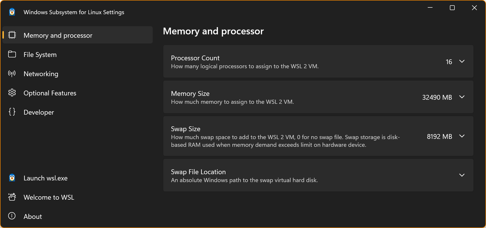

# Ubuntu Template on WSL2

<br><br><br>
```
╔═╦═══════════════════════════════════════════════════════╦═╗
╠═╬═══════════════════════════════════════════════════════╬═╣
║ ║ Content of this Folder was Last Updated on 2026 07 22 ║ ║
╠═╬═══════════════════════════════════════════════════════╬═╣
╚═╩═══════════════════════════════════════════════════════╩═╝
```
<br><br><br>

Having Ubuntu node(s) on WSL2 have some benefits and also disadvantages. The main one being:
- [&#x1F44D;] Access to GPU. In this document we test and use PyTorch.
- [&#x1F44E;] Much more complicated control/configuration of networking, and networking/subnetting are done from Windows host side, not from Ubuntu guest VM side (unlike Ubuntu VM on VMware where you configure the networking/subnetting on the Ubuntu guest VM itself, pretty much like the bare-metal unit).

With the above in mind, at the moment, this document describes only the "how to" install and configure Ubuntu node(s) on WSL2, to be used independently from other nodes within the WSL2 environment (i.e. avoiding the complexity of configuring virtual networking of the WSL2).

Note that this document focus only on [WSL2](https://learn.microsoft.com/en-us/windows/wsl/compare-versions).

<br><br><br>

***

## WSL2 Installation on Windows 11

Blah Blah Blah.

<br><br><br>

***

## Ubuntu Installation on WSL2

### Ensure the WSL2 virtualization framework is working

Open **Windows PowerShell** or **Command Prompt** and run: `wsl --list --verbose` or `wsl -l -v`.

If you've never used the WSL2 virtualization framework before, typically the output will be similar to below CLI dump:

```
PS C:\Users\hchandra> wsl --list --verbose
Windows Subsystem for Linux has no installed distributions.
You can resolve this by installing a distribution with the instructions below:

Use 'wsl.exe --list --online' to list available distributions
and 'wsl.exe --install <Distro>' to install.
PS C:\Users\hchandra>
```

This means the underlying WSL2 engine is ready, only the actual Ubuntu Linux OS isn't installed yet.

If you used the WSL2 virtualization framework before on your machine, you ***may*** see a Linux OS like `Ubuntu` listed.
In this case, pay attention at the **VERSION** column. It must say **2** to support GPU acceleration.

```
PS C:\Users\hchandra> wsl --list --verbose
  NAME                 STATE           VERSION
* Ubuntu-24.04-Base    Stopped         2
PS C:\Users\hchandra>
```

Furthermore, you can also get more versioning information with command: `wsl --version`.

```
PS C:\Users\hchandra> wsl --version
WSL version: 2.7.3.0
Kernel version: 6.6.114.1-1
WSLg version: 1.0.73
MSRDC version: 1.2.6676
Direct3D version: 1.611.1-81528511
DXCore version: 10.0.26100.1-240331-1435.ge-release
Windows version: 10.0.26200.8390
PS C:\Users\hchandra>
```

A help "menu" is also available with command: `wsl --help`.

<details>
<summary><b>Click here to expand <code>wsl --help</code> CLI Dump</b></summary>

```
PS C:\Users\hchandra> wsl --help
Copyright (c) Microsoft Corporation. All rights reserved.
For privacy information about this product please visit https://aka.ms/privacy.

Usage: wsl.exe [Argument] [Options...] [CommandLine]

Arguments for running Linux binaries:

    If no command line is provided, wsl.exe launches the default shell.

    --exec, -e <CommandLine>
        Execute the specified command without using the default Linux shell.

    --shell-type <standard|login|none>
        Execute the specified command with the provided shell type.

    --
        Pass the remaining command line as-is.

Options:
    --cd <Directory>
        Sets the specified directory as the current working directory.
        If ~ is used the Linux user's home path will be used. If the path begins
        with a / character, it will be interpreted as an absolute Linux path.
        Otherwise, the value must be an absolute Windows path.

    --distribution, -d <DistroName>
        Run the specified distribution.

    --distribution-id <DistroGuid>
        Run the specified distribution ID.

    --user, -u <UserName>
        Run as the specified user.

    --system
        Launches a shell for the system distribution.

Arguments for managing Windows Subsystem for Linux:

    --help
        Display usage information.

    --debug-shell
        Open a WSL2 debug shell for diagnostics purposes.

    --install [Distro] [Options...]
        Install a Windows Subsystem for Linux distribution.
        For a list of valid distributions, use 'wsl.exe --list --online'.

        Options:
            --enable-wsl1
                Enable WSL1 support.

            --fixed-vhd
                Create a fixed-size disk to store the distribution.

            --from-file <Path>
                Install a distribution from a local file.

            --legacy
                Use the legacy distribution manifest.

            --location <Location>
                Set the install path for the distribution.

            --name <Name>
                Set the name of the distribution.

            --no-distribution
                Only install the required optional components, does not install a distribution.

            --no-launch, -n
                Do not launch the distribution after install.

            --version <Version>
                Specifies the version to use for the new distribution.

            --vhd-size <MemoryString>
                Specifies the size of the disk to store the distribution.

            --web-download
                Download the distribution from the internet instead of the Microsoft Store.

    --manage <Distro> <Options...>
        Changes distro specific options.

        Options:
            --move <Location>
                Move the distribution to a new location.

            --set-sparse, -s <true|false>
                Set the VHD of distro to be sparse, allowing disk space to be automatically reclaimed.

            --set-default-user <Username>
                Set the default user of the distribution.

            --resize <MemoryString>
                Resize the disk of the distribution to the specified size.

    --mount <Disk>
        Attaches and mounts a physical or virtual disk in all WSL 2 distributions.

        Options:
            --vhd
                Specifies that <Disk> refers to a virtual hard disk.

            --bare
                Attach the disk to WSL2, but don't mount it.

            --name <Name>
                Mount the disk using a custom name for the mountpoint.

            --type <Type>
                Filesystem to use when mounting a disk, if not specified defaults to ext4.

            --options <Options>
                Additional mount options.

            --partition <Index>
                Index of the partition to mount, if not specified defaults to the whole disk.

    --set-default-version <Version>
        Changes the default install version for new distributions.

    --shutdown
        Immediately terminates all running distributions and the WSL 2
        lightweight utility virtual machine.

        Options:
            --force
                Terminate the WSL 2 virtual machine even if an operation is in progress. Can cause data loss.

    --status
        Show the status of Windows Subsystem for Linux.

    --unmount [Disk]
        Unmounts and detaches a disk from all WSL2 distributions.
        Unmounts and detaches all disks if called without argument.

    --uninstall
        Uninstalls the Windows Subsystem for Linux package from this machine.

    --update
        Update the Windows Subsystem for Linux package.

        Options:
            --pre-release
                Download a pre-release version if available.

    --version, -v
        Display version information.

Arguments for managing distributions in Windows Subsystem for Linux:

    --export <Distro> <FileName> [Options]
        Exports the distribution to a tar file.
        The filename can be - for stdout.

        Options:
            --format <Format>
                Specifies the export format. Supported values: tar, tar.gz, tar.xz, vhd.

    --import <Distro> <InstallLocation> <FileName> [Options]
        Imports the specified tar file as a new distribution.
        The filename can be - for stdin.

        Options:
            --version <Version>
                Specifies the version to use for the new distribution.

            --vhd
                Specifies that the provided file is a .vhd or .vhdx file, not a tar file.
                This operation makes a copy of the VHD file at the specified install location.

    --import-in-place <Distro> <FileName>
        Imports the specified VHD file as a new distribution.
        This virtual hard disk must be formatted with the ext4 filesystem type.

    --list, -l [Options]
        Lists distributions.

        Options:
            --all
                List all distributions, including distributions that are
                currently being installed or uninstalled.

            --running
                List only distributions that are currently running.

            --quiet, -q
                Only show distribution names.

            --verbose, -v
                Show detailed information about all distributions.

            --online, -o
                Displays a list of available distributions for install with 'wsl.exe --install'.

    --set-default, -s <Distro>
        Sets the distribution as the default.

    --set-version <Distro> <Version>
        Changes the version of the specified distribution.

    --terminate, -t <Distro>
        Terminates the specified distribution.

    --unregister <Distro>
        Unregisters the distribution and deletes the root filesystem.
PS C:\Users\hchandra>
```

</details>

<br><br><br>

***

### Install Ubuntu 24.04 LTS on WSL2

The list of supported Linux OS on WSL2 can be obtained with command: `wsl --list --online`.

<details>
<summary><b>Click here to expand <code>wsl --list --online</code> CLI Dump</b></summary>

```
PS C:\windows\system32> wsl --list --online
The following is a list of valid distributions that can be installed.
Install using 'wsl.exe --install <Distro>'.

NAME                            FRIENDLY NAME
Ubuntu                          Ubuntu
Ubuntu-26.04                    Ubuntu 26.04 LTS
Ubuntu-24.04                    Ubuntu 24.04 LTS
Ubuntu-22.04                    Ubuntu 22.04 LTS
openSUSE-Tumbleweed             openSUSE Tumbleweed
openSUSE-Leap-16.0              openSUSE Leap 16.0
SUSE-Linux-Enterprise-15-SP7    SUSE Linux Enterprise 15 SP7
SUSE-Linux-Enterprise-16.0      SUSE Linux Enterprise 16.0
kali-linux                      Kali Linux Rolling
Debian                          Debian GNU/Linux
AlmaLinux-8                     AlmaLinux OS 8
AlmaLinux-9                     AlmaLinux OS 9
AlmaLinux-Kitten-10             AlmaLinux OS Kitten 10
AlmaLinux-10                    AlmaLinux OS 10
archlinux                       Arch Linux
FedoraLinux-44                  Fedora Linux 44
FedoraLinux-43                  Fedora Linux 43
eLxr                            eLxr 12.12.0.0 GNU/Linux
OracleLinux_7_9                 Oracle Linux 7.9
OracleLinux_8_10                Oracle Linux 8.10
OracleLinux_9_5                 Oracle Linux 9.5
SUSE-Linux-Enterprise-15-SP6    SUSE Linux Enterprise 15 SP6
PS C:\windows\system32>
```

</details>

From the list above, we picked ***Ubuntu 24.04 LTS*** as at the time of writing *Ubuntu 26.04 LTS* is still very new, and we need to use a latest stable Ubuntu OS (i.e. having no compatibility issues with the GPU drivers).

Once you decide which Linux OS, you can install it with the following command:
- [ ] `wsl --install --distribution Ubuntu-24.04 --name Ubuntu-24.04-Base --no-launch`

  or

- [ ] `wsl --install -d Ubuntu-24.04 --name Ubuntu-24.04-Base -n`

  Notes on the command's options:

- [ ] the `--distribution` or `-d` option requires a string value from the `NAME` column of the list above.
- [ ] the `--name` option requires a string value of any continuous-string name you'd like to name the downloaded/installed Linux OS at your local environment.

```
PS C:\Users\hchandra> wsl --install --distribution Ubuntu-24.04 --name Ubuntu-24.04-Base --no-launch
Downloading: Ubuntu 24.04 LTS
Installing: Ubuntu 24.04 LTS
Distribution successfully installed. It can be launched via 'wsl.exe -d Ubuntu-24.04-Base'
PS C:\Users\hchandra>
```

The command will download and install the targeted Linux OS to the standard/default folder which typically be `%USERPROFILE%\AppData\Local\wsl\{01234567-89ab-cdef-0123-456789abcdef}\` folder.
- [ ] The `%USERPROFILE%` part is your *Home Path* within Windows 11 OS environment.
- [ ] The `{01234567-89ab-cdef-0123-456789abcdef}` is a 32-digits of hexadecimal-number formatted as per shown.

If for some reason, you did NOT run `wsl --list --online` first, you ***may*** run into the following issue.

```
PS C:\Users\hchandra> wsl --install --distribution Ubuntu-24.04 --name Ubuntu-24.04-Base --no-launch
Failed to fetch the distribution list from 'https://raw.githubusercontent.com/microsoft/WSL/master/distributions/DistributionInfo.json'. The server name or address could not be resolved
Error code: Wsl/InstallDistro/WININET_E_NAME_NOT_RESOLVED
PS C:\Users\hchandra>
```

To fix, you just need to run `wsl --list --online` command first, before executing the `wsl --install --distribution Ubuntu-24.04 --name Ubuntu-24.04-Base --no-launch` command.

And as we issue the WSL command with `--no-launch` option, the WSL2 will do only download and install the targeted Linux OS, and NOT launch it.

Once you have downloaded and installed a Linux OS onto the WSL, you can list your installed Linux OS(es) with command: `wsl --list --verbose` or `wsl -l -v`.

```
PS C:\Users\hchandra> wsl --list --verbose
  NAME                 STATE           VERSION
* Ubuntu-24.04-Base    Stopped         2
PS C:\Users\hchandra>
```

To launch (or to run) the installed Linux OS, issue the command: `wsl --distribution Ubuntu-24.04-Base`.
Note that now the `--distribution` option refers to the `NAME` you have given to the installed Linux OS, at/for your local environment (i.e. the `NAME` column on the installed Linux OS list above).

If you launch/run your installed Ubuntu OS the first time, you will be asked to create default account and the corresponding password.

```
PS C:\Users\hchandra> wsl --distribution Ubuntu-24.04-Base
Provisioning the new WSL instance Ubuntu-24.04-Base
This might take a while...
Create a default Unix user account: ubuntu
New password:
Retype new password:
passwd: password updated successfully
To run a command as administrator (user "root"), use "sudo <command>".
See "man sudo_root" for details.

ubuntu@F1NB7G4:/mnt/c/Users/hchandra$
```

Note that the CLI Prompt after the command does NOT return to Windows 11's *Windows PowerShell* or *Command Prompt*, but the prompt now is held by the Ubuntu Linux OS prompt.

For the subsequent launch/run of the installed Ubuntu OS, you will be directly prompted with Ubuntu Linux OS prompt.

```
PS C:\Users\hchandra> wsl --distribution Ubuntu-24.04-Base
ubuntu@F1NB7G4:/mnt/c/Users/hchandra$
```

Notes on Ubuntu Linux OS Prompt:
- [ ] `F1NB7G4` part will be your Windows 11 Device/Host Name.
- [ ] Your `%USERPROFILE%` or *Home Path* is mounted as `/mnt/%HOMEDRIVE%/%HOMEPATH%`, and that will be the landing folder every time you launch/run the installed Ubuntu Linux OS.

By default, without additional module installation, the *Ubuntu 24.04 LTS* already includes the `nvidia-smi` (NVIDIA System Management Interface), a command-line utility used to monitor and manage NVIDIA GPU. It verifies that your Windows-based NVIDIA graphics driver and GPU are successfully recognized and passed through to your Linux environment.

<details>
<summary><b>Click here to expand <code>nvidia-smi</code> CLI Dump</b></summary>

```
ubuntu@F1NB7G4:/mnt/c/Users/hchandra$ nvidia-smi
Wed May 27 09:17:47 2026
+-----------------------------------------------------------------------------------------+
| NVIDIA-SMI 590.51                 Driver Version: 591.64         CUDA Version: 13.1     |
+-----------------------------------------+------------------------+----------------------+
| GPU  Name                 Persistence-M | Bus-Id          Disp.A | Volatile Uncorr. ECC |
| Fan  Temp   Perf          Pwr:Usage/Cap |           Memory-Usage | GPU-Util  Compute M. |
|                                         |                        |               MIG M. |
|=========================================+========================+======================|
|   0  NVIDIA RTX PRO 1000 Blac...    On  |   00000000:01:00.0 Off |                  N/A |
| N/A   40C    P4             11W /   43W |       0MiB /   8151MiB |      0%      Default |
|                                         |                        |                  N/A |
+-----------------------------------------+------------------------+----------------------+

+-----------------------------------------------------------------------------------------+
| Processes:                                                                              |
|  GPU   GI   CI              PID   Type   Process name                        GPU Memory |
|        ID   ID                                                               Usage      |
|=========================================================================================|
|  No running processes found                                                             |
+-----------------------------------------------------------------------------------------+
ubuntu@F1NB7G4:/mnt/c/Users/hchandra$
```

</details>

You can check how much CPU and RAM the Ubuntu Linux OS on the WSL2 has claimed from your host by running `top` command on the Ubuntu CLI Prompt. This will show you a live monitor of the virtualized CPU and Memory. You can cross-reference this with what you saw in the **WSL Settings** application (on the host Windows 11) to ensure the Ubuntu Linux OS VM is breathing properly.

<p align="center"></p>

<p align="center"></p>

<details>
<summary><b>Click here to expand <code>top</code> CLI Dump</b></summary>

```
ubuntu@F1NB7G4:/mnt/c/Users/hchandra$ top
top - 09:20:47 up 5 min,  1 user,  load average: 0.01, 0.02, 0.00
Tasks:  22 total,   1 running,  21 sleeping,   0 stopped,   0 zombie
%Cpu(s):  0.0 us,  0.0 sy,  0.0 ni, 99.7 id,  0.3 wa,  0.0 hi,  0.0 si,  0.0 st
MiB Mem :  31822.1 total,  30850.9 free,    697.1 used,    583.0 buff/cache
MiB Swap:   8192.0 total,   8192.0 free,      0.0 used.  31125.0 avail Mem

    PID USER      PR  NI    VIRT    RES    SHR S  %CPU  %MEM     TIME+ COMMAND
      1 root      20   0   21960  13208   9564 S   0.0   0.0   0:00.54 systemd
      2 root      20   0    3172   2212   2072 S   0.0   0.0   0:00.01 init-systemd(Ub
      7 root      20   0    3204   2140   2008 S   0.0   0.0   0:00.01 init
     59 root      19  -1   50360  16096  15024 S   0.0   0.0   0:00.08 systemd-journal
    119 root      20   0   25396   6832   5028 S   0.0   0.0   0:00.09 systemd-udevd
    129 systemd+  20   0   21460  12876  10624 S   0.0   0.0   0:00.04 systemd-resolve
    130 systemd+  20   0   91028   8080   7112 S   0.0   0.0   0:00.02 systemd-timesyn
    199 root      20   0    4236   2688   2432 S   0.0   0.0   0:00.00 cron
    200 message+  20   0    9628   5288   4592 S   0.0   0.0   0:00.04 dbus-daemon
    208 root      20   0   17968   8724   7672 S   0.0   0.0   0:00.05 systemd-logind
    210 root      20   0 1756620  13684  11164 S   0.0   0.0   0:00.06 wsl-pro-service
    221 syslog    20   0  222508   5596   4520 S   0.0   0.0   0:00.04 rsyslogd
    232 root      20   0    3116   1924   1788 S   0.0   0.0   0:00.00 agetty
    239 root      20   0  107024  22756  13300 S   0.0   0.1   0:00.07 unattended-upgr
    412 root      20   0    3180   1116    980 S   0.0   0.0   0:00.00 SessionLeader
    414 root      20   0    3196   1252   1108 S   0.0   0.0   0:00.01 Relay(417)
    417 ubuntu    20   0    6072   5296   3572 S   0.0   0.0   0:00.02 bash
    515 root      20   0    6824   4668   3880 S   0.0   0.0   0:00.00 login
    556 ubuntu    20   0   20312  11400   9272 S   0.0   0.0   0:00.07 systemd
    557 ubuntu    20   0   21152   3556   1832 S   0.0   0.0   0:00.00 (sd-pam)
    581 ubuntu    20   0    6056   5244   3592 S   0.0   0.0   0:00.00 bash
    693 ubuntu    20   0    9328   5608   3384 R   0.0   0.0   0:00.01 top
```

</details>

<br><br><br>

***

## Base Configure the Ubuntu

### sudoers

As per default Ubuntu installation, a `sudo` command will require you to input password.
For some people, this is annoying, a bit distracting and unnecessary for documentation.

To remove this requirement, execute the following command: `echo -e "\n\n\nroot     ALL=(ALL:ALL) NOPASSWD:ALL\nubuntu   ALL=(ALL:ALL) NOPASSWD:ALL\n\n\n" | sudo tee -a /etc/sudoers`.

```
ubuntu@F1NB7G4:/mnt/c/Users/hchandra$ echo -e "\n\n\nroot     ALL=(ALL:ALL) NOPASSWD:ALL\nubuntu   ALL=(ALL:ALL) NOPASSWD:ALL\n\n\n" | sudo tee -a /etc/sudoers


root     ALL=(ALL:ALL) NOPASSWD:ALL
ubuntu   ALL=(ALL:ALL) NOPASSWD:ALL


ubuntu@F1NB7G4:/mnt/c/Users/hchandra$
```

The command adds the following two lines to the end of `/etc/sudoers` file, with some white-spaces/empty-lines before and after the added two lines.
- [ ] `root     ALL=(ALL:ALL) NOPASSWD:ALL`
- [ ] `ubuntu   ALL=(ALL:ALL) NOPASSWD:ALL`

You can check whether the lines had been successfully added, with `sudo cat /etc/sudoers` command.

<details>
<summary><b>Click here to expand <code>sudo cat /etc/sudoers</code> CLI Dump</b></summary>

```
ubuntu@F1NB7G4:/mnt/c/Users/hchandra$ sudo cat /etc/sudoers
#
# This file MUST be edited with the 'visudo' command as root.
#
# Please consider adding local content in /etc/sudoers.d/ instead of
# directly modifying this file.
#
# See the man page for details on how to write a sudoers file.
#
Defaults        env_reset
Defaults        mail_badpass
Defaults        secure_path="/usr/local/sbin:/usr/local/bin:/usr/sbin:/usr/bin:/sbin:/bin:/snap/bin"

# This fixes CVE-2005-4890 and possibly breaks some versions of kdesu
# (#1011624, https://bugs.kde.org/show_bug.cgi?id=452532)
Defaults        use_pty

# This preserves proxy settings from user environments of root
# equivalent users (group sudo)
#Defaults:%sudo env_keep += "http_proxy https_proxy ftp_proxy all_proxy no_proxy"

# This allows running arbitrary commands, but so does ALL, and it means
# different sudoers have their choice of editor respected.
#Defaults:%sudo env_keep += "EDITOR"

# Completely harmless preservation of a user preference.
#Defaults:%sudo env_keep += "GREP_COLOR"

# While you shouldn't normally run git as root, you need to with etckeeper
#Defaults:%sudo env_keep += "GIT_AUTHOR_* GIT_COMMITTER_*"

# Per-user preferences; root won't have sensible values for them.
#Defaults:%sudo env_keep += "EMAIL DEBEMAIL DEBFULLNAME"

# "sudo scp" or "sudo rsync" should be able to use your SSH agent.
#Defaults:%sudo env_keep += "SSH_AGENT_PID SSH_AUTH_SOCK"

# Ditto for GPG agent
#Defaults:%sudo env_keep += "GPG_AGENT_INFO"

# Host alias specification

# User alias specification

# Cmnd alias specification

# User privilege specification
root    ALL=(ALL:ALL) ALL

# Members of the admin group may gain root privileges
%admin ALL=(ALL) ALL

# Allow members of group sudo to execute any command
%sudo   ALL=(ALL:ALL) ALL

# See sudoers(5) for more information on "@include" directives:

@includedir /etc/sudoers.d


root     ALL=(ALL:ALL) NOPASSWD:ALL
ubuntu   ALL=(ALL:ALL) NOPASSWD:ALL


ubuntu@F1NB7G4:/mnt/c/Users/hchandra$
```

</details>

You can also check whether functionality wise the `/etc/sudoers` file is OK (i.e. parse-able) and whether functionality wise things are still working fine. Some of the test commands are:

- [ ] `sudo visudo -c`. Checks the syntax of the sudoers configuration file. It analyzes `/etc/sudoers` (and any files in `/etc/sudoers.d/`) for typos or formatting errors. If everything is correct, it returns parsed OK. If there's an error, it warns you before you accidentally lock yourself out of administrative privileges.

- [ ] `sudo -k`. Kills/invalidates your cached credentials (your sudo "ticket"). By default, once you type your password for sudo, Linux remembers it for a short grace period (usually 15 minutes) so you don't have to keep retyping it. Running sudo -k immediately revokes this privilege, meaning the very next sudo command will strictly require the password again. It's great for security when walking away from your machine. Do this only when `sudo visudo -c` returns all OK.

- [ ] `sudo whoami`. Outputs the username that the command is currently running as, which will always be `root` (because the prefix `sudo` means you're asking superuser privileges, which is `root` user). It’s a classic sanity check to confirm that `sudo` is working properly and that you have effectively assumed `root` execution power.

- [ ] `sudo -l -U root`. Lists the sudo privileges allowed for the user root. The -l flag lists privileges, and -U specifies the target user. Because root is the ultimate superuser, running this will typically show that root can run (ALL : ALL) ALL - meaning they can run any command, anywhere, as any user or group.

- [ ] `sudo -l -U ubuntu`. Lists the sudo privileges allowed for the user ubuntu. This allows an administrator (or the ubuntu user themselves) to check exactly what permissions the ubuntu account has. It will print out the specific commands ubuntu user is authorized to run via sudo, or tell you if they aren't allowed to use sudo at all.

<details>
<summary><b>Click here to expand sudoers tests CLI Dump</b></summary>

```
ubuntu@F1NB7G4:/mnt/c/Users/hchandra$ sudo visudo -c
/etc/sudoers: parsed OK
/etc/sudoers.d/README: parsed OK
ubuntu@F1NB7G4:/mnt/c/Users/hchandra$ sudo -k
ubuntu@F1NB7G4:/mnt/c/Users/hchandra$ sudo whoami
root
ubuntu@F1NB7G4:/mnt/c/Users/hchandra$ sudo -l -U root
Matching Defaults entries for root on F1NB7G4:
    env_reset, mail_badpass, secure_path=/usr/local/sbin\:/usr/local/bin\:/usr/sbin\:/usr/bin\:/sbin\:/bin\:/snap/bin, use_pty
User root may run the following commands on F1NB7G4:
    (ALL : ALL) ALL
    (ALL : ALL) NOPASSWD: ALL
ubuntu@F1NB7G4:/mnt/c/Users/hchandra$ sudo -l -U ubuntu
Matching Defaults entries for ubuntu on F1NB7G4:
    env_reset, mail_badpass, secure_path=/usr/local/sbin\:/usr/local/bin\:/usr/sbin\:/usr/bin\:/sbin\:/bin\:/snap/bin, use_pty
User ubuntu may run the following commands on F1NB7G4:
    (ALL : ALL) ALL
    (ALL : ALL) NOPASSWD: ALL
ubuntu@F1NB7G4:/mnt/c/Users/hchandra$
```

</details>

<br><br><br>

***

### Advanced Package Tool (apt) Sources

Sometimes, some Ubuntu sources may perform badly.
You can change where your Ubuntu instance obtains its sources from, by changing the `/etc/apt/sources.list` which has been moved to `/etc/apt/sources.list.d/ubuntu.sources` file.

<details>
<summary><b>Click here to expand <code>sudo cat /etc/apt/sources.list</code> and <code>sudo cat /etc/apt/sources.list.d/ubuntu.sources</code> CLI Dump</b></summary>

```
ubuntu@F1NB7G4:/mnt/c/Users/hchandra$ sudo cat /etc/apt/sources.list
# Ubuntu sources have moved to the /etc/apt/sources.list.d/ubuntu.sources
# file, which uses the deb822 format. Use deb822-formatted .sources files
# to manage package sources in the /etc/apt/sources.list.d/ directory.
# See the sources.list(5) manual page for details.
ubuntu@F1NB7G4:/mnt/c/Users/hchandra$ sudo cat /etc/apt/sources.list.d/ubuntu.sources
# See http://help.ubuntu.com/community/UpgradeNotes for how to upgrade to
# newer versions of the distribution.

## Ubuntu distribution repository
##
## The following settings can be adjusted to configure which packages to use from Ubuntu.
## Mirror your choices (except for URIs and Suites) in the security section below to
## ensure timely security updates.
##
## Types: Append deb-src to enable the fetching of source package.
## URIs: A URL to the repository (you may add multiple URLs)
## Suites: The following additional suites can be configured
##   <name>-updates   - Major bug fix updates produced after the final release of the
##                      distribution.
##   <name>-backports - software from this repository may not have been tested as
##                      extensively as that contained in the main release, although it includes
##                      newer versions of some applications which may provide useful features.
##                      Also, please note that software in backports WILL NOT receive any review
##                      or updates from the Ubuntu security team.
## Components: Aside from main, the following components can be added to the list
##   restricted  - Software that may not be under a free license, or protected by patents.
##   universe    - Community maintained packages. Software in this repository receives maintenance
##                 from volunteers in the Ubuntu community, or a 10 year security maintenance
##                 commitment from Canonical when an Ubuntu Pro subscription is attached.
##   multiverse  - Community maintained of restricted. Software from this repository is
##                 ENTIRELY UNSUPPORTED by the Ubuntu team, and may not be under a free
##                 licence. Please satisfy yourself as to your rights to use the software.
##                 Also, please note that software in multiverse WILL NOT receive any
##                 review or updates from the Ubuntu security team.
##
## See the sources.list(5) manual page for further settings.
Types: deb
URIs: http://archive.ubuntu.com/ubuntu/
Suites: noble noble-updates noble-backports
Components: main universe restricted multiverse
Signed-By: /usr/share/keyrings/ubuntu-archive-keyring.gpg

## Ubuntu security updates. Aside from URIs and Suites,
## this should mirror your choices in the previous section.
Types: deb
URIs: http://security.ubuntu.com/ubuntu/
Suites: noble-security
Components: main universe restricted multiverse
Signed-By: /usr/share/keyrings/ubuntu-archive-keyring.gpg
ubuntu@F1NB7G4:/mnt/c/Users/hchandra$
```

</details>

As you can see, basically there are only two sections on the `/etc/apt/sources.list.d/ubuntu.sources` file.

- [ ] For general update sources.

  ```
  Types: deb
  URIs: http://archive.ubuntu.com/ubuntu/
  Suites: noble noble-updates noble-backports
  Components: main universe restricted multiverse
  Signed-By: /usr/share/keyrings/ubuntu-archive-keyring.gpg
  ```

- [ ] For security update sources.

  ```
  Types: deb
  URIs: http://security.ubuntu.com/ubuntu/
  Suites: noble-security
  Components: main universe restricted multiverse
  Signed-By: /usr/share/keyrings/ubuntu-archive-keyring.gpg
  ```

What you need to update/modify on the two sections are only the `URIs` field.
To find out what are the other alternative values for the `URIs` field, you can refer to [Official Archive Mirrors for Ubuntu](https://launchpad.net/ubuntu/+archivemirrors).
Let's take example one of the closest mirrors with one of the largest bandwidth *Taiwan Digital Streaming Co.* which has two versions:
- [ ] *Taiwan Digital Streaming Co. (archive)*. Use this if your instance runs on standard x86_64 / AMD64 / Intel 64-bit hardware (which is true for 95% of standard PCs, servers, and standard cloud VMs).
- [ ] *Taiwan Digital Streaming Co. (ports)*. This site is for Ubuntu Ports. Use this only if your instance runs on alternative architectures like ARM (e.g., Raspberry Pi, Apple Silicon VMs, AWS Graviton instances), POWER, or RISC-V.

<p align="center"></p>

For each site, on the right side following the site name, there are protocols to connect to the site: `https`, `http` and `rsync`.
Generally for standard apt configuration, you'd consider only `https` and `http`, with preferences/recommendations towards `https`.
- [ ] If you right-click the `https` protocol for *Taiwan Digital Streaming Co. (archive)*, select *Copy Link Address* and paste the copied value, you will get "https://mirror.twds.com.tw/ubuntu/".
- [ ] If you right-click the `https` protocol for *Taiwan Digital Streaming Co. (ports)*, select *Copy Link Address* and paste the copied value, you will get "https://mirror.twds.com.tw/ubuntu-ports/". The path part "/ubuntu-ports/" indicates that the site is for Ubuntu Ports (alternative architectures).

With the two aspects above, we have narrow down our choices to only one link: "https://mirror.twds.com.tw/ubuntu/", since we are not using alternative architectures and we don't want to use unsecured protocol.

How about the `URIs` field for the security update sources section?
The sites on the [Official Archive Mirrors for Ubuntu](https://launchpad.net/ubuntu/+archivemirrors) do not have specific section for security update sources.
You can use the same link as for the general update sources section, i.e. "https://mirror.twds.com.tw/ubuntu/" if we follow our example above.

```
Types: deb
URIs: https://mirror.twds.com.tw/ubuntu/
Suites: noble noble-updates noble-backports
Components: main universe restricted multiverse
Signed-By: /usr/share/keyrings/ubuntu-archive-keyring.gpg

Types: deb
URIs: https://mirror.twds.com.tw/ubuntu/
Suites: noble-security
Components: main universe restricted multiverse
Signed-By: /usr/share/keyrings/ubuntu-archive-keyring.gpg
```

We can test the above configuration using command: `sudo apt update -y`.

<details>
<summary><b>Click here to expand <code>sudo apt update -y</code> CLI Dump</b></summary>

```
ubuntu@F1NB7G4:/mnt/c/Users/hchandra$ sudo apt update -y
Get:1 https://mirror.twds.com.tw/ubuntu noble InRelease [256 kB]
Get:2 https://mirror.twds.com.tw/ubuntu noble-updates InRelease [126 kB]
Get:3 https://mirror.twds.com.tw/ubuntu noble-backports InRelease [126 kB]
Get:4 https://mirror.twds.com.tw/ubuntu noble-security InRelease [126 kB]
Get:5 https://mirror.twds.com.tw/ubuntu noble/main amd64 Packages [1401 kB]
Get:6 https://mirror.twds.com.tw/ubuntu noble/main Translation-en [513 kB]
Get:7 https://mirror.twds.com.tw/ubuntu noble/main amd64 Components [464 kB]
Get:8 https://mirror.twds.com.tw/ubuntu noble/main amd64 c-n-f Metadata [30.5 kB]
Get:9 https://mirror.twds.com.tw/ubuntu noble/universe amd64 Packages [15.0 MB]
Get:10 https://mirror.twds.com.tw/ubuntu noble/universe Translation-en [5982 kB]
Get:11 https://mirror.twds.com.tw/ubuntu noble/universe amd64 Components [3871 kB]
Get:12 https://mirror.twds.com.tw/ubuntu noble/universe amd64 c-n-f Metadata [301 kB]
Get:13 https://mirror.twds.com.tw/ubuntu noble/restricted amd64 Packages [93.9 kB]
Get:14 https://mirror.twds.com.tw/ubuntu noble/restricted Translation-en [18.7 kB]
Get:15 https://mirror.twds.com.tw/ubuntu noble/restricted amd64 c-n-f Metadata [416 B]
Get:16 https://mirror.twds.com.tw/ubuntu noble/multiverse amd64 Packages [269 kB]
Get:17 https://mirror.twds.com.tw/ubuntu noble/multiverse Translation-en [118 kB]
Get:18 https://mirror.twds.com.tw/ubuntu noble/multiverse amd64 Components [35.0 kB]
Get:19 https://mirror.twds.com.tw/ubuntu noble/multiverse amd64 c-n-f Metadata [8328 B]
Get:20 https://mirror.twds.com.tw/ubuntu noble-updates/main amd64 Packages [1033 kB]
Get:21 https://mirror.twds.com.tw/ubuntu noble-updates/main Translation-en [260 kB]
Get:22 https://mirror.twds.com.tw/ubuntu noble-updates/main amd64 Components [181 kB]
Get:23 https://mirror.twds.com.tw/ubuntu noble-updates/main amd64 c-n-f Metadata [17.4 kB]
Get:24 https://mirror.twds.com.tw/ubuntu noble-updates/universe amd64 Packages [1656 kB]
Get:25 https://mirror.twds.com.tw/ubuntu noble-updates/universe Translation-en [326 kB]
Get:26 https://mirror.twds.com.tw/ubuntu noble-updates/universe amd64 Components [388 kB]
Get:27 https://mirror.twds.com.tw/ubuntu noble-updates/universe amd64 c-n-f Metadata [34.8 kB]
Get:28 https://mirror.twds.com.tw/ubuntu noble-updates/restricted amd64 Packages [1110 kB]
Get:29 https://mirror.twds.com.tw/ubuntu noble-updates/restricted Translation-en [251 kB]
Get:30 https://mirror.twds.com.tw/ubuntu noble-updates/restricted amd64 Components [212 B]
Get:31 https://mirror.twds.com.tw/ubuntu noble-updates/restricted amd64 c-n-f Metadata [456 B]
Get:32 https://mirror.twds.com.tw/ubuntu noble-updates/multiverse amd64 Packages [40.4 kB]
Get:33 https://mirror.twds.com.tw/ubuntu noble-updates/multiverse Translation-en [9972 B]
Get:34 https://mirror.twds.com.tw/ubuntu noble-updates/multiverse amd64 Components [940 B]
Get:35 https://mirror.twds.com.tw/ubuntu noble-updates/multiverse amd64 c-n-f Metadata [656 B]
Get:36 https://mirror.twds.com.tw/ubuntu noble-backports/main amd64 Packages [40.6 kB]
Get:37 https://mirror.twds.com.tw/ubuntu noble-backports/main Translation-en [9172 B]
Get:38 https://mirror.twds.com.tw/ubuntu noble-backports/main amd64 Components [5760 B]
Get:39 https://mirror.twds.com.tw/ubuntu noble-backports/main amd64 c-n-f Metadata [368 B]
Get:40 https://mirror.twds.com.tw/ubuntu noble-backports/universe amd64 Packages [31.0 kB]
Get:41 https://mirror.twds.com.tw/ubuntu noble-backports/universe Translation-en [18.6 kB]
Get:42 https://mirror.twds.com.tw/ubuntu noble-backports/universe amd64 Components [10.5 kB]
Get:43 https://mirror.twds.com.tw/ubuntu noble-backports/universe amd64 c-n-f Metadata [1588 B]
Get:44 https://mirror.twds.com.tw/ubuntu noble-backports/restricted amd64 Components [212 B]
Get:45 https://mirror.twds.com.tw/ubuntu noble-backports/restricted amd64 c-n-f Metadata [116 B]
Get:46 https://mirror.twds.com.tw/ubuntu noble-backports/multiverse amd64 Packages [748 B]
Get:47 https://mirror.twds.com.tw/ubuntu noble-backports/multiverse Translation-en [340 B]
Get:48 https://mirror.twds.com.tw/ubuntu noble-backports/multiverse amd64 Components [212 B]
Get:49 https://mirror.twds.com.tw/ubuntu noble-backports/multiverse amd64 c-n-f Metadata [116 B]
Get:50 https://mirror.twds.com.tw/ubuntu noble-security/main amd64 Packages [781 kB]
Get:51 https://mirror.twds.com.tw/ubuntu noble-security/main Translation-en [178 kB]
Get:52 https://mirror.twds.com.tw/ubuntu noble-security/main amd64 Components [44.9 kB]
Get:53 https://mirror.twds.com.tw/ubuntu noble-security/main amd64 c-n-f Metadata [11.5 kB]
Get:54 https://mirror.twds.com.tw/ubuntu noble-security/universe amd64 Packages [1171 kB]
Get:55 https://mirror.twds.com.tw/ubuntu noble-security/universe Translation-en [229 kB]
Get:56 https://mirror.twds.com.tw/ubuntu noble-security/universe amd64 Components [76.3 kB]
Get:57 https://mirror.twds.com.tw/ubuntu noble-security/universe amd64 c-n-f Metadata [24.1 kB]
Get:58 https://mirror.twds.com.tw/ubuntu noble-security/restricted amd64 Packages [1048 kB]
Get:59 https://mirror.twds.com.tw/ubuntu noble-security/restricted Translation-en [238 kB]
Get:60 https://mirror.twds.com.tw/ubuntu noble-security/restricted amd64 Components [212 B]
Get:61 https://mirror.twds.com.tw/ubuntu noble-security/restricted amd64 c-n-f Metadata [444 B]
Get:62 https://mirror.twds.com.tw/ubuntu noble-security/multiverse amd64 Packages [35.3 kB]
Get:63 https://mirror.twds.com.tw/ubuntu noble-security/multiverse Translation-en [8308 B]
Get:64 https://mirror.twds.com.tw/ubuntu noble-security/multiverse amd64 Components [208 B]
Get:65 https://mirror.twds.com.tw/ubuntu noble-security/multiverse amd64 c-n-f Metadata [468 B]
Fetched 38.1 MB in 19s (1995 kB/s)
Reading package lists... Done
Building dependency tree... Done
Reading state information... Done
130 packages can be upgraded. Run 'apt list --upgradable' to see them.
ubuntu@F1NB7G4:/mnt/c/Users/hchandra$
```

</details>

As you can see, all updates now retrieved from "https://mirror.twds.com.tw/ubuntu", including the "noble-security" (i.e. security update) suites.
Subsequently, when you do `sudo apt upgrade -y` to actually download and install those upgrade modules, you can see:
- [ ] "*standard LTS security updates*" are downloaded and installed
- [ ] those upgrade modules are retrieved from "https://mirror.twds.com.tw/ubuntu"

<details>
<summary><b>Click here to expand <code>sudo apt upgrade -y</code> CLI Dump</b></summary>

```
ubuntu@F1NB7G4:/mnt/c/Users/hchandra$ sudo apt upgrade -y
Reading package lists... Done
Building dependency tree... Done
Reading state information... Done
Calculating upgrade... Done
The following packages will be upgraded:
  apparmor binutils binutils-common binutils-x86-64-linux-gnu bsdextrautils bsdutils ca-certificates cloud-init coreutils curl distro-info-data dpkg eject fdisk gcc-14-base
  gir1.2-packagekitglib-1.0 iproute2 kmod libapparmor1 libavahi-client3 libavahi-common-data libavahi-common3 libbinutils libblkid1 libcap2 libcap2-bin libctf-nobfd0 libctf0 libcups2t64
  libcurl3t64-gnutls libcurl4t64 libdrm-amdgpu1 libdrm-common libdrm-intel1 libdrm2 libegl-mesa0 libexpat1 libfdisk1 libfreetype6 libgbm1 libgcc-s1 libgcrypt20 libgdk-pixbuf-2.0-0
  libgdk-pixbuf2.0-bin libgdk-pixbuf2.0-common libgl1-mesa-dri libglx-mesa0 libgnutls30t64 libgprofng0 libgraphite2-3 libkmod2 liblcms2-2 libllvm20 liblzma5 libmount1 libnetplan1 libnghttp2-14
  libnss-systemd libpackagekit-glib2-18 libpam-cap libpam-systemd libperl5.38t64 libpng16-16t64 libpolkit-agent-1-0 libpolkit-gobject-1-0 libpython3.12-minimal libpython3.12-stdlib
  libpython3.12t64 libsframe1 libsmartcols1 libssh-4 libssl3t64 libstdc++6 libsystemd-shared libsystemd0 libtiff6 libudev1 libuuid1 libxml2 libxmlb2 lshw mesa-libgallium mesa-vulkan-drivers mount
  nano netplan-generator netplan.io openssh-client openssl packagekit packagekit-tools perl perl-base perl-modules-5.38 polkitd python3-cryptography python3-jwt python3-netplan python3-openssl
  python3-pyasn1 python3-software-properties python3-twisted python3-urllib3 python3.12 python3.12-minimal rsync rsyslog sed snapd software-properties-common sudo systemd systemd-dev
  systemd-hwe-hwdb systemd-resolved systemd-sysv systemd-timesyncd tar tzdata ubuntu-pro-client ubuntu-pro-client-l10n udev util-linux uuid-runtime vim vim-common vim-runtime vim-tiny xxd
  xz-utils
130 upgraded, 0 newly installed, 0 to remove and 0 not upgraded.
104 standard LTS security updates
Need to get 162 MB of archives.
After this operation, 1763 kB of additional disk space will be used.
Get:1 https://mirror.twds.com.tw/ubuntu noble-updates/main amd64 bsdutils amd64 1:2.39.3-9ubuntu6.5 [96.1 kB]
Get:2 https://mirror.twds.com.tw/ubuntu noble-updates/main amd64 coreutils amd64 9.4-3ubuntu6.2 [1412 kB]
Get:3 https://mirror.twds.com.tw/ubuntu noble-security/main amd64 tar amd64 1.35+dfsg-3ubuntu0.1 [254 kB]
Get:4 https://mirror.twds.com.tw/ubuntu noble-updates/main amd64 dpkg amd64 1.22.6ubuntu6.6 [1282 kB]
Get:5 https://mirror.twds.com.tw/ubuntu noble-updates/main amd64 libperl5.38t64 amd64 5.38.2-3.2ubuntu0.3 [4876 kB]
Get:6 https://mirror.twds.com.tw/ubuntu noble-updates/main amd64 perl amd64 5.38.2-3.2ubuntu0.3 [231 kB]
Get:7 https://mirror.twds.com.tw/ubuntu noble-updates/main amd64 perl-base amd64 5.38.2-3.2ubuntu0.3 [1827 kB]
Get:8 https://mirror.twds.com.tw/ubuntu noble-updates/main amd64 perl-modules-5.38 all 5.38.2-3.2ubuntu0.3 [3110 kB]
Get:9 https://mirror.twds.com.tw/ubuntu noble-updates/main amd64 sed amd64 4.9-2ubuntu0.24.04.1 [194 kB]
Get:10 https://mirror.twds.com.tw/ubuntu noble-updates/main amd64 util-linux amd64 2.39.3-9ubuntu6.5 [1128 kB]
Get:11 https://mirror.twds.com.tw/ubuntu noble-updates/main amd64 mount amd64 2.39.3-9ubuntu6.5 [118 kB]
Get:12 https://mirror.twds.com.tw/ubuntu noble-updates/main amd64 libexpat1 amd64 2.6.1-2ubuntu0.4 [88.2 kB]
Get:13 https://mirror.twds.com.tw/ubuntu noble-updates/main amd64 libpython3.12t64 amd64 3.12.3-1ubuntu0.13 [2338 kB]
Get:14 https://mirror.twds.com.tw/ubuntu noble-updates/main amd64 libssl3t64 amd64 3.0.13-0ubuntu3.11 [1942 kB]
Get:15 https://mirror.twds.com.tw/ubuntu noble-updates/main amd64 python3.12 amd64 3.12.3-1ubuntu0.13 [662 kB]
Get:16 https://mirror.twds.com.tw/ubuntu noble-updates/main amd64 libpython3.12-stdlib amd64 3.12.3-1ubuntu0.13 [2068 kB]
Get:17 https://mirror.twds.com.tw/ubuntu noble-updates/main amd64 python3.12-minimal amd64 3.12.3-1ubuntu0.13 [2346 kB]
Get:18 https://mirror.twds.com.tw/ubuntu noble-updates/main amd64 libpython3.12-minimal amd64 3.12.3-1ubuntu0.13 [837 kB]
Get:19 https://mirror.twds.com.tw/ubuntu noble-updates/main amd64 tzdata all 2026a-0ubuntu0.24.04.1 [280 kB]
Get:20 https://mirror.twds.com.tw/ubuntu noble-updates/main amd64 liblzma5 amd64 5.6.1+really5.4.5-1ubuntu0.3 [127 kB]
Get:21 https://mirror.twds.com.tw/ubuntu noble-updates/main amd64 libcap2 amd64 1:2.66-5ubuntu2.4 [30.5 kB]
Get:22 https://mirror.twds.com.tw/ubuntu noble-updates/main amd64 libnss-systemd amd64 255.4-1ubuntu8.16 [159 kB]
Get:23 https://mirror.twds.com.tw/ubuntu noble-updates/main amd64 systemd-dev all 255.4-1ubuntu8.16 [106 kB]
Get:24 https://mirror.twds.com.tw/ubuntu noble-updates/main amd64 libblkid1 amd64 2.39.3-9ubuntu6.5 [123 kB]
Get:25 https://mirror.twds.com.tw/ubuntu noble-updates/main amd64 kmod amd64 31+20240202-2ubuntu7.2 [102 kB]
Get:26 https://mirror.twds.com.tw/ubuntu noble-updates/main amd64 libkmod2 amd64 31+20240202-2ubuntu7.2 [51.8 kB]
Get:27 https://mirror.twds.com.tw/ubuntu noble-updates/main amd64 systemd-timesyncd amd64 255.4-1ubuntu8.16 [35.3 kB]
Get:28 https://mirror.twds.com.tw/ubuntu noble-updates/main amd64 systemd-resolved amd64 255.4-1ubuntu8.16 [296 kB]
Get:29 https://mirror.twds.com.tw/ubuntu noble-updates/main amd64 libsystemd-shared amd64 255.4-1ubuntu8.16 [2076 kB]
Get:30 https://mirror.twds.com.tw/ubuntu noble-updates/main amd64 libsystemd0 amd64 255.4-1ubuntu8.16 [431 kB]
Get:31 https://mirror.twds.com.tw/ubuntu noble-updates/main amd64 systemd-sysv amd64 255.4-1ubuntu8.16 [11.9 kB]
Get:32 https://mirror.twds.com.tw/ubuntu noble-updates/main amd64 libpam-systemd amd64 255.4-1ubuntu8.16 [235 kB]
Get:33 https://mirror.twds.com.tw/ubuntu noble-updates/main amd64 systemd amd64 255.4-1ubuntu8.16 [3475 kB]
Get:34 https://mirror.twds.com.tw/ubuntu noble-updates/main amd64 udev amd64 255.4-1ubuntu8.16 [1875 kB]
Get:35 https://mirror.twds.com.tw/ubuntu noble-updates/main amd64 libudev1 amd64 255.4-1ubuntu8.16 [177 kB]
Get:36 https://mirror.twds.com.tw/ubuntu noble-updates/main amd64 libapparmor1 amd64 4.0.1really4.0.1-0ubuntu0.24.04.7 [51.3 kB]
Get:37 https://mirror.twds.com.tw/ubuntu noble-updates/main amd64 libgcrypt20 amd64 1.10.3-2ubuntu0.1 [532 kB]
Get:38 https://mirror.twds.com.tw/ubuntu noble-updates/main amd64 libmount1 amd64 2.39.3-9ubuntu6.5 [134 kB]
Get:39 https://mirror.twds.com.tw/ubuntu noble-updates/main amd64 libuuid1 amd64 2.39.3-9ubuntu6.5 [36.1 kB]
Get:40 https://mirror.twds.com.tw/ubuntu noble-updates/main amd64 libfdisk1 amd64 2.39.3-9ubuntu6.5 [146 kB]
Get:41 https://mirror.twds.com.tw/ubuntu noble-updates/main amd64 rsync amd64 3.2.7-1ubuntu1.5 [443 kB]
Get:42 https://mirror.twds.com.tw/ubuntu noble-updates/main amd64 libsmartcols1 amd64 2.39.3-9ubuntu6.5 [65.8 kB]
Get:43 https://mirror.twds.com.tw/ubuntu noble-updates/main amd64 uuid-runtime amd64 2.39.3-9ubuntu6.5 [33.1 kB]
Get:44 https://mirror.twds.com.tw/ubuntu noble-updates/main amd64 gcc-14-base amd64 14.2.0-4ubuntu2~24.04.1 [51.0 kB]
Get:45 https://mirror.twds.com.tw/ubuntu noble-updates/main amd64 libstdc++6 amd64 14.2.0-4ubuntu2~24.04.1 [792 kB]
Get:46 https://mirror.twds.com.tw/ubuntu noble-updates/main amd64 libgcc-s1 amd64 14.2.0-4ubuntu2~24.04.1 [78.4 kB]
Get:47 https://mirror.twds.com.tw/ubuntu noble-updates/main amd64 libgnutls30t64 amd64 3.8.3-1.1ubuntu3.6 [1003 kB]
Get:48 https://mirror.twds.com.tw/ubuntu noble-updates/main amd64 openssl amd64 3.0.13-0ubuntu3.11 [1003 kB]
Get:49 https://mirror.twds.com.tw/ubuntu noble-updates/main amd64 ca-certificates all 20260601~24.04.1 [139 kB]
Get:50 https://mirror.twds.com.tw/ubuntu noble-updates/main amd64 distro-info-data all 0.60ubuntu0.6 [7036 B]
Get:51 https://mirror.twds.com.tw/ubuntu noble-updates/main amd64 eject amd64 2.39.3-9ubuntu6.5 [26.3 kB]
Get:52 https://mirror.twds.com.tw/ubuntu noble-updates/main amd64 libpam-cap amd64 1:2.66-5ubuntu2.4 [12.5 kB]
Get:53 https://mirror.twds.com.tw/ubuntu noble-updates/main amd64 libcap2-bin amd64 1:2.66-5ubuntu2.4 [34.1 kB]
Get:54 https://mirror.twds.com.tw/ubuntu noble-updates/main amd64 iproute2 amd64 6.1.0-1ubuntu6.3 [1120 kB]
Get:55 https://mirror.twds.com.tw/ubuntu noble-updates/main amd64 netplan-generator amd64 1.1.2-8ubuntu1~24.04.2 [61.2 kB]
Get:56 https://mirror.twds.com.tw/ubuntu noble-updates/main amd64 python3-netplan amd64 1.1.2-8ubuntu1~24.04.2 [24.3 kB]
Get:57 https://mirror.twds.com.tw/ubuntu noble-updates/main amd64 netplan.io amd64 1.1.2-8ubuntu1~24.04.2 [69.8 kB]
Get:58 https://mirror.twds.com.tw/ubuntu noble-updates/main amd64 libnetplan1 amd64 1.1.2-8ubuntu1~24.04.2 [133 kB]
Get:59 https://mirror.twds.com.tw/ubuntu noble-updates/main amd64 libxml2 amd64 2.9.14+dfsg-1.3ubuntu3.8 [764 kB]
Get:60 https://mirror.twds.com.tw/ubuntu noble-updates/main amd64 rsyslog amd64 8.2312.0-3ubuntu9.2 [511 kB]
Get:61 https://mirror.twds.com.tw/ubuntu noble-updates/main amd64 sudo amd64 1.9.15p5-3ubuntu5.24.04.2 [948 kB]
Get:62 https://mirror.twds.com.tw/ubuntu noble-updates/main amd64 systemd-hwe-hwdb all 255.1.7 [3716 B]
Get:63 https://mirror.twds.com.tw/ubuntu noble-updates/main amd64 ubuntu-pro-client-l10n amd64 37.2ubuntu~24.04 [19.8 kB]
Get:64 https://mirror.twds.com.tw/ubuntu noble-updates/main amd64 ubuntu-pro-client amd64 37.2ubuntu~24.04 [259 kB]
Get:65 https://mirror.twds.com.tw/ubuntu noble-updates/main amd64 vim amd64 2:9.1.0016-1ubuntu7.16 [1880 kB]
Get:66 https://mirror.twds.com.tw/ubuntu noble-updates/main amd64 vim-common all 2:9.1.0016-1ubuntu7.16 [388 kB]
Get:67 https://mirror.twds.com.tw/ubuntu noble-updates/main amd64 vim-tiny amd64 2:9.1.0016-1ubuntu7.16 [805 kB]
Get:68 https://mirror.twds.com.tw/ubuntu noble-updates/main amd64 vim-runtime all 2:9.1.0016-1ubuntu7.16 [7280 kB]
Get:69 https://mirror.twds.com.tw/ubuntu noble-updates/main amd64 xxd amd64 2:9.1.0016-1ubuntu7.16 [65.3 kB]
Get:70 https://mirror.twds.com.tw/ubuntu noble-updates/main amd64 apparmor amd64 4.0.1really4.0.1-0ubuntu0.24.04.7 [640 kB]
Get:71 https://mirror.twds.com.tw/ubuntu noble-updates/main amd64 bsdextrautils amd64 2.39.3-9ubuntu6.5 [73.7 kB]
Get:72 https://mirror.twds.com.tw/ubuntu noble-updates/main amd64 libdrm-common all 2.4.125-1ubuntu0.1~24.04.2 [9250 B]
Get:73 https://mirror.twds.com.tw/ubuntu noble-updates/main amd64 libdrm2 amd64 2.4.125-1ubuntu0.1~24.04.2 [41.4 kB]
Get:74 https://mirror.twds.com.tw/ubuntu noble-updates/main amd64 libnghttp2-14 amd64 1.59.0-1ubuntu0.3 [74.4 kB]
Get:75 https://mirror.twds.com.tw/ubuntu noble-updates/main amd64 libpng16-16t64 amd64 1.6.43-5ubuntu0.6 [189 kB]
Get:76 https://mirror.twds.com.tw/ubuntu noble-updates/main amd64 lshw amd64 02.19.git.2021.06.19.996aaad9c7-2ubuntu0.24.04.1 [334 kB]
Get:77 https://mirror.twds.com.tw/ubuntu noble-updates/main amd64 nano amd64 7.2-2ubuntu0.2 [282 kB]
Get:78 https://mirror.twds.com.tw/ubuntu noble-updates/main amd64 openssh-client amd64 1:9.6p1-3ubuntu13.16 [907 kB]
Get:79 https://mirror.twds.com.tw/ubuntu noble-updates/main amd64 xz-utils amd64 5.6.1+really5.4.5-1ubuntu0.3 [267 kB]
Get:80 https://mirror.twds.com.tw/ubuntu noble-updates/main amd64 libgprofng0 amd64 2.42-4ubuntu2.10 [849 kB]
Get:81 https://mirror.twds.com.tw/ubuntu noble-updates/main amd64 libctf0 amd64 2.42-4ubuntu2.10 [94.5 kB]
Get:82 https://mirror.twds.com.tw/ubuntu noble-updates/main amd64 libctf-nobfd0 amd64 2.42-4ubuntu2.10 [98.0 kB]
Get:83 https://mirror.twds.com.tw/ubuntu noble-updates/main amd64 binutils-x86-64-linux-gnu amd64 2.42-4ubuntu2.10 [2463 kB]
Get:84 https://mirror.twds.com.tw/ubuntu noble-updates/main amd64 libbinutils amd64 2.42-4ubuntu2.10 [577 kB]
Get:85 https://mirror.twds.com.tw/ubuntu noble-updates/main amd64 binutils amd64 2.42-4ubuntu2.10 [18.2 kB]
Get:86 https://mirror.twds.com.tw/ubuntu noble-updates/main amd64 binutils-common amd64 2.42-4ubuntu2.10 [240 kB]
Get:87 https://mirror.twds.com.tw/ubuntu noble-updates/main amd64 libsframe1 amd64 2.42-4ubuntu2.10 [15.7 kB]
Get:88 https://mirror.twds.com.tw/ubuntu noble-updates/main amd64 libssh-4 amd64 0.10.6-2ubuntu0.4 [190 kB]
Get:89 https://mirror.twds.com.tw/ubuntu noble-updates/main amd64 curl amd64 8.5.0-2ubuntu10.9 [227 kB]
Get:90 https://mirror.twds.com.tw/ubuntu noble-updates/main amd64 libcurl4t64 amd64 8.5.0-2ubuntu10.9 [342 kB]
Get:91 https://mirror.twds.com.tw/ubuntu noble-updates/main amd64 fdisk amd64 2.39.3-9ubuntu6.5 [122 kB]
Get:92 https://mirror.twds.com.tw/ubuntu noble-updates/main amd64 libpackagekit-glib2-18 amd64 1.2.8-2ubuntu1.5 [120 kB]
Get:93 https://mirror.twds.com.tw/ubuntu noble-updates/main amd64 gir1.2-packagekitglib-1.0 amd64 1.2.8-2ubuntu1.5 [25.6 kB]
Get:94 https://mirror.twds.com.tw/ubuntu noble-updates/main amd64 libavahi-client3 amd64 0.8-13ubuntu6.2 [26.8 kB]
Get:95 https://mirror.twds.com.tw/ubuntu noble-updates/main amd64 libavahi-common3 amd64 0.8-13ubuntu6.2 [23.4 kB]
Get:96 https://mirror.twds.com.tw/ubuntu noble-updates/main amd64 libavahi-common-data amd64 0.8-13ubuntu6.2 [30.1 kB]
Get:97 https://mirror.twds.com.tw/ubuntu noble-updates/main amd64 libcups2t64 amd64 2.4.7-1.2ubuntu7.14 [274 kB]
Get:98 https://mirror.twds.com.tw/ubuntu noble-updates/main amd64 libcurl3t64-gnutls amd64 8.5.0-2ubuntu10.9 [334 kB]
Get:99 https://mirror.twds.com.tw/ubuntu noble-updates/main amd64 libdrm-amdgpu1 amd64 2.4.125-1ubuntu0.1~24.04.2 [21.4 kB]
Get:100 https://mirror.twds.com.tw/ubuntu noble-updates/main amd64 libdrm-intel1 amd64 2.4.125-1ubuntu0.1~24.04.2 [63.9 kB]
Get:101 https://mirror.twds.com.tw/ubuntu noble-updates/main amd64 libgl1-mesa-dri amd64 25.2.8-0ubuntu0.24.04.2 [37.9 kB]
Get:102 https://mirror.twds.com.tw/ubuntu noble-updates/main amd64 libglx-mesa0 amd64 25.2.8-0ubuntu0.24.04.2 [110 kB]
Get:103 https://mirror.twds.com.tw/ubuntu noble-updates/main amd64 libllvm20 amd64 1:20.1.2-0ubuntu1~24.04.3 [30.6 MB]
Get:104 https://mirror.twds.com.tw/ubuntu noble-updates/main amd64 libegl-mesa0 amd64 25.2.8-0ubuntu0.24.04.2 [117 kB]
Get:105 https://mirror.twds.com.tw/ubuntu noble-updates/main amd64 libgbm1 amd64 25.2.8-0ubuntu0.24.04.2 [34.2 kB]
Get:106 https://mirror.twds.com.tw/ubuntu noble-updates/main amd64 mesa-libgallium amd64 25.2.8-0ubuntu0.24.04.2 [10.8 MB]
Get:107 https://mirror.twds.com.tw/ubuntu noble-updates/main amd64 libfreetype6 amd64 2.13.2+dfsg-1ubuntu0.1 [402 kB]
Get:108 https://mirror.twds.com.tw/ubuntu noble-updates/main amd64 libgdk-pixbuf2.0-common all 2.42.10+dfsg-3ubuntu3.3 [8302 B]
Get:109 https://mirror.twds.com.tw/ubuntu noble-updates/main amd64 libtiff6 amd64 4.5.1+git230720-4ubuntu2.5 [200 kB]
Get:110 https://mirror.twds.com.tw/ubuntu noble-updates/main amd64 libgdk-pixbuf-2.0-0 amd64 2.42.10+dfsg-3ubuntu3.3 [147 kB]
Get:111 https://mirror.twds.com.tw/ubuntu noble-updates/main amd64 libgdk-pixbuf2.0-bin amd64 2.42.10+dfsg-3ubuntu3.3 [13.9 kB]
Get:112 https://mirror.twds.com.tw/ubuntu noble-updates/main amd64 libgraphite2-3 amd64 1.3.14-2ubuntu0.24.04.1 [73.4 kB]
Get:113 https://mirror.twds.com.tw/ubuntu noble-updates/main amd64 liblcms2-2 amd64 2.14-2ubuntu0.1 [161 kB]
Get:114 https://mirror.twds.com.tw/ubuntu noble-updates/main amd64 polkitd amd64 124-2ubuntu1.24.04.3 [95.4 kB]
Get:115 https://mirror.twds.com.tw/ubuntu noble-updates/main amd64 libpolkit-agent-1-0 amd64 124-2ubuntu1.24.04.3 [17.4 kB]
Get:116 https://mirror.twds.com.tw/ubuntu noble-updates/main amd64 libpolkit-gobject-1-0 amd64 124-2ubuntu1.24.04.3 [49.5 kB]
Get:117 https://mirror.twds.com.tw/ubuntu noble-updates/main amd64 libxmlb2 amd64 0.3.24-1~ubuntu0.24.04.1 [67.6 kB]
Get:118 https://mirror.twds.com.tw/ubuntu noble-updates/main amd64 mesa-vulkan-drivers amd64 25.2.8-0ubuntu0.24.04.2 [17.5 MB]
Get:119 https://mirror.twds.com.tw/ubuntu noble-updates/main amd64 packagekit-tools amd64 1.2.8-2ubuntu1.5 [28.2 kB]
Get:120 https://mirror.twds.com.tw/ubuntu noble-updates/main amd64 packagekit amd64 1.2.8-2ubuntu1.5 [434 kB]
Get:121 https://mirror.twds.com.tw/ubuntu noble-updates/main amd64 python3-cryptography amd64 41.0.7-4ubuntu0.4 [815 kB]
Get:122 https://mirror.twds.com.tw/ubuntu noble-updates/main amd64 python3-jwt all 2.7.0-1ubuntu0.1 [20.2 kB]
Get:123 https://mirror.twds.com.tw/ubuntu noble-updates/main amd64 python3-openssl all 23.2.0-1ubuntu0.1 [48.1 kB]
Get:124 https://mirror.twds.com.tw/ubuntu noble-updates/main amd64 python3-pyasn1 all 0.4.8-4ubuntu0.2 [51.8 kB]
Get:125 https://mirror.twds.com.tw/ubuntu noble-updates/main amd64 software-properties-common all 0.99.49.4 [14.4 kB]
Get:126 https://mirror.twds.com.tw/ubuntu noble-updates/main amd64 python3-software-properties all 0.99.49.4 [30.0 kB]
Get:127 https://mirror.twds.com.tw/ubuntu noble-updates/main amd64 python3-twisted all 24.3.0-1ubuntu0.2 [2061 kB]
Get:128 https://mirror.twds.com.tw/ubuntu noble-updates/main amd64 python3-urllib3 all 2.0.7-1ubuntu0.7 [95.4 kB]
Get:129 https://mirror.twds.com.tw/ubuntu noble-updates/main amd64 snapd amd64 2.75.2+ubuntu24.04 [35.1 MB]
Get:130 https://mirror.twds.com.tw/ubuntu noble-updates/main amd64 cloud-init all 26.1-0ubuntu1~24.04.1 [629 kB]
Fetched 162 MB in 40s (4064 kB/s)
Extracting templates from packages: 100%
Preconfiguring packages ...
(Reading database ... 40805 files and directories currently installed.)
Preparing to unpack .../bsdutils_1%3a2.39.3-9ubuntu6.5_amd64.deb ...
Unpacking bsdutils (1:2.39.3-9ubuntu6.5) over (1:2.39.3-9ubuntu6.4) ...
Setting up bsdutils (1:2.39.3-9ubuntu6.5) ...
(Reading database ... 40805 files and directories currently installed.)
Preparing to unpack .../coreutils_9.4-3ubuntu6.2_amd64.deb ...
Unpacking coreutils (9.4-3ubuntu6.2) over (9.4-3ubuntu6.1) ...
Setting up coreutils (9.4-3ubuntu6.2) ...
(Reading database ... 40805 files and directories currently installed.)
Preparing to unpack .../tar_1.35+dfsg-3ubuntu0.1_amd64.deb ...
Unpacking tar (1.35+dfsg-3ubuntu0.1) over (1.35+dfsg-3build1) ...
Setting up tar (1.35+dfsg-3ubuntu0.1) ...
(Reading database ... 40805 files and directories currently installed.)
Preparing to unpack .../dpkg_1.22.6ubuntu6.6_amd64.deb ...
Unpacking dpkg (1.22.6ubuntu6.6) over (1.22.6ubuntu6.5) ...
Setting up dpkg (1.22.6ubuntu6.6) ...
(Reading database ... 40805 files and directories currently installed.)
Preparing to unpack .../libperl5.38t64_5.38.2-3.2ubuntu0.3_amd64.deb ...
Unpacking libperl5.38t64:amd64 (5.38.2-3.2ubuntu0.3) over (5.38.2-3.2ubuntu0.2) ...
Preparing to unpack .../perl_5.38.2-3.2ubuntu0.3_amd64.deb ...
Unpacking perl (5.38.2-3.2ubuntu0.3) over (5.38.2-3.2ubuntu0.2) ...
Preparing to unpack .../perl-base_5.38.2-3.2ubuntu0.3_amd64.deb ...
Unpacking perl-base (5.38.2-3.2ubuntu0.3) over (5.38.2-3.2ubuntu0.2) ...
Setting up perl-base (5.38.2-3.2ubuntu0.3) ...
(Reading database ... 40805 files and directories currently installed.)
Preparing to unpack .../perl-modules-5.38_5.38.2-3.2ubuntu0.3_all.deb ...
Unpacking perl-modules-5.38 (5.38.2-3.2ubuntu0.3) over (5.38.2-3.2ubuntu0.2) ...
Preparing to unpack .../sed_4.9-2ubuntu0.24.04.1_amd64.deb ...
Unpacking sed (4.9-2ubuntu0.24.04.1) over (4.9-2build1) ...
Setting up sed (4.9-2ubuntu0.24.04.1) ...
(Reading database ... 40805 files and directories currently installed.)
Preparing to unpack .../util-linux_2.39.3-9ubuntu6.5_amd64.deb ...
Unpacking util-linux (2.39.3-9ubuntu6.5) over (2.39.3-9ubuntu6.4) ...
Setting up util-linux (2.39.3-9ubuntu6.5) ...
fstrim.service is a disabled or a static unit not running, not starting it.
(Reading database ... 40805 files and directories currently installed.)
Preparing to unpack .../mount_2.39.3-9ubuntu6.5_amd64.deb ...
Unpacking mount (2.39.3-9ubuntu6.5) over (2.39.3-9ubuntu6.4) ...
Preparing to unpack .../libexpat1_2.6.1-2ubuntu0.4_amd64.deb ...
Unpacking libexpat1:amd64 (2.6.1-2ubuntu0.4) over (2.6.1-2ubuntu0.3) ...
Preparing to unpack .../libpython3.12t64_3.12.3-1ubuntu0.13_amd64.deb ...
Unpacking libpython3.12t64:amd64 (3.12.3-1ubuntu0.13) over (3.12.3-1ubuntu0.11) ...
Preparing to unpack .../libssl3t64_3.0.13-0ubuntu3.11_amd64.deb ...
Unpacking libssl3t64:amd64 (3.0.13-0ubuntu3.11) over (3.0.13-0ubuntu3.7) ...
Setting up libssl3t64:amd64 (3.0.13-0ubuntu3.11) ...
(Reading database ... 40805 files and directories currently installed.)
Preparing to unpack .../0-python3.12_3.12.3-1ubuntu0.13_amd64.deb ...
Unpacking python3.12 (3.12.3-1ubuntu0.13) over (3.12.3-1ubuntu0.11) ...
Preparing to unpack .../1-libpython3.12-stdlib_3.12.3-1ubuntu0.13_amd64.deb ...
Unpacking libpython3.12-stdlib:amd64 (3.12.3-1ubuntu0.13) over (3.12.3-1ubuntu0.11) ...
Preparing to unpack .../2-python3.12-minimal_3.12.3-1ubuntu0.13_amd64.deb ...
Unpacking python3.12-minimal (3.12.3-1ubuntu0.13) over (3.12.3-1ubuntu0.11) ...
Preparing to unpack .../3-libpython3.12-minimal_3.12.3-1ubuntu0.13_amd64.deb ...
Unpacking libpython3.12-minimal:amd64 (3.12.3-1ubuntu0.13) over (3.12.3-1ubuntu0.11) ...
Preparing to unpack .../4-tzdata_2026a-0ubuntu0.24.04.1_all.deb ...
Unpacking tzdata (2026a-0ubuntu0.24.04.1) over (2025b-0ubuntu0.24.04.1) ...
Preparing to unpack .../5-liblzma5_5.6.1+really5.4.5-1ubuntu0.3_amd64.deb ...
Unpacking liblzma5:amd64 (5.6.1+really5.4.5-1ubuntu0.3) over (5.6.1+really5.4.5-1ubuntu0.2) ...
Setting up liblzma5:amd64 (5.6.1+really5.4.5-1ubuntu0.3) ...
(Reading database ... 40805 files and directories currently installed.)
Preparing to unpack .../libcap2_1%3a2.66-5ubuntu2.4_amd64.deb ...
Unpacking libcap2:amd64 (1:2.66-5ubuntu2.4) over (1:2.66-5ubuntu2.2) ...
Setting up libcap2:amd64 (1:2.66-5ubuntu2.4) ...
(Reading database ... 40805 files and directories currently installed.)
Preparing to unpack .../libnss-systemd_255.4-1ubuntu8.16_amd64.deb ...
Unpacking libnss-systemd:amd64 (255.4-1ubuntu8.16) over (255.4-1ubuntu8.12) ...
Preparing to unpack .../systemd-dev_255.4-1ubuntu8.16_all.deb ...
Unpacking systemd-dev (255.4-1ubuntu8.16) over (255.4-1ubuntu8.12) ...
Preparing to unpack .../libblkid1_2.39.3-9ubuntu6.5_amd64.deb ...
Unpacking libblkid1:amd64 (2.39.3-9ubuntu6.5) over (2.39.3-9ubuntu6.4) ...
Setting up libblkid1:amd64 (2.39.3-9ubuntu6.5) ...
(Reading database ... 40805 files and directories currently installed.)
Preparing to unpack .../0-kmod_31+20240202-2ubuntu7.2_amd64.deb ...
Unpacking kmod (31+20240202-2ubuntu7.2) over (31+20240202-2ubuntu7.1) ...
Preparing to unpack .../1-libkmod2_31+20240202-2ubuntu7.2_amd64.deb ...
Unpacking libkmod2:amd64 (31+20240202-2ubuntu7.2) over (31+20240202-2ubuntu7.1) ...
Preparing to unpack .../2-systemd-timesyncd_255.4-1ubuntu8.16_amd64.deb ...
Unpacking systemd-timesyncd (255.4-1ubuntu8.16) over (255.4-1ubuntu8.12) ...
Preparing to unpack .../3-systemd-resolved_255.4-1ubuntu8.16_amd64.deb ...
Unpacking systemd-resolved (255.4-1ubuntu8.16) over (255.4-1ubuntu8.12) ...
Preparing to unpack .../4-libsystemd-shared_255.4-1ubuntu8.16_amd64.deb ...
Unpacking libsystemd-shared:amd64 (255.4-1ubuntu8.16) over (255.4-1ubuntu8.12) ...
Preparing to unpack .../5-libsystemd0_255.4-1ubuntu8.16_amd64.deb ...
Unpacking libsystemd0:amd64 (255.4-1ubuntu8.16) over (255.4-1ubuntu8.12) ...
Setting up libsystemd0:amd64 (255.4-1ubuntu8.16) ...
(Reading database ... 40806 files and directories currently installed.)
Preparing to unpack .../systemd-sysv_255.4-1ubuntu8.16_amd64.deb ...
Unpacking systemd-sysv (255.4-1ubuntu8.16) over (255.4-1ubuntu8.12) ...
Preparing to unpack .../libpam-systemd_255.4-1ubuntu8.16_amd64.deb ...
Unpacking libpam-systemd:amd64 (255.4-1ubuntu8.16) over (255.4-1ubuntu8.12) ...
Preparing to unpack .../systemd_255.4-1ubuntu8.16_amd64.deb ...
Unpacking systemd (255.4-1ubuntu8.16) over (255.4-1ubuntu8.12) ...
Preparing to unpack .../udev_255.4-1ubuntu8.16_amd64.deb ...
Unpacking udev (255.4-1ubuntu8.16) over (255.4-1ubuntu8.12) ...
Preparing to unpack .../libudev1_255.4-1ubuntu8.16_amd64.deb ...
Unpacking libudev1:amd64 (255.4-1ubuntu8.16) over (255.4-1ubuntu8.12) ...
Setting up libudev1:amd64 (255.4-1ubuntu8.16) ...
(Reading database ... 40806 files and directories currently installed.)
Preparing to unpack .../libapparmor1_4.0.1really4.0.1-0ubuntu0.24.04.7_amd64.deb ...
Unpacking libapparmor1:amd64 (4.0.1really4.0.1-0ubuntu0.24.04.7) over (4.0.1really4.0.1-0ubuntu0.24.04.5) ...
Preparing to unpack .../libgcrypt20_1.10.3-2ubuntu0.1_amd64.deb ...
Unpacking libgcrypt20:amd64 (1.10.3-2ubuntu0.1) over (1.10.3-2build1) ...
Setting up libgcrypt20:amd64 (1.10.3-2ubuntu0.1) ...
(Reading database ... 40806 files and directories currently installed.)
Preparing to unpack .../libmount1_2.39.3-9ubuntu6.5_amd64.deb ...
Unpacking libmount1:amd64 (2.39.3-9ubuntu6.5) over (2.39.3-9ubuntu6.4) ...
Setting up libmount1:amd64 (2.39.3-9ubuntu6.5) ...
(Reading database ... 40806 files and directories currently installed.)
Preparing to unpack .../libuuid1_2.39.3-9ubuntu6.5_amd64.deb ...
Unpacking libuuid1:amd64 (2.39.3-9ubuntu6.5) over (2.39.3-9ubuntu6.4) ...
Setting up libuuid1:amd64 (2.39.3-9ubuntu6.5) ...
(Reading database ... 40806 files and directories currently installed.)
Preparing to unpack .../libfdisk1_2.39.3-9ubuntu6.5_amd64.deb ...
Unpacking libfdisk1:amd64 (2.39.3-9ubuntu6.5) over (2.39.3-9ubuntu6.4) ...
Preparing to unpack .../rsync_3.2.7-1ubuntu1.5_amd64.deb ...
Unpacking rsync (3.2.7-1ubuntu1.5) over (3.2.7-1ubuntu1.2) ...
Preparing to unpack .../libsmartcols1_2.39.3-9ubuntu6.5_amd64.deb ...
Unpacking libsmartcols1:amd64 (2.39.3-9ubuntu6.5) over (2.39.3-9ubuntu6.4) ...
Setting up libsmartcols1:amd64 (2.39.3-9ubuntu6.5) ...
(Reading database ... 40806 files and directories currently installed.)
Preparing to unpack .../uuid-runtime_2.39.3-9ubuntu6.5_amd64.deb ...
Unpacking uuid-runtime (2.39.3-9ubuntu6.5) over (2.39.3-9ubuntu6.4) ...
Preparing to unpack .../gcc-14-base_14.2.0-4ubuntu2~24.04.1_amd64.deb ...
Unpacking gcc-14-base:amd64 (14.2.0-4ubuntu2~24.04.1) over (14.2.0-4ubuntu2~24.04) ...
Setting up gcc-14-base:amd64 (14.2.0-4ubuntu2~24.04.1) ...
(Reading database ... 40806 files and directories currently installed.)
Preparing to unpack .../libstdc++6_14.2.0-4ubuntu2~24.04.1_amd64.deb ...
Unpacking libstdc++6:amd64 (14.2.0-4ubuntu2~24.04.1) over (14.2.0-4ubuntu2~24.04) ...
Setting up libstdc++6:amd64 (14.2.0-4ubuntu2~24.04.1) ...
(Reading database ... 40806 files and directories currently installed.)
Preparing to unpack .../libgcc-s1_14.2.0-4ubuntu2~24.04.1_amd64.deb ...
Unpacking libgcc-s1:amd64 (14.2.0-4ubuntu2~24.04.1) over (14.2.0-4ubuntu2~24.04) ...
Setting up libgcc-s1:amd64 (14.2.0-4ubuntu2~24.04.1) ...
(Reading database ... 40806 files and directories currently installed.)
Preparing to unpack .../libgnutls30t64_3.8.3-1.1ubuntu3.6_amd64.deb ...
Unpacking libgnutls30t64:amd64 (3.8.3-1.1ubuntu3.6) over (3.8.3-1.1ubuntu3.4) ...
Setting up libgnutls30t64:amd64 (3.8.3-1.1ubuntu3.6) ...
(Reading database ... 40806 files and directories currently installed.)
Preparing to unpack .../00-openssl_3.0.13-0ubuntu3.11_amd64.deb ...
Unpacking openssl (3.0.13-0ubuntu3.11) over (3.0.13-0ubuntu3.7) ...
Preparing to unpack .../01-ca-certificates_20260601~24.04.1_all.deb ...
Unpacking ca-certificates (20260601~24.04.1) over (20240203) ...
Preparing to unpack .../02-distro-info-data_0.60ubuntu0.6_all.deb ...
Unpacking distro-info-data (0.60ubuntu0.6) over (0.60ubuntu0.5) ...
Preparing to unpack .../03-eject_2.39.3-9ubuntu6.5_amd64.deb ...
Unpacking eject (2.39.3-9ubuntu6.5) over (2.39.3-9ubuntu6.4) ...
Preparing to unpack .../04-libpam-cap_1%3a2.66-5ubuntu2.4_amd64.deb ...
Unpacking libpam-cap:amd64 (1:2.66-5ubuntu2.4) over (1:2.66-5ubuntu2.2) ...
Preparing to unpack .../05-libcap2-bin_1%3a2.66-5ubuntu2.4_amd64.deb ...
Unpacking libcap2-bin (1:2.66-5ubuntu2.4) over (1:2.66-5ubuntu2.2) ...
Preparing to unpack .../06-iproute2_6.1.0-1ubuntu6.3_amd64.deb ...
Unpacking iproute2 (6.1.0-1ubuntu6.3) over (6.1.0-1ubuntu6.2) ...
Preparing to unpack .../07-netplan-generator_1.1.2-8ubuntu1~24.04.2_amd64.deb ...
Adding 'diversion of /lib/systemd/system-generators/netplan to /lib/systemd/system-generators/netplan.usr-is-merged by netplan-generator'
Unpacking netplan-generator (1.1.2-8ubuntu1~24.04.2) over (1.1.2-8ubuntu1~24.04.1) ...
Preparing to unpack .../08-python3-netplan_1.1.2-8ubuntu1~24.04.2_amd64.deb ...
Unpacking python3-netplan (1.1.2-8ubuntu1~24.04.2) over (1.1.2-8ubuntu1~24.04.1) ...
Preparing to unpack .../09-netplan.io_1.1.2-8ubuntu1~24.04.2_amd64.deb ...
Unpacking netplan.io (1.1.2-8ubuntu1~24.04.2) over (1.1.2-8ubuntu1~24.04.1) ...
Preparing to unpack .../10-libnetplan1_1.1.2-8ubuntu1~24.04.2_amd64.deb ...
Unpacking libnetplan1:amd64 (1.1.2-8ubuntu1~24.04.2) over (1.1.2-8ubuntu1~24.04.1) ...
Preparing to unpack .../11-libxml2_2.9.14+dfsg-1.3ubuntu3.8_amd64.deb ...
Unpacking libxml2:amd64 (2.9.14+dfsg-1.3ubuntu3.8) over (2.9.14+dfsg-1.3ubuntu3.7) ...
Preparing to unpack .../12-rsyslog_8.2312.0-3ubuntu9.2_amd64.deb ...
Unpacking rsyslog (8.2312.0-3ubuntu9.2) over (8.2312.0-3ubuntu9.1) ...
Preparing to unpack .../13-sudo_1.9.15p5-3ubuntu5.24.04.2_amd64.deb ...
Unpacking sudo (1.9.15p5-3ubuntu5.24.04.2) over (1.9.15p5-3ubuntu5.24.04.1) ...
Preparing to unpack .../14-systemd-hwe-hwdb_255.1.7_all.deb ...
Unpacking systemd-hwe-hwdb (255.1.7) over (255.1.6) ...
Preparing to unpack .../15-ubuntu-pro-client-l10n_37.2ubuntu~24.04_amd64.deb ...
Unpacking ubuntu-pro-client-l10n (37.2ubuntu~24.04) over (37.1ubuntu0~24.04) ...
Preparing to unpack .../16-ubuntu-pro-client_37.2ubuntu~24.04_amd64.deb ...
Unpacking ubuntu-pro-client (37.2ubuntu~24.04) over (37.1ubuntu0~24.04) ...
Preparing to unpack .../17-vim_2%3a9.1.0016-1ubuntu7.16_amd64.deb ...
Unpacking vim (2:9.1.0016-1ubuntu7.16) over (2:9.1.0016-1ubuntu7.9) ...
Preparing to unpack .../18-vim-common_2%3a9.1.0016-1ubuntu7.16_all.deb ...
Unpacking vim-common (2:9.1.0016-1ubuntu7.16) over (2:9.1.0016-1ubuntu7.9) ...
Preparing to unpack .../19-vim-tiny_2%3a9.1.0016-1ubuntu7.16_amd64.deb ...
Unpacking vim-tiny (2:9.1.0016-1ubuntu7.16) over (2:9.1.0016-1ubuntu7.9) ...
Preparing to unpack .../20-vim-runtime_2%3a9.1.0016-1ubuntu7.16_all.deb ...
Unpacking vim-runtime (2:9.1.0016-1ubuntu7.16) over (2:9.1.0016-1ubuntu7.9) ...
Preparing to unpack .../21-xxd_2%3a9.1.0016-1ubuntu7.16_amd64.deb ...
Unpacking xxd (2:9.1.0016-1ubuntu7.16) over (2:9.1.0016-1ubuntu7.9) ...
Preparing to unpack .../22-apparmor_4.0.1really4.0.1-0ubuntu0.24.04.7_amd64.deb ...
Unpacking apparmor (4.0.1really4.0.1-0ubuntu0.24.04.7) over (4.0.1really4.0.1-0ubuntu0.24.04.5) ...
Preparing to unpack .../23-bsdextrautils_2.39.3-9ubuntu6.5_amd64.deb ...
Unpacking bsdextrautils (2.39.3-9ubuntu6.5) over (2.39.3-9ubuntu6.4) ...
Preparing to unpack .../24-libdrm-common_2.4.125-1ubuntu0.1~24.04.2_all.deb ...
Unpacking libdrm-common (2.4.125-1ubuntu0.1~24.04.2) over (2.4.125-1ubuntu0.1~24.04.1) ...
Preparing to unpack .../25-libdrm2_2.4.125-1ubuntu0.1~24.04.2_amd64.deb ...
Unpacking libdrm2:amd64 (2.4.125-1ubuntu0.1~24.04.2) over (2.4.125-1ubuntu0.1~24.04.1) ...
Preparing to unpack .../26-libnghttp2-14_1.59.0-1ubuntu0.3_amd64.deb ...
Unpacking libnghttp2-14:amd64 (1.59.0-1ubuntu0.3) over (1.59.0-1ubuntu0.2) ...
Preparing to unpack .../27-libpng16-16t64_1.6.43-5ubuntu0.6_amd64.deb ...
Unpacking libpng16-16t64:amd64 (1.6.43-5ubuntu0.6) over (1.6.43-5ubuntu0.4) ...
Preparing to unpack .../28-lshw_02.19.git.2021.06.19.996aaad9c7-2ubuntu0.24.04.1_amd64.deb ...
Unpacking lshw (02.19.git.2021.06.19.996aaad9c7-2ubuntu0.24.04.1) over (02.19.git.2021.06.19.996aaad9c7-2build3) ...
Preparing to unpack .../29-nano_7.2-2ubuntu0.2_amd64.deb ...
Unpacking nano (7.2-2ubuntu0.2) over (7.2-2ubuntu0.1) ...
Preparing to unpack .../30-openssh-client_1%3a9.6p1-3ubuntu13.16_amd64.deb ...
Unpacking openssh-client (1:9.6p1-3ubuntu13.16) over (1:9.6p1-3ubuntu13.14) ...
Preparing to unpack .../31-xz-utils_5.6.1+really5.4.5-1ubuntu0.3_amd64.deb ...
Unpacking xz-utils (5.6.1+really5.4.5-1ubuntu0.3) over (5.6.1+really5.4.5-1ubuntu0.2) ...
Preparing to unpack .../32-libgprofng0_2.42-4ubuntu2.10_amd64.deb ...
Unpacking libgprofng0:amd64 (2.42-4ubuntu2.10) over (2.42-4ubuntu2.8) ...
Preparing to unpack .../33-libctf0_2.42-4ubuntu2.10_amd64.deb ...
Unpacking libctf0:amd64 (2.42-4ubuntu2.10) over (2.42-4ubuntu2.8) ...
Preparing to unpack .../34-libctf-nobfd0_2.42-4ubuntu2.10_amd64.deb ...
Unpacking libctf-nobfd0:amd64 (2.42-4ubuntu2.10) over (2.42-4ubuntu2.8) ...
Preparing to unpack .../35-binutils-x86-64-linux-gnu_2.42-4ubuntu2.10_amd64.deb ...
Unpacking binutils-x86-64-linux-gnu (2.42-4ubuntu2.10) over (2.42-4ubuntu2.8) ...
Preparing to unpack .../36-libbinutils_2.42-4ubuntu2.10_amd64.deb ...
Unpacking libbinutils:amd64 (2.42-4ubuntu2.10) over (2.42-4ubuntu2.8) ...
Preparing to unpack .../37-binutils_2.42-4ubuntu2.10_amd64.deb ...
Unpacking binutils (2.42-4ubuntu2.10) over (2.42-4ubuntu2.8) ...
Preparing to unpack .../38-binutils-common_2.42-4ubuntu2.10_amd64.deb ...
Unpacking binutils-common:amd64 (2.42-4ubuntu2.10) over (2.42-4ubuntu2.8) ...
Preparing to unpack .../39-libsframe1_2.42-4ubuntu2.10_amd64.deb ...
Unpacking libsframe1:amd64 (2.42-4ubuntu2.10) over (2.42-4ubuntu2.8) ...
Preparing to unpack .../40-libssh-4_0.10.6-2ubuntu0.4_amd64.deb ...
Unpacking libssh-4:amd64 (0.10.6-2ubuntu0.4) over (0.10.6-2ubuntu0.2) ...
Preparing to unpack .../41-curl_8.5.0-2ubuntu10.9_amd64.deb ...
Unpacking curl (8.5.0-2ubuntu10.9) over (8.5.0-2ubuntu10.6) ...
Preparing to unpack .../42-libcurl4t64_8.5.0-2ubuntu10.9_amd64.deb ...
Unpacking libcurl4t64:amd64 (8.5.0-2ubuntu10.9) over (8.5.0-2ubuntu10.6) ...
Preparing to unpack .../43-fdisk_2.39.3-9ubuntu6.5_amd64.deb ...
Unpacking fdisk (2.39.3-9ubuntu6.5) over (2.39.3-9ubuntu6.4) ...
Preparing to unpack .../44-libpackagekit-glib2-18_1.2.8-2ubuntu1.5_amd64.deb ...
Unpacking libpackagekit-glib2-18:amd64 (1.2.8-2ubuntu1.5) over (1.2.8-2ubuntu1.4) ...
Preparing to unpack .../45-gir1.2-packagekitglib-1.0_1.2.8-2ubuntu1.5_amd64.deb ...
Unpacking gir1.2-packagekitglib-1.0 (1.2.8-2ubuntu1.5) over (1.2.8-2ubuntu1.4) ...
Preparing to unpack .../46-libavahi-client3_0.8-13ubuntu6.2_amd64.deb ...
Unpacking libavahi-client3:amd64 (0.8-13ubuntu6.2) over (0.8-13ubuntu6.1) ...
Preparing to unpack .../47-libavahi-common3_0.8-13ubuntu6.2_amd64.deb ...
Unpacking libavahi-common3:amd64 (0.8-13ubuntu6.2) over (0.8-13ubuntu6.1) ...
Preparing to unpack .../48-libavahi-common-data_0.8-13ubuntu6.2_amd64.deb ...
Unpacking libavahi-common-data:amd64 (0.8-13ubuntu6.2) over (0.8-13ubuntu6.1) ...
Preparing to unpack .../49-libcups2t64_2.4.7-1.2ubuntu7.14_amd64.deb ...
Unpacking libcups2t64:amd64 (2.4.7-1.2ubuntu7.14) over (2.4.7-1.2ubuntu7.9) ...
Preparing to unpack .../50-libcurl3t64-gnutls_8.5.0-2ubuntu10.9_amd64.deb ...
Unpacking libcurl3t64-gnutls:amd64 (8.5.0-2ubuntu10.9) over (8.5.0-2ubuntu10.6) ...
Preparing to unpack .../51-libdrm-amdgpu1_2.4.125-1ubuntu0.1~24.04.2_amd64.deb ...
Unpacking libdrm-amdgpu1:amd64 (2.4.125-1ubuntu0.1~24.04.2) over (2.4.125-1ubuntu0.1~24.04.1) ...
Preparing to unpack .../52-libdrm-intel1_2.4.125-1ubuntu0.1~24.04.2_amd64.deb ...
Unpacking libdrm-intel1:amd64 (2.4.125-1ubuntu0.1~24.04.2) over (2.4.125-1ubuntu0.1~24.04.1) ...
Preparing to unpack .../53-libgl1-mesa-dri_25.2.8-0ubuntu0.24.04.2_amd64.deb ...
Unpacking libgl1-mesa-dri:amd64 (25.2.8-0ubuntu0.24.04.2) over (25.2.8-0ubuntu0.24.04.1) ...
Preparing to unpack .../54-libglx-mesa0_25.2.8-0ubuntu0.24.04.2_amd64.deb ...
Unpacking libglx-mesa0:amd64 (25.2.8-0ubuntu0.24.04.2) over (25.2.8-0ubuntu0.24.04.1) ...
Preparing to unpack .../55-libllvm20_1%3a20.1.2-0ubuntu1~24.04.3_amd64.deb ...
Unpacking libllvm20:amd64 (1:20.1.2-0ubuntu1~24.04.3) over (1:20.1.2-0ubuntu1~24.04.2) ...
Preparing to unpack .../56-libegl-mesa0_25.2.8-0ubuntu0.24.04.2_amd64.deb ...
Unpacking libegl-mesa0:amd64 (25.2.8-0ubuntu0.24.04.2) over (25.2.8-0ubuntu0.24.04.1) ...
Preparing to unpack .../57-libgbm1_25.2.8-0ubuntu0.24.04.2_amd64.deb ...
Unpacking libgbm1:amd64 (25.2.8-0ubuntu0.24.04.2) over (25.2.8-0ubuntu0.24.04.1) ...
Preparing to unpack .../58-mesa-libgallium_25.2.8-0ubuntu0.24.04.2_amd64.deb ...
Unpacking mesa-libgallium:amd64 (25.2.8-0ubuntu0.24.04.2) over (25.2.8-0ubuntu0.24.04.1) ...
Preparing to unpack .../59-libfreetype6_2.13.2+dfsg-1ubuntu0.1_amd64.deb ...
Unpacking libfreetype6:amd64 (2.13.2+dfsg-1ubuntu0.1) over (2.13.2+dfsg-1build3) ...
Preparing to unpack .../60-libgdk-pixbuf2.0-common_2.42.10+dfsg-3ubuntu3.3_all.deb ...
Unpacking libgdk-pixbuf2.0-common (2.42.10+dfsg-3ubuntu3.3) over (2.42.10+dfsg-3ubuntu3.2) ...
Preparing to unpack .../61-libtiff6_4.5.1+git230720-4ubuntu2.5_amd64.deb ...
Unpacking libtiff6:amd64 (4.5.1+git230720-4ubuntu2.5) over (4.5.1+git230720-4ubuntu2.4) ...
Preparing to unpack .../62-libgdk-pixbuf-2.0-0_2.42.10+dfsg-3ubuntu3.3_amd64.deb ...
Unpacking libgdk-pixbuf-2.0-0:amd64 (2.42.10+dfsg-3ubuntu3.3) over (2.42.10+dfsg-3ubuntu3.2) ...
Preparing to unpack .../63-libgdk-pixbuf2.0-bin_2.42.10+dfsg-3ubuntu3.3_amd64.deb ...
Unpacking libgdk-pixbuf2.0-bin (2.42.10+dfsg-3ubuntu3.3) over (2.42.10+dfsg-3ubuntu3.2) ...
Preparing to unpack .../64-libgraphite2-3_1.3.14-2ubuntu0.24.04.1_amd64.deb ...
Unpacking libgraphite2-3:amd64 (1.3.14-2ubuntu0.24.04.1) over (1.3.14-2build1) ...
Preparing to unpack .../65-liblcms2-2_2.14-2ubuntu0.1_amd64.deb ...
Unpacking liblcms2-2:amd64 (2.14-2ubuntu0.1) over (2.14-2build1) ...
Preparing to unpack .../66-polkitd_124-2ubuntu1.24.04.3_amd64.deb ...
Unpacking polkitd (124-2ubuntu1.24.04.3) over (124-2ubuntu1.24.04.2) ...
Preparing to unpack .../67-libpolkit-agent-1-0_124-2ubuntu1.24.04.3_amd64.deb ...
Unpacking libpolkit-agent-1-0:amd64 (124-2ubuntu1.24.04.3) over (124-2ubuntu1.24.04.2) ...
Preparing to unpack .../68-libpolkit-gobject-1-0_124-2ubuntu1.24.04.3_amd64.deb ...
Unpacking libpolkit-gobject-1-0:amd64 (124-2ubuntu1.24.04.3) over (124-2ubuntu1.24.04.2) ...
Preparing to unpack .../69-libxmlb2_0.3.24-1~ubuntu0.24.04.1_amd64.deb ...
Unpacking libxmlb2:amd64 (0.3.24-1~ubuntu0.24.04.1) over (0.3.18-1) ...
Preparing to unpack .../70-mesa-vulkan-drivers_25.2.8-0ubuntu0.24.04.2_amd64.deb ...
Unpacking mesa-vulkan-drivers:amd64 (25.2.8-0ubuntu0.24.04.2) over (25.2.8-0ubuntu0.24.04.1) ...
Preparing to unpack .../71-packagekit-tools_1.2.8-2ubuntu1.5_amd64.deb ...
Unpacking packagekit-tools (1.2.8-2ubuntu1.5) over (1.2.8-2ubuntu1.4) ...
Preparing to unpack .../72-packagekit_1.2.8-2ubuntu1.5_amd64.deb ...
Unpacking packagekit (1.2.8-2ubuntu1.5) over (1.2.8-2ubuntu1.4) ...
Preparing to unpack .../73-python3-cryptography_41.0.7-4ubuntu0.4_amd64.deb ...
Unpacking python3-cryptography (41.0.7-4ubuntu0.4) over (41.0.7-4ubuntu0.1) ...
Preparing to unpack .../74-python3-jwt_2.7.0-1ubuntu0.1_all.deb ...
Unpacking python3-jwt (2.7.0-1ubuntu0.1) over (2.7.0-1) ...
Preparing to unpack .../75-python3-openssl_23.2.0-1ubuntu0.1_all.deb ...
Unpacking python3-openssl (23.2.0-1ubuntu0.1) over (23.2.0-1) ...
Preparing to unpack .../76-python3-pyasn1_0.4.8-4ubuntu0.2_all.deb ...
Unpacking python3-pyasn1 (0.4.8-4ubuntu0.2) over (0.4.8-4ubuntu0.1) ...
Preparing to unpack .../77-software-properties-common_0.99.49.4_all.deb ...
Unpacking software-properties-common (0.99.49.4) over (0.99.49.3) ...
Preparing to unpack .../78-python3-software-properties_0.99.49.4_all.deb ...
Unpacking python3-software-properties (0.99.49.4) over (0.99.49.3) ...
Preparing to unpack .../79-python3-twisted_24.3.0-1ubuntu0.2_all.deb ...
Unpacking python3-twisted (24.3.0-1ubuntu0.2) over (24.3.0-1ubuntu0.1) ...
Preparing to unpack .../80-python3-urllib3_2.0.7-1ubuntu0.7_all.deb ...
Unpacking python3-urllib3 (2.0.7-1ubuntu0.7) over (2.0.7-1ubuntu0.6) ...
Preparing to unpack .../81-snapd_2.75.2+ubuntu24.04_amd64.deb ...
Unpacking snapd (2.75.2+ubuntu24.04) over (2.73+ubuntu24.04) ...
Preparing to unpack .../82-cloud-init_26.1-0ubuntu1~24.04.1_all.deb ...
Unpacking cloud-init (26.1-0ubuntu1~24.04.1) over (25.2-0ubuntu1~24.04.1) ...
Setting up libexpat1:amd64 (2.6.1-2ubuntu0.4) ...
Setting up libgraphite2-3:amd64 (1.3.14-2ubuntu0.24.04.1) ...
Setting up liblcms2-2:amd64 (2.14-2ubuntu0.1) ...
Setting up libapparmor1:amd64 (4.0.1really4.0.1-0ubuntu0.24.04.7) ...
Setting up bsdextrautils (2.39.3-9ubuntu6.5) ...
Setting up python3-jwt (2.7.0-1ubuntu0.1) ...
Setting up distro-info-data (0.60ubuntu0.6) ...
Setting up openssh-client (1:9.6p1-3ubuntu13.16) ...
Setting up libxmlb2:amd64 (0.3.24-1~ubuntu0.24.04.1) ...
Setting up libgdk-pixbuf2.0-common (2.42.10+dfsg-3ubuntu3.3) ...
Setting up rsyslog (8.2312.0-3ubuntu9.2) ...
Installing new version of config file /etc/apparmor.d/usr.sbin.rsyslogd ...
info: The user `syslog' is already a member of `adm'.
Setting up libpython3.12-minimal:amd64 (3.12.3-1ubuntu0.13) ...
Setting up binutils-common:amd64 (2.42-4ubuntu2.10) ...
Setting up libnghttp2-14:amd64 (1.59.0-1ubuntu0.3) ...
Setting up libctf-nobfd0:amd64 (2.42-4ubuntu2.10) ...
Setting up libpackagekit-glib2-18:amd64 (1.2.8-2ubuntu1.5) ...
Setting up systemd-dev (255.4-1ubuntu8.16) ...
Setting up libnetplan1:amd64 (1.1.2-8ubuntu1~24.04.2) ...
Setting up lshw (02.19.git.2021.06.19.996aaad9c7-2ubuntu0.24.04.1) ...
Setting up xxd (2:9.1.0016-1ubuntu7.16) ...
Setting up libsframe1:amd64 (2.42-4ubuntu2.10) ...
Setting up tzdata (2026a-0ubuntu0.24.04.1) ...

Current default time zone: 'Asia/Jakarta'
Local time is now:      Fri Jun 26 08:25:50 WIB 2026.
Universal Time is now:  Fri Jun 26 01:25:50 UTC 2026.
Run 'dpkg-reconfigure tzdata' if you wish to change it.

Setting up libcap2-bin (1:2.66-5ubuntu2.4) ...
Setting up eject (2.39.3-9ubuntu6.5) ...
Setting up apparmor (4.0.1really4.0.1-0ubuntu0.24.04.7) ...
Removing obsolete conffile /etc/apparmor.d/busybox ...
Removing obsolete conffile /etc/apparmor.d/nautilus ...
Setting up gir1.2-packagekitglib-1.0 (1.2.8-2ubuntu1.5) ...
Setting up vim-common (2:9.1.0016-1ubuntu7.16) ...
Setting up python3-software-properties (0.99.49.4) ...
Setting up python3-cryptography (41.0.7-4ubuntu0.4) ...
Setting up libavahi-common-data:amd64 (0.8-13ubuntu6.2) ...
Setting up xz-utils (5.6.1+really5.4.5-1ubuntu0.3) ...
Setting up perl-modules-5.38 (5.38.2-3.2ubuntu0.3) ...
Setting up libpng16-16t64:amd64 (1.6.43-5ubuntu0.6) ...
Setting up sudo (1.9.15p5-3ubuntu5.24.04.2) ...
Setting up libssh-4:amd64 (0.10.6-2ubuntu0.4) ...
Setting up python3-urllib3 (2.0.7-1ubuntu0.7) ...
Setting up libfdisk1:amd64 (2.39.3-9ubuntu6.5) ...
Setting up nano (7.2-2ubuntu0.2) ...
Setting up mount (2.39.3-9ubuntu6.5) ...
Setting up uuid-runtime (2.39.3-9ubuntu6.5) ...
uuidd.service is a disabled or a static unit not running, not starting it.
Setting up libtiff6:amd64 (4.5.1+git230720-4ubuntu2.5) ...
Setting up python3-pyasn1 (0.4.8-4ubuntu0.2) ...
Setting up python3-netplan (1.1.2-8ubuntu1~24.04.2) ...
Setting up libgdk-pixbuf-2.0-0:amd64 (2.42.10+dfsg-3ubuntu3.3) ...
Setting up libperl5.38t64:amd64 (5.38.2-3.2ubuntu0.3) ...
Setting up libbinutils:amd64 (2.42-4ubuntu2.10) ...
Setting up vim-runtime (2:9.1.0016-1ubuntu7.16) ...
Setting up openssl (3.0.13-0ubuntu3.11) ...
Setting up libdrm-common (2.4.125-1ubuntu0.1~24.04.2) ...
Setting up libpam-cap:amd64 (1:2.66-5ubuntu2.4) ...
Setting up libxml2:amd64 (2.9.14+dfsg-1.3ubuntu3.8) ...
Setting up ubuntu-pro-client (37.2ubuntu~24.04) ...
Installing new version of config file /etc/apparmor.d/ubuntu_pro_esm_cache ...
Setting up libpolkit-gobject-1-0:amd64 (124-2ubuntu1.24.04.3) ...
Setting up rsync (3.2.7-1ubuntu1.5) ...
rsync.service is a disabled or a static unit not running, not starting it.
Setting up libkmod2:amd64 (31+20240202-2ubuntu7.2) ...
Setting up libctf0:amd64 (2.42-4ubuntu2.10) ...
Setting up ubuntu-pro-client-l10n (37.2ubuntu~24.04) ...
Setting up python3.12-minimal (3.12.3-1ubuntu0.13) ...
Setting up libpython3.12-stdlib:amd64 (3.12.3-1ubuntu0.13) ...
Setting up libcurl4t64:amd64 (8.5.0-2ubuntu10.9) ...
Setting up iproute2 (6.1.0-1ubuntu6.3) ...
Setting up python3-openssl (23.2.0-1ubuntu0.1) ...
Setting up python3.12 (3.12.3-1ubuntu0.13) ...
Setting up libavahi-common3:amd64 (0.8-13ubuntu6.2) ...
Setting up libcurl3t64-gnutls:amd64 (8.5.0-2ubuntu10.9) ...
Setting up vim-tiny (2:9.1.0016-1ubuntu7.16) ...
Setting up kmod (31+20240202-2ubuntu7.2) ...
Setting up fdisk (2.39.3-9ubuntu6.5) ...
Setting up libpython3.12t64:amd64 (3.12.3-1ubuntu0.13) ...
Setting up ca-certificates (20260601~24.04.1) ...
Updating certificates in /etc/ssl/certs...
rehash: warning: skipping ca-certificates.crt,it does not contain exactly one certificate or CRL
14 added, 39 removed; done.
Setting up perl (5.38.2-3.2ubuntu0.3) ...
Setting up libgprofng0:amd64 (2.42-4ubuntu2.10) ...
Setting up libfreetype6:amd64 (2.13.2+dfsg-1ubuntu0.1) ...
Setting up python3-twisted (24.3.0-1ubuntu0.2) ...
Setting up libsystemd-shared:amd64 (255.4-1ubuntu8.16) ...
Setting up libllvm20:amd64 (1:20.1.2-0ubuntu1~24.04.3) ...
Setting up libdrm2:amd64 (2.4.125-1ubuntu0.1~24.04.2) ...
Setting up libgdk-pixbuf2.0-bin (2.42.10+dfsg-3ubuntu3.3) ...
Setting up libpolkit-agent-1-0:amd64 (124-2ubuntu1.24.04.3) ...
Setting up curl (8.5.0-2ubuntu10.9) ...
Setting up libavahi-client3:amd64 (0.8-13ubuntu6.2) ...
Setting up binutils-x86-64-linux-gnu (2.42-4ubuntu2.10) ...
Setting up libdrm-amdgpu1:amd64 (2.4.125-1ubuntu0.1~24.04.2) ...
Setting up mesa-vulkan-drivers:amd64 (25.2.8-0ubuntu0.24.04.2) ...
Setting up vim (2:9.1.0016-1ubuntu7.16) ...
Setting up libdrm-intel1:amd64 (2.4.125-1ubuntu0.1~24.04.2) ...
Setting up systemd (255.4-1ubuntu8.16) ...
Setting up binutils (2.42-4ubuntu2.10) ...
Setting up systemd-timesyncd (255.4-1ubuntu8.16) ...
Setting up udev (255.4-1ubuntu8.16) ...
Setting up systemd-hwe-hwdb (255.1.7) ...
Setting up netplan-generator (1.1.2-8ubuntu1~24.04.2) ...
Removing 'diversion of /lib/systemd/system-generators/netplan to /lib/systemd/system-generators/netplan.usr-is-merged by netplan-generator'
Setting up libcups2t64:amd64 (2.4.7-1.2ubuntu7.14) ...
Setting up systemd-resolved (255.4-1ubuntu8.16) ...
Setting up snapd (2.75.2+ubuntu24.04) ...
Installing new version of config file /etc/apparmor.d/usr.lib.snapd.snap-confine.real ...
snapd.failure.service is a disabled or a static unit not running, not starting it.
snapd.gpio-chardev-setup.target is a disabled or a static unit not running, not starting it.
snapd.snap-repair.service is a disabled or a static unit not running, not starting it.
Setting up mesa-libgallium:amd64 (25.2.8-0ubuntu0.24.04.2) ...
Setting up systemd-sysv (255.4-1ubuntu8.16) ...
Setting up libgbm1:amd64 (25.2.8-0ubuntu0.24.04.2) ...
Setting up libgl1-mesa-dri:amd64 (25.2.8-0ubuntu0.24.04.2) ...
Setting up libnss-systemd:amd64 (255.4-1ubuntu8.16) ...
Setting up netplan.io (1.1.2-8ubuntu1~24.04.2) ...
Setting up libegl-mesa0:amd64 (25.2.8-0ubuntu0.24.04.2) ...
Setting up libpam-systemd:amd64 (255.4-1ubuntu8.16) ...
Setting up polkitd (124-2ubuntu1.24.04.3) ...
Setting up libglx-mesa0:amd64 (25.2.8-0ubuntu0.24.04.2) ...
Setting up cloud-init (26.1-0ubuntu1~24.04.1) ...
Installing new version of config file /etc/cloud/templates/chrony.conf.freebsd.tmpl ...
Processing triggers for dbus (1.14.10-4ubuntu4.1) ...
Processing triggers for sgml-base (1.31) ...
Processing triggers for install-info (7.1-3build2) ...
Processing triggers for hicolor-icon-theme (0.17-2) ...
Processing triggers for libc-bin (2.39-0ubuntu8.7) ...
Processing triggers for man-db (2.12.0-4build2) ...
Setting up packagekit (1.2.8-2ubuntu1.5) ...
Setting up packagekit-tools (1.2.8-2ubuntu1.5) ...
Setting up software-properties-common (0.99.49.4) ...
Processing triggers for ca-certificates (20260601~24.04.1) ...
Updating certificates in /etc/ssl/certs...
0 added, 0 removed; done.
Running hooks in /etc/ca-certificates/update.d...
done.
ubuntu@F1NB7G4:/mnt/c/Users/hchandra$
```

</details>

You can configure multiple URIs for a single block of suite section.
You simply list the URIs on the same line, separated by space. For example:

```
Types: deb
URIs: https://archive.domain.tld/ubuntu/   https://mirror.twds.com.tw/ubuntu/   https://archive.ubuntu.com/ubuntu/
Suites: noble noble-updates noble-backports
Components: main universe restricted multiverse
Signed-By: /usr/share/keyrings/ubuntu-archive-keyring.gpg

Types: deb
URIs: https://security.domain.tld/ubuntu/   https://mirror.twds.com.tw/ubuntu/   https://security.ubuntu.com/ubuntu/
Suites: noble-security
Components: main universe restricted multiverse
Signed-By: /usr/share/keyrings/ubuntu-archive-keyring.gpg
```

For `sudo apt update -y` command, APT reads ALL the provided URIs, and try to connect to ALL of them to collect ALL the possible Indexes files (and ***probably*** merge the Indexes files).

<details>
<summary><b>Click here to expand <code>sudo apt update -y</code> CLI Dump</b></summary>

```
ubuntu@F1NB7G4:/mnt/c/Users/hchandra$ sudo apt update -y
Get:1 https://security.ubuntu.com/ubuntu noble-security InRelease [126 kB]
Hit:2 https://mirror.twds.com.tw/ubuntu noble InRelease
Hit:3 https://mirror.twds.com.tw/ubuntu noble-updates InRelease
Hit:4 https://mirror.twds.com.tw/ubuntu noble-backports InRelease
Get:5 https://archive.ubuntu.com/ubuntu noble InRelease [256 kB]
Hit:6 https://mirror.twds.com.tw/ubuntu noble-security InRelease
Get:7 https://security.ubuntu.com/ubuntu noble-security/main amd64 Packages [781 kB]
Get:8 https://security.ubuntu.com/ubuntu noble-security/main Translation-en [178 kB]
Get:9 https://security.ubuntu.com/ubuntu noble-security/main amd64 Components [44.9 kB]
Get:10 https://security.ubuntu.com/ubuntu noble-security/main amd64 c-n-f Metadata [11.6 kB]
Get:11 https://security.ubuntu.com/ubuntu noble-security/universe amd64 Packages [1171 kB]
Get:12 https://security.ubuntu.com/ubuntu noble-security/universe Translation-en [229 kB]
Get:13 https://security.ubuntu.com/ubuntu noble-security/universe amd64 Components [76.3 kB]
Get:14 https://security.ubuntu.com/ubuntu noble-security/universe amd64 c-n-f Metadata [24.1 kB]
Get:15 https://security.ubuntu.com/ubuntu noble-security/restricted amd64 Packages [1048 kB]
Get:16 https://archive.ubuntu.com/ubuntu noble-updates InRelease [126 kB]
Get:17 https://security.ubuntu.com/ubuntu noble-security/restricted Translation-en [238 kB]
Get:18 https://security.ubuntu.com/ubuntu noble-security/restricted amd64 Components [212 B]
Get:19 https://security.ubuntu.com/ubuntu noble-security/restricted amd64 c-n-f Metadata [444 B]
Get:20 https://security.ubuntu.com/ubuntu noble-security/multiverse amd64 Packages [35.3 kB]
Get:21 https://security.ubuntu.com/ubuntu noble-security/multiverse Translation-en [8308 B]
Get:22 https://security.ubuntu.com/ubuntu noble-security/multiverse amd64 Components [208 B]
Get:23 https://security.ubuntu.com/ubuntu noble-security/multiverse amd64 c-n-f Metadata [468 B]
Get:24 https://archive.ubuntu.com/ubuntu noble-backports InRelease [126 kB]
Get:25 https://archive.ubuntu.com/ubuntu noble/main amd64 Packages [1401 kB]
Get:26 https://archive.ubuntu.com/ubuntu noble/main Translation-en [513 kB]
Get:27 https://archive.ubuntu.com/ubuntu noble/main amd64 Components [464 kB]
Get:28 https://archive.ubuntu.com/ubuntu noble/main amd64 c-n-f Metadata [30.5 kB]
Get:29 https://archive.ubuntu.com/ubuntu noble/universe amd64 Packages [15.0 MB]
Get:30 https://archive.ubuntu.com/ubuntu noble/universe Translation-en [5982 kB]
Get:31 https://archive.ubuntu.com/ubuntu noble/universe amd64 Components [3871 kB]
Get:32 https://archive.ubuntu.com/ubuntu noble/universe amd64 c-n-f Metadata [301 kB]
Get:33 https://archive.ubuntu.com/ubuntu noble/restricted amd64 Packages [93.9 kB]
Get:34 https://archive.ubuntu.com/ubuntu noble/restricted Translation-en [18.7 kB]
Get:35 https://archive.ubuntu.com/ubuntu noble/restricted amd64 c-n-f Metadata [416 B]
Get:36 https://archive.ubuntu.com/ubuntu noble/multiverse amd64 Packages [269 kB]
Get:37 https://archive.ubuntu.com/ubuntu noble/multiverse Translation-en [118 kB]
Get:38 https://archive.ubuntu.com/ubuntu noble/multiverse amd64 Components [35.0 kB]
Get:39 https://archive.ubuntu.com/ubuntu noble/multiverse amd64 c-n-f Metadata [8328 B]
Get:40 https://archive.ubuntu.com/ubuntu noble-updates/main amd64 Packages [1041 kB]
Get:41 https://archive.ubuntu.com/ubuntu noble-updates/main Translation-en [261 kB]
Get:42 https://archive.ubuntu.com/ubuntu noble-updates/main amd64 Components [181 kB]
Get:43 https://archive.ubuntu.com/ubuntu noble-updates/main amd64 c-n-f Metadata [17.4 kB]
Get:44 https://archive.ubuntu.com/ubuntu noble-updates/universe amd64 Packages [1656 kB]
Get:45 https://archive.ubuntu.com/ubuntu noble-updates/universe Translation-en [326 kB]
Get:46 https://archive.ubuntu.com/ubuntu noble-updates/universe amd64 Components [388 kB]
Get:47 https://archive.ubuntu.com/ubuntu noble-updates/universe amd64 c-n-f Metadata [34.8 kB]
Get:48 https://archive.ubuntu.com/ubuntu noble-updates/restricted amd64 Packages [1134 kB]
Get:49 https://archive.ubuntu.com/ubuntu noble-updates/restricted Translation-en [257 kB]
Get:50 https://archive.ubuntu.com/ubuntu noble-updates/restricted amd64 Components [212 B]
Get:51 https://archive.ubuntu.com/ubuntu noble-updates/restricted amd64 c-n-f Metadata [456 B]
Get:52 https://archive.ubuntu.com/ubuntu noble-updates/multiverse amd64 Packages [40.4 kB]
Get:53 https://archive.ubuntu.com/ubuntu noble-updates/multiverse Translation-en [9972 B]
Get:54 https://archive.ubuntu.com/ubuntu noble-updates/multiverse amd64 Components [940 B]
Get:55 https://archive.ubuntu.com/ubuntu noble-updates/multiverse amd64 c-n-f Metadata [656 B]
Get:56 https://archive.ubuntu.com/ubuntu noble-backports/main amd64 Packages [40.6 kB]
Get:57 https://archive.ubuntu.com/ubuntu noble-backports/main Translation-en [9172 B]
Get:58 https://archive.ubuntu.com/ubuntu noble-backports/main amd64 Components [5760 B]
Get:59 https://archive.ubuntu.com/ubuntu noble-backports/main amd64 c-n-f Metadata [368 B]
Get:60 https://archive.ubuntu.com/ubuntu noble-backports/universe amd64 Packages [31.0 kB]
Get:61 https://archive.ubuntu.com/ubuntu noble-backports/universe Translation-en [18.6 kB]
Get:62 https://archive.ubuntu.com/ubuntu noble-backports/universe amd64 Components [10.5 kB]
Get:63 https://archive.ubuntu.com/ubuntu noble-backports/universe amd64 c-n-f Metadata [1588 B]
Get:64 https://archive.ubuntu.com/ubuntu noble-backports/restricted amd64 Components [212 B]
Get:65 https://archive.ubuntu.com/ubuntu noble-backports/restricted amd64 c-n-f Metadata [116 B]
Get:66 https://archive.ubuntu.com/ubuntu noble-backports/multiverse amd64 Packages [748 B]
Get:67 https://archive.ubuntu.com/ubuntu noble-backports/multiverse Translation-en [340 B]
Get:68 https://archive.ubuntu.com/ubuntu noble-backports/multiverse amd64 Components [212 B]
Get:69 https://archive.ubuntu.com/ubuntu noble-backports/multiverse amd64 c-n-f Metadata [116 B]
Ign:70 https://archive.domain.tld/ubuntu noble InRelease
Ign:71 https://security.domain.tld/ubuntu noble-security InRelease
Ign:72 https://archive.domain.tld/ubuntu noble-updates InRelease
Ign:71 https://security.domain.tld/ubuntu noble-security InRelease
Ign:73 https://archive.domain.tld/ubuntu noble-backports InRelease
Ign:71 https://security.domain.tld/ubuntu noble-security InRelease
Ign:70 https://archive.domain.tld/ubuntu noble InRelease
Err:71 https://security.domain.tld/ubuntu noble-security InRelease
  Temporary failure resolving 'security.domain.tld'
Ign:72 https://archive.domain.tld/ubuntu noble-updates InRelease
Ign:73 https://archive.domain.tld/ubuntu noble-backports InRelease
Ign:70 https://archive.domain.tld/ubuntu noble InRelease
Ign:72 https://archive.domain.tld/ubuntu noble-updates InRelease
Ign:73 https://archive.domain.tld/ubuntu noble-backports InRelease
Err:70 https://archive.domain.tld/ubuntu noble InRelease
  Temporary failure resolving 'archive.domain.tld'
Err:72 https://archive.domain.tld/ubuntu noble-updates InRelease
  Temporary failure resolving 'archive.domain.tld'
Err:73 https://archive.domain.tld/ubuntu noble-backports InRelease
  Temporary failure resolving 'archive.domain.tld'
Fetched 38.1 MB in 4min 0s (159 kB/s)
Reading package lists... Done
Building dependency tree... Done
Reading state information... Done
All packages are up to date.
W: Failed to fetch https://archive.domain.tld/ubuntu/dists/noble/InRelease  Temporary failure resolving 'archive.domain.tld'
W: Failed to fetch https://archive.domain.tld/ubuntu/dists/noble-updates/InRelease  Temporary failure resolving 'archive.domain.tld'
W: Failed to fetch https://archive.domain.tld/ubuntu/dists/noble-backports/InRelease  Temporary failure resolving 'archive.domain.tld'
W: Failed to fetch https://security.domain.tld/ubuntu/dists/noble-security/InRelease  Temporary failure resolving 'security.domain.tld'
W: Some index files failed to download. They have been ignored, or old ones used instead.
ubuntu@F1NB7G4:/mnt/c/Users/hchandra$
```

</details>

From the above test, it looks like APT connects to ALL of the provided URIs to collect ALL the possible Indexes files.
APT did NOT fetch many Indexes files from "https://mirror.twds.com.tw/ubuntu/" because we already did that (on the previous test above).
APT did fetch a lot of Indexes files from both "https://archive.ubuntu.com/ubuntu/" and "https://security.ubuntu.com/ubuntu/" because these two resource sites are new to APT.
APT struggle to connect to "https://archive.domain.tld/ubuntu/" and "https://security.domain.tld/ubuntu/" because obviously these sites are not working (because they're fake sites purposely inserted to stimulate errors).

The collected Indexes files are ***probably*** merged by APT, since when it is asked to actually download and install new/updated software modules, it does not find any new/updated software modules (because we just did that on our previous test above).

```
ubuntu@F1NB7G4:/mnt/c/Users/hchandra$ sudo apt upgrade -y
Reading package lists... Done
Building dependency tree... Done
Reading state information... Done
Calculating upgrade... Done
0 upgraded, 0 newly installed, 0 to remove and 0 not upgraded.
ubuntu@F1NB7G4:/mnt/c/Users/hchandra$
```

However, if APT does find new/updated software modules to be downloaded and installed, APT will always attempt to download from the first available Index File downloaded from the first URI read from left to right. If that server is down, times out, or returns a connection error, APT will seamlessly failover to the second available Index File downloaded from the second URI to look for the packages.

So from the above example, `sudo apt update -y` will try to download Indexes files from all sites:
- [ ] Download Indexes files from https://archive.domain.tld/ubuntu/ (which fails because the site is purposely fake)
- [ ] Download Indexes files from https://mirror.twds.com.tw/ubuntu/ (which APT already has in storage)
- [ ] Download Indexes files from https://archive.ubuntu.com/ubuntu/ (which APT downloads into its storage)

Then, for `sudo apt upgrade -y` (assuming there are new/updated software modules to be downloaded and installed), APT will try to download and install in the following order:
- [ ] Try to download the new/updated software modules according to the Index File downloaded from https://archive.domain.tld/ubuntu/ (which fails since the Index File does NOT exist)
- [ ] When the above fail, try to download the new/updated software modules according to the Index File downloaded from https://mirror.twds.com.tw/ubuntu/ (which works fine since the site is fully functioning perfectly)
- [ ] In case the above fail, try to download the new/updated software modules according to the Index File downloaded from https://archive.ubuntu.com/ubuntu/ (which does not happen, since the above mirror site works fine)

As per time of this document writing, below are the collections of Ubuntu resource sites for `/etc/apt/sources.list.d/ubuntu.sources` file. The sites are ones which provide largest bandwidth, and ***subjective*** evaluation of reliability.

```
Types: deb
URIs: https://mirror.twds.com.tw/ubuntu/ https://ftp.kaist.ac.kr/ubuntu/ https://ftp.udx.icscoe.jp/Linux/ubuntu/ https://ftp.uni-stuttgart.de/ubuntu/ https://mirrors.arcuslayer.com/ubuntu/ https://archive.ubuntu.com/ubuntu/
Suites: noble noble-updates noble-backports
Components: main universe restricted multiverse
Signed-By: /usr/share/keyrings/ubuntu-archive-keyring.gpg

Types: deb
URIs: https://mirror.twds.com.tw/ubuntu/ https://ftp.kaist.ac.kr/ubuntu/ https://ftp.udx.icscoe.jp/Linux/ubuntu/ https://ftp.uni-stuttgart.de/ubuntu/ https://mirrors.arcuslayer.com/ubuntu/ https://security.ubuntu.com/ubuntu/
Suites: noble-security
Components: main universe restricted multiverse
Signed-By: /usr/share/keyrings/ubuntu-archive-keyring.gpg
```

And below is the respective example `sudo apt update -y` CLI Dump of the above collection configuration.

<details>
<summary><b>Click here to expand <code>sudo apt update -y</code> CLI Dump</b></summary>

```
ubuntu@F1NB7G4:/mnt/c/Users/hchandra$ sudo apt update -y
Get:1 https://ftp.uni-stuttgart.de/ubuntu noble InRelease [256 kB]
Get:2 https://ftp.uni-stuttgart.de/ubuntu noble-updates InRelease [126 kB]
Get:3 https://ftp.uni-stuttgart.de/ubuntu noble-backports InRelease [126 kB]
Get:4 https://ftp.uni-stuttgart.de/ubuntu noble-security InRelease [126 kB]
Get:5 https://ftp.uni-stuttgart.de/ubuntu noble/main amd64 Packages [1401 kB]
Get:6 https://ftp.uni-stuttgart.de/ubuntu noble/main Translation-en [513 kB]
Get:7 https://ftp.uni-stuttgart.de/ubuntu noble/main amd64 Components [464 kB]
Get:8 https://ftp.uni-stuttgart.de/ubuntu noble/main amd64 c-n-f Metadata [30.5 kB]
Get:9 https://ftp.uni-stuttgart.de/ubuntu noble/universe amd64 Packages [15.0 MB]
Get:10 https://mirrors.arcuslayer.com/ubuntu noble InRelease [256 kB]
Get:11 https://mirrors.arcuslayer.com/ubuntu noble-updates InRelease [126 kB]
Get:12 https://mirrors.arcuslayer.com/ubuntu noble-backports InRelease [126 kB]
Get:13 https://mirrors.arcuslayer.com/ubuntu noble-security InRelease [126 kB]
Get:14 https://mirrors.arcuslayer.com/ubuntu noble/main amd64 Packages [1401 kB]
Get:15 https://ftp.udx.icscoe.jp/Linux/ubuntu noble InRelease [256 kB]
Get:16 https://mirrors.arcuslayer.com/ubuntu noble/main Translation-en [513 kB]
Get:17 https://security.ubuntu.com/ubuntu noble-security InRelease [126 kB]
Hit:18 https://archive.ubuntu.com/ubuntu noble InRelease
Get:19 https://mirrors.arcuslayer.com/ubuntu noble/main amd64 Components [464 kB]
Get:20 https://mirrors.arcuslayer.com/ubuntu noble/main amd64 c-n-f Metadata [30.5 kB]
Get:21 https://mirrors.arcuslayer.com/ubuntu noble/universe amd64 Packages [15.0 MB]
Get:22 https://mirror.twds.com.tw/ubuntu noble InRelease [256 kB]
Get:23 https://ftp.udx.icscoe.jp/Linux/ubuntu noble-updates InRelease [126 kB]
Get:24 https://security.ubuntu.com/ubuntu noble-security/main amd64 Packages [781 kB]
Get:25 https://archive.ubuntu.com/ubuntu noble-updates InRelease [126 kB]
Get:26 https://ftp.kaist.ac.kr/ubuntu noble InRelease [256 kB]
Get:27 https://ftp.udx.icscoe.jp/Linux/ubuntu noble-backports InRelease [126 kB]
Get:28 https://mirror.twds.com.tw/ubuntu noble-updates InRelease [126 kB]
Get:29 https://security.ubuntu.com/ubuntu noble-security/main Translation-en [178 kB]
Get:30 https://ftp.udx.icscoe.jp/Linux/ubuntu noble-security InRelease [126 kB]
Get:31 https://security.ubuntu.com/ubuntu noble-security/main amd64 Components [44.9 kB]
Get:32 https://security.ubuntu.com/ubuntu noble-security/main amd64 c-n-f Metadata [11.6 kB]
Get:33 https://security.ubuntu.com/ubuntu noble-security/universe amd64 Packages [1171 kB]
Get:34 https://archive.ubuntu.com/ubuntu noble-backports InRelease [126 kB]
Get:35 https://mirror.twds.com.tw/ubuntu noble-backports InRelease [126 kB]
Get:36 https://ftp.kaist.ac.kr/ubuntu noble-updates InRelease [126 kB]
Get:37 https://archive.ubuntu.com/ubuntu noble/universe amd64 Packages [15.0 MB]
Get:38 https://ftp.udx.icscoe.jp/Linux/ubuntu noble/main amd64 Packages [1401 kB]
Get:39 https://mirror.twds.com.tw/ubuntu noble-security InRelease [126 kB]
Get:40 https://ftp.kaist.ac.kr/ubuntu noble-backports InRelease [126 kB]
Get:41 https://ftp.uni-stuttgart.de/ubuntu noble/universe Translation-en [5982 kB]
Get:42 https://security.ubuntu.com/ubuntu noble-security/universe Translation-en [229 kB]
Get:43 https://ftp.kaist.ac.kr/ubuntu noble-security InRelease [126 kB]
Get:44 https://security.ubuntu.com/ubuntu noble-security/universe amd64 Components [76.3 kB]
Get:45 https://security.ubuntu.com/ubuntu noble-security/universe amd64 c-n-f Metadata [24.1 kB]
Get:46 https://security.ubuntu.com/ubuntu noble-security/restricted amd64 Packages [1048 kB]
Get:47 https://mirror.twds.com.tw/ubuntu noble/main amd64 Packages [1401 kB]
Get:48 https://ftp.kaist.ac.kr/ubuntu noble/main amd64 Packages [1401 kB]
Get:49 https://security.ubuntu.com/ubuntu noble-security/restricted Translation-en [238 kB]
Get:50 https://security.ubuntu.com/ubuntu noble-security/restricted amd64 Components [212 B]
Get:51 https://security.ubuntu.com/ubuntu noble-security/restricted amd64 c-n-f Metadata [444 B]
Get:52 https://security.ubuntu.com/ubuntu noble-security/multiverse amd64 Packages [35.3 kB]
Get:53 https://security.ubuntu.com/ubuntu noble-security/multiverse Translation-en [8308 B]
Get:54 https://security.ubuntu.com/ubuntu noble-security/multiverse amd64 Components [208 B]
Get:55 https://security.ubuntu.com/ubuntu noble-security/multiverse amd64 c-n-f Metadata [468 B]
Get:56 https://ftp.udx.icscoe.jp/Linux/ubuntu noble/main Translation-en [513 kB]
Get:57 https://ftp.udx.icscoe.jp/Linux/ubuntu noble/main amd64 Components [464 kB]
Get:58 https://ftp.udx.icscoe.jp/Linux/ubuntu noble/main amd64 c-n-f Metadata [30.5 kB]
Get:59 https://ftp.udx.icscoe.jp/Linux/ubuntu noble/universe amd64 Packages [15.0 MB]
Get:60 https://mirrors.arcuslayer.com/ubuntu noble/universe Translation-en [5982 kB]
Get:61 https://ftp.kaist.ac.kr/ubuntu noble/main Translation-en [513 kB]
Get:62 https://mirrors.arcuslayer.com/ubuntu noble/universe amd64 Components [3871 kB]
Get:63 https://ftp.kaist.ac.kr/ubuntu noble/main amd64 Components [464 kB]
Get:64 https://ftp.kaist.ac.kr/ubuntu noble/main amd64 c-n-f Metadata [30.5 kB]
Get:65 https://ftp.kaist.ac.kr/ubuntu noble/universe amd64 Packages [15.0 MB]
Get:66 https://mirrors.arcuslayer.com/ubuntu noble/universe amd64 c-n-f Metadata [301 kB]
Get:67 https://mirrors.arcuslayer.com/ubuntu noble/restricted amd64 Packages [93.9 kB]
Get:68 https://mirrors.arcuslayer.com/ubuntu noble/restricted Translation-en [18.7 kB]
Get:69 https://mirrors.arcuslayer.com/ubuntu noble/restricted amd64 c-n-f Metadata [416 B]
Get:70 https://mirrors.arcuslayer.com/ubuntu noble/multiverse amd64 Packages [269 kB]
Get:71 https://mirrors.arcuslayer.com/ubuntu noble/multiverse Translation-en [118 kB]
Get:72 https://mirrors.arcuslayer.com/ubuntu noble/multiverse amd64 Components [35.0 kB]
Get:73 https://mirrors.arcuslayer.com/ubuntu noble/multiverse amd64 c-n-f Metadata [8328 B]
Get:74 https://mirrors.arcuslayer.com/ubuntu noble-updates/main amd64 Packages [1033 kB]
Get:75 https://archive.ubuntu.com/ubuntu noble/universe Translation-en [5982 kB]
Get:76 https://mirrors.arcuslayer.com/ubuntu noble-updates/main Translation-en [260 kB]
Get:77 https://mirrors.arcuslayer.com/ubuntu noble-updates/main amd64 Components [181 kB]
Get:78 https://mirrors.arcuslayer.com/ubuntu noble-updates/main amd64 c-n-f Metadata [17.4 kB]
Get:79 https://mirrors.arcuslayer.com/ubuntu noble-updates/universe amd64 Packages [1656 kB]
Get:80 https://mirror.twds.com.tw/ubuntu noble/main Translation-en [513 kB]
Get:81 https://mirrors.arcuslayer.com/ubuntu noble-updates/universe Translation-en [326 kB]
Get:82 https://archive.ubuntu.com/ubuntu noble/universe amd64 Components [3871 kB]
Get:83 https://mirrors.arcuslayer.com/ubuntu noble-updates/universe amd64 Components [388 kB]
Get:84 https://mirrors.arcuslayer.com/ubuntu noble-updates/universe amd64 c-n-f Metadata [34.8 kB]
Get:85 https://mirrors.arcuslayer.com/ubuntu noble-updates/restricted amd64 Packages [1110 kB]
Get:86 https://mirrors.arcuslayer.com/ubuntu noble-updates/restricted Translation-en [251 kB]
Get:87 https://mirrors.arcuslayer.com/ubuntu noble-updates/restricted amd64 Components [212 B]
Get:88 https://mirrors.arcuslayer.com/ubuntu noble-updates/restricted amd64 c-n-f Metadata [456 B]
Get:89 https://mirrors.arcuslayer.com/ubuntu noble-updates/multiverse amd64 Packages [40.4 kB]
Get:90 https://mirrors.arcuslayer.com/ubuntu noble-updates/multiverse Translation-en [9972 B]
Get:91 https://archive.ubuntu.com/ubuntu noble/universe amd64 c-n-f Metadata [301 kB]
Get:92 https://mirrors.arcuslayer.com/ubuntu noble-updates/multiverse amd64 Components [940 B]
Get:93 https://mirrors.arcuslayer.com/ubuntu noble-updates/multiverse amd64 c-n-f Metadata [656 B]
Get:94 https://mirrors.arcuslayer.com/ubuntu noble-backports/main amd64 Packages [40.6 kB]
Get:95 https://archive.ubuntu.com/ubuntu noble/multiverse amd64 Packages [269 kB]
Get:96 https://mirrors.arcuslayer.com/ubuntu noble-backports/main Translation-en [9172 B]
Get:97 https://archive.ubuntu.com/ubuntu noble/multiverse Translation-en [118 kB]
Get:98 https://archive.ubuntu.com/ubuntu noble/multiverse amd64 Components [35.0 kB]
Get:99 https://archive.ubuntu.com/ubuntu noble/multiverse amd64 c-n-f Metadata [8328 B]
Get:100 https://archive.ubuntu.com/ubuntu noble-updates/main amd64 Packages [1041 kB]
Get:101 https://mirrors.arcuslayer.com/ubuntu noble-backports/main amd64 Components [5760 B]
Get:102 https://mirrors.arcuslayer.com/ubuntu noble-backports/main amd64 c-n-f Metadata [368 B]
Get:103 https://mirrors.arcuslayer.com/ubuntu noble-backports/universe amd64 Packages [31.0 kB]
Get:104 https://mirrors.arcuslayer.com/ubuntu noble-backports/universe Translation-en [18.6 kB]
Get:105 https://archive.ubuntu.com/ubuntu noble-updates/main Translation-en [261 kB]
Get:106 https://archive.ubuntu.com/ubuntu noble-updates/main amd64 Components [181 kB]
Get:107 https://mirrors.arcuslayer.com/ubuntu noble-backports/universe amd64 Components [10.5 kB]
Get:108 https://mirrors.arcuslayer.com/ubuntu noble-backports/universe amd64 c-n-f Metadata [1588 B]
Get:109 https://mirrors.arcuslayer.com/ubuntu noble-backports/restricted amd64 Components [212 B]
Get:110 https://mirrors.arcuslayer.com/ubuntu noble-backports/restricted amd64 c-n-f Metadata [116 B]
Get:111 https://archive.ubuntu.com/ubuntu noble-updates/main amd64 c-n-f Metadata [17.4 kB]
Get:112 https://archive.ubuntu.com/ubuntu noble-updates/universe amd64 Packages [1656 kB]
Get:113 https://mirrors.arcuslayer.com/ubuntu noble-backports/multiverse amd64 Packages [748 B]
Get:114 https://mirrors.arcuslayer.com/ubuntu noble-backports/multiverse Translation-en [340 B]
Get:115 https://mirrors.arcuslayer.com/ubuntu noble-backports/multiverse amd64 Components [212 B]
Get:116 https://mirrors.arcuslayer.com/ubuntu noble-backports/multiverse amd64 c-n-f Metadata [116 B]
Get:117 https://mirrors.arcuslayer.com/ubuntu noble-security/main amd64 Packages [781 kB]
Get:118 https://archive.ubuntu.com/ubuntu noble-updates/universe Translation-en [326 kB]
Get:119 https://archive.ubuntu.com/ubuntu noble-updates/universe amd64 Components [388 kB]
Get:120 https://mirrors.arcuslayer.com/ubuntu noble-security/main Translation-en [178 kB]
Get:121 https://archive.ubuntu.com/ubuntu noble-updates/universe amd64 c-n-f Metadata [34.8 kB]
Get:122 https://archive.ubuntu.com/ubuntu noble-updates/restricted amd64 Packages [1134 kB]
Get:123 https://mirrors.arcuslayer.com/ubuntu noble-security/main amd64 Components [44.9 kB]
Get:124 https://mirrors.arcuslayer.com/ubuntu noble-security/main amd64 c-n-f Metadata [11.5 kB]
Get:125 https://mirrors.arcuslayer.com/ubuntu noble-security/universe amd64 Packages [1171 kB]
Get:126 https://archive.ubuntu.com/ubuntu noble-updates/restricted Translation-en [257 kB]
Get:127 https://archive.ubuntu.com/ubuntu noble-updates/restricted amd64 Components [212 B]
Get:128 https://archive.ubuntu.com/ubuntu noble-updates/restricted amd64 c-n-f Metadata [456 B]
Get:129 https://archive.ubuntu.com/ubuntu noble-updates/multiverse amd64 Packages [40.4 kB]
Get:130 https://archive.ubuntu.com/ubuntu noble-updates/multiverse Translation-en [9972 B]
Get:131 https://archive.ubuntu.com/ubuntu noble-updates/multiverse amd64 Components [940 B]
Get:132 https://archive.ubuntu.com/ubuntu noble-updates/multiverse amd64 c-n-f Metadata [656 B]
Get:133 https://archive.ubuntu.com/ubuntu noble-backports/main amd64 Packages [40.6 kB]
Get:134 https://archive.ubuntu.com/ubuntu noble-backports/main Translation-en [9172 B]
Get:135 https://archive.ubuntu.com/ubuntu noble-backports/main amd64 Components [5760 B]
Get:136 https://archive.ubuntu.com/ubuntu noble-backports/main amd64 c-n-f Metadata [368 B]
Get:137 https://archive.ubuntu.com/ubuntu noble-backports/universe amd64 Packages [31.0 kB]
Get:138 https://archive.ubuntu.com/ubuntu noble-backports/universe Translation-en [18.6 kB]
Get:139 https://archive.ubuntu.com/ubuntu noble-backports/universe amd64 Components [10.5 kB]
Get:140 https://archive.ubuntu.com/ubuntu noble-backports/universe amd64 c-n-f Metadata [1588 B]
Get:141 https://archive.ubuntu.com/ubuntu noble-backports/restricted amd64 Components [212 B]
Get:142 https://archive.ubuntu.com/ubuntu noble-backports/restricted amd64 c-n-f Metadata [116 B]
Get:143 https://archive.ubuntu.com/ubuntu noble-backports/multiverse amd64 Packages [748 B]
Get:144 https://archive.ubuntu.com/ubuntu noble-backports/multiverse Translation-en [340 B]
Get:145 https://archive.ubuntu.com/ubuntu noble-backports/multiverse amd64 Components [212 B]
Get:146 https://archive.ubuntu.com/ubuntu noble-backports/multiverse amd64 c-n-f Metadata [116 B]
Get:147 https://mirrors.arcuslayer.com/ubuntu noble-security/universe Translation-en [229 kB]
Get:148 https://mirror.twds.com.tw/ubuntu noble/main amd64 Components [464 kB]
Get:149 https://mirrors.arcuslayer.com/ubuntu noble-security/universe amd64 Components [76.3 kB]
Get:150 https://mirrors.arcuslayer.com/ubuntu noble-security/universe amd64 c-n-f Metadata [24.1 kB]
Get:151 https://mirrors.arcuslayer.com/ubuntu noble-security/restricted amd64 Packages [1048 kB]
Get:152 https://ftp.udx.icscoe.jp/Linux/ubuntu noble/universe Translation-en [5982 kB]
Get:153 https://mirrors.arcuslayer.com/ubuntu noble-security/restricted Translation-en [238 kB]
Get:154 https://mirrors.arcuslayer.com/ubuntu noble-security/restricted amd64 Components [212 B]
Get:155 https://mirrors.arcuslayer.com/ubuntu noble-security/restricted amd64 c-n-f Metadata [444 B]
Get:156 https://mirrors.arcuslayer.com/ubuntu noble-security/multiverse amd64 Packages [35.3 kB]
Get:157 https://mirrors.arcuslayer.com/ubuntu noble-security/multiverse Translation-en [8308 B]
Get:158 https://mirrors.arcuslayer.com/ubuntu noble-security/multiverse amd64 Components [208 B]
Get:159 https://mirrors.arcuslayer.com/ubuntu noble-security/multiverse amd64 c-n-f Metadata [468 B]
Get:160 https://mirror.twds.com.tw/ubuntu noble/main amd64 c-n-f Metadata [30.5 kB]
Get:161 https://mirror.twds.com.tw/ubuntu noble/universe amd64 Packages [15.0 MB]
Get:162 https://ftp.udx.icscoe.jp/Linux/ubuntu noble/universe amd64 Components [3871 kB]
Get:163 https://ftp.udx.icscoe.jp/Linux/ubuntu noble/universe amd64 c-n-f Metadata [301 kB]
Get:164 https://ftp.udx.icscoe.jp/Linux/ubuntu noble/restricted amd64 Packages [93.9 kB]
Get:165 https://ftp.udx.icscoe.jp/Linux/ubuntu noble/restricted Translation-en [18.7 kB]
Get:166 https://ftp.udx.icscoe.jp/Linux/ubuntu noble/restricted amd64 c-n-f Metadata [416 B]
Get:167 https://ftp.udx.icscoe.jp/Linux/ubuntu noble/multiverse amd64 Packages [269 kB]
Get:168 https://ftp.udx.icscoe.jp/Linux/ubuntu noble/multiverse Translation-en [118 kB]
Get:169 https://ftp.udx.icscoe.jp/Linux/ubuntu noble/multiverse amd64 Components [35.0 kB]
Get:170 https://ftp.udx.icscoe.jp/Linux/ubuntu noble/multiverse amd64 c-n-f Metadata [8328 B]
Get:171 https://ftp.udx.icscoe.jp/Linux/ubuntu noble-updates/main amd64 Packages [1033 kB]
Get:172 https://ftp.udx.icscoe.jp/Linux/ubuntu noble-updates/main Translation-en [260 kB]
Get:173 https://ftp.udx.icscoe.jp/Linux/ubuntu noble-updates/main amd64 Components [181 kB]
Get:174 https://ftp.udx.icscoe.jp/Linux/ubuntu noble-updates/main amd64 c-n-f Metadata [17.4 kB]
Get:175 https://ftp.udx.icscoe.jp/Linux/ubuntu noble-updates/universe amd64 Packages [1656 kB]
Get:176 https://ftp.udx.icscoe.jp/Linux/ubuntu noble-updates/universe Translation-en [326 kB]
Get:177 https://ftp.udx.icscoe.jp/Linux/ubuntu noble-updates/universe amd64 Components [388 kB]
Get:178 https://ftp.udx.icscoe.jp/Linux/ubuntu noble-updates/universe amd64 c-n-f Metadata [34.8 kB]
Get:179 https://ftp.udx.icscoe.jp/Linux/ubuntu noble-updates/restricted amd64 Packages [1110 kB]
Get:180 https://ftp.udx.icscoe.jp/Linux/ubuntu noble-updates/restricted Translation-en [251 kB]
Get:181 https://ftp.udx.icscoe.jp/Linux/ubuntu noble-updates/restricted amd64 Components [212 B]
Get:182 https://ftp.udx.icscoe.jp/Linux/ubuntu noble-updates/restricted amd64 c-n-f Metadata [456 B]
Get:183 https://ftp.udx.icscoe.jp/Linux/ubuntu noble-updates/multiverse amd64 Packages [40.4 kB]
Get:184 https://ftp.udx.icscoe.jp/Linux/ubuntu noble-updates/multiverse Translation-en [9972 B]
Get:185 https://ftp.udx.icscoe.jp/Linux/ubuntu noble-updates/multiverse amd64 Components [940 B]
Get:186 https://ftp.udx.icscoe.jp/Linux/ubuntu noble-updates/multiverse amd64 c-n-f Metadata [656 B]
Get:187 https://ftp.udx.icscoe.jp/Linux/ubuntu noble-backports/main amd64 Packages [40.6 kB]
Get:188 https://ftp.udx.icscoe.jp/Linux/ubuntu noble-backports/main Translation-en [9172 B]
Get:189 https://ftp.udx.icscoe.jp/Linux/ubuntu noble-backports/main amd64 Components [5760 B]
Get:190 https://ftp.udx.icscoe.jp/Linux/ubuntu noble-backports/main amd64 c-n-f Metadata [368 B]
Get:191 https://ftp.udx.icscoe.jp/Linux/ubuntu noble-backports/universe amd64 Packages [31.0 kB]
Get:192 https://ftp.udx.icscoe.jp/Linux/ubuntu noble-backports/universe Translation-en [18.6 kB]
Get:193 https://ftp.udx.icscoe.jp/Linux/ubuntu noble-backports/universe amd64 Components [10.5 kB]
Get:194 https://ftp.udx.icscoe.jp/Linux/ubuntu noble-backports/universe amd64 c-n-f Metadata [1588 B]
Get:195 https://ftp.udx.icscoe.jp/Linux/ubuntu noble-backports/restricted amd64 Components [212 B]
Get:196 https://ftp.udx.icscoe.jp/Linux/ubuntu noble-backports/restricted amd64 c-n-f Metadata [116 B]
Get:197 https://ftp.udx.icscoe.jp/Linux/ubuntu noble-backports/multiverse amd64 Packages [748 B]
Get:198 https://ftp.udx.icscoe.jp/Linux/ubuntu noble-backports/multiverse Translation-en [340 B]
Get:199 https://ftp.udx.icscoe.jp/Linux/ubuntu noble-backports/multiverse amd64 Components [212 B]
Get:200 https://ftp.udx.icscoe.jp/Linux/ubuntu noble-backports/multiverse amd64 c-n-f Metadata [116 B]
Get:201 https://ftp.udx.icscoe.jp/Linux/ubuntu noble-security/main amd64 Packages [781 kB]
Get:202 https://ftp.udx.icscoe.jp/Linux/ubuntu noble-security/main Translation-en [178 kB]
Get:203 https://ftp.udx.icscoe.jp/Linux/ubuntu noble-security/main amd64 Components [44.9 kB]
Get:204 https://ftp.udx.icscoe.jp/Linux/ubuntu noble-security/main amd64 c-n-f Metadata [11.5 kB]
Get:205 https://ftp.udx.icscoe.jp/Linux/ubuntu noble-security/universe amd64 Packages [1171 kB]
Get:206 https://ftp.kaist.ac.kr/ubuntu noble/universe Translation-en [5982 kB]
Get:207 https://ftp.udx.icscoe.jp/Linux/ubuntu noble-security/universe Translation-en [229 kB]
Get:208 https://ftp.udx.icscoe.jp/Linux/ubuntu noble-security/universe amd64 Components [76.3 kB]
Get:209 https://ftp.udx.icscoe.jp/Linux/ubuntu noble-security/universe amd64 c-n-f Metadata [24.1 kB]
Get:210 https://ftp.udx.icscoe.jp/Linux/ubuntu noble-security/restricted amd64 Packages [1048 kB]
Get:211 https://ftp.udx.icscoe.jp/Linux/ubuntu noble-security/restricted Translation-en [238 kB]
Get:212 https://ftp.udx.icscoe.jp/Linux/ubuntu noble-security/restricted amd64 Components [212 B]
Get:213 https://ftp.udx.icscoe.jp/Linux/ubuntu noble-security/restricted amd64 c-n-f Metadata [444 B]
Get:214 https://ftp.udx.icscoe.jp/Linux/ubuntu noble-security/multiverse amd64 Packages [35.3 kB]
Get:215 https://ftp.udx.icscoe.jp/Linux/ubuntu noble-security/multiverse Translation-en [8308 B]
Get:216 https://ftp.udx.icscoe.jp/Linux/ubuntu noble-security/multiverse amd64 Components [208 B]
Get:217 https://ftp.udx.icscoe.jp/Linux/ubuntu noble-security/multiverse amd64 c-n-f Metadata [468 B]
Get:218 https://ftp.kaist.ac.kr/ubuntu noble/universe amd64 Components [3871 kB]
Get:219 https://ftp.kaist.ac.kr/ubuntu noble/universe amd64 c-n-f Metadata [301 kB]
Get:220 https://ftp.kaist.ac.kr/ubuntu noble/restricted amd64 Packages [93.9 kB]
Get:221 https://ftp.kaist.ac.kr/ubuntu noble/restricted Translation-en [18.7 kB]
Get:222 https://ftp.kaist.ac.kr/ubuntu noble/restricted amd64 c-n-f Metadata [416 B]
Get:223 https://ftp.kaist.ac.kr/ubuntu noble/multiverse amd64 Packages [269 kB]
Get:224 https://ftp.kaist.ac.kr/ubuntu noble/multiverse Translation-en [118 kB]
Get:225 https://ftp.kaist.ac.kr/ubuntu noble/multiverse amd64 Components [35.0 kB]
Get:226 https://ftp.kaist.ac.kr/ubuntu noble/multiverse amd64 c-n-f Metadata [8328 B]
Get:227 https://ftp.kaist.ac.kr/ubuntu noble-updates/main amd64 Packages [1033 kB]
Get:228 https://ftp.kaist.ac.kr/ubuntu noble-updates/main Translation-en [260 kB]
Get:229 https://ftp.kaist.ac.kr/ubuntu noble-updates/main amd64 Components [181 kB]
Get:230 https://ftp.kaist.ac.kr/ubuntu noble-updates/main amd64 c-n-f Metadata [17.4 kB]
Get:231 https://ftp.kaist.ac.kr/ubuntu noble-updates/universe amd64 Packages [1656 kB]
Get:232 https://ftp.kaist.ac.kr/ubuntu noble-updates/universe Translation-en [326 kB]
Get:233 https://ftp.kaist.ac.kr/ubuntu noble-updates/universe amd64 Components [388 kB]
Get:234 https://ftp.kaist.ac.kr/ubuntu noble-updates/universe amd64 c-n-f Metadata [34.8 kB]
Get:235 https://ftp.kaist.ac.kr/ubuntu noble-updates/restricted amd64 Packages [1110 kB]
Get:236 https://ftp.kaist.ac.kr/ubuntu noble-updates/restricted Translation-en [251 kB]
Get:237 https://ftp.kaist.ac.kr/ubuntu noble-updates/restricted amd64 Components [212 B]
Get:238 https://ftp.kaist.ac.kr/ubuntu noble-updates/restricted amd64 c-n-f Metadata [456 B]
Get:239 https://ftp.kaist.ac.kr/ubuntu noble-updates/multiverse amd64 Packages [40.4 kB]
Get:240 https://ftp.kaist.ac.kr/ubuntu noble-updates/multiverse Translation-en [9972 B]
Get:241 https://ftp.kaist.ac.kr/ubuntu noble-updates/multiverse amd64 Components [940 B]
Get:242 https://ftp.kaist.ac.kr/ubuntu noble-updates/multiverse amd64 c-n-f Metadata [656 B]
Get:243 https://ftp.kaist.ac.kr/ubuntu noble-backports/main amd64 Packages [40.6 kB]
Get:244 https://ftp.kaist.ac.kr/ubuntu noble-backports/main Translation-en [9172 B]
Get:245 https://ftp.kaist.ac.kr/ubuntu noble-backports/main amd64 Components [5760 B]
Get:246 https://ftp.kaist.ac.kr/ubuntu noble-backports/main amd64 c-n-f Metadata [368 B]
Get:247 https://ftp.kaist.ac.kr/ubuntu noble-backports/universe amd64 Packages [31.0 kB]
Get:248 https://ftp.kaist.ac.kr/ubuntu noble-backports/universe Translation-en [18.6 kB]
Get:249 https://ftp.kaist.ac.kr/ubuntu noble-backports/universe amd64 Components [10.5 kB]
Get:250 https://ftp.kaist.ac.kr/ubuntu noble-backports/universe amd64 c-n-f Metadata [1588 B]
Get:251 https://ftp.kaist.ac.kr/ubuntu noble-backports/restricted amd64 Components [212 B]
Get:252 https://ftp.kaist.ac.kr/ubuntu noble-backports/restricted amd64 c-n-f Metadata [116 B]
Get:253 https://ftp.kaist.ac.kr/ubuntu noble-backports/multiverse amd64 Packages [748 B]
Get:254 https://ftp.kaist.ac.kr/ubuntu noble-backports/multiverse Translation-en [340 B]
Get:255 https://ftp.kaist.ac.kr/ubuntu noble-backports/multiverse amd64 Components [212 B]
Get:256 https://ftp.kaist.ac.kr/ubuntu noble-backports/multiverse amd64 c-n-f Metadata [116 B]
Get:257 https://ftp.kaist.ac.kr/ubuntu noble-security/main amd64 Packages [781 kB]
Get:258 https://ftp.kaist.ac.kr/ubuntu noble-security/main Translation-en [178 kB]
Get:259 https://ftp.kaist.ac.kr/ubuntu noble-security/main amd64 Components [44.9 kB]
Get:260 https://ftp.kaist.ac.kr/ubuntu noble-security/main amd64 c-n-f Metadata [11.5 kB]
Get:261 https://ftp.kaist.ac.kr/ubuntu noble-security/universe amd64 Packages [1171 kB]
Get:262 https://ftp.uni-stuttgart.de/ubuntu noble/universe amd64 Components [3871 kB]
Get:263 https://ftp.kaist.ac.kr/ubuntu noble-security/universe Translation-en [229 kB]
Get:264 https://ftp.kaist.ac.kr/ubuntu noble-security/universe amd64 Components [76.3 kB]
Get:265 https://ftp.kaist.ac.kr/ubuntu noble-security/universe amd64 c-n-f Metadata [24.1 kB]
Get:266 https://ftp.kaist.ac.kr/ubuntu noble-security/restricted amd64 Packages [1048 kB]
Get:267 https://ftp.kaist.ac.kr/ubuntu noble-security/restricted Translation-en [238 kB]
Get:268 https://ftp.kaist.ac.kr/ubuntu noble-security/restricted amd64 Components [212 B]
Get:269 https://ftp.kaist.ac.kr/ubuntu noble-security/restricted amd64 c-n-f Metadata [444 B]
Get:270 https://ftp.kaist.ac.kr/ubuntu noble-security/multiverse amd64 Packages [35.3 kB]
Get:271 https://ftp.kaist.ac.kr/ubuntu noble-security/multiverse Translation-en [8308 B]
Get:272 https://ftp.kaist.ac.kr/ubuntu noble-security/multiverse amd64 Components [208 B]
Get:273 https://ftp.kaist.ac.kr/ubuntu noble-security/multiverse amd64 c-n-f Metadata [468 B]
Get:274 https://mirror.twds.com.tw/ubuntu noble/universe Translation-en [5982 kB]
Get:275 https://mirror.twds.com.tw/ubuntu noble/universe amd64 Components [3871 kB]
Get:276 https://mirror.twds.com.tw/ubuntu noble/universe amd64 c-n-f Metadata [301 kB]
Get:277 https://mirror.twds.com.tw/ubuntu noble/restricted amd64 Packages [93.9 kB]
Get:278 https://mirror.twds.com.tw/ubuntu noble/restricted Translation-en [18.7 kB]
Get:279 https://mirror.twds.com.tw/ubuntu noble/restricted amd64 c-n-f Metadata [416 B]
Get:280 https://mirror.twds.com.tw/ubuntu noble/multiverse amd64 Packages [269 kB]
Get:281 https://mirror.twds.com.tw/ubuntu noble/multiverse Translation-en [118 kB]
Get:282 https://mirror.twds.com.tw/ubuntu noble/multiverse amd64 Components [35.0 kB]
Get:283 https://mirror.twds.com.tw/ubuntu noble/multiverse amd64 c-n-f Metadata [8328 B]
Get:284 https://mirror.twds.com.tw/ubuntu noble-updates/main amd64 Packages [1041 kB]
Get:285 https://mirror.twds.com.tw/ubuntu noble-updates/main Translation-en [261 kB]
Get:286 https://mirror.twds.com.tw/ubuntu noble-updates/main amd64 Components [181 kB]
Get:287 https://mirror.twds.com.tw/ubuntu noble-updates/main amd64 c-n-f Metadata [17.4 kB]
Get:288 https://mirror.twds.com.tw/ubuntu noble-updates/universe amd64 Packages [1656 kB]
Get:289 https://mirror.twds.com.tw/ubuntu noble-updates/universe Translation-en [326 kB]
Get:290 https://mirror.twds.com.tw/ubuntu noble-updates/universe amd64 Components [388 kB]
Get:291 https://mirror.twds.com.tw/ubuntu noble-updates/universe amd64 c-n-f Metadata [34.8 kB]
Get:292 https://mirror.twds.com.tw/ubuntu noble-updates/restricted amd64 Packages [1134 kB]
Get:293 https://mirror.twds.com.tw/ubuntu noble-updates/restricted Translation-en [257 kB]
Get:294 https://mirror.twds.com.tw/ubuntu noble-updates/restricted amd64 Components [212 B]
Get:295 https://mirror.twds.com.tw/ubuntu noble-updates/restricted amd64 c-n-f Metadata [456 B]
Get:296 https://mirror.twds.com.tw/ubuntu noble-updates/multiverse amd64 Packages [40.4 kB]
Get:297 https://mirror.twds.com.tw/ubuntu noble-updates/multiverse Translation-en [9972 B]
Get:298 https://mirror.twds.com.tw/ubuntu noble-updates/multiverse amd64 Components [940 B]
Get:299 https://mirror.twds.com.tw/ubuntu noble-updates/multiverse amd64 c-n-f Metadata [656 B]
Get:300 https://mirror.twds.com.tw/ubuntu noble-backports/main amd64 Packages [40.6 kB]
Get:301 https://mirror.twds.com.tw/ubuntu noble-backports/main Translation-en [9172 B]
Get:302 https://mirror.twds.com.tw/ubuntu noble-backports/main amd64 Components [5760 B]
Get:303 https://mirror.twds.com.tw/ubuntu noble-backports/main amd64 c-n-f Metadata [368 B]
Get:304 https://mirror.twds.com.tw/ubuntu noble-backports/universe amd64 Packages [31.0 kB]
Get:305 https://mirror.twds.com.tw/ubuntu noble-backports/universe Translation-en [18.6 kB]
Get:306 https://mirror.twds.com.tw/ubuntu noble-backports/universe amd64 Components [10.5 kB]
Get:307 https://mirror.twds.com.tw/ubuntu noble-backports/universe amd64 c-n-f Metadata [1588 B]
Get:308 https://mirror.twds.com.tw/ubuntu noble-backports/restricted amd64 Components [212 B]
Get:309 https://mirror.twds.com.tw/ubuntu noble-backports/restricted amd64 c-n-f Metadata [116 B]
Get:310 https://mirror.twds.com.tw/ubuntu noble-backports/multiverse amd64 Packages [748 B]
Get:311 https://mirror.twds.com.tw/ubuntu noble-backports/multiverse Translation-en [340 B]
Get:312 https://mirror.twds.com.tw/ubuntu noble-backports/multiverse amd64 Components [212 B]
Get:313 https://mirror.twds.com.tw/ubuntu noble-backports/multiverse amd64 c-n-f Metadata [116 B]
Get:314 https://mirror.twds.com.tw/ubuntu noble-security/main amd64 Packages [781 kB]
Get:315 https://mirror.twds.com.tw/ubuntu noble-security/main Translation-en [178 kB]
Get:316 https://mirror.twds.com.tw/ubuntu noble-security/main amd64 Components [44.9 kB]
Get:317 https://mirror.twds.com.tw/ubuntu noble-security/main amd64 c-n-f Metadata [11.6 kB]
Get:318 https://mirror.twds.com.tw/ubuntu noble-security/universe amd64 Packages [1171 kB]
Get:319 https://mirror.twds.com.tw/ubuntu noble-security/universe Translation-en [229 kB]
Get:320 https://mirror.twds.com.tw/ubuntu noble-security/universe amd64 Components [76.3 kB]
Get:321 https://mirror.twds.com.tw/ubuntu noble-security/universe amd64 c-n-f Metadata [24.1 kB]
Get:322 https://mirror.twds.com.tw/ubuntu noble-security/restricted amd64 Packages [1048 kB]
Get:323 https://mirror.twds.com.tw/ubuntu noble-security/restricted Translation-en [238 kB]
Get:324 https://mirror.twds.com.tw/ubuntu noble-security/restricted amd64 Components [212 B]
Get:325 https://mirror.twds.com.tw/ubuntu noble-security/restricted amd64 c-n-f Metadata [444 B]
Get:326 https://mirror.twds.com.tw/ubuntu noble-security/multiverse amd64 Packages [35.3 kB]
Get:327 https://mirror.twds.com.tw/ubuntu noble-security/multiverse Translation-en [8308 B]
Get:328 https://mirror.twds.com.tw/ubuntu noble-security/multiverse amd64 Components [208 B]
Get:329 https://mirror.twds.com.tw/ubuntu noble-security/multiverse amd64 c-n-f Metadata [468 B]
Get:330 https://ftp.uni-stuttgart.de/ubuntu noble/universe amd64 c-n-f Metadata [301 kB]
Get:331 https://ftp.uni-stuttgart.de/ubuntu noble/restricted amd64 Packages [93.9 kB]
Get:332 https://ftp.uni-stuttgart.de/ubuntu noble/restricted Translation-en [18.7 kB]
Get:333 https://ftp.uni-stuttgart.de/ubuntu noble/restricted amd64 c-n-f Metadata [416 B]
Get:334 https://ftp.uni-stuttgart.de/ubuntu noble/multiverse amd64 Packages [269 kB]
Get:335 https://ftp.uni-stuttgart.de/ubuntu noble/multiverse Translation-en [118 kB]
Get:336 https://ftp.uni-stuttgart.de/ubuntu noble/multiverse amd64 Components [35.0 kB]
Get:337 https://ftp.uni-stuttgart.de/ubuntu noble/multiverse amd64 c-n-f Metadata [8328 B]
Get:338 https://ftp.uni-stuttgart.de/ubuntu noble-updates/main amd64 Packages [1041 kB]
Get:339 https://ftp.uni-stuttgart.de/ubuntu noble-updates/main Translation-en [261 kB]
Get:340 https://ftp.uni-stuttgart.de/ubuntu noble-updates/main amd64 Components [181 kB]
Get:341 https://ftp.uni-stuttgart.de/ubuntu noble-updates/main amd64 c-n-f Metadata [17.4 kB]
Get:342 https://ftp.uni-stuttgart.de/ubuntu noble-updates/universe amd64 Packages [1656 kB]
Get:343 https://ftp.uni-stuttgart.de/ubuntu noble-updates/universe Translation-en [326 kB]
Get:344 https://ftp.uni-stuttgart.de/ubuntu noble-updates/universe amd64 Components [388 kB]
Get:345 https://ftp.uni-stuttgart.de/ubuntu noble-updates/universe amd64 c-n-f Metadata [34.8 kB]
Get:346 https://ftp.uni-stuttgart.de/ubuntu noble-updates/restricted amd64 Packages [1134 kB]
Get:347 https://ftp.uni-stuttgart.de/ubuntu noble-updates/restricted Translation-en [257 kB]
Get:348 https://ftp.uni-stuttgart.de/ubuntu noble-updates/restricted amd64 Components [212 B]
Get:349 https://ftp.uni-stuttgart.de/ubuntu noble-updates/restricted amd64 c-n-f Metadata [456 B]
Get:350 https://ftp.uni-stuttgart.de/ubuntu noble-updates/multiverse amd64 Packages [40.4 kB]
Get:351 https://ftp.uni-stuttgart.de/ubuntu noble-updates/multiverse Translation-en [9972 B]
Get:352 https://ftp.uni-stuttgart.de/ubuntu noble-updates/multiverse amd64 Components [940 B]
Get:353 https://ftp.uni-stuttgart.de/ubuntu noble-updates/multiverse amd64 c-n-f Metadata [656 B]
Get:354 https://ftp.uni-stuttgart.de/ubuntu noble-backports/main amd64 Packages [40.6 kB]
Get:355 https://ftp.uni-stuttgart.de/ubuntu noble-backports/main Translation-en [9172 B]
Get:356 https://ftp.uni-stuttgart.de/ubuntu noble-backports/main amd64 Components [5760 B]
Get:357 https://ftp.uni-stuttgart.de/ubuntu noble-backports/main amd64 c-n-f Metadata [368 B]
Get:358 https://ftp.uni-stuttgart.de/ubuntu noble-backports/universe amd64 Packages [31.0 kB]
Get:359 https://ftp.uni-stuttgart.de/ubuntu noble-backports/universe Translation-en [18.6 kB]
Get:360 https://ftp.uni-stuttgart.de/ubuntu noble-backports/universe amd64 Components [10.5 kB]
Get:361 https://ftp.uni-stuttgart.de/ubuntu noble-backports/universe amd64 c-n-f Metadata [1588 B]
Get:362 https://ftp.uni-stuttgart.de/ubuntu noble-backports/restricted amd64 Components [212 B]
Get:363 https://ftp.uni-stuttgart.de/ubuntu noble-backports/restricted amd64 c-n-f Metadata [116 B]
Get:364 https://ftp.uni-stuttgart.de/ubuntu noble-backports/multiverse amd64 Packages [748 B]
Get:365 https://ftp.uni-stuttgart.de/ubuntu noble-backports/multiverse Translation-en [340 B]
Get:366 https://ftp.uni-stuttgart.de/ubuntu noble-backports/multiverse amd64 Components [212 B]
Get:367 https://ftp.uni-stuttgart.de/ubuntu noble-backports/multiverse amd64 c-n-f Metadata [116 B]
Get:368 https://ftp.uni-stuttgart.de/ubuntu noble-security/main amd64 Packages [781 kB]
Get:369 https://ftp.uni-stuttgart.de/ubuntu noble-security/main Translation-en [178 kB]
Get:370 https://ftp.uni-stuttgart.de/ubuntu noble-security/main amd64 Components [44.9 kB]
Get:371 https://ftp.uni-stuttgart.de/ubuntu noble-security/main amd64 c-n-f Metadata [11.6 kB]
Get:372 https://ftp.uni-stuttgart.de/ubuntu noble-security/universe amd64 Packages [1171 kB]
Get:373 https://ftp.uni-stuttgart.de/ubuntu noble-security/universe Translation-en [229 kB]
Get:374 https://ftp.uni-stuttgart.de/ubuntu noble-security/universe amd64 Components [76.3 kB]
Get:375 https://ftp.uni-stuttgart.de/ubuntu noble-security/universe amd64 c-n-f Metadata [24.1 kB]
Get:376 https://ftp.uni-stuttgart.de/ubuntu noble-security/restricted amd64 Packages [1048 kB]
Get:377 https://ftp.uni-stuttgart.de/ubuntu noble-security/restricted Translation-en [238 kB]
Get:378 https://ftp.uni-stuttgart.de/ubuntu noble-security/restricted amd64 Components [212 B]
Get:379 https://ftp.uni-stuttgart.de/ubuntu noble-security/restricted amd64 c-n-f Metadata [444 B]
Get:380 https://ftp.uni-stuttgart.de/ubuntu noble-security/multiverse amd64 Packages [35.3 kB]
Get:381 https://ftp.uni-stuttgart.de/ubuntu noble-security/multiverse Translation-en [8308 B]
Get:382 https://ftp.uni-stuttgart.de/ubuntu noble-security/multiverse amd64 Components [208 B]
Get:383 https://ftp.uni-stuttgart.de/ubuntu noble-security/multiverse amd64 c-n-f Metadata [468 B]
Fetched 226 MB in 60s (3767 kB/s)
Reading package lists... Done
Building dependency tree... Done
Reading state information... Done
130 packages can be upgraded. Run 'apt list --upgradable' to see them.
ubuntu@F1NB7G4:/mnt/c/Users/hchandra$
```

</details>

And the respective example `sudo apt upgrade -y` CLI Dump of the above collection configuration.
Here we can see that all new/updated software modules are downloaded from the first listed site "https://mirror.twds.com.tw/ubuntu/" on the above `/etc/apt/sources.list.d/ubuntu.sources` collection configuration, because the site at the moment is fully functioning perfectly.

<details>
<summary><b>Click here to expand <code>sudo apt upgrade -y</code> CLI Dump</b></summary>

```
ubuntu@F1NB7G4:/mnt/c/Users/hchandra$ sudo apt upgrade -y
Reading package lists... Done
Building dependency tree... Done
Reading state information... Done
Calculating upgrade... Done
The following packages will be upgraded:
  apparmor binutils binutils-common binutils-x86-64-linux-gnu bsdextrautils bsdutils ca-certificates cloud-init coreutils curl distro-info-data dpkg eject fdisk gcc-14-base
  gir1.2-packagekitglib-1.0 iproute2 kmod libapparmor1 libavahi-client3 libavahi-common-data libavahi-common3 libbinutils libblkid1 libcap2 libcap2-bin libctf-nobfd0 libctf0 libcups2t64
  libcurl3t64-gnutls libcurl4t64 libdrm-amdgpu1 libdrm-common libdrm-intel1 libdrm2 libegl-mesa0 libexpat1 libfdisk1 libfreetype6 libgbm1 libgcc-s1 libgcrypt20 libgdk-pixbuf-2.0-0
  libgdk-pixbuf2.0-bin libgdk-pixbuf2.0-common libgl1-mesa-dri libglx-mesa0 libgnutls30t64 libgprofng0 libgraphite2-3 libkmod2 liblcms2-2 libllvm20 liblzma5 libmount1 libnetplan1 libnghttp2-14
  libnss-systemd libpackagekit-glib2-18 libpam-cap libpam-systemd libperl5.38t64 libpng16-16t64 libpolkit-agent-1-0 libpolkit-gobject-1-0 libpython3.12-minimal libpython3.12-stdlib
  libpython3.12t64 libsframe1 libsmartcols1 libssh-4 libssl3t64 libstdc++6 libsystemd-shared libsystemd0 libtiff6 libudev1 libuuid1 libxml2 libxmlb2 lshw mesa-libgallium mesa-vulkan-drivers mount
  nano netplan-generator netplan.io openssh-client openssl packagekit packagekit-tools perl perl-base perl-modules-5.38 polkitd python3-cryptography python3-jwt python3-netplan python3-openssl
  python3-pyasn1 python3-software-properties python3-twisted python3-urllib3 python3.12 python3.12-minimal rsync rsyslog sed snapd software-properties-common sudo systemd systemd-dev
  systemd-hwe-hwdb systemd-resolved systemd-sysv systemd-timesyncd tar tzdata ubuntu-pro-client ubuntu-pro-client-l10n udev util-linux uuid-runtime vim vim-common vim-runtime vim-tiny xxd
  xz-utils
130 upgraded, 0 newly installed, 0 to remove and 0 not upgraded.
104 standard LTS security updates
Need to get 162 MB of archives.
After this operation, 1763 kB of additional disk space will be used.
Get:1 https://mirror.twds.com.tw/ubuntu noble-updates/main amd64 bsdutils amd64 1:2.39.3-9ubuntu6.5 [96.1 kB]
Get:2 https://mirror.twds.com.tw/ubuntu noble-updates/main amd64 coreutils amd64 9.4-3ubuntu6.2 [1412 kB]
Get:3 https://mirror.twds.com.tw/ubuntu noble-updates/main amd64 tar amd64 1.35+dfsg-3ubuntu0.1 [254 kB]
Get:4 https://mirror.twds.com.tw/ubuntu noble-updates/main amd64 dpkg amd64 1.22.6ubuntu6.6 [1282 kB]
Get:5 https://mirror.twds.com.tw/ubuntu noble-updates/main amd64 libperl5.38t64 amd64 5.38.2-3.2ubuntu0.3 [4876 kB]
Get:6 https://mirror.twds.com.tw/ubuntu noble-updates/main amd64 perl amd64 5.38.2-3.2ubuntu0.3 [231 kB]
Get:7 https://mirror.twds.com.tw/ubuntu noble-updates/main amd64 perl-base amd64 5.38.2-3.2ubuntu0.3 [1827 kB]
Get:8 https://mirror.twds.com.tw/ubuntu noble-updates/main amd64 perl-modules-5.38 all 5.38.2-3.2ubuntu0.3 [3110 kB]
Get:9 https://mirror.twds.com.tw/ubuntu noble-updates/main amd64 sed amd64 4.9-2ubuntu0.24.04.1 [194 kB]
Get:10 https://mirror.twds.com.tw/ubuntu noble-updates/main amd64 util-linux amd64 2.39.3-9ubuntu6.5 [1128 kB]
Get:11 https://mirror.twds.com.tw/ubuntu noble-updates/main amd64 mount amd64 2.39.3-9ubuntu6.5 [118 kB]
Get:12 https://mirror.twds.com.tw/ubuntu noble-updates/main amd64 libexpat1 amd64 2.6.1-2ubuntu0.4 [88.2 kB]
Get:13 https://mirror.twds.com.tw/ubuntu noble-updates/main amd64 libpython3.12t64 amd64 3.12.3-1ubuntu0.13 [2338 kB]
Get:14 https://mirror.twds.com.tw/ubuntu noble-updates/main amd64 libssl3t64 amd64 3.0.13-0ubuntu3.11 [1942 kB]
Get:15 https://mirror.twds.com.tw/ubuntu noble-updates/main amd64 python3.12 amd64 3.12.3-1ubuntu0.13 [662 kB]
Get:16 https://mirror.twds.com.tw/ubuntu noble-updates/main amd64 libpython3.12-stdlib amd64 3.12.3-1ubuntu0.13 [2068 kB]
Get:17 https://mirror.twds.com.tw/ubuntu noble-updates/main amd64 python3.12-minimal amd64 3.12.3-1ubuntu0.13 [2346 kB]
Get:18 https://mirror.twds.com.tw/ubuntu noble-updates/main amd64 libpython3.12-minimal amd64 3.12.3-1ubuntu0.13 [837 kB]
Get:19 https://mirror.twds.com.tw/ubuntu noble-updates/main amd64 tzdata all 2026a-0ubuntu0.24.04.1 [280 kB]
Get:20 https://mirror.twds.com.tw/ubuntu noble-updates/main amd64 liblzma5 amd64 5.6.1+really5.4.5-1ubuntu0.3 [127 kB]
Get:21 https://mirror.twds.com.tw/ubuntu noble-updates/main amd64 libcap2 amd64 1:2.66-5ubuntu2.4 [30.5 kB]
Get:22 https://mirror.twds.com.tw/ubuntu noble-updates/main amd64 libnss-systemd amd64 255.4-1ubuntu8.16 [159 kB]
Get:23 https://mirror.twds.com.tw/ubuntu noble-updates/main amd64 systemd-dev all 255.4-1ubuntu8.16 [106 kB]
Get:24 https://mirror.twds.com.tw/ubuntu noble-updates/main amd64 libblkid1 amd64 2.39.3-9ubuntu6.5 [123 kB]
Get:25 https://mirror.twds.com.tw/ubuntu noble-updates/main amd64 kmod amd64 31+20240202-2ubuntu7.2 [102 kB]
Get:26 https://mirror.twds.com.tw/ubuntu noble-updates/main amd64 libkmod2 amd64 31+20240202-2ubuntu7.2 [51.8 kB]
Get:27 https://mirror.twds.com.tw/ubuntu noble-updates/main amd64 systemd-timesyncd amd64 255.4-1ubuntu8.16 [35.3 kB]
Get:28 https://mirror.twds.com.tw/ubuntu noble-updates/main amd64 systemd-resolved amd64 255.4-1ubuntu8.16 [296 kB]
Get:29 https://mirror.twds.com.tw/ubuntu noble-updates/main amd64 libsystemd-shared amd64 255.4-1ubuntu8.16 [2076 kB]
Get:30 https://mirror.twds.com.tw/ubuntu noble-updates/main amd64 libsystemd0 amd64 255.4-1ubuntu8.16 [431 kB]
Get:31 https://mirror.twds.com.tw/ubuntu noble-updates/main amd64 systemd-sysv amd64 255.4-1ubuntu8.16 [11.9 kB]
Get:32 https://mirror.twds.com.tw/ubuntu noble-updates/main amd64 libpam-systemd amd64 255.4-1ubuntu8.16 [235 kB]
Get:33 https://mirror.twds.com.tw/ubuntu noble-updates/main amd64 systemd amd64 255.4-1ubuntu8.16 [3475 kB]
Get:34 https://mirror.twds.com.tw/ubuntu noble-updates/main amd64 udev amd64 255.4-1ubuntu8.16 [1875 kB]
Get:35 https://mirror.twds.com.tw/ubuntu noble-updates/main amd64 libudev1 amd64 255.4-1ubuntu8.16 [177 kB]
Get:36 https://mirror.twds.com.tw/ubuntu noble-updates/main amd64 libapparmor1 amd64 4.0.1really4.0.1-0ubuntu0.24.04.7 [51.3 kB]
Get:37 https://mirror.twds.com.tw/ubuntu noble-updates/main amd64 libgcrypt20 amd64 1.10.3-2ubuntu0.1 [532 kB]
Get:38 https://mirror.twds.com.tw/ubuntu noble-updates/main amd64 libmount1 amd64 2.39.3-9ubuntu6.5 [134 kB]
Get:39 https://mirror.twds.com.tw/ubuntu noble-updates/main amd64 libuuid1 amd64 2.39.3-9ubuntu6.5 [36.1 kB]
Get:40 https://mirror.twds.com.tw/ubuntu noble-updates/main amd64 libfdisk1 amd64 2.39.3-9ubuntu6.5 [146 kB]
Get:41 https://mirror.twds.com.tw/ubuntu noble-updates/main amd64 rsync amd64 3.2.7-1ubuntu1.5 [443 kB]
Get:42 https://mirror.twds.com.tw/ubuntu noble-updates/main amd64 libsmartcols1 amd64 2.39.3-9ubuntu6.5 [65.8 kB]
Get:43 https://mirror.twds.com.tw/ubuntu noble-updates/main amd64 uuid-runtime amd64 2.39.3-9ubuntu6.5 [33.1 kB]
Get:44 https://mirror.twds.com.tw/ubuntu noble-updates/main amd64 gcc-14-base amd64 14.2.0-4ubuntu2~24.04.1 [51.0 kB]
Get:45 https://mirror.twds.com.tw/ubuntu noble-updates/main amd64 libstdc++6 amd64 14.2.0-4ubuntu2~24.04.1 [792 kB]
Get:46 https://mirror.twds.com.tw/ubuntu noble-updates/main amd64 libgcc-s1 amd64 14.2.0-4ubuntu2~24.04.1 [78.4 kB]
Get:47 https://mirror.twds.com.tw/ubuntu noble-updates/main amd64 libgnutls30t64 amd64 3.8.3-1.1ubuntu3.6 [1003 kB]
Get:48 https://mirror.twds.com.tw/ubuntu noble-updates/main amd64 openssl amd64 3.0.13-0ubuntu3.11 [1003 kB]
Get:49 https://mirror.twds.com.tw/ubuntu noble-updates/main amd64 ca-certificates all 20260601~24.04.1 [139 kB]
Get:50 https://mirror.twds.com.tw/ubuntu noble-updates/main amd64 distro-info-data all 0.60ubuntu0.6 [7036 B]
Get:51 https://mirror.twds.com.tw/ubuntu noble-updates/main amd64 eject amd64 2.39.3-9ubuntu6.5 [26.3 kB]
Get:52 https://mirror.twds.com.tw/ubuntu noble-updates/main amd64 libpam-cap amd64 1:2.66-5ubuntu2.4 [12.5 kB]
Get:53 https://mirror.twds.com.tw/ubuntu noble-updates/main amd64 libcap2-bin amd64 1:2.66-5ubuntu2.4 [34.1 kB]
Get:54 https://mirror.twds.com.tw/ubuntu noble-updates/main amd64 iproute2 amd64 6.1.0-1ubuntu6.3 [1120 kB]
Get:55 https://mirror.twds.com.tw/ubuntu noble-updates/main amd64 netplan-generator amd64 1.1.2-8ubuntu1~24.04.2 [61.2 kB]
Get:56 https://mirror.twds.com.tw/ubuntu noble-updates/main amd64 python3-netplan amd64 1.1.2-8ubuntu1~24.04.2 [24.3 kB]
Get:57 https://mirror.twds.com.tw/ubuntu noble-updates/main amd64 netplan.io amd64 1.1.2-8ubuntu1~24.04.2 [69.8 kB]
Get:58 https://mirror.twds.com.tw/ubuntu noble-updates/main amd64 libnetplan1 amd64 1.1.2-8ubuntu1~24.04.2 [133 kB]
Get:59 https://mirror.twds.com.tw/ubuntu noble-updates/main amd64 libxml2 amd64 2.9.14+dfsg-1.3ubuntu3.8 [764 kB]
Get:60 https://mirror.twds.com.tw/ubuntu noble-updates/main amd64 rsyslog amd64 8.2312.0-3ubuntu9.2 [511 kB]
Get:61 https://mirror.twds.com.tw/ubuntu noble-updates/main amd64 sudo amd64 1.9.15p5-3ubuntu5.24.04.2 [948 kB]
Get:62 https://mirror.twds.com.tw/ubuntu noble-updates/main amd64 systemd-hwe-hwdb all 255.1.7 [3716 B]
Get:63 https://mirror.twds.com.tw/ubuntu noble-updates/main amd64 ubuntu-pro-client-l10n amd64 37.2ubuntu~24.04 [19.8 kB]
Get:64 https://mirror.twds.com.tw/ubuntu noble-updates/main amd64 ubuntu-pro-client amd64 37.2ubuntu~24.04 [259 kB]
Get:65 https://mirror.twds.com.tw/ubuntu noble-updates/main amd64 vim amd64 2:9.1.0016-1ubuntu7.16 [1880 kB]
Get:66 https://mirror.twds.com.tw/ubuntu noble-updates/main amd64 vim-common all 2:9.1.0016-1ubuntu7.16 [388 kB]
Get:67 https://mirror.twds.com.tw/ubuntu noble-updates/main amd64 vim-tiny amd64 2:9.1.0016-1ubuntu7.16 [805 kB]
Get:68 https://mirror.twds.com.tw/ubuntu noble-updates/main amd64 vim-runtime all 2:9.1.0016-1ubuntu7.16 [7280 kB]
Get:69 https://mirror.twds.com.tw/ubuntu noble-updates/main amd64 xxd amd64 2:9.1.0016-1ubuntu7.16 [65.3 kB]
Get:70 https://mirror.twds.com.tw/ubuntu noble-updates/main amd64 apparmor amd64 4.0.1really4.0.1-0ubuntu0.24.04.7 [640 kB]
Get:71 https://mirror.twds.com.tw/ubuntu noble-updates/main amd64 bsdextrautils amd64 2.39.3-9ubuntu6.5 [73.7 kB]
Get:72 https://mirror.twds.com.tw/ubuntu noble-updates/main amd64 libdrm-common all 2.4.125-1ubuntu0.1~24.04.2 [9250 B]
Get:73 https://mirror.twds.com.tw/ubuntu noble-updates/main amd64 libdrm2 amd64 2.4.125-1ubuntu0.1~24.04.2 [41.4 kB]
Get:74 https://mirror.twds.com.tw/ubuntu noble-updates/main amd64 libnghttp2-14 amd64 1.59.0-1ubuntu0.3 [74.4 kB]
Get:75 https://mirror.twds.com.tw/ubuntu noble-updates/main amd64 libpng16-16t64 amd64 1.6.43-5ubuntu0.6 [189 kB]
Get:76 https://mirror.twds.com.tw/ubuntu noble-updates/main amd64 lshw amd64 02.19.git.2021.06.19.996aaad9c7-2ubuntu0.24.04.1 [334 kB]
Get:77 https://mirror.twds.com.tw/ubuntu noble-updates/main amd64 nano amd64 7.2-2ubuntu0.2 [282 kB]
Get:78 https://mirror.twds.com.tw/ubuntu noble-updates/main amd64 openssh-client amd64 1:9.6p1-3ubuntu13.16 [907 kB]
Get:79 https://mirror.twds.com.tw/ubuntu noble-updates/main amd64 xz-utils amd64 5.6.1+really5.4.5-1ubuntu0.3 [267 kB]
Get:80 https://mirror.twds.com.tw/ubuntu noble-updates/main amd64 libgprofng0 amd64 2.42-4ubuntu2.10 [849 kB]
Get:81 https://mirror.twds.com.tw/ubuntu noble-updates/main amd64 libctf0 amd64 2.42-4ubuntu2.10 [94.5 kB]
Get:82 https://mirror.twds.com.tw/ubuntu noble-updates/main amd64 libctf-nobfd0 amd64 2.42-4ubuntu2.10 [98.0 kB]
Get:83 https://mirror.twds.com.tw/ubuntu noble-updates/main amd64 binutils-x86-64-linux-gnu amd64 2.42-4ubuntu2.10 [2463 kB]
Get:84 https://mirror.twds.com.tw/ubuntu noble-updates/main amd64 libbinutils amd64 2.42-4ubuntu2.10 [577 kB]
Get:85 https://mirror.twds.com.tw/ubuntu noble-updates/main amd64 binutils amd64 2.42-4ubuntu2.10 [18.2 kB]
Get:86 https://mirror.twds.com.tw/ubuntu noble-updates/main amd64 binutils-common amd64 2.42-4ubuntu2.10 [240 kB]
Get:87 https://mirror.twds.com.tw/ubuntu noble-updates/main amd64 libsframe1 amd64 2.42-4ubuntu2.10 [15.7 kB]
Get:88 https://mirror.twds.com.tw/ubuntu noble-updates/main amd64 libssh-4 amd64 0.10.6-2ubuntu0.4 [190 kB]
Get:89 https://mirror.twds.com.tw/ubuntu noble-updates/main amd64 curl amd64 8.5.0-2ubuntu10.9 [227 kB]
Get:90 https://mirror.twds.com.tw/ubuntu noble-updates/main amd64 libcurl4t64 amd64 8.5.0-2ubuntu10.9 [342 kB]
Get:91 https://mirror.twds.com.tw/ubuntu noble-updates/main amd64 fdisk amd64 2.39.3-9ubuntu6.5 [122 kB]
Get:92 https://mirror.twds.com.tw/ubuntu noble-updates/main amd64 libpackagekit-glib2-18 amd64 1.2.8-2ubuntu1.5 [120 kB]
Get:93 https://mirror.twds.com.tw/ubuntu noble-updates/main amd64 gir1.2-packagekitglib-1.0 amd64 1.2.8-2ubuntu1.5 [25.6 kB]
Get:94 https://mirror.twds.com.tw/ubuntu noble-updates/main amd64 libavahi-client3 amd64 0.8-13ubuntu6.2 [26.8 kB]
Get:95 https://mirror.twds.com.tw/ubuntu noble-updates/main amd64 libavahi-common3 amd64 0.8-13ubuntu6.2 [23.4 kB]
Get:96 https://mirror.twds.com.tw/ubuntu noble-updates/main amd64 libavahi-common-data amd64 0.8-13ubuntu6.2 [30.1 kB]
Get:97 https://mirror.twds.com.tw/ubuntu noble-updates/main amd64 libcups2t64 amd64 2.4.7-1.2ubuntu7.14 [274 kB]
Get:98 https://mirror.twds.com.tw/ubuntu noble-updates/main amd64 libcurl3t64-gnutls amd64 8.5.0-2ubuntu10.9 [334 kB]
Get:99 https://mirror.twds.com.tw/ubuntu noble-updates/main amd64 libdrm-amdgpu1 amd64 2.4.125-1ubuntu0.1~24.04.2 [21.4 kB]
Get:100 https://mirror.twds.com.tw/ubuntu noble-updates/main amd64 libdrm-intel1 amd64 2.4.125-1ubuntu0.1~24.04.2 [63.9 kB]
Get:101 https://mirror.twds.com.tw/ubuntu noble-updates/main amd64 libgl1-mesa-dri amd64 25.2.8-0ubuntu0.24.04.2 [37.9 kB]
Get:102 https://mirror.twds.com.tw/ubuntu noble-updates/main amd64 libglx-mesa0 amd64 25.2.8-0ubuntu0.24.04.2 [110 kB]
Get:103 https://mirror.twds.com.tw/ubuntu noble-updates/main amd64 libllvm20 amd64 1:20.1.2-0ubuntu1~24.04.3 [30.6 MB]
Get:104 https://mirror.twds.com.tw/ubuntu noble-updates/main amd64 libegl-mesa0 amd64 25.2.8-0ubuntu0.24.04.2 [117 kB]
Get:105 https://mirror.twds.com.tw/ubuntu noble-updates/main amd64 libgbm1 amd64 25.2.8-0ubuntu0.24.04.2 [34.2 kB]
Get:106 https://mirror.twds.com.tw/ubuntu noble-updates/main amd64 mesa-libgallium amd64 25.2.8-0ubuntu0.24.04.2 [10.8 MB]
Get:107 https://mirror.twds.com.tw/ubuntu noble-updates/main amd64 libfreetype6 amd64 2.13.2+dfsg-1ubuntu0.1 [402 kB]
Get:108 https://mirror.twds.com.tw/ubuntu noble-updates/main amd64 libgdk-pixbuf2.0-common all 2.42.10+dfsg-3ubuntu3.3 [8302 B]
Get:109 https://mirror.twds.com.tw/ubuntu noble-updates/main amd64 libtiff6 amd64 4.5.1+git230720-4ubuntu2.5 [200 kB]
Get:110 https://mirror.twds.com.tw/ubuntu noble-updates/main amd64 libgdk-pixbuf-2.0-0 amd64 2.42.10+dfsg-3ubuntu3.3 [147 kB]
Get:111 https://mirror.twds.com.tw/ubuntu noble-updates/main amd64 libgdk-pixbuf2.0-bin amd64 2.42.10+dfsg-3ubuntu3.3 [13.9 kB]
Get:112 https://mirror.twds.com.tw/ubuntu noble-updates/main amd64 libgraphite2-3 amd64 1.3.14-2ubuntu0.24.04.1 [73.4 kB]
Get:113 https://mirror.twds.com.tw/ubuntu noble-updates/main amd64 liblcms2-2 amd64 2.14-2ubuntu0.1 [161 kB]
Get:114 https://mirror.twds.com.tw/ubuntu noble-updates/main amd64 polkitd amd64 124-2ubuntu1.24.04.3 [95.4 kB]
Get:115 https://mirror.twds.com.tw/ubuntu noble-updates/main amd64 libpolkit-agent-1-0 amd64 124-2ubuntu1.24.04.3 [17.4 kB]
Get:116 https://mirror.twds.com.tw/ubuntu noble-updates/main amd64 libpolkit-gobject-1-0 amd64 124-2ubuntu1.24.04.3 [49.5 kB]
Get:117 https://mirror.twds.com.tw/ubuntu noble-updates/main amd64 libxmlb2 amd64 0.3.24-1~ubuntu0.24.04.1 [67.6 kB]
Get:118 https://mirror.twds.com.tw/ubuntu noble-updates/main amd64 mesa-vulkan-drivers amd64 25.2.8-0ubuntu0.24.04.2 [17.5 MB]
Get:119 https://mirror.twds.com.tw/ubuntu noble-updates/main amd64 packagekit-tools amd64 1.2.8-2ubuntu1.5 [28.2 kB]
Get:120 https://mirror.twds.com.tw/ubuntu noble-updates/main amd64 packagekit amd64 1.2.8-2ubuntu1.5 [434 kB]
Get:121 https://mirror.twds.com.tw/ubuntu noble-updates/main amd64 python3-cryptography amd64 41.0.7-4ubuntu0.4 [815 kB]
Get:122 https://mirror.twds.com.tw/ubuntu noble-updates/main amd64 python3-jwt all 2.7.0-1ubuntu0.1 [20.2 kB]
Get:123 https://mirror.twds.com.tw/ubuntu noble-updates/main amd64 python3-openssl all 23.2.0-1ubuntu0.1 [48.1 kB]
Get:124 https://mirror.twds.com.tw/ubuntu noble-updates/main amd64 python3-pyasn1 all 0.4.8-4ubuntu0.2 [51.8 kB]
Get:125 https://mirror.twds.com.tw/ubuntu noble-updates/main amd64 software-properties-common all 0.99.49.4 [14.4 kB]
Get:126 https://mirror.twds.com.tw/ubuntu noble-updates/main amd64 python3-software-properties all 0.99.49.4 [30.0 kB]
Get:127 https://mirror.twds.com.tw/ubuntu noble-updates/main amd64 python3-twisted all 24.3.0-1ubuntu0.2 [2061 kB]
Get:128 https://mirror.twds.com.tw/ubuntu noble-updates/main amd64 python3-urllib3 all 2.0.7-1ubuntu0.7 [95.4 kB]
Get:129 https://mirror.twds.com.tw/ubuntu noble-updates/main amd64 snapd amd64 2.75.2+ubuntu24.04 [35.1 MB]
Get:130 https://mirror.twds.com.tw/ubuntu noble-updates/main amd64 cloud-init all 26.1-0ubuntu1~24.04.1 [629 kB]
Fetched 162 MB in 43s (3792 kB/s)
Extracting templates from packages: 100%
Preconfiguring packages ...
(Reading database ... 40805 files and directories currently installed.)
Preparing to unpack .../bsdutils_1%3a2.39.3-9ubuntu6.5_amd64.deb ...
Unpacking bsdutils (1:2.39.3-9ubuntu6.5) over (1:2.39.3-9ubuntu6.4) ...
Setting up bsdutils (1:2.39.3-9ubuntu6.5) ...
(Reading database ... 40805 files and directories currently installed.)
Preparing to unpack .../coreutils_9.4-3ubuntu6.2_amd64.deb ...
Unpacking coreutils (9.4-3ubuntu6.2) over (9.4-3ubuntu6.1) ...
Setting up coreutils (9.4-3ubuntu6.2) ...
(Reading database ... 40805 files and directories currently installed.)
Preparing to unpack .../tar_1.35+dfsg-3ubuntu0.1_amd64.deb ...
Unpacking tar (1.35+dfsg-3ubuntu0.1) over (1.35+dfsg-3build1) ...
Setting up tar (1.35+dfsg-3ubuntu0.1) ...
(Reading database ... 40805 files and directories currently installed.)
Preparing to unpack .../dpkg_1.22.6ubuntu6.6_amd64.deb ...
Unpacking dpkg (1.22.6ubuntu6.6) over (1.22.6ubuntu6.5) ...
Setting up dpkg (1.22.6ubuntu6.6) ...
(Reading database ... 40805 files and directories currently installed.)
Preparing to unpack .../libperl5.38t64_5.38.2-3.2ubuntu0.3_amd64.deb ...
Unpacking libperl5.38t64:amd64 (5.38.2-3.2ubuntu0.3) over (5.38.2-3.2ubuntu0.2) ...
Preparing to unpack .../perl_5.38.2-3.2ubuntu0.3_amd64.deb ...
Unpacking perl (5.38.2-3.2ubuntu0.3) over (5.38.2-3.2ubuntu0.2) ...
Preparing to unpack .../perl-base_5.38.2-3.2ubuntu0.3_amd64.deb ...
Unpacking perl-base (5.38.2-3.2ubuntu0.3) over (5.38.2-3.2ubuntu0.2) ...
Setting up perl-base (5.38.2-3.2ubuntu0.3) ...
(Reading database ... 40805 files and directories currently installed.)
Preparing to unpack .../perl-modules-5.38_5.38.2-3.2ubuntu0.3_all.deb ...
Unpacking perl-modules-5.38 (5.38.2-3.2ubuntu0.3) over (5.38.2-3.2ubuntu0.2) ...
Preparing to unpack .../sed_4.9-2ubuntu0.24.04.1_amd64.deb ...
Unpacking sed (4.9-2ubuntu0.24.04.1) over (4.9-2build1) ...
Setting up sed (4.9-2ubuntu0.24.04.1) ...
(Reading database ... 40805 files and directories currently installed.)
Preparing to unpack .../util-linux_2.39.3-9ubuntu6.5_amd64.deb ...
Unpacking util-linux (2.39.3-9ubuntu6.5) over (2.39.3-9ubuntu6.4) ...
Setting up util-linux (2.39.3-9ubuntu6.5) ...
fstrim.service is a disabled or a static unit not running, not starting it.
(Reading database ... 40805 files and directories currently installed.)
Preparing to unpack .../mount_2.39.3-9ubuntu6.5_amd64.deb ...
Unpacking mount (2.39.3-9ubuntu6.5) over (2.39.3-9ubuntu6.4) ...
Preparing to unpack .../libexpat1_2.6.1-2ubuntu0.4_amd64.deb ...
Unpacking libexpat1:amd64 (2.6.1-2ubuntu0.4) over (2.6.1-2ubuntu0.3) ...
Preparing to unpack .../libpython3.12t64_3.12.3-1ubuntu0.13_amd64.deb ...
Unpacking libpython3.12t64:amd64 (3.12.3-1ubuntu0.13) over (3.12.3-1ubuntu0.11) ...
Preparing to unpack .../libssl3t64_3.0.13-0ubuntu3.11_amd64.deb ...
Unpacking libssl3t64:amd64 (3.0.13-0ubuntu3.11) over (3.0.13-0ubuntu3.7) ...
Setting up libssl3t64:amd64 (3.0.13-0ubuntu3.11) ...
(Reading database ... 40805 files and directories currently installed.)
Preparing to unpack .../0-python3.12_3.12.3-1ubuntu0.13_amd64.deb ...
Unpacking python3.12 (3.12.3-1ubuntu0.13) over (3.12.3-1ubuntu0.11) ...
Preparing to unpack .../1-libpython3.12-stdlib_3.12.3-1ubuntu0.13_amd64.deb ...
Unpacking libpython3.12-stdlib:amd64 (3.12.3-1ubuntu0.13) over (3.12.3-1ubuntu0.11) ...
Preparing to unpack .../2-python3.12-minimal_3.12.3-1ubuntu0.13_amd64.deb ...
Unpacking python3.12-minimal (3.12.3-1ubuntu0.13) over (3.12.3-1ubuntu0.11) ...
Preparing to unpack .../3-libpython3.12-minimal_3.12.3-1ubuntu0.13_amd64.deb ...
Unpacking libpython3.12-minimal:amd64 (3.12.3-1ubuntu0.13) over (3.12.3-1ubuntu0.11) ...
Preparing to unpack .../4-tzdata_2026a-0ubuntu0.24.04.1_all.deb ...
Unpacking tzdata (2026a-0ubuntu0.24.04.1) over (2025b-0ubuntu0.24.04.1) ...
Preparing to unpack .../5-liblzma5_5.6.1+really5.4.5-1ubuntu0.3_amd64.deb ...
Unpacking liblzma5:amd64 (5.6.1+really5.4.5-1ubuntu0.3) over (5.6.1+really5.4.5-1ubuntu0.2) ...
Setting up liblzma5:amd64 (5.6.1+really5.4.5-1ubuntu0.3) ...
(Reading database ... 40805 files and directories currently installed.)
Preparing to unpack .../libcap2_1%3a2.66-5ubuntu2.4_amd64.deb ...
Unpacking libcap2:amd64 (1:2.66-5ubuntu2.4) over (1:2.66-5ubuntu2.2) ...
Setting up libcap2:amd64 (1:2.66-5ubuntu2.4) ...
(Reading database ... 40805 files and directories currently installed.)
Preparing to unpack .../libnss-systemd_255.4-1ubuntu8.16_amd64.deb ...
Unpacking libnss-systemd:amd64 (255.4-1ubuntu8.16) over (255.4-1ubuntu8.12) ...
Preparing to unpack .../systemd-dev_255.4-1ubuntu8.16_all.deb ...
Unpacking systemd-dev (255.4-1ubuntu8.16) over (255.4-1ubuntu8.12) ...
Preparing to unpack .../libblkid1_2.39.3-9ubuntu6.5_amd64.deb ...
Unpacking libblkid1:amd64 (2.39.3-9ubuntu6.5) over (2.39.3-9ubuntu6.4) ...
Setting up libblkid1:amd64 (2.39.3-9ubuntu6.5) ...
(Reading database ... 40805 files and directories currently installed.)
Preparing to unpack .../0-kmod_31+20240202-2ubuntu7.2_amd64.deb ...
Unpacking kmod (31+20240202-2ubuntu7.2) over (31+20240202-2ubuntu7.1) ...
Preparing to unpack .../1-libkmod2_31+20240202-2ubuntu7.2_amd64.deb ...
Unpacking libkmod2:amd64 (31+20240202-2ubuntu7.2) over (31+20240202-2ubuntu7.1) ...
Preparing to unpack .../2-systemd-timesyncd_255.4-1ubuntu8.16_amd64.deb ...
Unpacking systemd-timesyncd (255.4-1ubuntu8.16) over (255.4-1ubuntu8.12) ...
Preparing to unpack .../3-systemd-resolved_255.4-1ubuntu8.16_amd64.deb ...
Unpacking systemd-resolved (255.4-1ubuntu8.16) over (255.4-1ubuntu8.12) ...
Preparing to unpack .../4-libsystemd-shared_255.4-1ubuntu8.16_amd64.deb ...
Unpacking libsystemd-shared:amd64 (255.4-1ubuntu8.16) over (255.4-1ubuntu8.12) ...
Preparing to unpack .../5-libsystemd0_255.4-1ubuntu8.16_amd64.deb ...
Unpacking libsystemd0:amd64 (255.4-1ubuntu8.16) over (255.4-1ubuntu8.12) ...
Setting up libsystemd0:amd64 (255.4-1ubuntu8.16) ...
(Reading database ... 40806 files and directories currently installed.)
Preparing to unpack .../systemd-sysv_255.4-1ubuntu8.16_amd64.deb ...
Unpacking systemd-sysv (255.4-1ubuntu8.16) over (255.4-1ubuntu8.12) ...
Preparing to unpack .../libpam-systemd_255.4-1ubuntu8.16_amd64.deb ...
Unpacking libpam-systemd:amd64 (255.4-1ubuntu8.16) over (255.4-1ubuntu8.12) ...
Preparing to unpack .../systemd_255.4-1ubuntu8.16_amd64.deb ...
Unpacking systemd (255.4-1ubuntu8.16) over (255.4-1ubuntu8.12) ...
Preparing to unpack .../udev_255.4-1ubuntu8.16_amd64.deb ...
Unpacking udev (255.4-1ubuntu8.16) over (255.4-1ubuntu8.12) ...
Preparing to unpack .../libudev1_255.4-1ubuntu8.16_amd64.deb ...
Unpacking libudev1:amd64 (255.4-1ubuntu8.16) over (255.4-1ubuntu8.12) ...
Setting up libudev1:amd64 (255.4-1ubuntu8.16) ...
(Reading database ... 40806 files and directories currently installed.)
Preparing to unpack .../libapparmor1_4.0.1really4.0.1-0ubuntu0.24.04.7_amd64.deb ...
Unpacking libapparmor1:amd64 (4.0.1really4.0.1-0ubuntu0.24.04.7) over (4.0.1really4.0.1-0ubuntu0.24.04.5) ...
Preparing to unpack .../libgcrypt20_1.10.3-2ubuntu0.1_amd64.deb ...
Unpacking libgcrypt20:amd64 (1.10.3-2ubuntu0.1) over (1.10.3-2build1) ...
Setting up libgcrypt20:amd64 (1.10.3-2ubuntu0.1) ...
(Reading database ... 40806 files and directories currently installed.)
Preparing to unpack .../libmount1_2.39.3-9ubuntu6.5_amd64.deb ...
Unpacking libmount1:amd64 (2.39.3-9ubuntu6.5) over (2.39.3-9ubuntu6.4) ...
Setting up libmount1:amd64 (2.39.3-9ubuntu6.5) ...
(Reading database ... 40806 files and directories currently installed.)
Preparing to unpack .../libuuid1_2.39.3-9ubuntu6.5_amd64.deb ...
Unpacking libuuid1:amd64 (2.39.3-9ubuntu6.5) over (2.39.3-9ubuntu6.4) ...
Setting up libuuid1:amd64 (2.39.3-9ubuntu6.5) ...
(Reading database ... 40806 files and directories currently installed.)
Preparing to unpack .../libfdisk1_2.39.3-9ubuntu6.5_amd64.deb ...
Unpacking libfdisk1:amd64 (2.39.3-9ubuntu6.5) over (2.39.3-9ubuntu6.4) ...
Preparing to unpack .../rsync_3.2.7-1ubuntu1.5_amd64.deb ...
Unpacking rsync (3.2.7-1ubuntu1.5) over (3.2.7-1ubuntu1.2) ...
Preparing to unpack .../libsmartcols1_2.39.3-9ubuntu6.5_amd64.deb ...
Unpacking libsmartcols1:amd64 (2.39.3-9ubuntu6.5) over (2.39.3-9ubuntu6.4) ...
Setting up libsmartcols1:amd64 (2.39.3-9ubuntu6.5) ...
(Reading database ... 40806 files and directories currently installed.)
Preparing to unpack .../uuid-runtime_2.39.3-9ubuntu6.5_amd64.deb ...
Unpacking uuid-runtime (2.39.3-9ubuntu6.5) over (2.39.3-9ubuntu6.4) ...
Preparing to unpack .../gcc-14-base_14.2.0-4ubuntu2~24.04.1_amd64.deb ...
Unpacking gcc-14-base:amd64 (14.2.0-4ubuntu2~24.04.1) over (14.2.0-4ubuntu2~24.04) ...
Setting up gcc-14-base:amd64 (14.2.0-4ubuntu2~24.04.1) ...
(Reading database ... 40806 files and directories currently installed.)
Preparing to unpack .../libstdc++6_14.2.0-4ubuntu2~24.04.1_amd64.deb ...
Unpacking libstdc++6:amd64 (14.2.0-4ubuntu2~24.04.1) over (14.2.0-4ubuntu2~24.04) ...
Setting up libstdc++6:amd64 (14.2.0-4ubuntu2~24.04.1) ...
(Reading database ... 40806 files and directories currently installed.)
Preparing to unpack .../libgcc-s1_14.2.0-4ubuntu2~24.04.1_amd64.deb ...
Unpacking libgcc-s1:amd64 (14.2.0-4ubuntu2~24.04.1) over (14.2.0-4ubuntu2~24.04) ...
Setting up libgcc-s1:amd64 (14.2.0-4ubuntu2~24.04.1) ...
(Reading database ... 40806 files and directories currently installed.)
Preparing to unpack .../libgnutls30t64_3.8.3-1.1ubuntu3.6_amd64.deb ...
Unpacking libgnutls30t64:amd64 (3.8.3-1.1ubuntu3.6) over (3.8.3-1.1ubuntu3.4) ...
Setting up libgnutls30t64:amd64 (3.8.3-1.1ubuntu3.6) ...
(Reading database ... 40806 files and directories currently installed.)
Preparing to unpack .../00-openssl_3.0.13-0ubuntu3.11_amd64.deb ...
Unpacking openssl (3.0.13-0ubuntu3.11) over (3.0.13-0ubuntu3.7) ...
Preparing to unpack .../01-ca-certificates_20260601~24.04.1_all.deb ...
Unpacking ca-certificates (20260601~24.04.1) over (20240203) ...
Preparing to unpack .../02-distro-info-data_0.60ubuntu0.6_all.deb ...
Unpacking distro-info-data (0.60ubuntu0.6) over (0.60ubuntu0.5) ...
Preparing to unpack .../03-eject_2.39.3-9ubuntu6.5_amd64.deb ...
Unpacking eject (2.39.3-9ubuntu6.5) over (2.39.3-9ubuntu6.4) ...
Preparing to unpack .../04-libpam-cap_1%3a2.66-5ubuntu2.4_amd64.deb ...
Unpacking libpam-cap:amd64 (1:2.66-5ubuntu2.4) over (1:2.66-5ubuntu2.2) ...
Preparing to unpack .../05-libcap2-bin_1%3a2.66-5ubuntu2.4_amd64.deb ...
Unpacking libcap2-bin (1:2.66-5ubuntu2.4) over (1:2.66-5ubuntu2.2) ...
Preparing to unpack .../06-iproute2_6.1.0-1ubuntu6.3_amd64.deb ...
Unpacking iproute2 (6.1.0-1ubuntu6.3) over (6.1.0-1ubuntu6.2) ...
Preparing to unpack .../07-netplan-generator_1.1.2-8ubuntu1~24.04.2_amd64.deb ...
Adding 'diversion of /lib/systemd/system-generators/netplan to /lib/systemd/system-generators/netplan.usr-is-merged by netplan-generator'
Unpacking netplan-generator (1.1.2-8ubuntu1~24.04.2) over (1.1.2-8ubuntu1~24.04.1) ...
Preparing to unpack .../08-python3-netplan_1.1.2-8ubuntu1~24.04.2_amd64.deb ...
Unpacking python3-netplan (1.1.2-8ubuntu1~24.04.2) over (1.1.2-8ubuntu1~24.04.1) ...
Preparing to unpack .../09-netplan.io_1.1.2-8ubuntu1~24.04.2_amd64.deb ...
Unpacking netplan.io (1.1.2-8ubuntu1~24.04.2) over (1.1.2-8ubuntu1~24.04.1) ...
Preparing to unpack .../10-libnetplan1_1.1.2-8ubuntu1~24.04.2_amd64.deb ...
Unpacking libnetplan1:amd64 (1.1.2-8ubuntu1~24.04.2) over (1.1.2-8ubuntu1~24.04.1) ...
Preparing to unpack .../11-libxml2_2.9.14+dfsg-1.3ubuntu3.8_amd64.deb ...
Unpacking libxml2:amd64 (2.9.14+dfsg-1.3ubuntu3.8) over (2.9.14+dfsg-1.3ubuntu3.7) ...
Preparing to unpack .../12-rsyslog_8.2312.0-3ubuntu9.2_amd64.deb ...
Unpacking rsyslog (8.2312.0-3ubuntu9.2) over (8.2312.0-3ubuntu9.1) ...
Preparing to unpack .../13-sudo_1.9.15p5-3ubuntu5.24.04.2_amd64.deb ...
Unpacking sudo (1.9.15p5-3ubuntu5.24.04.2) over (1.9.15p5-3ubuntu5.24.04.1) ...
Preparing to unpack .../14-systemd-hwe-hwdb_255.1.7_all.deb ...
Unpacking systemd-hwe-hwdb (255.1.7) over (255.1.6) ...
Preparing to unpack .../15-ubuntu-pro-client-l10n_37.2ubuntu~24.04_amd64.deb ...
Unpacking ubuntu-pro-client-l10n (37.2ubuntu~24.04) over (37.1ubuntu0~24.04) ...
Preparing to unpack .../16-ubuntu-pro-client_37.2ubuntu~24.04_amd64.deb ...
Unpacking ubuntu-pro-client (37.2ubuntu~24.04) over (37.1ubuntu0~24.04) ...
Preparing to unpack .../17-vim_2%3a9.1.0016-1ubuntu7.16_amd64.deb ...
Unpacking vim (2:9.1.0016-1ubuntu7.16) over (2:9.1.0016-1ubuntu7.9) ...
Preparing to unpack .../18-vim-common_2%3a9.1.0016-1ubuntu7.16_all.deb ...
Unpacking vim-common (2:9.1.0016-1ubuntu7.16) over (2:9.1.0016-1ubuntu7.9) ...
Preparing to unpack .../19-vim-tiny_2%3a9.1.0016-1ubuntu7.16_amd64.deb ...
Unpacking vim-tiny (2:9.1.0016-1ubuntu7.16) over (2:9.1.0016-1ubuntu7.9) ...
Preparing to unpack .../20-vim-runtime_2%3a9.1.0016-1ubuntu7.16_all.deb ...
Unpacking vim-runtime (2:9.1.0016-1ubuntu7.16) over (2:9.1.0016-1ubuntu7.9) ...
Preparing to unpack .../21-xxd_2%3a9.1.0016-1ubuntu7.16_amd64.deb ...
Unpacking xxd (2:9.1.0016-1ubuntu7.16) over (2:9.1.0016-1ubuntu7.9) ...
Preparing to unpack .../22-apparmor_4.0.1really4.0.1-0ubuntu0.24.04.7_amd64.deb ...
Unpacking apparmor (4.0.1really4.0.1-0ubuntu0.24.04.7) over (4.0.1really4.0.1-0ubuntu0.24.04.5) ...
Preparing to unpack .../23-bsdextrautils_2.39.3-9ubuntu6.5_amd64.deb ...
Unpacking bsdextrautils (2.39.3-9ubuntu6.5) over (2.39.3-9ubuntu6.4) ...
Preparing to unpack .../24-libdrm-common_2.4.125-1ubuntu0.1~24.04.2_all.deb ...
Unpacking libdrm-common (2.4.125-1ubuntu0.1~24.04.2) over (2.4.125-1ubuntu0.1~24.04.1) ...
Preparing to unpack .../25-libdrm2_2.4.125-1ubuntu0.1~24.04.2_amd64.deb ...
Unpacking libdrm2:amd64 (2.4.125-1ubuntu0.1~24.04.2) over (2.4.125-1ubuntu0.1~24.04.1) ...
Preparing to unpack .../26-libnghttp2-14_1.59.0-1ubuntu0.3_amd64.deb ...
Unpacking libnghttp2-14:amd64 (1.59.0-1ubuntu0.3) over (1.59.0-1ubuntu0.2) ...
Preparing to unpack .../27-libpng16-16t64_1.6.43-5ubuntu0.6_amd64.deb ...
Unpacking libpng16-16t64:amd64 (1.6.43-5ubuntu0.6) over (1.6.43-5ubuntu0.4) ...
Preparing to unpack .../28-lshw_02.19.git.2021.06.19.996aaad9c7-2ubuntu0.24.04.1_amd64.deb ...
Unpacking lshw (02.19.git.2021.06.19.996aaad9c7-2ubuntu0.24.04.1) over (02.19.git.2021.06.19.996aaad9c7-2build3) ...
Preparing to unpack .../29-nano_7.2-2ubuntu0.2_amd64.deb ...
Unpacking nano (7.2-2ubuntu0.2) over (7.2-2ubuntu0.1) ...
Preparing to unpack .../30-openssh-client_1%3a9.6p1-3ubuntu13.16_amd64.deb ...
Unpacking openssh-client (1:9.6p1-3ubuntu13.16) over (1:9.6p1-3ubuntu13.14) ...
Preparing to unpack .../31-xz-utils_5.6.1+really5.4.5-1ubuntu0.3_amd64.deb ...
Unpacking xz-utils (5.6.1+really5.4.5-1ubuntu0.3) over (5.6.1+really5.4.5-1ubuntu0.2) ...
Preparing to unpack .../32-libgprofng0_2.42-4ubuntu2.10_amd64.deb ...
Unpacking libgprofng0:amd64 (2.42-4ubuntu2.10) over (2.42-4ubuntu2.8) ...
Preparing to unpack .../33-libctf0_2.42-4ubuntu2.10_amd64.deb ...
Unpacking libctf0:amd64 (2.42-4ubuntu2.10) over (2.42-4ubuntu2.8) ...
Preparing to unpack .../34-libctf-nobfd0_2.42-4ubuntu2.10_amd64.deb ...
Unpacking libctf-nobfd0:amd64 (2.42-4ubuntu2.10) over (2.42-4ubuntu2.8) ...
Preparing to unpack .../35-binutils-x86-64-linux-gnu_2.42-4ubuntu2.10_amd64.deb ...
Unpacking binutils-x86-64-linux-gnu (2.42-4ubuntu2.10) over (2.42-4ubuntu2.8) ...
Preparing to unpack .../36-libbinutils_2.42-4ubuntu2.10_amd64.deb ...
Unpacking libbinutils:amd64 (2.42-4ubuntu2.10) over (2.42-4ubuntu2.8) ...
Preparing to unpack .../37-binutils_2.42-4ubuntu2.10_amd64.deb ...
Unpacking binutils (2.42-4ubuntu2.10) over (2.42-4ubuntu2.8) ...
Preparing to unpack .../38-binutils-common_2.42-4ubuntu2.10_amd64.deb ...
Unpacking binutils-common:amd64 (2.42-4ubuntu2.10) over (2.42-4ubuntu2.8) ...
Preparing to unpack .../39-libsframe1_2.42-4ubuntu2.10_amd64.deb ...
Unpacking libsframe1:amd64 (2.42-4ubuntu2.10) over (2.42-4ubuntu2.8) ...
Preparing to unpack .../40-libssh-4_0.10.6-2ubuntu0.4_amd64.deb ...
Unpacking libssh-4:amd64 (0.10.6-2ubuntu0.4) over (0.10.6-2ubuntu0.2) ...
Preparing to unpack .../41-curl_8.5.0-2ubuntu10.9_amd64.deb ...
Unpacking curl (8.5.0-2ubuntu10.9) over (8.5.0-2ubuntu10.6) ...
Preparing to unpack .../42-libcurl4t64_8.5.0-2ubuntu10.9_amd64.deb ...
Unpacking libcurl4t64:amd64 (8.5.0-2ubuntu10.9) over (8.5.0-2ubuntu10.6) ...
Preparing to unpack .../43-fdisk_2.39.3-9ubuntu6.5_amd64.deb ...
Unpacking fdisk (2.39.3-9ubuntu6.5) over (2.39.3-9ubuntu6.4) ...
Preparing to unpack .../44-libpackagekit-glib2-18_1.2.8-2ubuntu1.5_amd64.deb ...
Unpacking libpackagekit-glib2-18:amd64 (1.2.8-2ubuntu1.5) over (1.2.8-2ubuntu1.4) ...
Preparing to unpack .../45-gir1.2-packagekitglib-1.0_1.2.8-2ubuntu1.5_amd64.deb ...
Unpacking gir1.2-packagekitglib-1.0 (1.2.8-2ubuntu1.5) over (1.2.8-2ubuntu1.4) ...
Preparing to unpack .../46-libavahi-client3_0.8-13ubuntu6.2_amd64.deb ...
Unpacking libavahi-client3:amd64 (0.8-13ubuntu6.2) over (0.8-13ubuntu6.1) ...
Preparing to unpack .../47-libavahi-common3_0.8-13ubuntu6.2_amd64.deb ...
Unpacking libavahi-common3:amd64 (0.8-13ubuntu6.2) over (0.8-13ubuntu6.1) ...
Preparing to unpack .../48-libavahi-common-data_0.8-13ubuntu6.2_amd64.deb ...
Unpacking libavahi-common-data:amd64 (0.8-13ubuntu6.2) over (0.8-13ubuntu6.1) ...
Preparing to unpack .../49-libcups2t64_2.4.7-1.2ubuntu7.14_amd64.deb ...
Unpacking libcups2t64:amd64 (2.4.7-1.2ubuntu7.14) over (2.4.7-1.2ubuntu7.9) ...
Preparing to unpack .../50-libcurl3t64-gnutls_8.5.0-2ubuntu10.9_amd64.deb ...
Unpacking libcurl3t64-gnutls:amd64 (8.5.0-2ubuntu10.9) over (8.5.0-2ubuntu10.6) ...
Preparing to unpack .../51-libdrm-amdgpu1_2.4.125-1ubuntu0.1~24.04.2_amd64.deb ...
Unpacking libdrm-amdgpu1:amd64 (2.4.125-1ubuntu0.1~24.04.2) over (2.4.125-1ubuntu0.1~24.04.1) ...
Preparing to unpack .../52-libdrm-intel1_2.4.125-1ubuntu0.1~24.04.2_amd64.deb ...
Unpacking libdrm-intel1:amd64 (2.4.125-1ubuntu0.1~24.04.2) over (2.4.125-1ubuntu0.1~24.04.1) ...
Preparing to unpack .../53-libgl1-mesa-dri_25.2.8-0ubuntu0.24.04.2_amd64.deb ...
Unpacking libgl1-mesa-dri:amd64 (25.2.8-0ubuntu0.24.04.2) over (25.2.8-0ubuntu0.24.04.1) ...
Preparing to unpack .../54-libglx-mesa0_25.2.8-0ubuntu0.24.04.2_amd64.deb ...
Unpacking libglx-mesa0:amd64 (25.2.8-0ubuntu0.24.04.2) over (25.2.8-0ubuntu0.24.04.1) ...
Preparing to unpack .../55-libllvm20_1%3a20.1.2-0ubuntu1~24.04.3_amd64.deb ...
Unpacking libllvm20:amd64 (1:20.1.2-0ubuntu1~24.04.3) over (1:20.1.2-0ubuntu1~24.04.2) ...
Preparing to unpack .../56-libegl-mesa0_25.2.8-0ubuntu0.24.04.2_amd64.deb ...
Unpacking libegl-mesa0:amd64 (25.2.8-0ubuntu0.24.04.2) over (25.2.8-0ubuntu0.24.04.1) ...
Preparing to unpack .../57-libgbm1_25.2.8-0ubuntu0.24.04.2_amd64.deb ...
Unpacking libgbm1:amd64 (25.2.8-0ubuntu0.24.04.2) over (25.2.8-0ubuntu0.24.04.1) ...
Preparing to unpack .../58-mesa-libgallium_25.2.8-0ubuntu0.24.04.2_amd64.deb ...
Unpacking mesa-libgallium:amd64 (25.2.8-0ubuntu0.24.04.2) over (25.2.8-0ubuntu0.24.04.1) ...
Preparing to unpack .../59-libfreetype6_2.13.2+dfsg-1ubuntu0.1_amd64.deb ...
Unpacking libfreetype6:amd64 (2.13.2+dfsg-1ubuntu0.1) over (2.13.2+dfsg-1build3) ...
Preparing to unpack .../60-libgdk-pixbuf2.0-common_2.42.10+dfsg-3ubuntu3.3_all.deb ...
Unpacking libgdk-pixbuf2.0-common (2.42.10+dfsg-3ubuntu3.3) over (2.42.10+dfsg-3ubuntu3.2) ...
Preparing to unpack .../61-libtiff6_4.5.1+git230720-4ubuntu2.5_amd64.deb ...
Unpacking libtiff6:amd64 (4.5.1+git230720-4ubuntu2.5) over (4.5.1+git230720-4ubuntu2.4) ...
Preparing to unpack .../62-libgdk-pixbuf-2.0-0_2.42.10+dfsg-3ubuntu3.3_amd64.deb ...
Unpacking libgdk-pixbuf-2.0-0:amd64 (2.42.10+dfsg-3ubuntu3.3) over (2.42.10+dfsg-3ubuntu3.2) ...
Preparing to unpack .../63-libgdk-pixbuf2.0-bin_2.42.10+dfsg-3ubuntu3.3_amd64.deb ...
Unpacking libgdk-pixbuf2.0-bin (2.42.10+dfsg-3ubuntu3.3) over (2.42.10+dfsg-3ubuntu3.2) ...
Preparing to unpack .../64-libgraphite2-3_1.3.14-2ubuntu0.24.04.1_amd64.deb ...
Unpacking libgraphite2-3:amd64 (1.3.14-2ubuntu0.24.04.1) over (1.3.14-2build1) ...
Preparing to unpack .../65-liblcms2-2_2.14-2ubuntu0.1_amd64.deb ...
Unpacking liblcms2-2:amd64 (2.14-2ubuntu0.1) over (2.14-2build1) ...
Preparing to unpack .../66-polkitd_124-2ubuntu1.24.04.3_amd64.deb ...
Unpacking polkitd (124-2ubuntu1.24.04.3) over (124-2ubuntu1.24.04.2) ...
Preparing to unpack .../67-libpolkit-agent-1-0_124-2ubuntu1.24.04.3_amd64.deb ...
Unpacking libpolkit-agent-1-0:amd64 (124-2ubuntu1.24.04.3) over (124-2ubuntu1.24.04.2) ...
Preparing to unpack .../68-libpolkit-gobject-1-0_124-2ubuntu1.24.04.3_amd64.deb ...
Unpacking libpolkit-gobject-1-0:amd64 (124-2ubuntu1.24.04.3) over (124-2ubuntu1.24.04.2) ...
Preparing to unpack .../69-libxmlb2_0.3.24-1~ubuntu0.24.04.1_amd64.deb ...
Unpacking libxmlb2:amd64 (0.3.24-1~ubuntu0.24.04.1) over (0.3.18-1) ...
Preparing to unpack .../70-mesa-vulkan-drivers_25.2.8-0ubuntu0.24.04.2_amd64.deb ...
Unpacking mesa-vulkan-drivers:amd64 (25.2.8-0ubuntu0.24.04.2) over (25.2.8-0ubuntu0.24.04.1) ...
Preparing to unpack .../71-packagekit-tools_1.2.8-2ubuntu1.5_amd64.deb ...
Unpacking packagekit-tools (1.2.8-2ubuntu1.5) over (1.2.8-2ubuntu1.4) ...
Preparing to unpack .../72-packagekit_1.2.8-2ubuntu1.5_amd64.deb ...
Unpacking packagekit (1.2.8-2ubuntu1.5) over (1.2.8-2ubuntu1.4) ...
Preparing to unpack .../73-python3-cryptography_41.0.7-4ubuntu0.4_amd64.deb ...
Unpacking python3-cryptography (41.0.7-4ubuntu0.4) over (41.0.7-4ubuntu0.1) ...
Preparing to unpack .../74-python3-jwt_2.7.0-1ubuntu0.1_all.deb ...
Unpacking python3-jwt (2.7.0-1ubuntu0.1) over (2.7.0-1) ...
Preparing to unpack .../75-python3-openssl_23.2.0-1ubuntu0.1_all.deb ...
Unpacking python3-openssl (23.2.0-1ubuntu0.1) over (23.2.0-1) ...
Preparing to unpack .../76-python3-pyasn1_0.4.8-4ubuntu0.2_all.deb ...
Unpacking python3-pyasn1 (0.4.8-4ubuntu0.2) over (0.4.8-4ubuntu0.1) ...
Preparing to unpack .../77-software-properties-common_0.99.49.4_all.deb ...
Unpacking software-properties-common (0.99.49.4) over (0.99.49.3) ...
Preparing to unpack .../78-python3-software-properties_0.99.49.4_all.deb ...
Unpacking python3-software-properties (0.99.49.4) over (0.99.49.3) ...
Preparing to unpack .../79-python3-twisted_24.3.0-1ubuntu0.2_all.deb ...
Unpacking python3-twisted (24.3.0-1ubuntu0.2) over (24.3.0-1ubuntu0.1) ...
Preparing to unpack .../80-python3-urllib3_2.0.7-1ubuntu0.7_all.deb ...
Unpacking python3-urllib3 (2.0.7-1ubuntu0.7) over (2.0.7-1ubuntu0.6) ...
Preparing to unpack .../81-snapd_2.75.2+ubuntu24.04_amd64.deb ...
Unpacking snapd (2.75.2+ubuntu24.04) over (2.73+ubuntu24.04) ...
Preparing to unpack .../82-cloud-init_26.1-0ubuntu1~24.04.1_all.deb ...
Unpacking cloud-init (26.1-0ubuntu1~24.04.1) over (25.2-0ubuntu1~24.04.1) ...
Setting up libexpat1:amd64 (2.6.1-2ubuntu0.4) ...
Setting up libgraphite2-3:amd64 (1.3.14-2ubuntu0.24.04.1) ...
Setting up liblcms2-2:amd64 (2.14-2ubuntu0.1) ...
Setting up libapparmor1:amd64 (4.0.1really4.0.1-0ubuntu0.24.04.7) ...
Setting up bsdextrautils (2.39.3-9ubuntu6.5) ...
Setting up python3-jwt (2.7.0-1ubuntu0.1) ...
Setting up distro-info-data (0.60ubuntu0.6) ...
Setting up openssh-client (1:9.6p1-3ubuntu13.16) ...
Setting up libxmlb2:amd64 (0.3.24-1~ubuntu0.24.04.1) ...
Setting up libgdk-pixbuf2.0-common (2.42.10+dfsg-3ubuntu3.3) ...
Setting up rsyslog (8.2312.0-3ubuntu9.2) ...
Installing new version of config file /etc/apparmor.d/usr.sbin.rsyslogd ...
info: The user `syslog' is already a member of `adm'.
Setting up libpython3.12-minimal:amd64 (3.12.3-1ubuntu0.13) ...
Setting up binutils-common:amd64 (2.42-4ubuntu2.10) ...
Setting up libnghttp2-14:amd64 (1.59.0-1ubuntu0.3) ...
Setting up libctf-nobfd0:amd64 (2.42-4ubuntu2.10) ...
Setting up libpackagekit-glib2-18:amd64 (1.2.8-2ubuntu1.5) ...
Setting up systemd-dev (255.4-1ubuntu8.16) ...
Setting up libnetplan1:amd64 (1.1.2-8ubuntu1~24.04.2) ...
Setting up lshw (02.19.git.2021.06.19.996aaad9c7-2ubuntu0.24.04.1) ...
Setting up xxd (2:9.1.0016-1ubuntu7.16) ...
Setting up libsframe1:amd64 (2.42-4ubuntu2.10) ...
Setting up tzdata (2026a-0ubuntu0.24.04.1) ...

Current default time zone: 'Asia/Jakarta'
Local time is now:      Fri Jun 26 12:15:12 WIB 2026.
Universal Time is now:  Fri Jun 26 05:15:12 UTC 2026.
Run 'dpkg-reconfigure tzdata' if you wish to change it.

Setting up libcap2-bin (1:2.66-5ubuntu2.4) ...
Setting up eject (2.39.3-9ubuntu6.5) ...
Setting up apparmor (4.0.1really4.0.1-0ubuntu0.24.04.7) ...
Removing obsolete conffile /etc/apparmor.d/busybox ...
Removing obsolete conffile /etc/apparmor.d/nautilus ...
Setting up gir1.2-packagekitglib-1.0 (1.2.8-2ubuntu1.5) ...
Setting up vim-common (2:9.1.0016-1ubuntu7.16) ...
Setting up python3-software-properties (0.99.49.4) ...
Setting up python3-cryptography (41.0.7-4ubuntu0.4) ...
Setting up libavahi-common-data:amd64 (0.8-13ubuntu6.2) ...
Setting up xz-utils (5.6.1+really5.4.5-1ubuntu0.3) ...
Setting up perl-modules-5.38 (5.38.2-3.2ubuntu0.3) ...
Setting up libpng16-16t64:amd64 (1.6.43-5ubuntu0.6) ...
Setting up sudo (1.9.15p5-3ubuntu5.24.04.2) ...
Setting up libssh-4:amd64 (0.10.6-2ubuntu0.4) ...
Setting up python3-urllib3 (2.0.7-1ubuntu0.7) ...
Setting up libfdisk1:amd64 (2.39.3-9ubuntu6.5) ...
Setting up nano (7.2-2ubuntu0.2) ...
Setting up mount (2.39.3-9ubuntu6.5) ...
Setting up uuid-runtime (2.39.3-9ubuntu6.5) ...
uuidd.service is a disabled or a static unit not running, not starting it.
Setting up libtiff6:amd64 (4.5.1+git230720-4ubuntu2.5) ...
Setting up python3-pyasn1 (0.4.8-4ubuntu0.2) ...
Setting up python3-netplan (1.1.2-8ubuntu1~24.04.2) ...
Setting up libgdk-pixbuf-2.0-0:amd64 (2.42.10+dfsg-3ubuntu3.3) ...
Setting up libperl5.38t64:amd64 (5.38.2-3.2ubuntu0.3) ...
Setting up libbinutils:amd64 (2.42-4ubuntu2.10) ...
Setting up vim-runtime (2:9.1.0016-1ubuntu7.16) ...
Setting up openssl (3.0.13-0ubuntu3.11) ...
Setting up libdrm-common (2.4.125-1ubuntu0.1~24.04.2) ...
Setting up libpam-cap:amd64 (1:2.66-5ubuntu2.4) ...
Setting up libxml2:amd64 (2.9.14+dfsg-1.3ubuntu3.8) ...
Setting up ubuntu-pro-client (37.2ubuntu~24.04) ...
Installing new version of config file /etc/apparmor.d/ubuntu_pro_esm_cache ...
Setting up libpolkit-gobject-1-0:amd64 (124-2ubuntu1.24.04.3) ...
Setting up rsync (3.2.7-1ubuntu1.5) ...
rsync.service is a disabled or a static unit not running, not starting it.
Setting up libkmod2:amd64 (31+20240202-2ubuntu7.2) ...
Setting up libctf0:amd64 (2.42-4ubuntu2.10) ...
Setting up ubuntu-pro-client-l10n (37.2ubuntu~24.04) ...
Setting up python3.12-minimal (3.12.3-1ubuntu0.13) ...
Setting up libpython3.12-stdlib:amd64 (3.12.3-1ubuntu0.13) ...
Setting up libcurl4t64:amd64 (8.5.0-2ubuntu10.9) ...
Setting up iproute2 (6.1.0-1ubuntu6.3) ...
Setting up python3-openssl (23.2.0-1ubuntu0.1) ...
Setting up python3.12 (3.12.3-1ubuntu0.13) ...
Setting up libavahi-common3:amd64 (0.8-13ubuntu6.2) ...
Setting up libcurl3t64-gnutls:amd64 (8.5.0-2ubuntu10.9) ...
Setting up vim-tiny (2:9.1.0016-1ubuntu7.16) ...
Setting up kmod (31+20240202-2ubuntu7.2) ...
Setting up fdisk (2.39.3-9ubuntu6.5) ...
Setting up libpython3.12t64:amd64 (3.12.3-1ubuntu0.13) ...
Setting up ca-certificates (20260601~24.04.1) ...
Updating certificates in /etc/ssl/certs...
rehash: warning: skipping ca-certificates.crt,it does not contain exactly one certificate or CRL
14 added, 39 removed; done.
Setting up perl (5.38.2-3.2ubuntu0.3) ...
Setting up libgprofng0:amd64 (2.42-4ubuntu2.10) ...
Setting up libfreetype6:amd64 (2.13.2+dfsg-1ubuntu0.1) ...
Setting up python3-twisted (24.3.0-1ubuntu0.2) ...
Setting up libsystemd-shared:amd64 (255.4-1ubuntu8.16) ...
Setting up libllvm20:amd64 (1:20.1.2-0ubuntu1~24.04.3) ...
Setting up libdrm2:amd64 (2.4.125-1ubuntu0.1~24.04.2) ...
Setting up libgdk-pixbuf2.0-bin (2.42.10+dfsg-3ubuntu3.3) ...
Setting up libpolkit-agent-1-0:amd64 (124-2ubuntu1.24.04.3) ...
Setting up curl (8.5.0-2ubuntu10.9) ...
Setting up libavahi-client3:amd64 (0.8-13ubuntu6.2) ...
Setting up binutils-x86-64-linux-gnu (2.42-4ubuntu2.10) ...
Setting up libdrm-amdgpu1:amd64 (2.4.125-1ubuntu0.1~24.04.2) ...
Setting up mesa-vulkan-drivers:amd64 (25.2.8-0ubuntu0.24.04.2) ...
Setting up vim (2:9.1.0016-1ubuntu7.16) ...
Setting up libdrm-intel1:amd64 (2.4.125-1ubuntu0.1~24.04.2) ...
Setting up systemd (255.4-1ubuntu8.16) ...
Setting up binutils (2.42-4ubuntu2.10) ...
Setting up systemd-timesyncd (255.4-1ubuntu8.16) ...
Setting up udev (255.4-1ubuntu8.16) ...
Setting up systemd-hwe-hwdb (255.1.7) ...
Setting up netplan-generator (1.1.2-8ubuntu1~24.04.2) ...
Removing 'diversion of /lib/systemd/system-generators/netplan to /lib/systemd/system-generators/netplan.usr-is-merged by netplan-generator'
Setting up libcups2t64:amd64 (2.4.7-1.2ubuntu7.14) ...
Setting up systemd-resolved (255.4-1ubuntu8.16) ...
Setting up snapd (2.75.2+ubuntu24.04) ...
Installing new version of config file /etc/apparmor.d/usr.lib.snapd.snap-confine.real ...
snapd.failure.service is a disabled or a static unit not running, not starting it.
snapd.gpio-chardev-setup.target is a disabled or a static unit not running, not starting it.
snapd.snap-repair.service is a disabled or a static unit not running, not starting it.
Setting up mesa-libgallium:amd64 (25.2.8-0ubuntu0.24.04.2) ...
Setting up systemd-sysv (255.4-1ubuntu8.16) ...
Setting up libgbm1:amd64 (25.2.8-0ubuntu0.24.04.2) ...
Setting up libgl1-mesa-dri:amd64 (25.2.8-0ubuntu0.24.04.2) ...
Setting up libnss-systemd:amd64 (255.4-1ubuntu8.16) ...
Setting up netplan.io (1.1.2-8ubuntu1~24.04.2) ...
Setting up libegl-mesa0:amd64 (25.2.8-0ubuntu0.24.04.2) ...
Setting up libpam-systemd:amd64 (255.4-1ubuntu8.16) ...
Setting up polkitd (124-2ubuntu1.24.04.3) ...
Setting up libglx-mesa0:amd64 (25.2.8-0ubuntu0.24.04.2) ...
Setting up cloud-init (26.1-0ubuntu1~24.04.1) ...
Installing new version of config file /etc/cloud/templates/chrony.conf.freebsd.tmpl ...
Processing triggers for dbus (1.14.10-4ubuntu4.1) ...
Processing triggers for sgml-base (1.31) ...
Processing triggers for install-info (7.1-3build2) ...
Processing triggers for hicolor-icon-theme (0.17-2) ...
Processing triggers for libc-bin (2.39-0ubuntu8.7) ...
Processing triggers for man-db (2.12.0-4build2) ...
Setting up packagekit (1.2.8-2ubuntu1.5) ...
Setting up packagekit-tools (1.2.8-2ubuntu1.5) ...
Setting up software-properties-common (0.99.49.4) ...
Processing triggers for ca-certificates (20260601~24.04.1) ...
Updating certificates in /etc/ssl/certs...
0 added, 0 removed; done.
Running hooks in /etc/ca-certificates/update.d...
done.
ubuntu@F1NB7G4:/mnt/c/Users/hchandra$
```

</details>

<br><br><br>

***

### Other Base Configurations

The following configurations are not covered, since they're either
- [ ] already set up correctly by default (i.e. following the host Windows 11 configuration)
- [ ] Not used for the purpose of single independent Ubuntu VM node on WSL2 (no networking between nodes within the WSL2 environment)

For example; TimeZone, Date and Time has been configured in sync with the host Windows 11 configuration.

```
ubuntu@F1NB7G4:/mnt/c/Users/hchandra$ timedatectl
               Local time: Wed 2026-05-27 09:50:58 WIB
           Universal time: Wed 2026-05-27 02:50:58 UTC
                 RTC time: Wed 2026-05-27 02:50:58
                Time zone: Asia/Jakarta (WIB, +0700)
System clock synchronized: yes
              NTP service: active
          RTC in local TZ: no
ubuntu@F1NB7G4:/mnt/c/Users/hchandra$
```

As well as HostName has been configured in sync with the host Windows 11 configuration.

```
ubuntu@F1NB7G4:/mnt/c/Users/hchandra$ hostname
F1NB7G4
ubuntu@F1NB7G4:/mnt/c/Users/hchandra$
```

The `/etc/netplan/` directory/folder is empty.

```
ubuntu@F1NB7G4:/mnt/c/Users/hchandra$ sudo ls -lap /etc/netplan/
total 8
drwxr-xr-x  2 root root 4096 Apr 18  2024 ./
drwxr-xr-x 88 root root 4096 May 27 09:33 ../
ubuntu@F1NB7G4:/mnt/c/Users/hchandra$
```

The `/etc/hosts` is auto-generated by WSL and contains only the most basic/standard items.

```
ubuntu@F1NB7G4:/mnt/c/Users/hchandra$ sudo cat /etc/hosts
# This file was automatically generated by WSL. To stop automatic generation of this file, add the following entry to /etc/wsl.conf:
# [network]
# generateHosts = false
127.0.0.1       localhost
127.0.1.1       F1NB7G4.localdomain     F1NB7G4

# The following lines are desirable for IPv6 capable hosts
::1     ip6-localhost ip6-loopback
fe00::0 ip6-localnet
ff00::0 ip6-mcastprefix
ff02::1 ip6-allnodes
ff02::2 ip6-allrouters
ubuntu@F1NB7G4:/mnt/c/Users/hchandra$
```

By default, WSL2 handles networking differently if compared to VMware WorkStation.
In a default setup, **all WSL instances share the same underlying virtual network interface (vNIC) managed by the WSL Hyper-V switch**.

```
       [ Windows 11 Host ]
                │
     ┌──────────┴──────────┐ (Shared NAT Switch)
     │                     │
┌────┴─────────┐     ┌─────┴────────┐ (Shared Localhost,
│ Ubuntu-Node1 │     │ Ubuntu-Node2 │  Unique Internal IPs)
└──────────────┘     └──────────────┘
```

In a way, default WSL2 networking setup resembles Kubernetes-Pod's IP Addressing/Networking.
- [ ] ***Node-to-Node Communication:*** By default, every instance gets its own internal IP address on the same virtual subnet. If you find the internal IP inside `Ubuntu-Node1` (using `ip address`), `Ubuntu-Node2` can ping it or hit its open ports directly.
- [ ] ***The "Localhost" Mirror:*** Be careful: all WSL2 instances share `localhost` mapping with your Windows host. If `Node1` binds an application to port `8080` (at `localhost`), `Node2` cannot bind to port `8080` (at `localhost`) at the exact same time without causing a port collision.

You can find the allocated/assigned IP Address to your Ubuntu Linux OS instance using the usual `ip address` command.

```
ubuntu@F1NB7G4:/mnt/c/Users/hchandra$ ip address
1: lo: <LOOPBACK,UP,LOWER_UP> mtu 65536 qdisc noqueue state UNKNOWN group default qlen 1000
    link/loopback 00:00:00:00:00:00 brd 00:00:00:00:00:00
    inet 127.0.0.1/8 scope host lo
       valid_lft forever preferred_lft forever
    inet 10.255.255.254/32 brd 10.255.255.254 scope global lo
       valid_lft forever preferred_lft forever
    inet6 ::1/128 scope host
       valid_lft forever preferred_lft forever
2: eth0: <BROADCAST,MULTICAST,UP,LOWER_UP> mtu 1500 qdisc mq state UP group default qlen 1000
    link/ether 00:15:5d:ac:1a:80 brd ff:ff:ff:ff:ff:ff
    inet 172.18.224.43/20 brd 172.18.239.255 scope global eth0
       valid_lft forever preferred_lft forever
    inet6 fe80::215:5dff:feac:1a80/64 scope link
       valid_lft forever preferred_lft forever
ubuntu@F1NB7G4:/mnt/c/Users/hchandra$
```

<br><br><br>

***

## Cloning and Clean-Up


```
PS C:\Users\hchandra> wsl --list --verbose
  NAME                 STATE           VERSION
* Ubuntu-24.04-Base    Stopped         2
  Ubuntu-24.04-Test    Stopped         2
PS C:\Users\hchandra> wsl --unregister Ubuntu-24.04-Test
Unregistering.
The operation completed successfully.
PS C:\Users\hchandra> wsl --list --verbose
  NAME                 STATE           VERSION
* Ubuntu-24.04-Base    Stopped         2
PS C:\Users\hchandra>
```


Blah Blah Blah

<br><br><br>

***

## Configure the Ubuntu/Python to Access GPU

Blah Blah Blah.

<br><br><br>

***

<br><br><br>
```
╔═╦═════════════════╦═╗
╠═╬═════════════════╬═╣
║ ║ End of Document ║ ║
╠═╬═════════════════╬═╣
╚═╩═════════════════╩═╝
```
<br><br><br>


